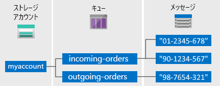

# キューの概要

Azure キュー ストレージは、HTTP または HTTPS を使用した認証された呼び出しを介して世界中のどこからでもアクセスできる大量のメッセージを格納するためのサービスです。 キューの 1 つのメッセージの最大サイズは 64 KB で、1 つのキューには、ストレージ アカウントの合計容量の上限に達するまで、数百万のメッセージを格納できます。

## 一般的な使用法

キュー ストレージの一般的な用途には、次のようなものがあります。

* 非同期に処理する作業のバックログを作成する
* Azure Web ロールから worker ロールにメッセージを渡す

## Queue サービスの概念

キュー サービスには、次のコンポーネントが含まれます。

* **URL 形式:** キューは、次の URL 形式を使用してアドレス指定できます。   
    https://`<storage account>`.queue.core.windows.net/`<queue>` 
  
    次の URL を使用すると、図のいずれかのキューをアドレス指定できます。  
  
    `https://myaccount.queue.core.windows.net/images-to-download`

* **ストレージ アカウント:** Azure Storage にアクセスするときは必ずストレージ アカウントを使用します。 ストレージ アカウントの容量の詳細については、 [Azure Storage の拡張性とパフォーマンスのターゲットに関するページ](../common/storage-scalability-targets.md?toc=%2fazure%2fstorage%2fqueues%2ftoc.json) を参照してください。

* **キュー:** キューは、メッセージのセットを格納します。 すべてのメッセージはキューに 格納されている必要があります。 キュー名は小文字で入力する必要があります。 キューの名前付け規則については、「 [Naming Queues and Metadata (キューとメタデータの名前付け規則)](https://msdn.microsoft.com/library/azure/dd179349.aspx)」を参照してください。

* **メッセージ:** 形式を問わず、メッセージのサイズは最大で 64 KB です。 メッセージをキューで保持できる最長時間は 7 日間です。

## 次の手順

* [ストレージ アカウントの作成](../storage-create-storage-account.md?toc=%2fazure%2fstorage%2fqueues%2ftoc.json)
* [.NET を使用するキューの概要](storage-dotnet-how-to-use-queues.md)
