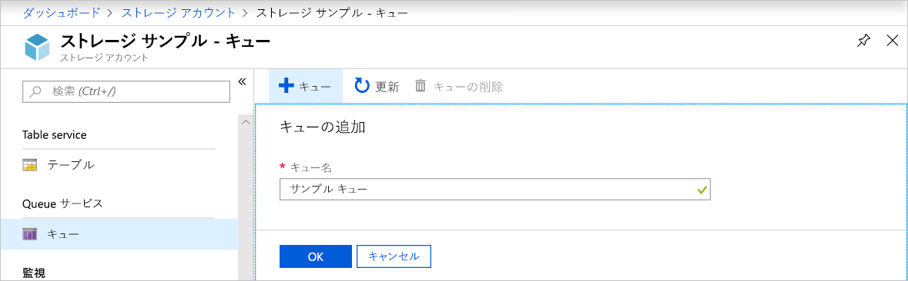
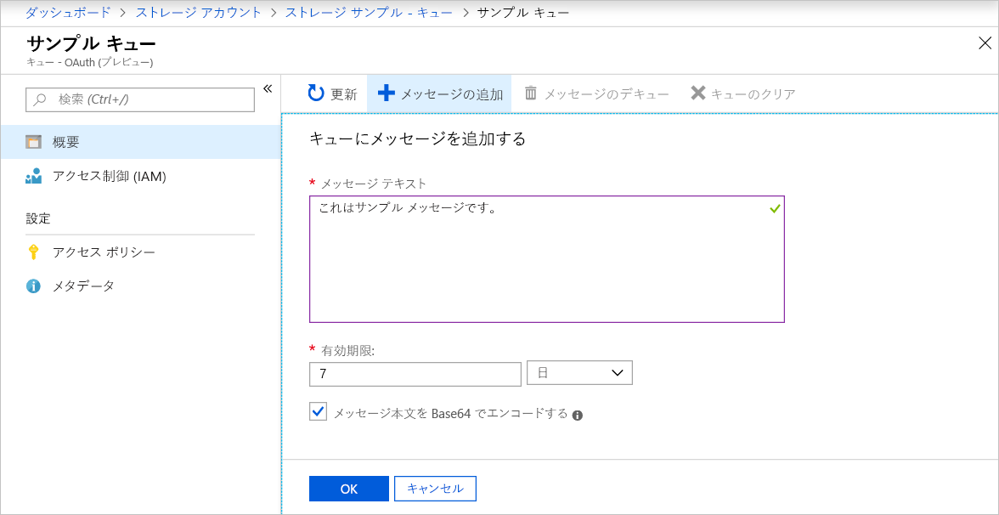
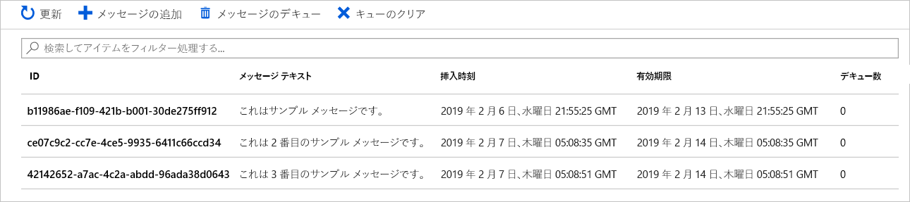
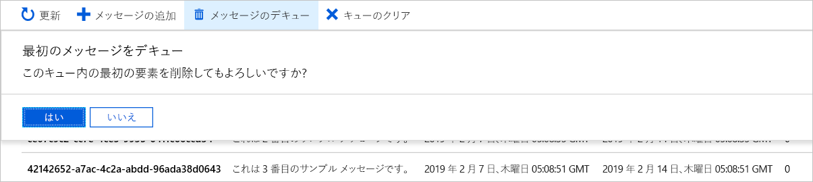

# クイック スタート:Azure portal でキューを作成してメッセージを追加する

このクイック スタートでは、[Azure portal](https://portal.azure.com/) を使用して Azure Storage にキューを作成し、メッセージを追加およびデキューする方法について説明します。

## 前提条件

[!INCLUDE [storage-quickstart-prereq-include](../../../includes/storage-quickstart-prereq-include.md)]

## キューを作成する

Azure portal でキューを作成するには、次の手順のようにします。

1. Azure Portal で新しいストレージ アカウントに移動します。
2. ストレージ アカウントの左側のメニューで、 **[Queue サービス]** セクションまでスクロールし、 **[キュー]** を選択します。
3. **[+ キュー]** ボタンを選択します。
4. 新しいキューの名前を入力します。 キューの名前は小文字である必要があり、英文字または数字で始まる必要があり、英文字、数字、ダッシュ (-) 文字のみを含めることができます。
6. **[OK]** を選択してキューを作成します。

    

## メッセージを追加する

次に、新しいキューにメッセージを追加します。 メッセージの許容される最大サイズは 64 KB です。

1. ストレージ アカウントのキューの一覧から新しいキューを選択します。
1. **[+ メッセージの追加]** ボタンを選択して、キューにメッセージを追加します。 **[メッセージ テキスト]** フィールドにメッセージを入力します。 
1. メッセージの有効期限を指定します。 メッセージをキューに保持できる最長時間は 7 日間です。
1. メッセージを Base64 としてエンコードするかどうかを示します。 バイナリ データはエンコードすることをお勧めします。
1. **[OK]** ボタンを選択して、メッセージを追加します。

    

## メッセージのプロパティを表示する

メッセージを追加した後、キュー内のすべてのメッセージの一覧が Azure portal に表示されます。 メッセージ ID、メッセージの内容、メッセージの挿入日時、メッセージの有効期限を見ることができます。 また、このメッセージがデキューされた回数を確認することもできます。

## メッセージをデキューする

Azure portal では、キューの先頭からメッセージをデキューすることができます。 メッセージをデキューすると、メッセージは削除されます。 

デキューでは常に、キュー内の最も古いメッセージが削除されます。 

## 次の手順

このクイック スタートでは、Azure portal でキューを作成し、メッセージを追加し、メッセージのプロパティを表示して、メッセージをデキューする方法について説明しました。

> [!div class="nextstepaction"]
> [Azure キューとは](storage-queues-introduction.md)
