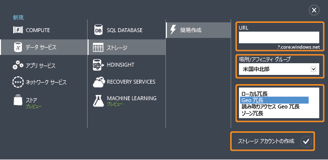
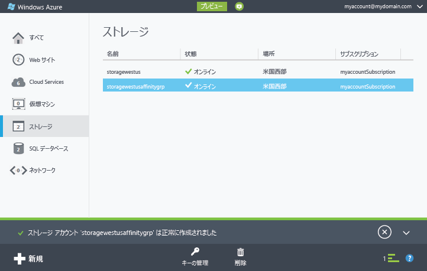
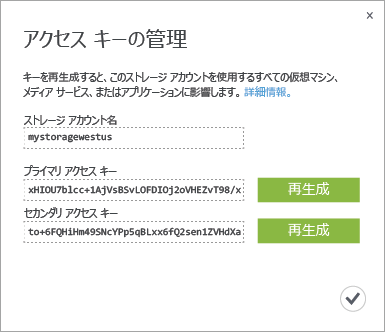

<properties
	pageTitle="ストレージ アカウントを作成、管理、または削除する方法 | Microsoft Azure"
	description="Azure クラシック ポータルでストレージ アカウントを作成、管理、削除する方法について説明します。"
	services="storage"
	documentationCenter=""
	authors="tamram"
	manager="adinah"
	editor=""/>

<tags
	ms.service="storage"
	ms.workload="storage"
	ms.tgt_pltfrm="na"
	ms.devlang="na"
	ms.topic="get-started-article"
	ms.date="12/01/2015" 
	ms.author="tamram"/>

# Azure ストレージ アカウントについて

[AZURE.INCLUDE [storage-selector-portal-create-storage-account](../../includes/storage-selector-portal-create-storage-account.md)]

## 概要

Azure ストレージ アカウントを使用すると、Azure Storage の Azure BLOB サービス、Queue サービス、Table サービス、ファイル サービスにアクセスできます。ストレージ アカウントは、Azure Storage のデータ オブジェクトに対して一意の名前空間を提供します。既定では、アカウントのデータはアカウント所有者だけが使用できます。

ストレージ アカウントには、次の 2 種類があります。

- 標準ストレージ アカウント。Blob、Table、Queue、File Storage が含まれています。 
- Premium Storage アカウント。現在、Azure 仮想マシン ディスクでのみサポートされています。Premium Storage の詳細については、「[Premium Storage: Azure 仮想マシン ワークロード向けの高パフォーマンス ストレージ](storage-premium-storage-preview-portal.md)」をご覧ください。

## ストレージ アカウントの課金

Azure Storage は、ストレージ アカウントに基づいた使用量によって課金されます。ストレージのコストは、ストレージ容量、レプリケーション スキーム、ストレージ トランザクション、送信データ転送という 4 つの要因に基づいています。

- ストレージ容量とは、データの保存に使用するためにストレージ アカウントに割り当てられた容量を指します。単純にデータを保存する場合の料金は、保存するデータ量とレプリケーション方法によって決まります。
- レプリケーションによって、1 回に保持するデータのコピー数や、データの場所が決定されます。
- トランザクションには、Azure Storage に対するすべての読み取り操作と書き込み操作が含まれます。
- 送信データ転送とは、Azure リージョンから転送されたデータを意味します。他のリージョンで動作しているアプリケーションがストレージ アカウント内のデータにアクセスした場合、そのアプリケーションがクラウド サービスか、その他の種類のアプリケーションかに関係なく、送信データ転送として課金されます(Azure サービスでは、同じデータ センター内のデータとサービスをグループ化して、送信データ転送処理とそれに伴う料金を削減または不要にする手順が用意されています)。  

ストレージ容量、レプリケーション、トランザクションの料金の詳細については、「[Azure の価格](http://azure.microsoft.com/pricing/details/#storage)」ページをご覧ください。送信データ転送の価格の詳細については、[データ転送の価格詳細](http://azure.microsoft.com/pricing/details/data-transfers/)に関するページをご覧ください。

ストレージ アカウントの容量とパフォーマンスのターゲットの詳細については、「[Azure Storage のスケーラビリティおよびパフォーマンスのターゲット](http://msdn.microsoft.com/library/azure/dn249410.aspx)」をご覧ください。

> [AZURE.NOTE]Azure の仮想マシンを作成する場合、デプロイ場所にまだストレージ アカウントがない状況では、その場所に自動的にストレージ アカウントが作成されます。このため、使用する仮想マシンのディスク用にストレージ アカウントを作成する場合、必ずしも以下の手順に従う必要はありません。ストレージ アカウント名は仮想マシン名を基にして付けられます。詳細については、[Azure Virtual Machines のドキュメント](http://azure.microsoft.com/documentation/services/virtual-machines/)を参照してください。

## ストレージ アカウントの作成

1. [Azure クラシック ポータル](https://manage.windowsazure.com)にサインインします。

2. ページの下部にあるタスク バーの **[新規]** をクリックします。**[Data Services]**、**[Storage]**、**[簡易作成]** の順にクリックします。

	

3. **[URL]** に、ストレージ アカウントの名前を入力します。

	> [AZURE.NOTE]ストレージ アカウント名の長さは 3 ～ 24 文字で、数字と小文字のみを使用できます。
	>  
	> ストレージ アカウント名は Azure 内で一意である必要があります。選択したストレージ アカウント名が既に使用されているかどうかが、Azure クラシック ポータルによって示されます。

	Azure Storage で、オブジェクトのアドレスの処理にストレージ アカウント名がどのように使用されるかについては、後述の「[ストレージ アカウント エンドポイント](#storage-account-endpoints)」をご覧ください。

4. **[場所/アフィニティ グループ]** で、自分または顧客がストレージ アカウントで使用しやすい場所を選択します。Azure 仮想マシンやクラウド サービスなど、別の Azure サービスがストレージ アカウントのデータにアクセスする場合、一覧のアフィニティ グループから 1 つを選択して、同じデータ センター内のストレージ アカウントと、パフォーマンス向上とコスト削減のために使用している Azure サービスとをグループ化することができます。

	ストレージ アカウントを作成するときにアフィニティ グループを選択する必要があることに注意してください。既存のアカウントをアフィニティ グループに移動することはできません。アフィニティ グループの詳細については、後述の「[アフィニティ グループによるサービスのコロケーション](#service-co-location-with-an-affinity-group)」をご覧ください。

	>[AZURE.IMPORTANT] [[プロバイダーのリスト]](https://msdn.microsoft.com/library/azure/dn790524.aspx) 操作を呼び出して、サブスクリプションに使用可能な場所を判別できます。PowerShell からプロバイダーをリストするには、[Get-AzureLocation](https://msdn.microsoft.com/library/azure/dn757693.aspx) を呼び出します。.NET から、ProviderOperationsExtensions クラスの [List](https://msdn.microsoft.com/library/azure/microsoft.azure.management.resources.provideroperationsextensions.list.aspx) メソッドを使用します。
	>
	>どの領域でどのサービスを使用できるかについては、「[Azure リージョン](https://azure.microsoft.com/regions/#services)」をご覧ください。

5. 複数の Azure サブスクリプションを所有している場合は、**[サブスクリプション]** フィールドが表示されます。**[サブスクリプション]** ボックスに、ストレージ アカウントを使用する Azure サブスクリプションを入力します。

6. **[レプリケーション]** で、ストレージ アカウントに必要なレプリケーションのレベルを選択します。推奨されるレプリケーションのオプションは geo 冗長レプリケーションです。これは、最大限のデータ耐久性を提供します。Azure Storage のレプリケーション オプションの詳細については、[Azure Storage のレプリケーション](storage-redundancy.md)に関するページをご覧ください。

6. **[ストレージ アカウントの作成]** をクリックします。

	ストレージ アカウントを作成するには数分かかる場合があります。状態を確認するには、Azure クラシック ポータルの下部にある通知を監視します。ストレージ アカウントが作成されると、新しいストレージ アカウントの状態が "**オンライン**" になって、使用できるようになります。

### ストレージ アカウント エンドポイント

Azure Storage に格納するすべてのオブジェクトには一意の URL アドレスが設定されています。ストレージ アカウント名は、そのアドレスのサブドメインになります。サブドメインとドメイン名の組み合わせは、各サービスに固有であり、ストレージ アカウントの*エンドポイント*になります。

たとえば、ストレージ アカウントの名前が "mystorageaccount" の場合、ストレージ アカウントの既定のエンドポイントは次のようになります。

- BLOB サービス: http://*mystorageaccount*.blob.core.windows.net

- Table サービス: http://*mystorageaccount*.table.core.windows.net

- Queue サービス: http://*mystorageaccount*.queue.core.windows.net

- File サービス: http://*mystorageaccount*.file.core.windows.net

ストレージ アカウントが作成されると、そのアカウントのエンドポイントが [Azure クラシック ポータル](manage.windowsazure.com)のストレージ ダッシュボードに表示されます。

ストレージ アカウント内のオブジェクトにアクセスするための URL は、ストレージ アカウント内のオブジェクトの場所をエンドポイントに追加して作成します。たとえば、BLOB アドレスは次の形式になります。http://*mystorageaccount*.blob.core.windows.net/*mycontainer*/*myblob*

また、カスタム ドメイン名もストレージ アカウントを使用するように構成することができます。詳細については、「[Azure ストレージ アカウントの BLOB データのカスタム ドメイン名の構成](storage-custom-domain-name.md)」をご覧ください。

### Azure ストレージと他のサービスを併置するためのアフィニティ グループ

*アフィニティ グループ*は、Azure ストレージ アカウント内で Azure サービスと仮想マシンを地理的にまとめたグループです。アフィニティ グループは、コンピューティング ワークロードを同じデータ センター内または対象ユーザーの近くに配置することにより、サービス パフォーマンスを向上させることができます。また、同じアフィニティ グループに属している別のサービスがストレージ アカウント内のデータにアクセスする場合には、課金されません。

> [AZURE.NOTE]アフィニティ グループを作成するには、[Azure クラシック ポータル](manage.windowsazure.com)の <b>[設定]</b> 領域を開き、<b>[アフィニティ グループ]</b> をクリックして、<b>[アフィニティ グループの追加]</b> または <b>[追加]</b> をクリックします。また、Azure サービス管理 API を使用してアフィニティ グループを作成および管理することもできます。詳細については、「<a href="http://msdn.microsoft.com/library/azure/ee460798.aspx">アフィニティ グループに対する操作</a>」をご覧ください

## ストレージ アクセス キーの表示、コピーおよび再生成

ストレージ アカウントを作成するときに、Azure によって 2 つの 512 ビット ストレージ アクセス キーが生成されます。これらは、ストレージ アカウントにアクセスするときに認証の目的で使用されます。Azure によって 2 つのストレージ アクセス キーが提供される結果、ストレージ サービスやサービスへのアクセスを中断することなく、これらのキーを再生成できます。

> [AZURE.NOTE]ストレージ アクセス キーは、他の人と共有しないことをお勧めします。アクセス キーを入力しないでストレージ リソースにアクセスする場合は、*Shared Access Signature* が利用できます。Shared Access Signature を使用すると、指定した期間、指定した権限で、アカウント内のリソースにアクセスできるようになります。詳細については、「[Shared Access Signature、第 1 部: SAS モデルについて](storage-dotnet-shared-access-signature-part-1.md)」を参照してください。

[Azure クラシック ポータル](manage.windowsazure.com)で、ダッシュボードまたは **[Storage]** ページの **[キーの管理]** を使用して、BLOB、Table、および Queue サービスのアクセスに使用するストレージ アクセス キーを表示、コピー、再生成します。

### ストレージ アクセス キーのコピー  

**[キーの管理]** を使用してストレージ アクセス キーをコピーし、接続文字列で使用することができます。接続文字列には、ストレージ アカウント名および認証で使用するキーが必要です。Azure ストレージ サービスにアクセスするための接続文字列の構成については、「[Azure 接続文字列の構成](http://msdn.microsoft.com/library/azure/ee758697.aspx)」をご覧ください。

1. [Azure クラシック ポータル](manage.windowsazure.com)で、**[Storage]** をクリックし、目的のストレージ アカウント名をクリックしてダッシュボードを開きます。

2. **[キーの管理]** をクリックします。

 	**[アクセス キーの管理]** が開きます。

	

3. ストレージ アクセス キーをコピーするには、キー文字列を選択します。右クリックして **[コピー]** をクリックします。

### ストレージ アクセス キーの再生成
ストレージ接続のセキュリティを維持するために、ストレージ アカウントのアクセス キーは定期的に変更する必要があります。アクセス キーは 2 つ割り当てられるため、一方のアクセス キーでストレージ アカウントに接続したまま、もう一方のアクセス キーを再生成できます。

> [AZURE.WARNING]アクセス キーを再生成すると、そのストレージ アカウントに依存する仮想マシン、メディア サービス、およびアプリケーションが影響を受けます。アクセス キーを使用してストレージ アカウントにアクセスするすべてのクライアントを更新し、新しいキーが使用されるようにする必要があります。

**仮想マシン** - ストレージ アカウントに実行中の仮想マシンが含まれる場合は、アクセス キーの再生成後、すべての仮想マシンを再デプロイする必要があります。再デプロイを回避するには、アクセス キーを生成する前に仮想マシンをシャットダウンします。

**メディア サービス** - ストレージ アカウントに依存するメディア サービスがある場合は、アクセス キーを再生成した後で、そのキーをメディア サービスと再同期する必要があります。

**アプリケーション** - ストレージ アカウントを使用する Web アプリケーションまたはクラウド サービスがある場合は、キーを切り替えない限り、キーを再生成すると接続が失われます。キーを切り替える手順は次のとおりです。

1. ストレージ アカウントのセカンダリ アクセス キーを参照するようにアプリケーション コードの接続文字列を更新します。

2. ストレージ アカウントのプライマリ アクセス キーを再生成します。[Azure クラシック ポータル](manage.windowsazure.com)で、ダッシュボードまたは **[構成]** ページの **[キーの管理]** をクリックします。プライマリ アクセス キーの **[再生成]** をクリックし、確認画面で **[はい]** をクリックして新しいキーを生成します。

3. 新しいプライマリ アクセス キーを参照するようにアプリケーション コードの接続文字列を更新します。

4. セカンダリ アクセス キーを再生成します。

## ストレージ アカウントの削除

使わなくなったストレージ アカウントを削除するには、ダッシュボードまたは **[構成]** ページの **[削除]** を使用します。**[削除]** をクリックすると、アカウントにあるすべての BLOB、テーブル、キューを含めて、ストレージ アカウント全体が削除されます。

> [AZURE.WARNING]削除したストレージ アカウントを復元することも、削除前にアカウントに含まれていたコンテンツを取得することもできません。アカウントを削除する前に、保存する必要のあるデータを必ずバックアップしてください。これはアカウントのどのリソースにも当てはまります。BLOB、テーブル、キュー、またはファイルを削除すると、完全に削除されます。
>
> ストレージ アカウントに Azure 仮想マシンの VHD ファイルが含まれている場合、ストレージ アカウントを削除するには、これらの VHD ファイルを使用するイメージやディスクをすべて削除しておく必要があります。最初に、実行中の場合は仮想マシンを停止してから削除します。ディスクを削除するには、**[ディスク]** タブに移動し、そこでディスクを削除します。イメージを削除するには、**[イメージ]** タブに移動し、アカウントに保存されているイメージを削除します。

1. [Azure クラシック ポータル](manage.windowsazure.com)で、**[Storage]** をクリックします。

2. ストレージ アカウント項目の名前以外の部分をクリックして、**[削除]** をクリックします。

	 または

	ストレージ アカウントの名前をクリックしてダッシュボードを開き、**[削除]** をクリックします。

3. 確認画面で **[はい]** をクリックして、ストレージ アカウントを削除します。

## 次のステップ

- Azure Storage の詳細については、[Azure.com](http://azure.microsoft.com/documentation/services/storage/) にある Azure Storage のドキュメントを参照してください。
- [Azure Storage チームのブログ](http://blogs.msdn.com/b/windowsazurestorage/)

<!---HONumber=AcomDC_1203_2015-->