# <a name="get-started-with-azure-file-storage-on-windows"></a>Windows で Azure File Storage を使用する
[!INCLUDE [storage-selector-file-include](../../includes/storage-selector-file-include.md)]

[!INCLUDE [storage-check-out-samples-dotnet](../../includes/storage-check-out-samples-dotnet.md)]

[!INCLUDE [storage-file-overview-include](../../includes/storage-file-overview-include.md)]

Linux で File Storage を使用する方法の詳細については、「 [Linux で Azure File ストレージを使用する方法](storage-how-to-use-files-linux.md)」を参照してください。

File Storage のスケーラビリティおよびパフォーマンスのターゲットの詳細については、「 [Azure Storage のスケーラビリティおよびパフォーマンスのターゲット](storage-scalability-targets.md#scalability-targets-for-blobs-queues-tables-and-files)」を参照してください。

[!INCLUDE [storage-dotnet-client-library-version-include](../../includes/storage-dotnet-client-library-version-include.md)]

[!INCLUDE [storage-file-concepts-include](../../includes/storage-file-concepts-include.md)]

## <a name="video-using-azure-file-storage-with-windows"></a>ビデオ: Windows で Azure File Storage を使用する方法
このビデオでは、Windows で Azure のファイル共有を作成して使用する方法について説明しています。

> [!VIDEO https://channel9.msdn.com/Blogs/Azure/Azure-File-Storage-with-Windows/player]
> 
> 

## <a name="about-this-tutorial"></a>このチュートリアルについて
この概要チュートリアルでは、Microsoft Azure File Storage の基本的な使用方法を説明します。 このチュートリアルでは、次のことを行います。

* Azure Portal または PowerShell を使用して、新しい Azure ファイル共有の作成、ディレクトリの追加、共有へのローカル ファイルのアップロード、ディレクトリ内のファイルの一覧表示を実行します。
* SMB 共有をマウントする場合と同じように、ファイル共有をマウントします。
* .NET 用 Azure Storage クライアント ライブラリを使用して、オンプレミスのアプリケーションからファイル共有にアクセスします。 コンソール アプリケーションを作成し、ファイル共有で次の操作を実行します。
  * 共有内のファイルの内容をコンソール ウィンドウに書き込む
  * ファイル共有のクォータ (最大サイズ) を設定する
  * 共有で定義されている共有アクセス ポリシーを使用するファイルの Shared Access Signature を作成する
  * ファイルを、同じストレージ アカウント内の別のファイルにコピーする
  * ファイルを、同じストレージ アカウント内の BLOB にコピーする
* トラブルシューティングに Azure Storage メトリックを使用します。

File Storage は、すべてのストレージ アカウントでサポートされているため、既存のストレージ アカウントを使用することも、新しいストレージ アカウントを作成することもできます。 新しいストレージ アカウントの作成については、 [ストレージ アカウントの作成方法](storage-create-storage-account.md#create-a-storage-account) に関するセクションを参照してください。

## <a name="use-the-azure-portal-to-manage-a-file-share"></a>Azure Portal を使用したファイル共有の管理
[Azure Portal](https://portal.azure.com) には、ユーザーがファイル共有を管理するためのユーザー インターフェイスが用意されています。 ポータルでは、次の操作を実行できます。

* ファイル共有の作成
* ファイル共有からのファイルのアップロードおよびダウンロード
* 各ファイル共有の実際の使用状況の監視
* 共有のサイズ クォータの調整
* Windows クライアントからファイル共有をマウントするために使用する `net use` コマンドの取得

### <a name="create-file-share"></a>ファイル共有の作成
1. Azure ポータルにサインインします。
2. ナビゲーション メニューで、**[ストレージ アカウント]** または **[ストレージ アカウント (クラシック)]** をクリックします。
   
    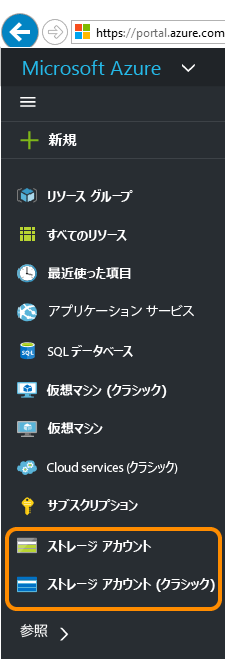
3. ストレージ アカウントを選択します。
   
    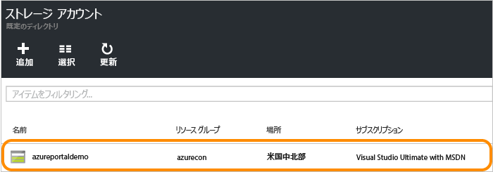
4. [Files] サービスを選択します。
   
    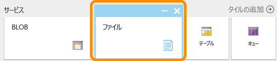
5. [ファイル共有] をクリックし、リンクをクリックして最初のファイル共有を作成します。
   
    
6. 最初のファイル共有を作成するには、ファイル共有名とファイル共有のサイズ (最大 5120 GB) を入力します。 作成されたファイル共有は、SMB 2.1 または SMB 3.0 をサポートしている任意のファイル システムからマウントできます。
   
    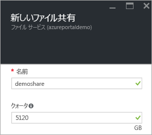

### <a name="upload-and-download-files"></a>ファイルのアップロードとダウンロード
1. 既に作成した 1 つのファイル共有を選択します。
   
    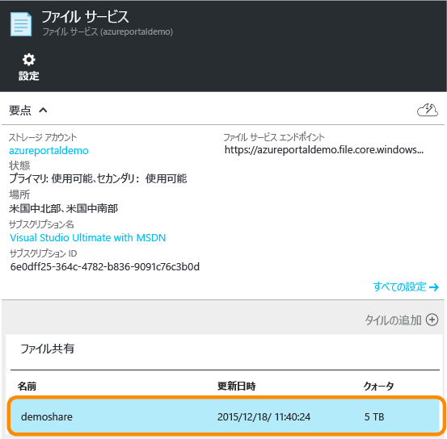
2. **[アップロード]** をクリックして、ファイルをアップロードするためのユーザー インターフェイスを開きます。
   
    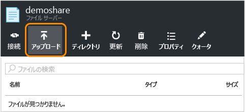
3. 1 つのファイルを右クリックし、 **[ダウンロード]** を選択してローカルにダウンロードします。
   
    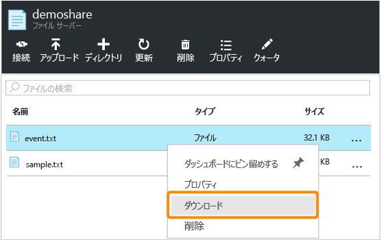

### <a name="manage-file-share"></a>ファイル共有の管理
1. **[クォータ]** をクリックして、ファイル共有のサイズを変更します (最大 5,120 GB)。
   
    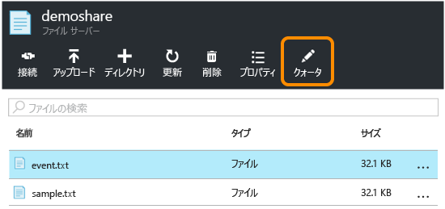
2. **[接続]** をクリックし、Windows からファイル共有にマウントするためのコマンド ラインを取得します。
   
    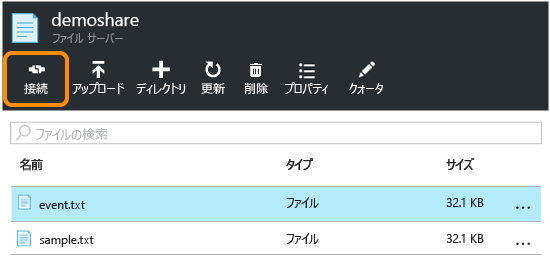
   
    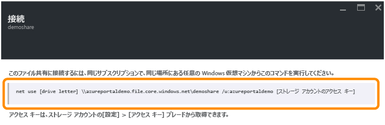
   
   > [!TIP]
   > マウント用のストレージ アカウント アクセス キーを調べるには、ストレージ アカウントの **[設定]** をクリックし、**[アクセス キー]** をクリックします。
   > 
   > 
   
    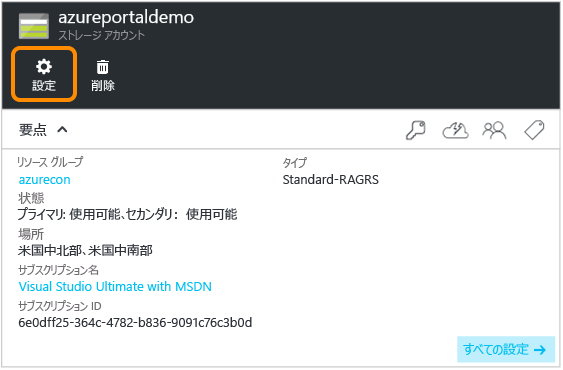
   
    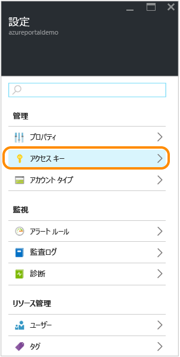

## <a name="use-powershell-to-manage-a-file-share"></a>PowerShell を使用したファイル共有の管理
Azure PowerShell を使用して、ファイル共有を作成および管理することもできます。

### <a name="install-the-powershell-cmdlets-for-azure-storage"></a>Azure Storage 用の PowerShell コマンドレットのインストール
PowerShell の使用を準備するために、Azure PowerShell コマンドレットをダウンロードしてインストールします。 インストール先とインストール方法については、「 [Azure PowerShell のインストールおよび構成方法](/powershell/azureps-cmdlets-docs) 」を参照してください。

> [!NOTE]
> 最新の Azure PowerShell モジュールをダウンロードしてインストールするか、アップグレードすることをお勧めします。
> 
> 

**[スタート]** をクリックし、「**Windows PowerShell**」と入力して、Azure PowerShell ウィンドウを開きます。 PowerShell ウィンドウに自動的に Azure Powershell モジュールが読み込まれます。

### <a name="create-a-context-for-your-storage-account-and-key"></a>ストレージ アカウントおよびキーのコンテキストの作成
次に、ストレージ アカウント コンテキストを作成します。 コンテキストによってストレージ アカウント名とアカウント キーがカプセル化されます。 [Azure Portal](https://portal.azure.com) からアカウント キーをコピーする手順については、「[ストレージ アクセス キーの表示とコピー](storage-create-storage-account.md#view-and-copy-storage-access-keys)」を参照してください。

次の例の `storage-account-name` と `storage-account-key` は、実際のストレージ アカウント名とキーに置き換えてください。

```powershell
# create a context for account and key
$ctx=New-AzureStorageContext storage-account-name storage-account-key
```

### <a name="create-a-new-file-share"></a>新しいファイル共有の作成
次に、`logs` という名前の新しいファイル共有を作成します。

```powershell
# create a new share
$s = New-AzureStorageShare logs -Context $ctx
```

これで、File Storage にファイル共有が作成されました。 次に、ディレクトリとファイルを追加します。

> [!IMPORTANT]
> ファイル共有の名前はすべて小文字にする必要があります。 ファイル共有とファイルの名前付けの詳細については、「 [共有、ディレクトリ、ファイル、およびメタデータの名前付けおよび参照](https://msdn.microsoft.com/library/azure/dn167011.aspx)」を参照してください。
> 
> 

### <a name="create-a-directory-in-the-file-share"></a>ファイル共有でのディレクトリの作成
次に、共有内にディレクトリを作成します。 次の例では、ディレクトリに `CustomLogs` という名前を付けています。

```powershell
# create a directory in the share
New-AzureStorageDirectory -Share $s -Path CustomLogs
```

### <a name="upload-a-local-file-to-the-directory"></a>ディレクトリへのローカル ファイルのアップロード
次に、ディレクトリにローカル ファイルをアップロードします。 次の例では、`C:\temp\Log1.txt` からファイルをアップロードします。 ファイル パスを編集して、ローカル マシン上の有効なファイルを指定してください。

```powershell
# upload a local file to the new directory
Set-AzureStorageFileContent -Share $s -Source C:\temp\Log1.txt -Path CustomLogs
```

### <a name="list-the-files-in-the-directory"></a>ディレクトリ内のファイルの一覧表示
ディレクトリ内のすべてのファイルを一覧表示して、ファイルを確認できます。 このコマンドは、CustomLogs ディレクトリ内にあるファイルとサブディレクトリ (ある場合) を返します。

```powershell
# list files in the new directory
Get-AzureStorageFile -Share $s -Path CustomLogs | Get-AzureStorageFile
```

Get-AzureStorageFile は、ディレクトリ オブジェクトが渡されるファイルとディレクトリの一覧を返します。 "Get-AzureStorageFile -Share $s" は、ルート ディレクトリ内のファイルとディレクトリの一覧を返します。 サブディレクトリ内のファイルの一覧を取得するには、サブディレクトリを Get-AzureStorageFile に渡す必要があります。 コマンドの処理手順として、コマンドの最初の部分からパイプまでの処理で、サブディレクトリ CustomLogs のディレクトリ インスタンスが返されます。 次に、そのインスタンスが Get-AzureStorageFile に渡され、CustomLogs 内のファイルとディレクトリが返されます。

### <a name="copy-files"></a>ファイルのコピー
Azure PowerShell のバージョン 0.9.7 以降では、ファイルを別のファイルにコピーしたり、ファイルを BLOB にコピーしたり、BLOB をファイルにコピーしたりすることができます。 次に、PowerShell コマンドレットを使用してこれらのコピー操作を実行する方法を示します。

```powershell
# copy a file to the new directory
Start-AzureStorageFileCopy -SrcShareName srcshare -SrcFilePath srcdir/hello.txt -DestShareName destshare -DestFilePath destdir/hellocopy.txt -Context $srcCtx -DestContext $destCtx

# copy a blob to a file directory
Start-AzureStorageFileCopy -SrcContainerName srcctn -SrcBlobName hello2.txt -DestShareName hello -DestFilePath hellodir/hello2copy.txt -DestContext $ctx -Context $ctx
```

## <a name="mount-the-file-share"></a>ファイル共有のマウント
SMB 3.0 のサポートにより、File Storage では、SMB 3.0 クライアントから暗号化と永続的ハンドルをサポートするようになりました。 暗号化のサポートは、SMB 3.0 クライアントが、次を含む任意の場所からファイル共有をマウントできることを意味します。

* 同じリージョン内の Azure の仮想マシン (SMB 2.1 でもサポート)
* 別のリージョンの Azure の仮想マシン (SMB 3.0 のみ)
* オンプレミスのクライアント アプリケーション (SMB 3.0 のみ)

クライアントが File Storage にアクセスするときに使用する SMB バージョンは、オペレーティング システムでサポートされている SMB バージョンによって異なります。 次の表に、Windows クライアントでのサポートの概要を示します。 SMB バージョンの詳細については、 [こちらのブログ](http://blogs.technet.com/b/josebda/archive/2013/10/02/windows-server-2012-r2-which-version-of-the-smb-protocol-smb-1-0-smb-2-0-smb-2-1-smb-3-0-or-smb-3-02-you-are-using.aspx)を参照してください。

| Windows クライアント | サポートされている SMB バージョン |
|:--- |:--- |
| Windows 7 |SMB 2.1 |
| Windows Server 2008 R2 |SMB 2.1 |
| Windows 8 |SMB 3.0 |
| Windows Server 2012 |SMB 3.0 |
| Windows Server 2012 R2 |SMB 3.0 |
| Windows 10 |SMB 3.0 |

### <a name="mount-the-file-share-from-an-azure-virtual-machine-running-windows"></a>Windows を実行する Azure の仮想マシンからのファイル共有のマウント
Azure のファイル共有をマウントする方法を示すために、ここでは Windows を実行する Azure の仮想マシンを作成します。このマシンにリモート接続して、共有をマウントします。

1. 最初に、[Azure Portal での Windows 仮想マシンの作成](../virtual-machines/virtual-machines-windows-hero-tutorial.md?toc=%2fazure%2fvirtual-machines%2fwindows%2ftoc.json)に関するページの手順に従って、新しい Azure 仮想マシンを作成します。
2. 次に、[Azure Portal を使用した Windows 仮想マシンへのログオン](../virtual-machines/virtual-machines-windows-connect-logon.md?toc=%2fazure%2fvirtual-machines%2fwindows%2ftoc.json)に関するページの手順に従って、仮想マシンにリモート接続します。
3. 仮想マシンで PowerShell ウィンドウを開きます。

### <a name="persist-your-storage-account-credentials-for-the-virtual-machine"></a>ストレージ アカウントの資格情報を仮想マシンに適用
ファイル共有をマウントする前に、ストレージ アカウントの資格情報を仮想マシンにも適用します。 そうすることで、仮想マシンが再起動したときに Windows が自動的にファイル共有に再接続します。 アカウントの資格情報を適用するには、仮想マシンの PowerShell ウィンドウで `cmdkey` コマンドを実行します。 `<storage-account-name>` を実際のストレージ アカウントの名前に置き換え、`<storage-account-key>` を実際のストレージ アカウント キーに置き換えてください。 次の例に示すように、ドメイン "AZURE" を明示的に指定する必要があります。 

```
cmdkey /add:<storage-account-name>.file.core.windows.net /user:AZURE\<storage-account-name> /pass:<storage-account-key>
```

これで、仮想マシンの再起動時に Windows が自動的にファイル共有に再接続するようになります。 共有に再接続したことを確認するには、PowerShell ウィンドウから `net use` コマンドを実行します。

資格情報は `cmdkey` が実行されているコンテキストでのみ永続化されることに注意してください。 サービスを実行するアプリケーションを開発している場合、そのコンテキストでも資格情報を永続化する必要があります。

### <a name="mount-the-file-share-using-the-persisted-credentials"></a>適用された資格情報を使用したファイル共有のマウント
仮想マシンにリモート接続した後で、`net use` コマンドを実行してファイル共有をマウントできます。その場合は次の構文を使用します。 `<storage-account-name>` を実際のストレージ アカウントの名前に置き換え、`<share-name>` を実際の File ストレージ共有に置き換えてください。

```
net use <drive-letter>: \\<storage-account-name>.file.core.windows.net\<share-name>

example :
net use z: \\samples.file.core.windows.net\logs
```

前の手順でストレージ アカウントの資格情報を適用したため、`net use` コマンドで資格情報を指定する必要はありません。 資格情報をまだ適用していない場合は、次の例に示されているように、 `net use` コマンドに渡されるパラメーターとして資格情報を指定してください。

```
net use <drive-letter>: \\<storage-account-name>.file.core.windows.net\<share-name> /u:AZURE\<storage-account-name> <storage-account-key>

example :
net use z: \\samples.file.core.windows.net\logs /u:AZURE\samples <storage-account-key>
```

これで、他のドライブの場合と同じように仮想マシンから File Storage 共有を利用できるようになります。 コマンド プロンプトから標準のファイル コマンドを発行したり、マウントした共有とその内容をエクスプローラーで表示したりできます。 .NET Framework の [System.IO 名前空間](http://msdn.microsoft.com/library/gg145019.aspx) の API など、標準の Windows ファイル I/O API を使用してファイル共有にアクセスするコードを仮想マシン内で実行することもできます。

さらに、ロールにリモート接続することで、Azure クラウド サービスで実行されるロールからファイル共有をマウントすることもできます。

### <a name="mount-the-file-share-from-an-on-premises-client-running-windows"></a>Windows を実行するオンプレミスのクライアントからのファイル共有のマウント
オンプレミスのクライアントからファイル共有をマウントするには、まず次の手順を実行する必要があります。

* SMB 3.0 をサポートする Windows バージョンをインストールします。 Windows では、オンプレミスのクライアントと、クラウドの Azure のファイル共有間でデータを安全に転送するために SMB 3.0 の暗号化を利用しています。
* インターネット アクセス用に SMB プロトコルで必要とされるポート 445 (TCP 送信) をローカル ネットワークで開きます。

> [!NOTE]
> 一部のインターネット サービス プロバイダーは、ポート 445 をブロックしている場合があるため、サービス プロバイダーに確認する必要がある場合があります。
> 
> 

## <a name="develop-with-file-storage"></a>File ストレージを使用した開発
File Storage を呼び出すコードを作成する場合、.NET と Java のストレージ クライアント ライブラリまたは Azure Storage の REST API を使用できます。 このセクションの例では、デスクトップで実行する単純なコンソール アプリケーションから、 [.NET 用 Azure ストレージ クライアント ライブラリ](https://msdn.microsoft.com/library/mt347887.aspx) を使用してファイル共有を操作する方法を示します。

### <a name="create-the-console-application-and-obtain-the-assembly"></a>コンソール アプリケーションの作成とアセンブリの取得
Visual Studio で、新しい Windows コンソール アプリケーションを作成します。 次の手順では、Visual Studio 2017 でコンソール アプリケーションを作成する方法を説明しますが、この手順は Visual Studio の他のバージョンでも同様です。

1. **[ファイル]** > **[新規]** > **[プロジェクト]** の順に選択します。
2. **[インストール済み]** > **[テンプレート]** > **[Visual C#]** > **[Windows クラシック デスクトップ]** の順に選択します。
3. **[コンソール アプリ (.NET Framework)]** を選択します。
4. **[名前]** フィールドに、アプリケーションの名前を入力します。
5. **[OK]** を選択します。

このチュートリアルのすべてのコード例は、コンソール アプリケーションの `Program.cs` ファイルの `Main()` メソッドに追加できます。

Azure クラウド サービス、Azure Web アプリ、デスクトップ アプリケーション、モバイル アプリケーションなど、どの種類の .NET アプリケーションでも Azure ストレージ クライアント ライブラリを使用できます。 このガイドでは、わかりやすくするためにコンソール アプリケーションを使用します。

### <a name="use-nuget-to-install-the-required-packages"></a>NuGet を使用した必要なパッケージのインストール
このチュートリアルを完了するには、プロジェクトで参照する必要があるパッケージが 2 つあります。

* [.NET 用 Microsoft Azure ストレージ クライアント ライブラリ](https://www.nuget.org/packages/WindowsAzure.Storage/): このパッケージを使用すると、ストレージ アカウント内のデータ リソースにプログラムでアクセスできます。
* [.NET 用 Microsoft Azure Configuration Manager ライブラリ](https://www.nuget.org/packages/Microsoft.WindowsAzure.ConfigurationManager/): このパッケージには、アプリケーションの実行場所に関係なく、構成ファイルの接続文字列を解析するためのクラスが用意されています。

NuGet を使って両方のパッケージを取得できます。 次の手順に従います。

1. **ソリューション エクスプローラー**でプロジェクトを右クリックし、**[NuGet パッケージの管理]** をクリックします。
2. "WindowsAzure.Storage" をオンラインで検索し、 **[インストール]** をクリックしてストレージ クライアント ライブラリとその依存関係をインストールします。
3. "WindowsAzure.ConfigurationManager" をオンラインで検索し、**[インストール]** をクリックして Azure Configuration Manager をインストールします。

### <a name="save-your-storage-account-credentials-to-the-appconfig-file"></a>ストレージ アカウントの資格情報を app.config ファイルに保存
次に、プロジェクトの app.config ファイルに資格情報を保存します。 次の例のようになるように app.config ファイルを編集します。ここで、`myaccount` は実際のストレージ アカウント名に置き換え、`mykey` は実際のストレージ アカウント キーに置き換えてください。

```xml
<?xml version="1.0" encoding="utf-8" ?>
<configuration>
    <startup>
        <supportedRuntime version="v4.0" sku=".NETFramework,Version=v4.5" />
    </startup>
    <appSettings>
        <add key="StorageConnectionString" value="DefaultEndpointsProtocol=https;AccountName=myaccount;AccountKey=StorageAccountKeyEndingIn==" />
    </appSettings>
</configuration>
```

> [!NOTE]
> 最新バージョンの Azure ストレージ エミュレーターでは、File Storage がサポートされません。 File Storage を使用するには、接続文字列は、クラウド内の Azure ストレージ アカウントを対象とする必要があります。
> 
> 

### <a name="add-using-directives"></a>using ディレクティブを追加する
ソリューション エクスプローラーで `Program.cs` ファイルを開き、次の using ディレクティブをファイルの先頭に追加します。

```csharp
using Microsoft.Azure; // Namespace for Azure Configuration Manager
using Microsoft.WindowsAzure.Storage; // Namespace for Storage Client Library
using Microsoft.WindowsAzure.Storage.Blob; // Namespace for Blob storage
using Microsoft.WindowsAzure.Storage.File; // Namespace for File storage
```

[!INCLUDE [storage-cloud-configuration-manager-include](../../includes/storage-cloud-configuration-manager-include.md)]

### <a name="access-the-file-share-programmatically"></a>プログラムによるファイル共有へのアクセス
次に、前に示したコードの後で、`Main()` メソッドに次のコードを追加し、接続文字列を取得します。 このコードは、前の手順で作成したファイルへの参照を取得し、その内容をコンソール ウィンドウに出力します。

```csharp
// Create a CloudFileClient object for credentialed access to File storage.
CloudFileClient fileClient = storageAccount.CreateCloudFileClient();

// Get a reference to the file share we created previously.
CloudFileShare share = fileClient.GetShareReference("logs");

// Ensure that the share exists.
if (share.Exists())
{
    // Get a reference to the root directory for the share.
    CloudFileDirectory rootDir = share.GetRootDirectoryReference();

    // Get a reference to the directory we created previously.
    CloudFileDirectory sampleDir = rootDir.GetDirectoryReference("CustomLogs");

    // Ensure that the directory exists.
    if (sampleDir.Exists())
    {
        // Get a reference to the file we created previously.
        CloudFile file = sampleDir.GetFileReference("Log1.txt");

        // Ensure that the file exists.
        if (file.Exists())
        {
            // Write the contents of the file to the console window.
            Console.WriteLine(file.DownloadTextAsync().Result);
        }
    }
}
```

コンソール アプリケーションを実行して、出力結果を確認します。

### <a name="set-the-maximum-size-for-a-file-share"></a>ファイル共有の最大サイズの設定
Azure Storage クライアント ライブラリのバージョン 5.x 以降では、ギガバイトでファイル共有のクォータ (つまり、最大サイズ) を設定できます。 また、共有に現在格納されているデータの量も確認できます。

共有のクォータを設定することにより、共有に格納するファイルの合計サイズを制限できます。 共有上のファイルの合計サイズが共有に設定されたクォータを超過すると、クライアントは既存ファイルのサイズを増やせなくなったり、新しいファイルを作成できなくなったりします。ただし、これらのファイルが空である場合は除きます。

次の例では、共有の現在の使用状況を確認する方法と、共有のクォータを設定する方法を示します。

```csharp
// Parse the connection string for the storage account.
CloudStorageAccount storageAccount = CloudStorageAccount.Parse(
    Microsoft.Azure.CloudConfigurationManager.GetSetting("StorageConnectionString"));

// Create a CloudFileClient object for credentialed access to File storage.
CloudFileClient fileClient = storageAccount.CreateCloudFileClient();

// Get a reference to the file share we created previously.
CloudFileShare share = fileClient.GetShareReference("logs");

// Ensure that the share exists.
if (share.Exists())
{
    // Check current usage stats for the share.
    // Note that the ShareStats object is part of the protocol layer for the File service.
    Microsoft.WindowsAzure.Storage.File.Protocol.ShareStats stats = share.GetStats();
    Console.WriteLine("Current share usage: {0} GB", stats.Usage.ToString());

    // Specify the maximum size of the share, in GB.
    // This line sets the quota to be 10 GB greater than the current usage of the share.
    share.Properties.Quota = 10 + stats.Usage;
    share.SetProperties();

    // Now check the quota for the share. Call FetchAttributes() to populate the share's properties.
    share.FetchAttributes();
    Console.WriteLine("Current share quota: {0} GB", share.Properties.Quota);
}
```

### <a name="generate-a-shared-access-signature-for-a-file-or-file-share"></a>ファイルまたはファイル共有の Shared Access Signature の生成
Azure Storage クライアント ライブラリのバージョン 5.x 以降、ファイル共有または個々のファイルの Shared Access Signature (SAS) を生成できます。 また、ファイル共有に共有アクセス ポリシーを作成して、Shared Access Signature を管理することもできます。 共有アクセス ポリシーを作成することをお勧めします。これにより、侵害されそうな場合に SAS を取り消すことができます。

次の例では、共有上に共有アクセス ポリシーを作成し、そのポリシーを使用して共有上のファイルの SAS に制約を指定します。

```csharp
// Parse the connection string for the storage account.
CloudStorageAccount storageAccount = CloudStorageAccount.Parse(
    Microsoft.Azure.CloudConfigurationManager.GetSetting("StorageConnectionString"));

// Create a CloudFileClient object for credentialed access to File storage.
CloudFileClient fileClient = storageAccount.CreateCloudFileClient();

// Get a reference to the file share we created previously.
CloudFileShare share = fileClient.GetShareReference("logs");

// Ensure that the share exists.
if (share.Exists())
{
    string policyName = "sampleSharePolicy" + DateTime.UtcNow.Ticks;

    // Create a new shared access policy and define its constraints.
    SharedAccessFilePolicy sharedPolicy = new SharedAccessFilePolicy()
        {
            SharedAccessExpiryTime = DateTime.UtcNow.AddHours(24),
            Permissions = SharedAccessFilePermissions.Read | SharedAccessFilePermissions.Write
        };

    // Get existing permissions for the share.
    FileSharePermissions permissions = share.GetPermissions();

    // Add the shared access policy to the share's policies. Note that each policy must have a unique name.
    permissions.SharedAccessPolicies.Add(policyName, sharedPolicy);
    share.SetPermissions(permissions);

    // Generate a SAS for a file in the share and associate this access policy with it.
    CloudFileDirectory rootDir = share.GetRootDirectoryReference();
    CloudFileDirectory sampleDir = rootDir.GetDirectoryReference("CustomLogs");
    CloudFile file = sampleDir.GetFileReference("Log1.txt");
    string sasToken = file.GetSharedAccessSignature(null, policyName);
    Uri fileSasUri = new Uri(file.StorageUri.PrimaryUri.ToString() + sasToken);

    // Create a new CloudFile object from the SAS, and write some text to the file.
    CloudFile fileSas = new CloudFile(fileSasUri);
    fileSas.UploadText("This write operation is authenticated via SAS.");
    Console.WriteLine(fileSas.DownloadText());
}
```

Shared Access Signature の作成と使用の詳細については、「[Shared Access Signature (SAS) の使用](storage-dotnet-shared-access-signature-part-1.md)」と、[Blob Storage での SAS の作成と使用](storage-dotnet-shared-access-signature-part-2.md)に関するページを参照してください。

### <a name="copy-files"></a>ファイルのコピー
Azure Storage クライアント ライブラリのバージョン 5.x 以降では、ファイルを別のファイルにコピーしたり、ファイルを BLOB にコピーしたり、BLOB をファイルにコピーしたりすることができます。 次のセクションでは、プログラムを使用してこれらのコピー操作を実行する方法を示します。

また、AzCopy を使用してあるファイルを別のファイルにコピーしたり、BLOB をファイルにコピーしたり、その反対の操作をしたりすることもできます。 「 [AzCopy コマンド ライン ユーティリティを使用してデータを転送する](storage-use-azcopy.md)」を参照してください。

> [!NOTE]
> BLOB をファイルにコピーしたり、ファイルを BLOB にコピーしたりする場合は、同じストレージ アカウント内でコピーする場合でも、Shared Access Signature (SAS) を使用してソース オブジェクトを認証する必要があります。
> 
> 

**別のファイルへのファイルのコピー**

次の例では、同じ共有内の別のファイルに、ファイルをコピーします。 このコピー操作では同じストレージ アカウント内のファイルがコピーされるため、共有キー認証を使用してコピーを実行できます。

```csharp
// Parse the connection string for the storage account.
CloudStorageAccount storageAccount = CloudStorageAccount.Parse(
    Microsoft.Azure.CloudConfigurationManager.GetSetting("StorageConnectionString"));

// Create a CloudFileClient object for credentialed access to File storage.
CloudFileClient fileClient = storageAccount.CreateCloudFileClient();

// Get a reference to the file share we created previously.
CloudFileShare share = fileClient.GetShareReference("logs");

// Ensure that the share exists.
if (share.Exists())
{
    // Get a reference to the root directory for the share.
    CloudFileDirectory rootDir = share.GetRootDirectoryReference();

    // Get a reference to the directory we created previously.
    CloudFileDirectory sampleDir = rootDir.GetDirectoryReference("CustomLogs");

    // Ensure that the directory exists.
    if (sampleDir.Exists())
    {
        // Get a reference to the file we created previously.
        CloudFile sourceFile = sampleDir.GetFileReference("Log1.txt");

        // Ensure that the source file exists.
        if (sourceFile.Exists())
        {
            // Get a reference to the destination file.
            CloudFile destFile = sampleDir.GetFileReference("Log1Copy.txt");

            // Start the copy operation.
            destFile.StartCopy(sourceFile);

            // Write the contents of the destination file to the console window.
            Console.WriteLine(destFile.DownloadText());
        }
    }
}
```

**BLOB へのファイルのコピー**

次の例では、ファイルを作成し、同じストレージ アカウント内の BLOB にそれをコピーします。 この例では、ソース ファイルの SAS を作成します。サービスはこれを使用してコピー操作中にソース ファイルへのアクセスを認証します。

```csharp
// Parse the connection string for the storage account.
CloudStorageAccount storageAccount = CloudStorageAccount.Parse(
    Microsoft.Azure.CloudConfigurationManager.GetSetting("StorageConnectionString"));

// Create a CloudFileClient object for credentialed access to File storage.
CloudFileClient fileClient = storageAccount.CreateCloudFileClient();

// Create a new file share, if it does not already exist.
CloudFileShare share = fileClient.GetShareReference("sample-share");
share.CreateIfNotExists();

// Create a new file in the root directory.
CloudFile sourceFile = share.GetRootDirectoryReference().GetFileReference("sample-file.txt");
sourceFile.UploadText("A sample file in the root directory.");

// Get a reference to the blob to which the file will be copied.
CloudBlobClient blobClient = storageAccount.CreateCloudBlobClient();
CloudBlobContainer container = blobClient.GetContainerReference("sample-container");
container.CreateIfNotExists();
CloudBlockBlob destBlob = container.GetBlockBlobReference("sample-blob.txt");

// Create a SAS for the file that's valid for 24 hours.
// Note that when you are copying a file to a blob, or a blob to a file, you must use a SAS
// to authenticate access to the source object, even if you are copying within the same
// storage account.
string fileSas = sourceFile.GetSharedAccessSignature(new SharedAccessFilePolicy()
{
    // Only read permissions are required for the source file.
    Permissions = SharedAccessFilePermissions.Read,
    SharedAccessExpiryTime = DateTime.UtcNow.AddHours(24)
});

// Construct the URI to the source file, including the SAS token.
Uri fileSasUri = new Uri(sourceFile.StorageUri.PrimaryUri.ToString() + fileSas);

// Copy the file to the blob.
destBlob.StartCopy(fileSasUri);

// Write the contents of the file to the console window.
Console.WriteLine("Source file contents: {0}", sourceFile.DownloadText());
Console.WriteLine("Destination blob contents: {0}", destBlob.DownloadText());
```

同じ方法で、ファイルに BLOB をコピーできます。 ソース オブジェクトが BLOB である場合、SAS を作成して、コピー操作中にその BLOB へのアクセスを認証します。

## <a name="troubleshooting-file-storage-using-metrics"></a>メトリックを使用した File Storage のトラブルシューティング
Azure ストレージ分析で File Storage のメトリックがサポートされるようになりました。 メトリック データを使用すると、要求のトレースや問題の診断ができます。

[Azure Portal](https://portal.azure.com) から File Storage のメトリックを有効にすることができます。 REST API を使用して Set File Service Properties 操作を呼び出すか、ストレージ クライアント ライブラリのアナログの 1 つを使用して、プログラムでメトリックを有効にすることも可能です。

次のコード例では、.NET 用ストレージ クライアント ライブラリを使用して、File Storage のメトリックを有効にする方法を示します。

まず、`Program.cs` ファイルで、先ほど追加したディレクティブに加え、次の `using` ディレクティブを追加します。

```csharp
using Microsoft.WindowsAzure.Storage.File.Protocol;
using Microsoft.WindowsAzure.Storage.Shared.Protocol;
```

Blob Storage、Table Storage、Queue Storage は `Microsoft.WindowsAzure.Storage.Shared.Protocol` 名前空間の共有 `ServiceProperties` タイプを使用しますが、File Storage はその独自のタイプ、`Microsoft.WindowsAzure.Storage.File.Protocol` 名前空間の `FileServiceProperties` タイプを使用することに注意してください。 ただし、両方の名前空間は、次のコードのコンパイルのため、自身のコードから参照される必要があります。

```csharp
// Parse your storage connection string from your application's configuration file.
CloudStorageAccount storageAccount = CloudStorageAccount.Parse(
        Microsoft.Azure.CloudConfigurationManager.GetSetting("StorageConnectionString"));
// Create the File service client.
CloudFileClient fileClient = storageAccount.CreateCloudFileClient();

// Set metrics properties for File service.
// Note that the File service currently uses its own service properties type,
// available in the Microsoft.WindowsAzure.Storage.File.Protocol namespace.
fileClient.SetServiceProperties(new FileServiceProperties()
{
    // Set hour metrics
    HourMetrics = new MetricsProperties()
    {
        MetricsLevel = MetricsLevel.ServiceAndApi,
        RetentionDays = 14,
        Version = "1.0"
    },
    // Set minute metrics
    MinuteMetrics = new MetricsProperties()
    {
        MetricsLevel = MetricsLevel.ServiceAndApi,
        RetentionDays = 7,
        Version = "1.0"
    }
});

// Read the metrics properties we just set.
FileServiceProperties serviceProperties = fileClient.GetServiceProperties();
Console.WriteLine("Hour metrics:");
Console.WriteLine(serviceProperties.HourMetrics.MetricsLevel);
Console.WriteLine(serviceProperties.HourMetrics.RetentionDays);
Console.WriteLine(serviceProperties.HourMetrics.Version);
Console.WriteLine();
Console.WriteLine("Minute metrics:");
Console.WriteLine(serviceProperties.MinuteMetrics.MetricsLevel);
Console.WriteLine(serviceProperties.MinuteMetrics.RetentionDays);
Console.WriteLine(serviceProperties.MinuteMetrics.Version);
```

エンド ツー エンドのトラブルシューティング ガイダンスについては、[Azure File のトラブルシューティングに関する記事](storage-troubleshoot-file-connection-problems.md)も参照してください。 

## <a name="file-storage-faq"></a>File Storage のよく寄せられる質問
1. **File Storage では、Active Directory ベースの認証はサポートされていますか。**
   
    現在、AD ベースの認証や、ACL はサポートしていませんが、今後サポートする可能性はあります。 現時点では、ファイル共有の認証には、Azure Storage のアカウント キーを使用しています。 REST API またはクライアント ライブラリを使用した Shared Access Signature (SAS) での回避策を提供しています。 SAS を使用すると、指定した時間間隔の間に有効な特定のアクセス許可を持つトークンを生成できます。 たとえば、特定のファイルへの読み取り専用のアクセス許可を持つトークンを生成できます。 トークンを所有するすべてのユーザーは、そのファイルへの読み取り専用アクセスをその有効期間の間持ちます。
   
    SAS は、REST API またはクライアント ライブラリを使用してのみサポートされます。 SMB プロトコルを使用してファイル共有をマウントした場合、SAS を使用してそのコンテンツへのアクセスを委任することはできません。 

2. **Web ブラウザー経由で特定のファイルへのアクセス権を提供するにはどうすればよいですか。**
   SAS を使用すると、指定した時間間隔の間に有効な特定のアクセス許可を持つトークンを生成できます。 たとえば、特定の期間に特定のファイルに対する読み取り専用アクセス権だけを持つトークンを生成できます。 この URL を持つユーザーは、それが有効な間、任意の Web ブラウザーから直接ダウンロードを実行できます。 SAS キーは、ストレージ エクスプローラーなどの UI から簡単に生成できます。

3.   **Azure File Storage でファイルにアクセスするさまざまな方法を挙げてください。**
    SMB 3.0 プロトコルを使用してローカル コンピューターにファイル共有をマウントするか、[ストレージ エクスプローラー](http://storageexplorer.com/)や Cloudberry などのツールを使用してファイル共有内のファイルにアクセスできます。 アプリケーションから、クライアント ライブラリ、REST API または Powershell を使用して、Azure File Share 内のファイルにアクセスできます。
    
4.   **ローカル コンピューターに Azure のファイル共有をマウントするにはどうすればよいですか。** ポート 445 (TCP 送信) が開いており、(Windows 8 や Windows Server 2012 "*など*" の) クライアントが SMB 3.0 プロトコルをサポートしている場合は、SMB プロトコル経由でファイル共有をマウントできます。 ポートのブロックを解除するには、ローカルの ISP プロバイダーを利用してください。 それまでの間は、ストレージ エクスプローラーやその他のサード パーティ製品 (Cloudberry など) を使用してファイルを表示できます。

5. **Azure の仮想マシンとファイル共有間のネットワーク トラフィックは、サブスクリプションに課金される外部帯域幅としてカウントされますか。**
   
    ファイル共有と仮想マシンのリージョンが別の場合、これらの間のトラフィックは外部帯域幅として課金されます。
6. **同じリージョン内の仮想マシンとファイル共有間で発生するネットワーク トラフィックは、無料ですか。**
   
    はい。 同じリージョン内のトラフィックは無料です。
7. **オンプレミスの仮想マシンから Azure File Storage への接続は、Azure ExpressRoute に依存していますか。**
   
    いいえ。 ExpressRoute がない場合も、インターネット アクセス用にポート 445 (TCP 送信) が開いている場合は、オンプレミスからファイル共有にアクセスできます。 ただし、必要であれば File Storage で ExpressRoute を使用できます。
8. **Azure File Storage の 1 つの用途は、フェールオーバー クラスターの "ファイル共有監視" ですか。**
   
    現在これはサポートされていません。
9. **現在 File ストレージのレプリケーションは、LRS または GRS を介してのみ実行できるのですか。**  
   
    RA-GRS もサポート予定ですが、まだ予定は公表できません。
10. **いつ Azure File Storage に既存のストレージ アカウントを使用できるようになりますか。**
   
    現在 Azure File Storage ですべてのストレージ アカウントが有効です。
11. **REST API に名前変更操作も追加されますか。**
   
    名前変更は、まだ REST API ではサポートしていません。
12. **共有は入れ子にできますか。つまり共有の下に共有を配置できますか。**
    
    いいえ。 ファイル共有はマウント可能な仮想ドライバーであるため、共有の入れ子はサポートしていません。
13. **共有内のフォルダーに読み取り専用または書き込み専用の権限を指定できますか。**
    
    SMB を使用してファイル共有をマウントした場合、このレベルでアクセス許可を制御することはできません。 ただし、REST API またはクライアント ライブラリを使用して Shared Access Signature (SAS) を作成することでこれを実現することができます。  
14. **File Storage にファイルを解凍する際にパフォーマンスが低かった場合は、どうすればよいですか。**
    
    File Storage に大量のファイルを転送する場合、ネットワーク転送に最適化されている AzCopy、Azure Powershell (Windows)、または Azure CLI (Linux または Unix) を使用することをお勧めします。
15. **Azure Files の低パフォーマンスの問題を解決するためにリリースされた修正プログラム**
    
    Windows チームは先日、ユーザーが Windows 8.1 または Windows Server 2012 R2 から Azure Files Storage にアクセスする際に生じる低パフォーマンスの問題を解決するための修正プログラムをリリースしました。 詳細については、関連するサポート技術情報の記事「[Slow performance when you access Azure Files Storage from Windows 8.1 or Server 2012 R2 (Windows 8.1 または Server 2012 R2 から Azure Files Storage にアクセスするときにパフォーマンスが低下する)](https://support.microsoft.com/kb/3114025)」を参照してください。
16. **IBM MQ での Azure File Storage の使用**
    
    IBM は、IBM MQ ユーザーが IBM のサービスで Azure File Storage を構成する際にガイドとなるドキュメントを公開しました。 詳細については、「 [How to setup IBM MQ Multi instance queue manager with Microsoft Azure File Service (IBM MQ マルチ インスタンス キュー マネージャーを Microsoft Azure File サービスでセットアップする方法)](https://github.com/ibm-messaging/mq-azure/wiki/How-to-setup-IBM-MQ-Multi-instance-queue-manager-with-Microsoft-Azure-File-Service)」を参照してください。
17. **Azure File Storage のエラーのトラブルシューティングを行うにはどうすればよいですか。**
    
    エンド ツー エンドのトラブルシューティング ガイダンスについては、[Azure File のトラブルシューティングに関する記事](storage-troubleshoot-file-connection-problems.md)を参照してください。               

18. **Azure Files のサーバー側暗号化を有効にするにはどうすればよいですか。**

    Azure Files の[サーバー側暗号化](storage-service-encryption.md)は、現在プレビューの段階です。 プレビュー期間中、この機能は、[Azure Portal](https://portal.azure.com) を使用して作成された新しい Azure Resource Manager ストレージ アカウントのみで有効にすることができます。 この機能の有効化については、追加料金は発生しません。 Azure File Storage の Storage サービスの暗号化を有効にすると、データは自動的に暗号化されます。 
    
    今後、[Azure PowerShell](/powershell/resourcemanager/azurerm.storage/v2.7.0/azurerm.storage)、[Azure CLI](storage-azure-cli.md)、[Azure Storage Resource Provider REST API](/rest/api/storagerp/storageaccounts) を使用して File Storage を暗号化できるようにサポートする予定です。 
    Azure Storage での保存時の暗号化の詳細については、[Storage Service Encryption](storage-service-encryption.md) に関する記事を参照してください。プレビュー期間中に質問が発生した場合は ssediscussions@microsoft.com までお問い合わせください。

## <a name="next-steps"></a>次のステップ
Azure File Storage の詳細については、次のリンクを参照してください。

### <a name="conceptual-articles-and-videos"></a>概念に関する記事とビデオ
* [Azure File Storage: Windows および Linux 用の円滑なクラウド SMB ファイル システム](https://azure.microsoft.com/documentation/videos/azurecon-2015-azure-files-storage-a-frictionless-cloud-smb-file-system-for-windows-and-linux/)
* [Linux で Azure File Storage を使用する方法](storage-how-to-use-files-linux.md)

### <a name="tooling-support-for-file-storage"></a>File Storage 用のツールのサポート
* [Azure Storage での Azure PowerShell の使用](storage-powershell-guide-full.md)
* [Microsoft Azure Storage で AzCopy を使用する方法](storage-use-azcopy.md)
* [Azure Storage での Azure CLI の使用](storage-azure-cli.md#create-and-manage-file-shares)
* [Azure File Storage に関する問題のトラブルシューティング](https://docs.microsoft.com/azure/storage/storage-troubleshoot-file-connection-problems)

### <a name="reference"></a>リファレンス
* [.NET 用ストレージ クライアント ライブラリ リファレンス](https://msdn.microsoft.com/library/azure/dn261237.aspx)
* [File サービスの REST API リファレンス](http://msdn.microsoft.com/library/azure/dn167006.aspx)

### <a name="blog-posts"></a>ブログ記事
* [Azure File Storage の一般提供開始](https://azure.microsoft.com/blog/azure-file-storage-now-generally-available/)
* [Inside Azure File Storage (Azure File Storage の内部)](https://azure.microsoft.com/blog/inside-azure-file-storage/)
* [Microsoft Azure File サービスの概要](http://blogs.msdn.com/b/windowsazurestorage/archive/2014/05/12/introducing-microsoft-azure-file-service.aspx)
* [Microsoft Azure Files への接続の維持](http://blogs.msdn.com/b/windowsazurestorage/archive/2014/05/27/persisting-connections-to-microsoft-azure-files.aspx)

