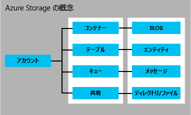

<properties
	pageTitle="Storage の概要 | Microsoft Azure"
	description="Microsoft がクラウドで提供するオンライン データ ストレージ、Azure Storage の概要を紹介。アプリケーションで可用性に最も優れたクラウド ストレージ ソリューションを使用する方法について説明します。"
	services="storage"
	documentationCenter=""
	authors="tamram"
	manager="carmonm"
	editor="tysonn"/>

<tags
	ms.service="storage"
	ms.workload="storage"
	ms.tgt_pltfrm="na"
	ms.devlang="na"
	ms.topic="get-started-article"
	ms.date="05/23/2016"
	ms.author="tamram"/>

# Microsoft Azure Storage の概要

## 概要

Azure Storage は、持続性、可用性、スケーラビリティで顧客のニーズに応える最新のアプリケーションのためのクラウド ストレージ ソリューションです。この記事では、開発者、IT 技術者、およびビジネスの意思決定者が下記の内容について学習できます。

- Azure Storage の簡単な説明、およびクラウド、モバイル、サーバー、およびデスクトップ アプリケーションでの活用方法
- Azure Storage サービスに保存できるデータの種類: BLOB (オブジェクト) データ、NoSQL テーブル データ、キュー メッセージ、ファイル共有
- Azure Storage に保存されたデータへのアクセス管理の方法
- 冗長性およびレプリケーションによって Azure Storage データを永続的にする方法
- Azure Storage アプリケーションを初めて構築する場合に役立つ詳細情報

Azure Storage の使用を今すぐ開始するための情報については、「[Azure Storage を 5 分で使い始める](storage-getting-started-guide.md)」をご覧ください。

Azure Storage の使用に必要なツール、ライブラリ、およびその他のリソースの詳細については、下記「[次のステップ](#next-steps)」をご覧ください。

## Azure Storage とは

クラウド コンピューティングは、スケーラブルで、耐久性と高可用性に富んだストレージを必要とするアプリケーションに適した新しいシナリオを実現します。それこそがまさに、Microsoft が Azure Storage を開発した理由です。Azure Storage は、開発者が新しいシナリオをサポートするための大規模なアプリケーションの構築に使用できるだけでなく、Azure Virtual Machines の堅牢性を裏付けるストレージ基盤となります。

Azure Storage は拡張性に富んでいます。科学、財務分析、およびメディアのアプリケーションで求められるビッグ データ シナリオに対応して、数百テラバイトのデータを保存、処理できます。また、スモール ビジネスの Web サイト用に、少量のデータを保存することもできます。お客様のニーズがどのような規模であろうとも、料金は保存しているデータ量に応じた金額のみです。Azure Storage には現在、膨大な数のお客様のプロジェクトが保存され、1 秒間に平均数百万の要求が処理されています。

Azure Storage は弾力性に富んでいるため、広範なグローバル ユーザー向けにアプリケーションを設計し、必要に応じて、格納されるデータの量とアプリケーションに対する要求の数の両面からそれらのアプリケーションの規模を変更できます。料金は使用した容量のみ、また使用したときのみが課金されます。

Azure Storage は、自動パーティション分割システムを使用し、トラフィック量に基づいてデータを均等に負荷分散します。つまり、Azure Storage では、アプリケーションの需要の拡大に応じて、それに対応する適切なリソースが自動的に割り当てられます。

Azure Storage は、世界中どこからでも、あらゆる種類のアプリケーションからアクセスでき、そのアプリケーションがクラウド、デスクトップ、オンプレミスのサーバー、またはモバイルやタブレット デバイスのいずれで実行されていても利用できます。また、アプリケーションがデータの一部をデバイスに保存し、そのデータをクラウドに保存された完全なデータと同期するモバイルのシナリオも、Azure Storage で実現できます。

Azure Storage は、多様なセットのオペレーティング システム (Windows および Linux を含む) と、多様なプログラミング言語 (.NET、Java、Node.js、Python、Ruby、PHP、および C++ と、モバイル プログラミング言語) を使用するクライアントをサポートしているため、アプリケーション開発に便利です。またデータ リソースには、HTTP/HTTPS の送受信機能を持つ任意のクライアントから、単純な REST API 経由でアクセスできます。

Azure Premium Storage は、Azure Virtual Machines 上で実行される大量の I/O が発生するワークロード向けに高パフォーマンス、低待機時間のディスク サポートを提供します。Azure Premium Storage を使用すると、複数の永続データ ディスクを仮想マシンに接続し、パフォーマンス要件を満たすように構成できます。各データ ディスクは Azure Premium Storage の SSD ディスクによって最高の I/O パフォーマンスを実現しています。詳細については、「[Premium Storage: Azure 仮想マシン ワークロード向けの高パフォーマンス ストレージ](storage-premium-storage.md)」をご覧ください。

## Azure Storage サービスの概要

Azure Storage では、4 つのサービスが提供されます。Blob Storage、Table Storage、Queue Storage、および File Storage です。

- Blob Storage は、非構造化オブジェクト データを格納します。ドキュメント、メディア ファイル、アプリケーション インストーラーなど、任意の種類のテキスト データやバイナリ データを BLOB として保存できます。Blob Storage は、オブジェクト ストレージとも呼ばれます。
- Table Storage には、構造型データセットが格納されます。Table Storage は、NoSQL キー属性データ ストアであるため、開発が迅速化され、大量のデータにすばやくアクセスできます。
- Queue Storage は、ワークフロー処理およびクラウド サービスのコンポーネント間通信のための、信頼性の高いメッセージング機能を提供します。
- File Storage は、標準的な SMB プロトコルを使用して、レガシ アプリケーション用の共有ストレージを提供します。Azure の仮想マシンおよびクラウド サービスでは、マウントされている共有を介して、アプリケーション コンポーネント間でファイル データを共有できます。オンプレミスのアプリケーションでは、ファイル サービス REST API を介して、共有内のファイル データにアクセスできます。

Azure ストレージ アカウントは、Azure Storage のサービスにアクセスできる安全なアカウントです。ストレージ アカウントは、ストレージ リソースに対して一意の名前空間を提供します。以下の図は、ストレージ アカウントにおける Azure Storage のリソース間の関係を示したものです。

[AZURE.INCLUDE [storage-account-types-include](../../includes/storage-account-types-include.md)]

[AZURE.INCLUDE [storage-versions-include](../../includes/storage-versions-include.md)]

## BLOB ストレージ

大量の非構造化オブジェクト データをクラウドに保存する場合は、Blob Storage を使用するとコスト効率の高いスケーラブルなソリューションが実現します。Blob Storage には、次のようなコンテンツを格納できます。

- ドキュメント
- 写真、ビデオ、音楽、ブログなどのソーシャル データ
- ファイル、コンピューター、データベース、およびデバイスのバックアップ データ
- Web アプリケーションのイメージとテキスト
- クラウド アプリケーションの構成データ
- ログやその他の大きなデータセットなどのビッグ データ

すべての BLOB は、コンテナーに編成されます。コンテナーを使用すると、オブジェクトのグループにセキュリティ ポリシーを便利に割り当てることができます。ストレージ アカウントの容量の上限である 500 TB (テラバイト) を超えない限り、ストレージ アカウントには任意の数のコンテナーを含めることができ、コンテナーには任意の数の BLOB を含めることができます。

BLOB ストレージが提供する BLOB には、ブロック BLOB、追加 BLOB、ページ BLOB (ディスク) の 3 種類があります。

- ブロック BLOB はストリーミングとクラウド オブジェクトの格納に最適化されているので、ドキュメント、メディア ファイル、バックアップなどの格納に適しています。
- 追加 BLOB はブロック BLOB に似ていますが、追加操作用に最適化されています。追加 BLOB は、新しいブロックを最後に追加することによってのみ更新できます。追加 BLOB は、新しいデータが BLOB の最後のみに書き込まれる必要がある、ログ記録のようなシナリオに適しています。
- ページ BLOB は、IaaS のディスクとして使用でき、ランダムな書き込みをサポートするように最適化され、最大 1 TB (テラバイト) までサイズを拡大できます。Azure 仮想マシン ネットワークに設置された IaaS ディスクは、ページ BLOB として格納される VHD です。

ネットワーク上の制限があるために、有線接続経由で Blob Storage にデータをアップロードまたはダウンロードできない場合は、Microsoft にハード ドライブを送付し、データ センターから直接データをインポートまたはエクスポートできます。「[Microsoft Azure Import/Export サービスを使用した Blob Storage へのデータの転送](storage-import-export-service.md)」を参照してください。

## テーブル ストレージ

最新のアプリケーションの多くは、前の世代のソフトウェアよりも、拡張性と柔軟性に優れたデータ ストアを必要とします。Table Storage は、高度な可用性と拡張性を備え、アプリケーションを需要に応じて自動的に拡張できます。Table Storage は、Microsoft の NoSQL のキーまたは属性ストアですが、従来のリレーショナル データベースと異なり、スキーマなしの設計です。スキーマなしのデータ ストアでは、アプリケーションの進化のニーズに合わせてデータを容易に修正できます。Table Storage は使いやすいため、開発者はアプリケーションを迅速に作成できます。あらゆる種類のデータに、高速かつ経済的にアクセスできます。Table Storage は、通常、従来の SQL と比較して、同様の容量のデータをはるかに低コストで保存できます。

Table Storage は、キー属性ストアであるため、テーブル内のすべての値に型指定されたプロパティ名が付いて保存されます。このプロパティ名は、フィルタリングや、選択条件の指定に使用できます。1 つのエンティティは、一連のプロパティとその値で構成されます。Table Storage はスキーマがないため、同じテーブル内の 2 つのエンティティが異なるコレクションのプロパティを持つことができ、それらのプロパティに異なる型を使用できます。

Table Storage を使用すると、Web アプリケーションのユーザー データ、アドレス帳、デバイス情報、およびサービスに必要なその他の種類のメタデータなど、柔軟なデータセットを保存できます。ストレージ アカウントの容量の上限を超えない限り、テーブルには任意の数のエンティティを保存でき、ストレージ アカウントには任意の数のテーブルを含めることができます。

Table Storage は、Blob Storage や Queue Storage と同様、標準の REST プロトコルを使用して管理およびアクセスできますが、それに加えて OData プロトコルのサブセットもサポートしているため、高度なクエリ機能を容易に使用でき、JSON と AtomPub (XML ベース) の両方の形式が有効になります。

今日のインターネットベースのアプリケーションでは、Table Storage のような NoSQL データベースが、従来のリレーショナル データベースの代わりに広く使用されています。

## Queue Storage

拡張性を重視してアプリケーションを設計する場合、通常、アプリケーション コンポーネントを個別に拡張できるように分離します。Queue Storage では、アプリケーション コンポーネントがクラウド、デスクトップ、オンプレミスのサーバー、モバイル デバイスのいずれで実行されている場合でも、信頼性の高いメッセージング ソリューションによって、アプリケーション コンポーネント間の非同期通信が実行されます。Queue Storage ではまた、非同期タスクの管理とプロセス ワークフローの構築もサポートします。

ストレージ アカウントには、任意の数のキューを含めることができます。キューには、ストレージ アカウントの容量の上限を超えない限り、任意の数のメッセージを含めることができます。1 つのメッセージは、最大 64 KB のサイズにすることができます。

## File Storage

Azure File Storage はクラウド ベースの SMB ファイル共有を提供するため、コストがかかる書き換えを行わずに、ファイル共有に依存するレガシ アプリケーションをすばやく Azure に移行できます。Azure File Storage では、デスクトップ アプリケーションが一般的な SMB 共有をマウントするのと同じように、Azure の仮想マシンまたはクラウド サービスで実行されているアプリケーションはファイル共有をクラウドにマウントできます。このため、任意の数のアプリケーション コンポーネントが、File Storage 共有をマウントして同時にアクセスできます。

File Storage 共有は標準の SMB ファイル共有であるため、Azure で実行されているアプリケーションは、ファイル システム I/O API を介して共有内のデータにアクセスできます。そのため、開発者は、既存のコードとスキルを活用して、既存のアプリケーションを移行することができます。IT プロフェッショナルは、Azure アプリケーションの管理の一環として、PowerShell コマンドレットを使用して、File Storage 共有を作成、マウント、管理できます。

他の Azure Storage サービスと同じように、File Storage では、共有内のデータにアクセスするための REST API を公開しています。オンプレミスのアプリケーションでは、File Storage REST API を呼び出して、ファイル共有内のデータにアクセスできます。そのため、企業では、一部のレガシ アプリケーションを Azure に移行し、それ以外のアプリケーションを組織内から引き続き実行することができます。ファイル共有をマウントできるのは、Azure で実行しているアプリケーションのみです。オンプレミスのアプリケーションでは、REST API を介してのみファイル共有にアクセスすることができます。

また、分散アプリケーションでは、File Storage を使用して、役立つアプリケーション データ、開発ツール、テスト ツールを格納および共有することができます。たとえば、File Storage 共有にログ、メトリック、クラッシュ ダンプなどの診断データと構成ファイルを格納して、複数の仮想マシンやロールで使用できます。開発者および管理者は、アプリケーションを構築または管理するために必要なユーティリティを、すべての仮想マシンやロール インスタンスにインストールする代わりに、すべてのコンポーネントで利用できる File Storage 共有に格納することができます。

## BLOB、テーブル、キュー、ファイルのリソースへのアクセス

既定では、ストレージ アカウント所有者のみが、ストレージ アカウント内のリソースにアクセスできます。データのセキュリティを保護するため、アカウント内のリソースに対するすべての要求を認証する必要があります。認証は、共有キー モデルに依存します。BLOB を構成して、匿名認証をサポートすることもできます。

ストレージ アカウントには、認証に使用される 2 つのプライベート アクセス キーが作成時に割り当てられます。2 つのキーを持つことで、通常のセキュリティ キーの管理手法に従って定期的にキーを再生成しても、アプリケーションが使用できます。

ストレージ リソースへのアクセス許可をユーザーが管理する必要がある場合は、共有アクセス署名 を作成できます。Shared Access Signature (SAS) は、URL に追加できるトークンであり、ストレージ リソースへのアクセスの委任を可能にするトークンです。トークンを持つすべてのユーザーは、トークンが有効な間、トークンに指定されたアクセス許可を使用して、トークンが示すリソースにアクセスできます。2015 年 4 月 5 日のバージョン以降、Azure Storage では、サービス SAS とアカウント SAS という 2 種類の Shared Access Signature をサポートします。

サービス SAS は、1 つのストレージ サービス (BLOB、Queue、Table、または File サービスのいずれか) のリソースへのアクセスを委任します。

アカウント SAS は、1 つ以上のストレージ サービスのリソースへのアクセスを委任します。サービス SAS で利用できないサービス レベルの操作へのアクセスを委任できます。サービス SAS で許可されていない BLOB コンテナー、テーブル、キューおよびファイル共有の読み取り、書き込みおよび削除操作へのアクセスも委任できます。

最後に、コンテナーとそれに含まれるすべての BLOB、または特定の BLOB をパブリック アクセスで使用できるように指定できます。コンテナーまたは BLOB をパブリックとして指定すると、認証が不要になり、すべてのユーザーが匿名でリソースを読み取ることができます。パブリック コンテナーと BLOB は、Web サイトでホストされているメディアやドキュメントなどのリソースを公開する場合に便利です。グローバル ユーザーのネットワーク待ち時間を短縮するために、Web サイトで使用される BLOB データを Azure CDN によってキャッシュできます。

Shared Access Signature の詳細については、「[Shared Access Signature、第 1 部: SAS モデルについて](storage-dotnet-shared-access-signature-part-1.md)」を参照してください。ストレージ アカウントへのセキュリティで保護されたアクセスの詳細については、「[コンテナーと BLOB への匿名読み取りアクセスを管理する](storage-manage-access-to-resources.md)」および「[Azure Storage サービスの認証](https://msdn.microsoft.com/library/azure/dd179428.aspx)」を参照してください。

## レプリケーションによる持続性と高可用性

[AZURE.INCLUDE [storage-replication-options-include](../../includes/storage-replication-options-include.md)]

## Azure Storage との間のデータ転送

AzCopy コマンド ライン ユーティリティを使用して、BLOB、ファイル、テーブルのデータを同じストレージ アカウント内で、または別のストレージ アカウントとの間でコピーすることができます。詳細については、「[AzCopy コマンド ライン ユーティリティを使用してデータを転送する](storage-use-azcopy.md)」を参照してください。

AzCopy は [Azure Data Movement Library](https://www.nuget.org/packages/Microsoft.Azure.Storage.DataMovement/) を基盤として構築されていますが、このライブラリは現時点ではプレビューとして公開されています。

Azure Import/Export サービスを利用すると、ハード ディスク ドライブを Azure データ センターに送付するという方法で、ストレージ アカウントに BLOB データをインポートする、またはストレージ アカウントからエクスポートすることができます。Import/Export サービスの詳細については、「[Microsoft Azure Import/Export サービスを使用した Blob Storage へのデータの転送](storage-import-export-service.md)」を参照してください。

## 価格

[AZURE.INCLUDE [storage-account-billing-include](../../includes/storage-account-billing-include.md)]

## ストレージ API、ライブラリ、ツール

Azure Storage のリソースは、HTTP/HTTPS 要求が可能な任意の言語からアクセスできます。さらに、主要な複数の言語のプログラミング ライブラリも用意されています。これらのライブラリを使用すると、同期呼び出しと非同期呼び出し、操作のバッチ処理、例外管理、自動再試行、実行動作などの詳細が処理され、Azure Storage の使用に関するさまざまな側面が簡略化されます。ライブラリは、次の言語およびプラットフォーム用が現在提供されており、その他についても準備中です。

### Azure Storage データ サービス

- [Storage サービス REST API](http://msdn.microsoft.com/library/azure/dd179355.aspx)
- [.NET、Windows Phone、Windows ランタイム用ストレージ クライアント ライブラリ](https://www.nuget.org/packages/WindowsAzure.Storage/)
- [C++ 用ストレージ クライアント ライブラリ](https://github.com/Azure/azure-storage-cpp)
- [Java/Android 用ストレージ クライアント ライブラリ](/develop/java/)
- [Node.js 用ストレージ クライアント ライブラリ](http://dl.windowsazure.com/nodestoragedocs/index.html)
- [PHP 用ストレージ クライアント ライブラリ](/develop/php/)
- [Ruby 用ストレージ クライアント ライブラリ](/develop/ruby/)
- [Python 用ストレージ クライアント ライブラリ](/develop/python/)
- [PowerShell 1.0 用ストレージ コマンドレット](https://msdn.microsoft.com/library/azure/mt269418.aspx)

### Azure Storage 管理サービス

- [Storage Resource Provider REST API リファレンス](https://msdn.microsoft.com/library/azure/mt163683.aspx)
- [.NET 用 Storage Resource Provider クライアント ライブラリ](https://msdn.microsoft.com/library/azure/mt131037.aspx)
- [PowerShell 1.0 用 Storage Resource Provider コマンドレット](https://msdn.microsoft.com/library/azure/mt607151.aspx)
- [Storage Service Management REST API (Classic)](https://msdn.microsoft.com/library/azure/ee460790.aspx)

### Azure Storage データ管理サービス

- [Storage Import/Export Service REST API](https://msdn.microsoft.com/library/azure/dn529096.aspx)
- [.NET 用 Storage Data Movement クライアント ライブラリ](https://www.nuget.org/packages/Microsoft.Azure.Storage.DataMovement/)

### ツールとユーティリティ

- [Azure SDK とツール](https://azure.microsoft.com/downloads/)
- [Azure ストレージ エミュレーター](http://www.microsoft.com/download/details.aspx?id=43709)
- [Azure PowerShell](../powershell-install-configure.md)
- [AzCopy コマンド ライン ユーティリティ](http://aka.ms/downloadazcopy)

## 次のステップ

Azure Storage についてさらに学習するには、次のリソースを参照してください。

### ドキュメント

- [Azure Storage のドキュメント](https://azure.microsoft.com/documentation/services/storage/)

### 管理者向け

- [Azure Storage での Azure PowerShell の使用](storage-powershell-guide-full.md)
- [Azure Storage での Azure CLI の使用](storage-azure-cli.md)

### .NET 開発者向け

- [.NET を使用して Azure Blob Storage を使用する](storage-dotnet-how-to-use-blobs.md)
- [.NET を使用して Azure Table Storage を使用する](storage-dotnet-how-to-use-tables.md)
- [.NET を使用して Azure Queue Storage を使用する](storage-dotnet-how-to-use-queues.md)
- [Windows で Azure File Storage を使用する](storage-dotnet-how-to-use-files.md)

### Java/Android 開発者向け

- [Java から BLOB ストレージを使用する方法](storage-java-how-to-use-blob-storage.md)
- [Java からテーブル ストレージを使用する方法](storage-java-how-to-use-table-storage.md)
- [Java から Queue ストレージを使用する方法](storage-java-how-to-use-queue-storage.md)
- [Java からファイル ストレージを使用する方法](storage-java-how-to-use-file-storage.md)

### Node.js 開発者向け

- [Node.js から BLOB ストレージを使用する方法](storage-nodejs-how-to-use-blob-storage.md)
- [Node.js から Table ストレージを使用する方法](storage-nodejs-how-to-use-table-storage.md)
- [Node.js から Queue ストレージを使用する方法](storage-nodejs-how-to-use-queues.md)

### PHP 開発者向け

- [PHP から BLOB ストレージを使用する方法](storage-php-how-to-use-blobs.md)
- [PHP から Table ストレージを使用する方法](storage-php-how-to-use-table-storage.md)
- [PHP から Queue ストレージを使用する方法](storage-php-how-to-use-queues.md)

### Ruby 開発者向け

- [Ruby から BLOB ストレージを使用する方法](storage-ruby-how-to-use-blob-storage.md)
- [Ruby から Table ストレージを使用する方法](storage-ruby-how-to-use-table-storage.md)
- [Ruby から Queue ストレージを使用する方法](storage-ruby-how-to-use-queue-storage.md)

### Python 開発者向け

- [Python から BLOB ストレージを使用する方法](storage-python-how-to-use-blob-storage.md)
- [Python から Table ストレージを使用する方法](storage-python-how-to-use-table-storage.md)
- [Python から Queue ストレージを使用する方法](storage-python-how-to-use-queue-storage.md)
- [Python からファイル ストレージを使用する方法](storage-python-how-to-use-file-storage.md)

<!---HONumber=AcomDC_0525_2016-->