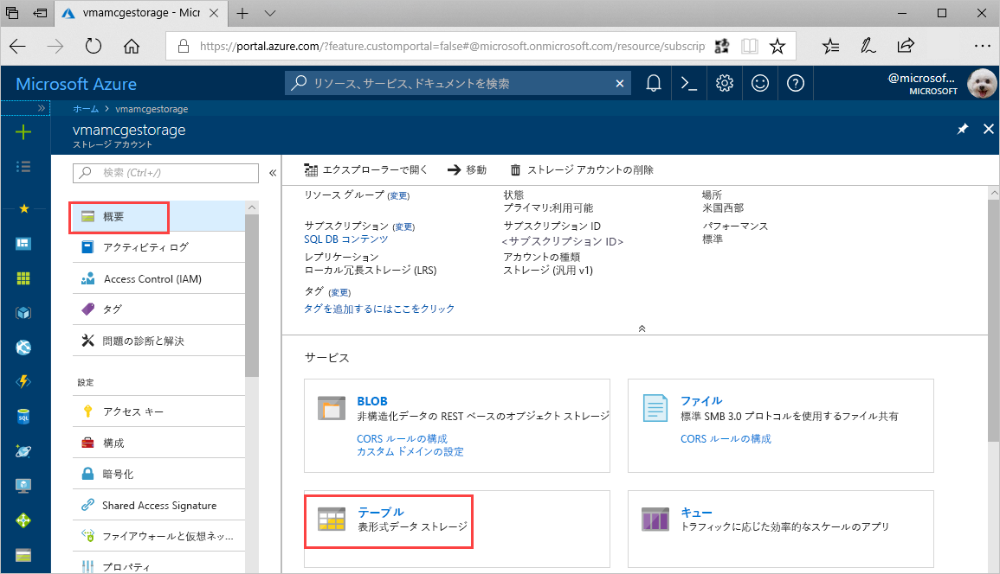
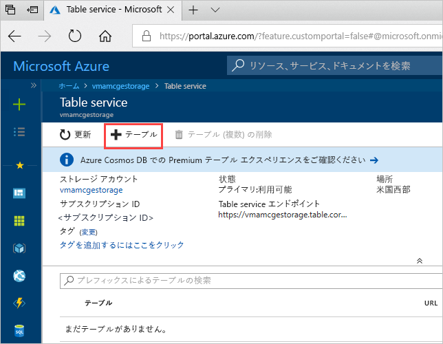
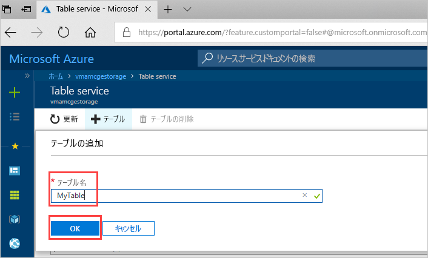

# クイック スタート:Azure portal で Azure Storage テーブルを作成する 

このクイック スタートでは、Web ベースの Azure portal でテーブルおよびエンティティを作成する方法を示します。 このクイック スタートでは、Azure ストレージ アカウントを作成する方法も示します。

[!INCLUDE [quickstarts-free-trial-note](../../../includes/quickstarts-free-trial-note.md)]

## 前提条件

このクイック スタートを完了するには、まず、[Azure Portal](https://portal.azure.com/#create/Microsoft.StorageAccount-ARM) で Azure ストレージ アカウントを作成します。 アカウントの作成については、「[ストレージ アカウントの作成](../common/storage-account-create.md)」を参照してください。

## テーブルの追加

Azure portal で Table service を使用して、テーブルを作成することができます。

1. [概要] > [テーブル] をクリックします。

   

2. **[+ テーブル]** をクリックします。

   

3. **[テーブル名]** ボックスにテーブルの名前を入力し、 **[OK]** をクリックします。 

   

## 次のステップ

- [テーブル設計のガイドライン](table-storage-design-guidelines.md)
