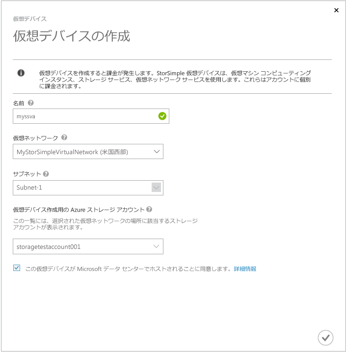
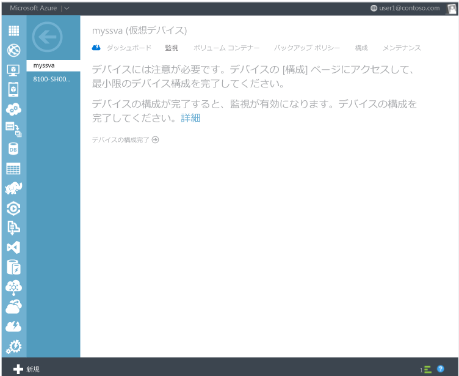
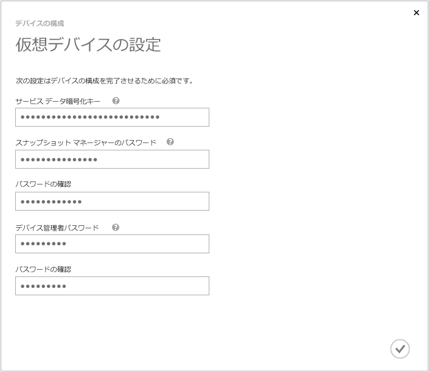
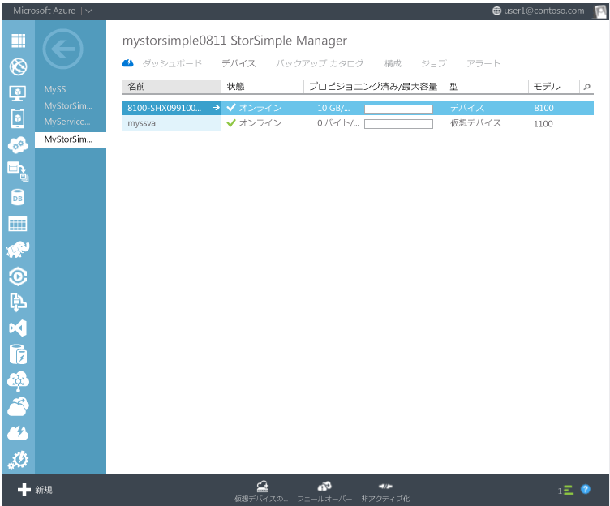

<properties
   pageTitle="StorSimple 仮想デバイス | Microsoft Azure"
   description="StorSimple 仮想デバイスを作成、構成、デプロイ、および管理する方法について説明します。"
   services="storsimple"
   documentationCenter=""
   authors="alkohli"
   manager="adinah"
   editor="" />
<tags
   ms.service="storsimple"
   ms.devlang="NA"
   ms.topic="hero-article"
   ms.tgt_pltfrm="NA"
   ms.workload="NA"
   ms.date="08/13/2015"
   ms.author="alkohli" />

# StorSimple 仮想デバイス

[AZURE.INCLUDE [storsimple-version-selector-sva](../../includes/storsimple-version-selector-sva.md)]

## 概要

StorSimple 仮想デバイスは、Microsoft Azure StorSimple ソリューションに付属する追加的な機能です。StorSimple 仮想デバイスは Microsoft Azure の仮想ネットワーク内の仮想マシン上で動作します。この仮想マシンを使用して、ホストからデータをバックアップしたり、複製したりできます。この記事の次のトピックでは、StorSimple 仮想デバイスの概要のほか、構成方法や使用方法についてわかりやすく説明しています。

- 仮想デバイスと物理デバイスの違い

- 仮想デバイスを使用するためのセキュリティに関する考慮事項

- 仮想デバイスの前提条件

- 仮想デバイスの作成と構成

- 仮想デバイスの作業

- 仮想デバイスへのフェールオーバー

- 仮想デバイスのシャットダウンまたは削除

## 仮想デバイスと物理デバイスの違い

StorSimple 仮想デバイスは、Microsoft Azure 仮想マシン内の単一のノード上で動作する、StorSimple のソフトウェア専用バージョンです。災害復旧のシナリオ、たとえば、物理デバイスが利用できなくなった状況をサポートします。また、クラウド開発やテストのシナリオに適しています。

StorSimple 仮想デバイスと物理 StorSimple デバイスの主な相違点を以下に示します。

- 仮想デバイスのネットワーク インターフェイスは DATA 0 ただ 1 つです。物理デバイスには 6 つのネットワーク インターフェイス、DATA 0 から DATA 5 があります。
- 仮想デバイスは、別個のタスクとしてではなく構成手順の中で登録されます。
- 仮想デバイスからサービス データ暗号化キーを再生成することはできません。キー ロールオーバー時に物理デバイス上でキーを再生成し、その新しいキーで仮想デバイスを更新することになります。
- 更新プログラムを適用する必要がある場合、仮想デバイスにはある程度のダウン タイムが発生するのに対し、物理デバイスにはダウン タイムが発生しません。

## 仮想デバイスを使用するためのセキュリティに関する考慮事項

StorSimple 仮想デバイスを使用する場合、セキュリティに関する次の考慮事項に留意してください。

- 仮想デバイスは Microsoft Azure サブスクリプションを通じてセキュリティで保護されます。つまり、仮想デバイスを使用している場合に Azure サブスクリプションが侵害されると、仮想デバイス上に格納されたデータも影響を受けます。

- Azure StorSimple に格納されたデータの暗号化に使われる証明書の公開キーは、Azure ポータルに対して安全に公開され、秘密キーは StorSimple デバイス上に保持されます。StorSimple 仮想デバイスでは、公開キーと秘密キーの両方が Azure に格納されます。

- 仮想デバイスは、Microsoft Azure データセンターでホストされます。

## 仮想デバイスの前提条件

次のセクションでは、StorSimple 仮想デバイスを使用するための準備について説明します。

### Azure の要件

仮想デバイスをプロビジョニングする前に、Azure 環境で次の準備作業が必要となります。

- 仮想デバイスに対し、[Azure の仮想ネットワークを構成](virtual-networks-create-vnet.md)します。
- 独自の DNS サーバー名を指定する代わりに、Azure に用意されている既定の DNS サーバーを使用することをお勧めします。DNS サーバー名が有効でない場合、仮想デバイスの作成は失敗します。
- ポイント対サイトおよびサイト間を必要に応じて選ぶことができますが、必須ではありません。必要に応じてこれらのオプションを構成することで、より高度なシナリオを実現することができます。

>[AZURE.IMPORTANT]**仮想デバイスで使用する予定のクラウド ストレージ アカウントと同じリージョンに仮想ネットワークが存在することを確認してください。**

- 仮想デバイスによって公開されたボリュームを使用できる [Azure 仮想マシン](https://msdn.microsoft.com/library/azure/jj156003.aspx) (ホスト サーバー) を仮想ネットワークに作成できます。これらのサーバーは次の要件を満たしている必要があります。
	- Windows または Linux の VM が実行され、iSCSI イニシエーター ソフトウェアがインストールされていること。
	- 仮想デバイスと同じ仮想ネットワークで実行されていること。
	- 仮想デバイスの内部 IP アドレスで仮想デバイスの iSCSI ターゲットに接続できること。

- iSCSI とクラウド トラフィックに対するサポートを同じ仮想ネットワークに対して構成済みであることを確認してください。

### StorSimple の要件

仮想デバイスを作成する前に、Azure StorSimple サービスに対して次の更新作業を行います。

- 仮想デバイスのホスト サーバーとなる VM の[アクセス制御レコード](storsimple-manage-acrs.md)を追加します。

- ご利用の[ストレージ アカウント](storsimple-manage-storage-accounts.md#add-a-storage-account)が仮想デバイスと同じリージョンに存在することを確認します。ストレージ アカウントが異なるリージョンに存在すると、十分なパフォーマンスが得られない可能性があります。

- 仮想デバイスの作成には、データに使用するストレージ アカウントとは異なるストレージ アカウントを使用してください。同じストレージ アカウントを使用すると、十分なパフォーマンスが得られない可能性があります。

作業を開始する前に、次の情報を確認してください。

- アクセス資格情報のある Azure ポータル アカウントを持っていること。

- Azure ストレージ アカウントのアクセス資格情報。

- 物理デバイスから取得したサービス データ暗号化キーのコピー。

- クラウド サービス暗号化キーのコピー (ボリューム コンテナーごと)。

## 仮想デバイスの作成と構成

以下の作業を始める前に、「[仮想デバイスの前提条件](#prerequisites-for-the-virtual-device)」が満たされていることを確認してください。

以下の作業が完了した後、「[仮想デバイスの作業](#work-with-the-storsimple-virtual-device)」に進むことができます。

### 仮想デバイスの作成

仮想ネットワークを作成して StorSimple Manager サービスを構成し、そのサービスに物理 StorSimple デバイスを登録した後、次の手順に従って StorSimple 仮想デバイスを作成することができます。

StorSimple 仮想デバイスを作成するには、次の手順を実行します。

1.  Azure ポータルで **StorSimple Manager** サービスに移動します。

- **[デバイス]** ページに移動します。

- **[仮想デバイスの作成]** ダイアログ ボックスで、次のように詳細を指定します。

	

	a.**[名前]** – 仮想デバイスの一意の名前。

	b.**[仮想ネットワーク]** – この仮想デバイスで使用する仮想ネットワークの名前。

	c.**[サブネット]** – 仮想デバイスで使用する仮想ネットワーク上のサブネット。

	d.**[仮想デバイスの作成に使用するストレージ アカウント]** – プロビジョニング中に仮想デバイスのイメージを保持する目的で使用されるストレージ アカウント。このストレージ アカウントは、仮想デバイスおよび仮想ネットワークと同じリージョンに存在する必要があります。物理デバイスまたは仮想デバイスのデータ保管にこのストレージ アカウントを使用することは避けてください。既定では、この目的に使用する新しいストレージ アカウントが作成されます。ただし、この用途に適したストレージ アカウントが既にあることがわかっている場合は、一覧からそのアカウントを選択してください。

- 仮想デバイスに格納するデータがマイクロソフトのデータセンターでホストされることに同意する旨のチェック ボックスをオンにします。これで仮想デバイスが作成されます。仮想デバイスの作成には最大で 45 分～ 1 時間かかる場合があります。

物理デバイスのみを使用する場合は、暗号化キーがご利用のデバイスに保管されるため、マイクロソフトが暗号化を解除することはできません。仮想デバイスを使用する場合、暗号化キーと復号化キーの両方が Microsoft Azure に保管されます。詳細については、「[仮想デバイスを使用するためのセキュリティに関する考慮事項](#security-considerations-for-using-a-virtual-device)」を参照してください。

### 仮想デバイスの構成と登録

この手順を開始する前に、サービス データ暗号化キーのコピーがあることを確認してください。サービス データ暗号化キーは、最初の StorSimple 物理デバイスの構成時に作成され、安全な場所に保存するように指示されます。サービス データ暗号化キーのコピーがない場合は、[Microsoft サポートに支援を依頼する](storsimple-contact-microsoft-support.md)必要があります。

StorSimple 仮想デバイスを構成して登録するには、次の手順を実行します。

1. **[デバイス]** ページで、先ほど作成した **StorSimple 仮想デバイス**を選択します。

2. **[デバイスの構成完了]** をクリックします。デバイスの構成ウィザードが起動します。

	

1. デバイスの構成ウィザードで、次のように実行します。

	1. 所定の場所に **[サービス データ暗号化キー]** を入力します。
	2. **Snapshot Manager のパスワード**を入力します。**Snapshot Manager のパスワード**は 14 ～ 15 文字とし、小文字、大文字、数字、特殊文字を組み合わせて構成する必要があります。
	3. **デバイス管理者のパスワード**を入力します。**デバイス管理者のパスワード**は 8 ～ 15 文字とし、小文字、大文字、数字、特殊文字を組み合わせて構成する必要があります。
	4. チェック マーク アイコンをクリックして、仮想デバイスの初期構成と登録を完了します。

		

構成と登録が完了したら、デバイスがオンラインになります。デバイスがオンラインになるまでに数分かかる場合があります。

### デバイスの構成設定の変更

次のセクションでは、StorSimple 仮想デバイスの構成で必要になる可能性のあるデバイスの構成設定について説明します。これらの設定には、CHAP の設定、StorSimple Snapshot Manager のパスワード、またはデバイス管理者のパスワードが含まれています。

#### CHAP イニシエーターの構成 (省略可能)

このパラメーターには、ボリュームへのアクセスを試みるイニシエーター (サーバー) に対して仮想デバイス (ターゲット) が要求する資格情報が含まれます。この認証中、イニシエーターは自己の身元をデバイスに証明するために CHAP ユーザー名と CHAP パスワードを提供します。

#### CHAP ターゲットの構成 (省略可能)

このパラメーターには、CHAP 対応のイニシエーターが相互認証 (双方向認証) を要求するときに仮想デバイスによって使用される資格情報が含まれます。この認証プロセス中、仮想デバイスは、リバース CHAP ユーザー名とリバース CHAP パスワードを使用してその身元をイニシエーターに対して証明します。CHAP ターゲットの設定はグローバル設定であることに注意してください。これらの設定が適用されると、ストレージの仮想デバイスに接続されているすべてのボリュームに CHAP 認証が使用されます。

#### StorSimple Snapshot Manager のパスワードの構成 (省略可能)

StorSimple Snapshot Manager ソフトウェアは Windows ホスト上に常駐し、管理者が、ローカル スナップショットとクラウド スナップショットの形式で StorSimple デバイスのバックアップを管理することを可能にします。

>[AZURE.NOTE]仮想デバイスの場合、Windows ホストは Azure VM です。

StorSimple Snapshot Manager でデバイスを構成するとき、ストレージ デバイスを認証するためのパスワードと StorSimple デバイスの IP アドレスを入力するように求められます。このパスワードは、Windows PowerShell のインターフェイスを使用して最初に構成されます。

StorSimple 仮想デバイスで使用している場合に StorSimple Snapshot Manager を変更するには、次の手順を実行します。

1. 仮想デバイスの **[デバイス] > [構成]** に移動します。

- 下へスクロールして **[Snapshot Manager]** セクションに移動します。14 または 15 文字のパスワードを入力します。大文字、小文字、数字、および特殊文字を組み合わせたパスワードを使用してください。

- パスワードを確認入力します。

- ページの下部にある **[保存]** をクリックします。

これで StorSimple Snapshot Manager パスワードが更新されました。Windows ホストの認証時に使用できます。

#### デバイス管理者のパスワードの構成

Windows PowerShell インターフェイスを使用して仮想デバイスにアクセスする際、デバイス管理者のパスワードの入力が求められます。データのセキュリティ上、仮想デバイスの使用前にこのパスワードを変更することが必須となっています。

StorSimple 仮想デバイスのデバイス管理者のパスワードを変更するには、次の手順を実行します。

1. 仮想デバイスの **[デバイス] > [構成]** に移動します。

1. 下へスクロールして **[デバイス管理者]** のパスワード セクションに移動します。管理者のパスワードは、8 ～ 15 文字で指定してください。大文字、小文字、数字、および特殊文字を組み合わせたパスワードを使用する必要があります。

1. パスワードを確認入力します。

1. ページの下部にある **[保存]** をクリックします。

これでデバイス管理者のパスワードが更新されました。この変更されたパスワードを使用して、仮想デバイス上の Windows PowerShell インターフェイスにアクセスすることができます。

#### リモート管理の構成 (省略可能)

Windows PowerShell インターフェイス経由での仮想デバイスへのリモート アクセスは既定では有効になっていません。リモート管理は、まず仮想デバイスで有効にして、次に、仮想デバイスへのアクセスに使用するクライアントで有効にする必要があります。

HTTP または HTTPS で接続するよう選択できます。セキュリティ上の理由から、仮想デバイスへの接続には自己署名証明書による HTTPS を使用することをお勧めします。

StorSimple 仮想デバイスのリモート管理を構成するには、次の手順を実行します。

1. 仮想デバイスの **[デバイス] > [構成]** に移動します。

2. 下へスクロールして **[リモート管理]** セクションに移動します。

3. **[リモート管理を有効にする]** を **[はい]** に設定します。

4. これで、HTTP を使用した接続を選択できるようになります。既定では HTTPS 経由で接続します。HTTP 経由での接続は、信頼のおけるネットワークでのみ許容されます。

5. リモート管理証明書をダウンロードするには、**[リモート管理証明書のダウンロード]** をクリックします。ファイルの保存先を指定してください。この証明書は、さらに、仮想デバイスへの接続に使用するクライアントまたはホスト コンピューターにインストールする必要があります。

6. ページの下部にある **[保存]** をクリックします。

## StorSimple 仮想デバイスの作業

StorSimple 仮想デバイスの作成と構成が終了したので、操作を開始する準備ができました。物理 StorSimple デバイスの場合と同じように、ボリューム コンテナー、ボリューム、およびバックアップ ポリシーを仮想デバイスで使用できます。唯一の違いは、デバイス リストから仮想デバイスを選択する必要があることです。関連するタスクの手順については、次のセクションを参照してください。

- [ボリューム コンテナー](storsimple-manage-volume-containers.md)

- [ボリューム](storsimple-manage-volumes.md)

- [バックアップ ポリシー](storsimple-manage-backup-policies)

以降のセクションでは、仮想デバイスでの作業時に遭遇するいくつかの違いについて説明します。

### StorSimple 仮想デバイスのメンテナンス

仮想デバイスはソフトウェア専用デバイスであるため、物理的なデバイスと比べて、メンテナンスは最小限で済みます。次のオプションがあります。

- **[ソフトウェアの更新]** – ソフトウェアが最後に更新された日時と更新状態メッセージが表示されます。新しい更新プログラムがないかどうかを確認する場合は、ページの下部にある [更新プログラムのスキャン] ボタンを使って、手動スキャンを実行できます。
- **[サポート パッケージ]** – ご利用の仮想デバイスに関する問題を Microsoft サポートがトラブルシューティングできるようにするため、サポート パッケージを作成してアップロードできます。

### 仮想デバイスのストレージ アカウント

ストレージ アカウントは、StorSimple Manager サービス、仮想デバイス、および物理的なデバイスで使用するために作成されます。ストレージ アカウントを作成する場合、すべてのシステム コンポーネントでリージョンが一致するように、表示名に地域識別子を使用することをお勧めします。仮想デバイスの場合、パフォーマンスの問題を防ぐには、すべてのコンポーネントが同じリージョンに属していることが重要です。

### StorSimple 仮想デバイスの非アクティブ化

仮想デバイスを非アクティブ化すると、プロビジョニング時に作成された VM とリソースが削除されます。仮想デバイスを非アクティブにすると、以前の状態に復元することはできません。仮想デバイスを非アクティブ化する前に、それに依存しているクライアントとホストを必ず停止または削除してください。

仮想デバイスを非アクティブにすると、次のアクションが発生します。

- 仮想デバイスが削除されます。

- 仮想デバイス用に作成された OS ディスクとデータ ディスクが削除されます。

- プロビジョニング中に作成されたホストされるサービスと仮想ネットワークは保持されます。それらを使用していない場合は、手動で削除する必要があります。

- 仮想デバイス用に作成されたクラウド スナップショットは保持されます。

StorSimple Manager サービス ページで非アクティブとして表示されるとすぐに、StorSimple Manager サービス デバイスの一覧から仮想デバイスを削除できます。

### StorSimple 仮想デバイスへのリモート アクセス

StorSimple デバイスの構成ページで Windows PowerShell リモート処理を有効にしたら、それを使って、同じ仮想ネットワーク内の別の仮想マシンから仮想デバイスに接続することができます。たとえば、iSCSI に接続するために構成して使用しているホスト VM から接続することができます。ほとんどのデプロイでは、仮想デバイスへのアクセスに使用できるホスト VM にアクセスするパブリック エンドポイントは既に開かれています。

>[AZURE.WARNING]セキュリティ強化のため、エンドポイントに接続する場合は HTTPS を使用して、PowerShell リモート セッション完了後にエンドポイントを削除することを強くお勧めします。

「[Windows PowerShell を使用するリモート接続](storsimple-remote-connect.md)」の手順に従って、仮想デバイスのリモート処理をセットアップしてください。

ただし、仮想ネットワーク外または Microsoft Azure 環境外の別のコンピューターから直接仮想デバイスに接続する場合は、次の手順に従って追加のエンドポイントを作成する必要があります。

仮想デバイス上にパブリック エンドポイントを作成するには、次の手順を実行します。

1. Azure ポータルにサインインします。

- **[Virtual Machines]** をクリックし、仮想デバイスとして使用している仮想マシンを選択します。

- **[エンドポイント]** をクリックします。[エンドポイント] ページに仮想マシンのすべてのエンドポイントが示されます。

- **[追加]** をクリックします。[エンドポイントの追加] ダイアログ ボックスが表示されます。矢印をクリックして続行します。

- **[名前]** にエンドポイントの名前の「**WinRMHttps**」を入力します。

- **[プロトコル]** には **[TCP]** を指定します。

- **[パブリック ポート]** に、接続に使用するポート番号を入力します。

- **[プライベート ポート]** に「**5986**」と入力します。

- チェック マークをクリックしてエンドポイントを作成します。

エンドポイントを作成した後、詳細を表示して、パブリック仮想 IP (VIP) アドレスを決定できます。このアドレスを記録します。

この方法では仮想ネットワーク上のパブリック エンドポイントの数が最小限になるため、同じ仮想ネットワーク内にある別の仮想マシンから接続することをお勧めします。この方法を使用する際は、リモート デスクトップ セッションを介して仮想マシンに接続してから、ローカル ネットワーク上の他の Windows クライアントのように仮装マシンを構成します。ポートは既にわかっているため、パブリック ポート番号を付加する必要はありません。

### 停止と再起動

物理的な StorSimple デバイスとは異なり、StorSimple 仮想デバイスには電源をオンまたはオフにするボタンはありません。ただし、仮想デバイスを停止して再起動する必要がある場合があります。たとえば、一部の更新プログラムでは、更新プロセスを完了するために VM の再起動が必要な場合があります。仮想デバイスを開始、停止、再起動する最も簡単な方法は、Virtual Machines 管理コンソールを使用することです。

管理コンソールを表示すると、仮想デバイスは作成後、既定で開始されるため、状態は **[実行中]** になります。仮想マシンはいつでも停止したり再起動したりできます。

仮想デバイスを停止するには、名前をクリックしてから **[シャットダウン]** をクリックします。仮想デバイスのシャットダウン中、状態は **[停止中]** です。仮想デバイスが停止した後、状態は **[停止]** になります。

実行中の仮想デバイスを再起動する場合は、名前をクリックしてから **[再起動]** をクリックします。仮想デバイスの再起動中の状態は **[再開中]** になります。仮想デバイスを使用する準備ができると、その状態は **[実行中]** になります。

以下の Windows PowerShell コマンドレットを使って、仮想デバイスを開始、停止、再起動することもできます。各コマンドレットの例を次に示します。

`Start-AzureVMC:\PS>Start-AzureVM -ServiceName "MyStorSimpleservice1" -Name "MyStorSimpleDevice"`

`Stop-AzureVMC:\PS>Stop-AzureVM -ServiceName "MyStorSimpleservice1" -Name "MyStorSimpleDevice"`

`Restart-AzureVMC:\PS>Restart-AzureVM -ServiceName "MyStorSimpleservice1" -Name "MyStorSimpleDevice"`

### 工場出荷時の既定値へのリセット

仮想デバイスを始めからやり直したい場合は、非アクティブにしてから削除し、新しく作成し直します。物理デバイスをリセットするときと同様に、新しい仮想デバイスには更新プログラムがインストールされていないため、使用する前に更新プログラムを必ず確認してください。

## 仮想デバイスへのフェールオーバー

災害復旧 (DR) は、StorSimple 仮想デバイスの設計目的であった主要シナリオの 1 つです。このシナリオでは、物理 StorSimple デバイスまたはデータセンター全体が使用できなくなる可能性があります。さいわいなことに、仮想デバイスを使って、別の場所に運用を復元することができます。DR 中に、ソース デバイスのボリューム コンテナーの所有権が変更され、それらのコンテナーは仮想デバイスに転送されます。DR の前提条件として、仮想デバイスが作成され、構成されていることと、ボリューム コンテナー内のすべてのボリュームがオフラインになっていること、さらに、ボリューム コンテナーにクラウド スナップショットが関連付けられていることが挙げられます。

### 物理デバイスを StorSimple 仮想デバイスに復元するには

1. フェールオーバーするボリューム コンテナーにクラウド スナップショットが関連付けられていることを確認します。

- **[デバイス]** ページを開いて、**[ボリューム コンテナー]** タブをクリックします。

- 仮想デバイスにフェールオーバーするボリューム コンテナーを選択します。ボリューム コンテナーをクリックし、そのコンテナー内のボリュームを一覧表示します。ボリュームを選択し、**[オフラインにする]** をクリックしてボリュームをオフラインにします。ボリューム コンテナーのすべてのボリュームでこのプロセスを繰り返します。

- 仮想デバイスにフェールオーバーするすべてのボリューム コンテナーに前の手順を繰り返します。

- **[デバイス]** ページで、フェールオーバーするデバイスを選択し、**[フェールオーバー]** をクリックして、**[デバイス フェールオーバー]** ウィザードを開きます。

- **[フェールオーバーするボリューム コンテナーを選択する]** で、フェールオーバーするボリューム コンテナーを選択します。ボリューム コンテナーがこの一覧に表示されるには、ボリューム コンテナーにクラウド スナップショットが含まれていて、オフラインである必要があります。表示されるはずのボリューム コンテナーが表示されない場合、ウィザードをキャンセルし、ボリューム コンテナーがオフラインになっていることを確認します。

- 次のページの **[選択したコンテナーのボリュームのターゲット デバイスを選択する]** で、利用できるデバイスのドロップダウン リストから仮想デバイスを選択します。利用できる容量があるデバイスのみが一覧に表示されます。

- **[フェールオーバーの確認]** ページですべてのフェールオーバー設定を見直します。すべての設定が正しければ、チェック マーク アイコンをクリックします。

フェールオーバー プロセスが開始されます。フェールオーバーが完了したら、[デバイス] ページに進み、フェールオーバー プロセスのターゲットとして使用した仮想デバイスを選択します。[ボリューム コンテナー] ページに移動します。すべてのボリューム コンテナーと古いデバイスのボリュームが表示されます。

>[AZURE.NOTE]仮想デバイスでサポートされるストレージの量は 30 TB (テラバイト) です。

## 仮想デバイスのシャットダウンまたは削除

以前構成して使っていた StorSimple 仮想デバイスのコンピューティング料金の発生を止めるには、仮想デバイスをシャットダウンします。仮想デバイスをシャットダウンしても、ストレージ内のオペレーティング システムやデータ ディスクは削除されません。この操作によって、サブスクリプションの料金は発生しなくなりますが、OS とデータ ディスクのストレージの料金は継続して発生します。

仮想デバイスを削除またはシャットダウンすると、StorSimple Manager サービスの [デバイス] ページには **[オフライン]** として表示されます。仮想デバイスによって作成されたバックアップも一緒に削除する場合は、デバイスとして非アクティブにするか、削除するかを選択できます。詳細については、[非アクティブ化](storsimple-deactivate-and-delete-device.md#deactivate-a-device)に関するトピックを参照してください。

### StorSimple 仮想デバイスをシャットダウンするには

1. Azure ポータルにサインインします。

2. **[Virtual Machines]** をクリックし、仮想デバイスを選択します。

3. **[シャットダウン]** をクリックします。

### StorSimple 仮想デバイスを削除するには

1. Azure ポータルにサインインします。

- **[Virtual Machines]** をクリックし、仮想デバイスを選択します。

- **[削除]** をクリックして、すべて仮想マシンのディスクの削除を選択します。

## 次のステップ

仮想デバイスを管理するには、[StorSimple デバイスの管理](storsimple-manager-service-administration.md#administer-storsimple-device-using-storsimple-manager-service)に関するページでワークフローの詳細な一覧をご覧ください。

<!---HONumber=August15_HO8-->