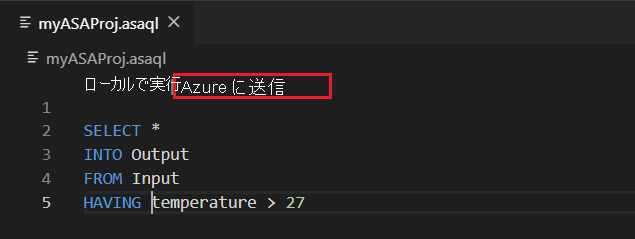

# リージョン間での Azure Stream Analytics ジョブのコピー、バックアップ、移動

Visual Studio Code または Visual Studio を使用して、デプロイされた Azure Stream Analytics ジョブをコピーまたはバックアップできます。 別のリージョンにジョブをコピーしても、最後の出力時刻はコピーされません。 そのため、コピーされたジョブを開始するときに、[**最終停止時刻**](./start-job.md#start-options)を使用することはできません。

## 開始する前に
* Azure サブスクリプションをお持ちでない場合は、[無料アカウント](https://azure.microsoft.com/free/)を作成してください。

* [Azure portal](https://portal.azure.com/) にサインインします。

* [Visual Studio Code の Azure Stream Analytics 拡張機能](quick-create-visual-studio-code.md#install-the-azure-stream-analytics-tools-extension)または [Visual Studio の Azure Stream Analytics ツール](quick-create-visual-studio-code.md#install-the-azure-stream-analytics-tools-extension)をインストールします。  

## Visual Studio Code

1. Visual Studio Code のアクティビティ バーの **[Azure]** アイコンをクリックし、**Stream Analytics ノード** を展開します。 ジョブは、サブスクリプションの下に表示されます。

   

2. ジョブをローカル プロジェクトにエクスポートするには、Visual Studio Code の **Stream Analytics Explorer** で、エクスポートするジョブを特定します。 次に、プロジェクトのフォルダーを選択します。

    

    プロジェクトは選択したフォルダーにエクスポートされ、現在のワークスペースに追加されます。

3. ジョブを別のリージョンに発行するか、または別の名前を使用してバックアップするには、クエリエディター (\*.asaql) で **[Select from your subscriptions to publish]\(発行先をサブスクリプションから選択\)** を選択し、指示に従います。

    

## Visual Studio

1. [デプロイされた Azure Stream Analytics ジョブをプロジェクトにエクスポートする指示](./stream-analytics-vs-tools.md#export-jobs-to-a-project)に従います。

2. クエリ エディターで \*.asaql ファイルを開き、スクリプト エディターで **[Azure に送信]** を選択し、指示に従ってジョブを別のリージョンに発行するか、新しい名前を使用してバックアップします。

## 次のステップ

* [クイック スタート: Visual Studio Code を使用して Stream Analytics ジョブを作成する](quick-create-visual-studio-code.md)
* [クイック スタート: Visual Studio を使用して Stream Analytics ジョブを作成する](stream-analytics-quick-create-vs.md)