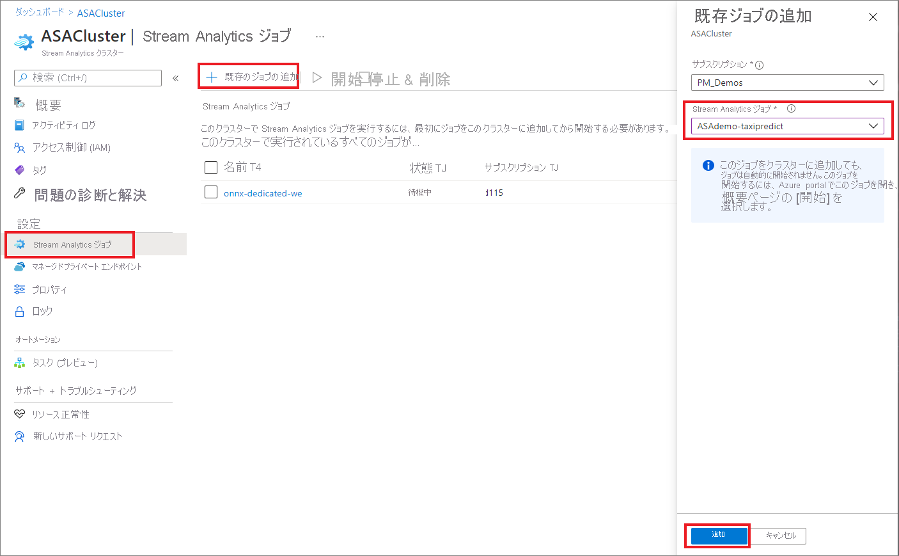
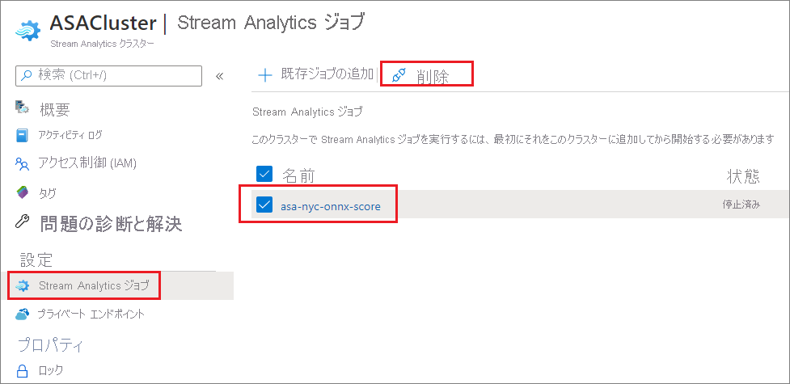

# Azure Stream Analytics クラスターのジョブを追加、削除する

Stream Analytics クラスター上で、複数の Azure Stream Analytics ジョブを実行できます。 クラスター上でのジョブの実行は、クラスターにジョブを追加してジョブを開始する単純な 2 段階のプロセスです。 この記事では、既存のクラスターからジョブを追加および削除する方法について説明します。 クイックスタートに従って [Stream Analytics クラスターを作成](create-cluster.md)します (まだお持ちでない場合)。

## クラスターに Stream Analytics ジョブを追加する

クラスターに追加できるのは、既存の Stream Analytics ジョブだけです。 Azure portal を使って[ジョブを作成する方法を学習する](stream-analytics-quick-create-portal.md)には、クイックスタートに従います。 クラスターに追加するジョブがある場合は、次の手順を使用して、クラスターにジョブを追加します。

1. Azure portal 内で、目的の Stream Analytics クラスターを見つけて選択します。

1. **[設定]** で、 **[Stream Analytics ジョブ]** を選択します。 次に、 **[既存ジョブの追加]** を選択します。

1. クラスターに追加するサブスクリプションと Stream Analytics ジョブを選択します。 クラスターに追加できるのは、クラスターと同じリージョンにある Stream Analytics ジョブだけです。

   

1. クラスターにジョブを追加したら、ジョブ リソースに移動し、[ジョブを開始](start-job.md#azure-portal)します。 これで、クラスター上でジョブの実行が開始されます。

監視、アラート、診断ログなど、他のすべての操作は、[Stream Analytics job resource]\(Stream Analytics ジョブ リソース\) ページから実行できます。

## クラスターから Stream Analytics ジョブを削除する

Stream Analytics ジョブは、クラスターから削除する前に、停止状態になっている必要があります。 ジョブがまだ実行中の場合は、次の手順に進む前にジョブを停止します。

1. Stream Analytics クラスターを検索して選択します。

1. **[設定]** で、 **[Stream Analytics ジョブ]** を選択します。

1. クラスターから削除するジョブを選択し、 **[削除]** を選択します。

   

   ジョブが Stream Analytics クラスターから削除されると、標準のマルチテナント環境に戻ります。

## 次のステップ

これで、Azure Stream Analytics クラスター内でジョブを追加および削除する方法がわかりました。 次は、プライベート エンドポイントを管理し、クラスターをスケーリングする方法について学習します。

* [Azure Stream Analytics クラスターのスケーリング](scale-cluster.md)
* [Azure Stream Analytics クラスター内でプライベート エンドポイントを管理する](private-endpoints.md)
