# <a name="quickstart-create-an-azure-stream-analytics-job-in-visual-studio-code-preview"></a>クイック スタート:Visual Studio Code で Azure Stream Analytics ジョブを作成する (プレビュー)

このクイックスタートでは、Visual Studio Code 用の Azure Stream Analytics ツール拡張機能を使用して、Azure Stream Analytics ジョブを作成および実行する方法について説明します。 サンプル ジョブでは、Azure IoT Hub デバイスからストリーミング データを読み取ります。 温度が 27 度を超えるときに平均温度を計算し、結果の出力イベントを BLOB ストレージ内の新しいファイルに書き込むジョブを定義します。

> [!NOTE]
> Visual Studio と Visual Studio Code のツールでは、中国東部、中国北部、ドイツ中部、ドイツ北東部のリージョンでのジョブはサポートされていません。

## <a name="before-you-begin"></a>開始する前に

* Azure サブスクリプションをお持ちでない場合は、[無料アカウント](https://azure.microsoft.com/free/)を作成してください。

* [Azure portal](https://portal.azure.com/) にサインインします。

* [Visual Studio Code](https://code.visualstudio.com/) をインストールします。

## <a name="install-the-azure-stream-analytics-tools-extension"></a>Azure Stream Analytics ツール拡張機能をインストールする

1. Visual Studio Code を開きます。

2. 左ペインの **[拡張機能]** から **Stream Analytics** を検索し、**Azure Stream Analytics ツール**拡張機能で **[インストール]** を選択します。

3. 拡張機能がインストールされたら、**Azure Stream Analytics ツール**が **[Enabled Extensions]\(有効な拡張機能\)** に表示されることを確認します。

   

## <a name="activate-the-azure-stream-analytics-tools-extension"></a>Azure Stream Analytics ツール拡張機能をアクティブにする

1. Visual Studio Code アクティビティ バーで、**Azure** アイコンを選択します。 サイド バーの **[Stream Analytics]** で、 **[Azure にサインイン]** を選択します。

   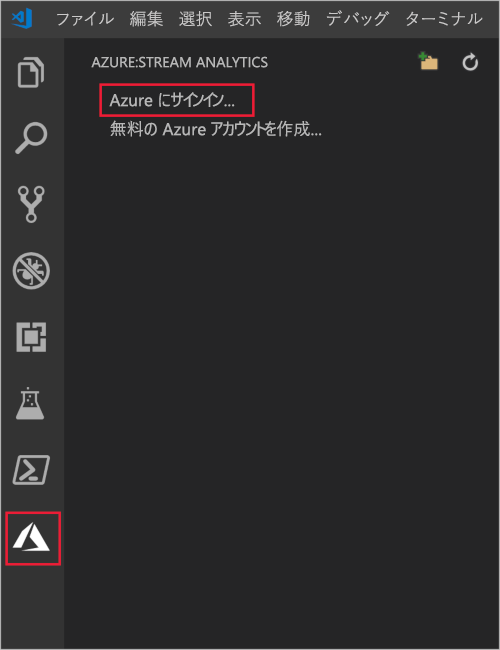

2. サインインすると、Visual Studio Code ウィンドウの左下にあるステータス バーに Azure アカウント名が表示されます。

> [!NOTE]
> サインアウトしない場合、次回は Azure Stream Analytics ツール拡張機能によって自動的にサインインされます。アカウントに 2 要素認証がある場合は、PIN を使用せずに電話による認証を使用することをお勧めします。
> リソースの一覧表示で問題が発生した場合は、通常、サインアウトしてから再度サインインすると解決します。 サインアウトするには、コマンド `Azure: Sign Out` を入力します。

## <a name="prepare-the-input-data"></a>入力データを準備する

Stream Analytics ジョブを定義する前に、後でジョブの入力として構成されるデータを準備する必要があります。 ジョブに必要な入力データを準備するには、次の手順を完了します。

1. [Azure portal](https://portal.azure.com/) にサインインします。

2. **[リソースの作成]**  >  **[モノのインターネット]**  >  **[IoT Hub]** を選択します。

3. **[IoT Hub]** ウィンドウで、以下の情報を入力します。

   |**設定**  |**推奨値**  |**説明**  |
   |---------|---------|---------|
   |サブスクリプション  | \<該当するサブスクリプション\> |  使用する Azure サブスクリプションを選択します。 |
   |リソース グループ   |   asaquickstart-resourcegroup  |   **[新規作成]** を選択し、アカウントの新しいリソース グループ名を入力します。 |
   |リージョン  |  \<ユーザーに最も近いリージョンを選択\> | お客様の IoT ハブをホストできる地理的な場所を選択します。 お客様のユーザーに最も近い場所を使用します。 |
   |IoT Hub 名  | MyASAIoTHub  |   お客様の IoT ハブの名前を選択します。   |

   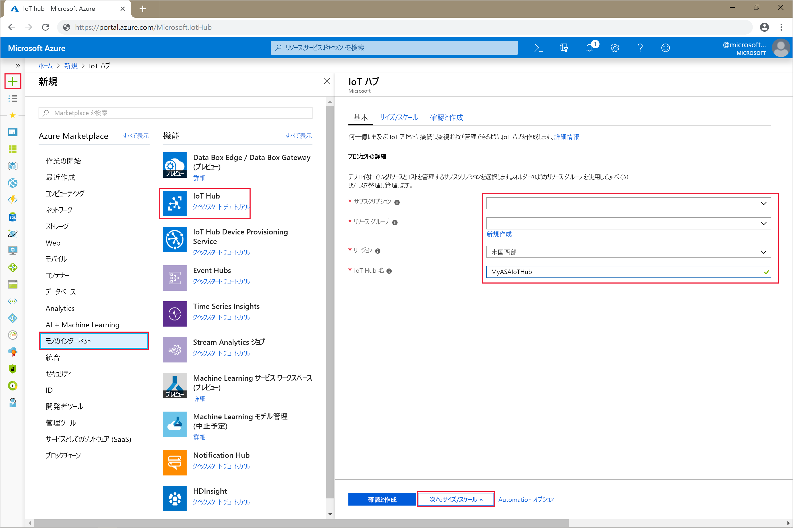

4. **Set size and scale\(次へ: サイズとスケールの設定\)** を選択します。

5. **[価格とスケールティア]** で選択を行います。 このクイック スタートでは、 **[F1 - Free tier]\(F1 - Free レベル\)** を選択します (お客様のサブスクリプションでまだ使用可能な場合)。 Free レベルを使用できない場合は、使用可能な最も低いレベルを選択します。 詳細については、「[Azure IoT Hub の価格](https://azure.microsoft.com/pricing/details/iot-hub/)」を参照してください。

   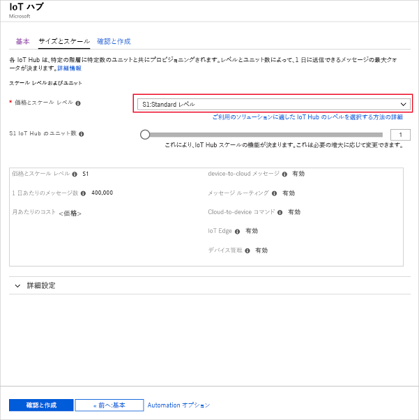

6. **[Review + create]\(レビュー + 作成\)** を選択します。 お客様の IoT ハブの情報を確認して、 **[作成]** を選択します。 IoT ハブの作成には数分かかることがあります。 **[通知]** ペインで進行状況を監視できます。

7. お客様の IoT ハブのナビゲーション メニューで、 **[IoT デバイス]** の **[追加]** を選択します。 **[デバイス ID]** で ID を追加し、 **[保存]** を選択します。

   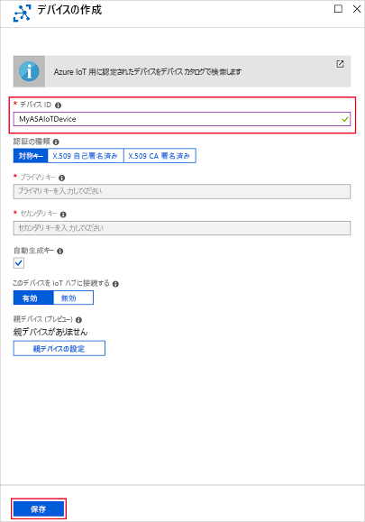

8. デバイスが作成されたら、 **[IoT デバイス]** の一覧からデバイスを開きます。 後で使用できるように、 **[接続文字列 (主キー)]** の文字列をコピーしてメモ帳に保存します。

   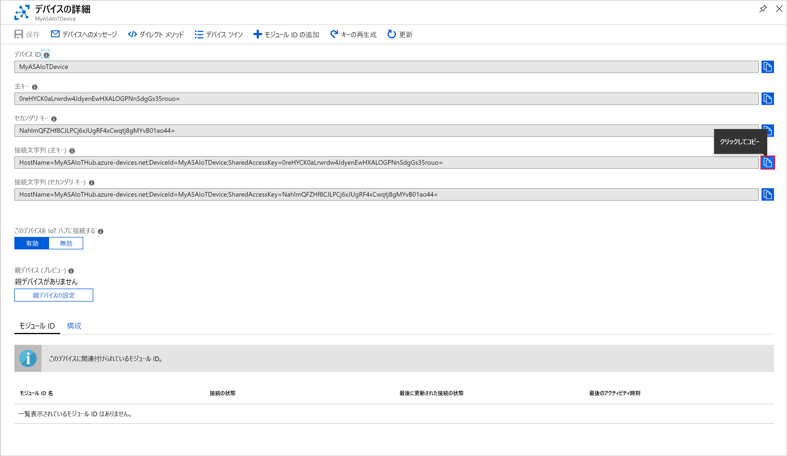

## <a name="run-the-iot-simulator"></a>IoT シミュレーターを実行する

1. 新しいブラウザー タブまたはウィンドウで [Raspberry Pi Azure IoT オンライン シミュレーター](https://azure-samples.github.io/raspberry-pi-web-simulator/)を開きます。

2. 行 15 のプレースホルダーを、先ほど保存した IoT ハブ デバイス接続文字列で置き換えます。

3. **[実行]** を選択します。 お客様の IoT ハブに送信されているセンサー データとメッセージが出力に表示されます。

   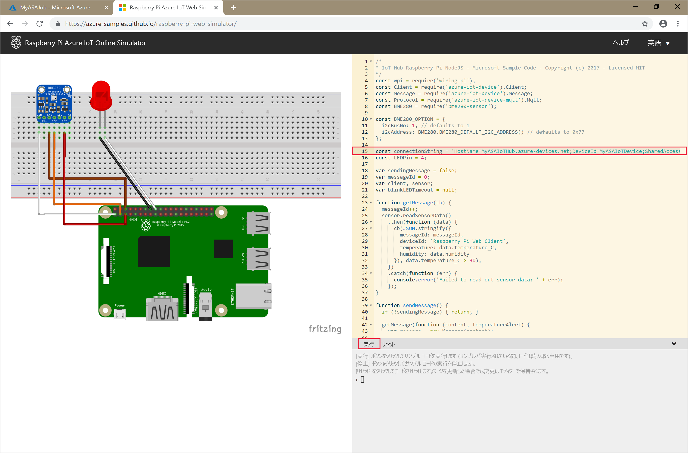

## <a name="create-blob-storage"></a>BLOB ストレージを作成する

1. Azure portal の左上隅で、 **[リソースの作成]**  >  **[ストレージ]**  >  **[ストレージ アカウント]** の順に選択します。

2. **[ストレージ アカウントの作成]** ウィンドウで、ストレージ アカウントの名前、場所、リソース グループを入力します。 お客様が作成した IoT ハブと同じ場所およびリソース グループを選択します。 次に、 **[確認および作成]** を選択してアカウントを作成します。

   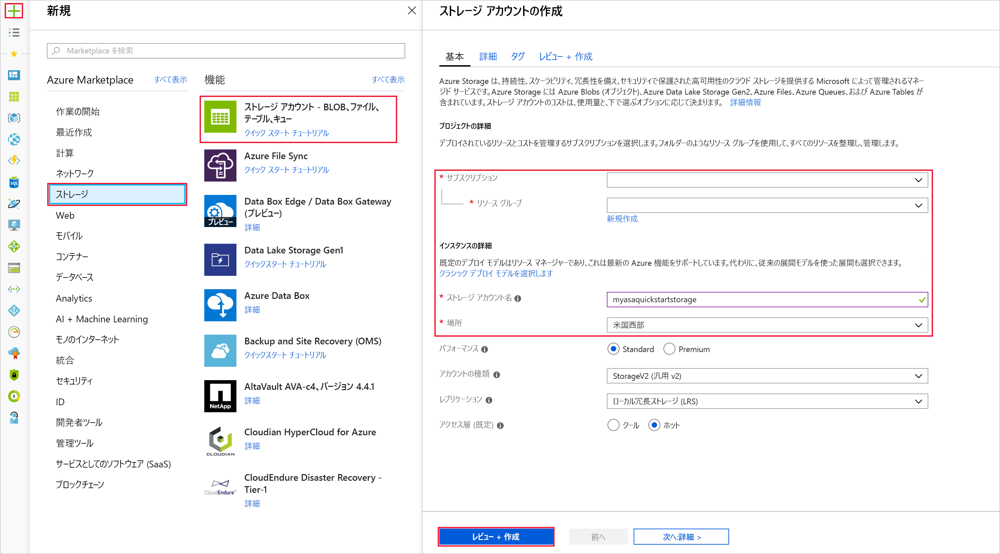

3. お客様のストレージ アカウントが作成されたら、 **[概要]** ペインの **[BLOB]** タイルを選択します。

   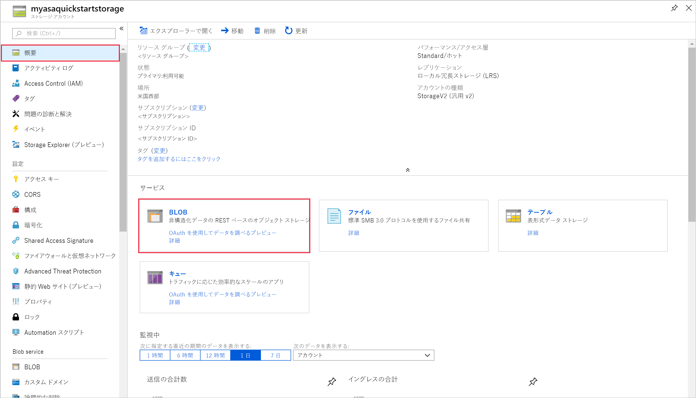

4. **[Blob service]** ページで、 **[コンテナー]** を選択し、お客様のコンテナーに名前を付けます (**container1** など)。 **[パブリック アクセス レベル]** を **[プライベート (匿名アクセスなし)]** のままにして、 **[OK]** を選択します。

   

## <a name="create-a-stream-analytics-project"></a>Stream Analytics プロジェクトを作成する

1. Visual Studio Code で、**Ctrl + Shift + P** キーを押してコマンド パレットを開きます。 次に「**ASA**」と入力し、 **[ASA: 新しいプロジェクトの作成]** を選択します。

   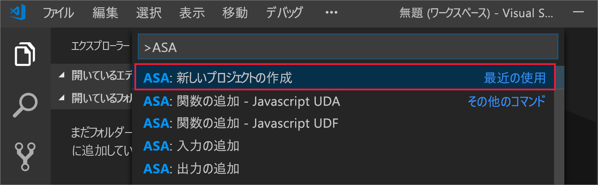

2. 「**myASAproj**」のようにプロジェクト名を入力し、プロジェクトのフォルダーを選択します。

    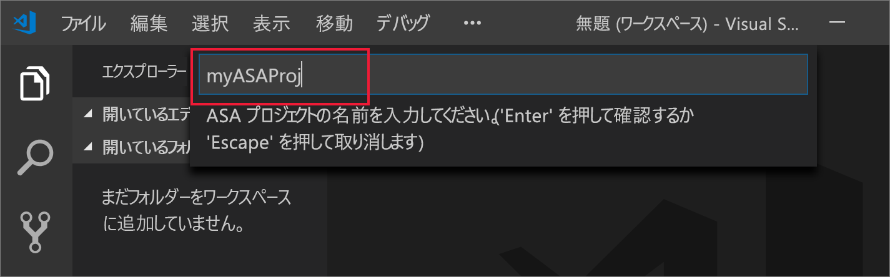

3. 新しいプロジェクトがワークスペースに追加されます。 Stream Analytics プロジェクトは、 **[入力]** 、 **[出力]** 、 **[関数]** という 3 つのフォルダーで構成されます。 また、クエリ スクリプト **(*.asaql)** 、**JobConfig.json** ファイル、**asaproj.json** 構成ファイルも含まれます。

    **asaproj.json** 構成ファイルには、Stream Analytics ジョブを Azure に送信するために必要な入力、出力、およびジョブ構成ファイルの情報が含まれています。

    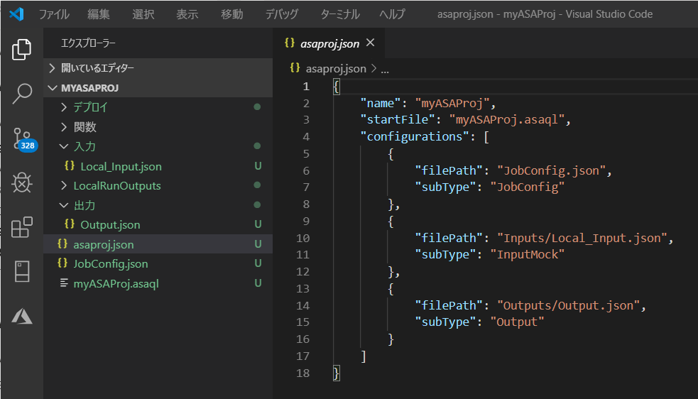

> [!Note]
> コマンド パレットから入力と出力を追加すると、対応するパスが自動的に **asaproj.json** に追加されます。 ディスク上で入力または出力を直接追加または削除する場合は、**asaproj.json** に手動で追加または削除する必要があります。 入力と出力を 1 か所にまとめてから、それぞれの **asaproj.json** にパスを指定して、それらを異なるジョブで参照するように選択することもできます。

## <a name="define-the-transformation-query"></a>変換クエリを定義する

1. プロジェクト フォルダーから **myASAproj.asaql** を開きます。

2. 次のクエリを追加します。

   ```sql
   SELECT *
   INTO Output
   FROM Input
   HAVING Temperature > 27
   ```

## <a name="define-a-live-input"></a>ライブ入力を定義する

1. Stream Analytics プロジェクトの **[入力]** フォルダーを右クリックします。 次に、コンテキスト メニューから **[ASA: 入力の追加]** を選択します。

    

    または、**Ctrl + Shift + P** キーを押してコマンド パレットを開き、「**ASA: 入力の追加** を入力します。

   

2. 入力の種類として **[IoT Hub]** を選択します。

   

3. コマンド パレットから入力を追加した場合は、その入力を使用する Stream Analytics クエリ スクリプトを選択します。 **myASAproj.asaql** へのファイル パスが自動的に入力されます。

   

4. ドロップダウン メニューで **[Select from your Azure Subscriptions]\(自分の Azure サブスクリプションから選択\)** を選択します。

    

5. 次の値を使用して、新しく生成された **IoTHub1.json** ファイルを編集します。 ここに記載されていないフィールドは既定値のままにします。

   |設定|推奨値|説明|
   |-------|---------------|-----------|
   |名前|入力|ジョブの入力を識別する名前を入力します。|
   |IotHubNamespace|MyASAIoTHub|対象の IoT ハブの名前を選択または入力します。 IoT ハブが同じサブスクリプション内に作成されている場合、IoT ハブ名は自動的に検出されます。|
   |SharedAccessPolicyName|iothubowner| |

   CodeLens 機能を使用すると、文字列の入力、ドロップダウン リストからの選択、テキストの変更をファイル内で直接行うことができます。 次のスクリーンショットは、例として **[Select from your Subscriptions]\(自分のサブスクリプションから選択\)** を示しています。 資格情報が自動的にリストされて、ローカル資格情報マネージャーに保存されます。

   

   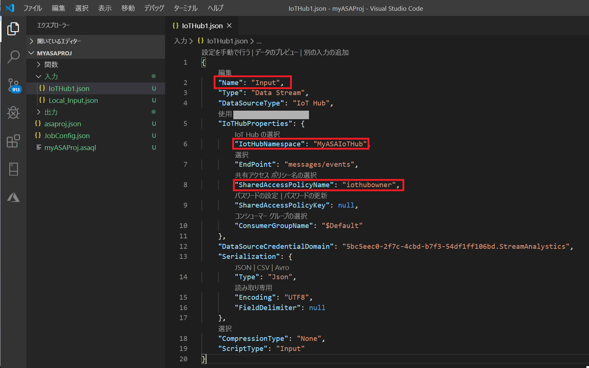

## <a name="preview-input"></a>入力をプレビューする

**IoTHub1.json** の一番上の行で **[Preview data]** を選択します。 一部の入力データが IoT ハブからフェッチされ、プレビュー ウィンドウに表示されます。 このプロセスにはしばらく時間がかかることがあります。

 

## <a name="define-an-output"></a>出力の定義

1. **Ctrl + Shift + P** キーを押してコマンド パレットを開きます。 次に、 **[ASA:出力の追加]** を入力します。

   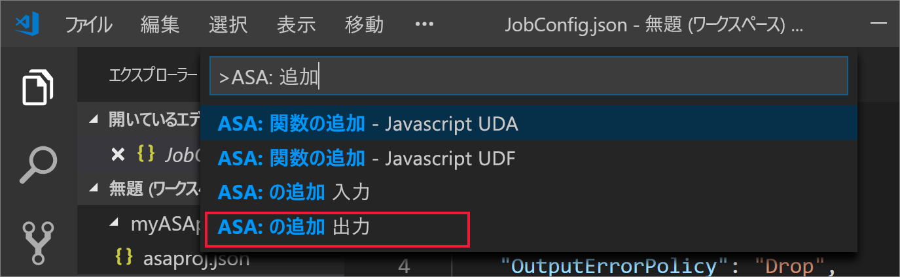

2. シンクの種類として **[Blob Storage]** を選択します。

3. この入力を使用する Stream Analytics クエリ スクリプトを選択します。

4. 出力ファイル名を「**BlobStorage**」と入力します。

5. 以下の値を使用して **BlobStorage** を編集します。 ここに記載されていないフィールドは既定値のままにします。 CodeLens 機能を使用すると、文字列を簡単にドロップダウン リストから選択したり入力したりすることができます。

   |設定|推奨値|説明|
   |-------|---------------|-----------|
   |名前|出力| ジョブの出力を識別する名前を入力します。|
   |ストレージ アカウント|asaquickstartstorage|ストレージ アカウントの名前を選択または入力します。 ストレージ アカウントが同じサブスクリプション内に作成されている場合、ストレージ アカウント名は自動的に検出されます。|
   |コンテナー|container1|ストレージ アカウントで作成した既存のコンテナーを選択します。|
   |パスのパターン|output|コンテナー内に作成するファイル パスの名前を入力します。|

   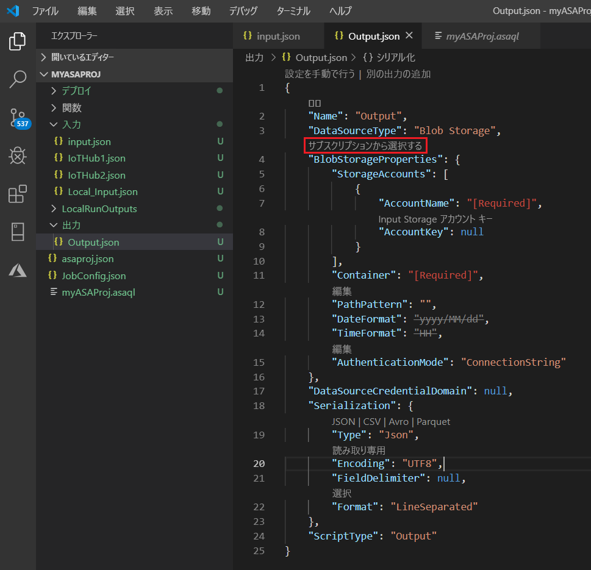

## <a name="compile-the-script"></a>スクリプトをコンパイルする

スクリプトのコンパイルでは、構文がチェックされ、自動デプロイ用の Azure Resource Manager テンプレートが生成されます。

スクリプトのコンパイルを開始する方法は 2 つあります。

- ワークスペースからスクリプトを選択し、コマンド パレットからコンパイルを行います。

   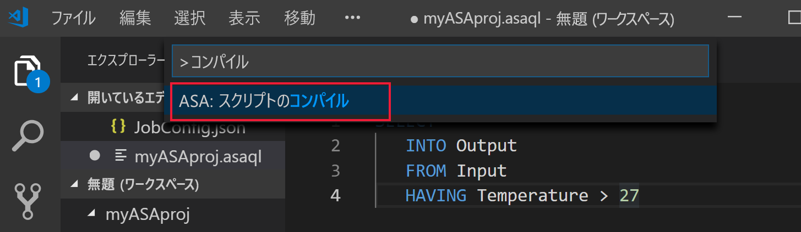

- スクリプトを右クリックし、**ASA: Compile Script**」と入力します。

    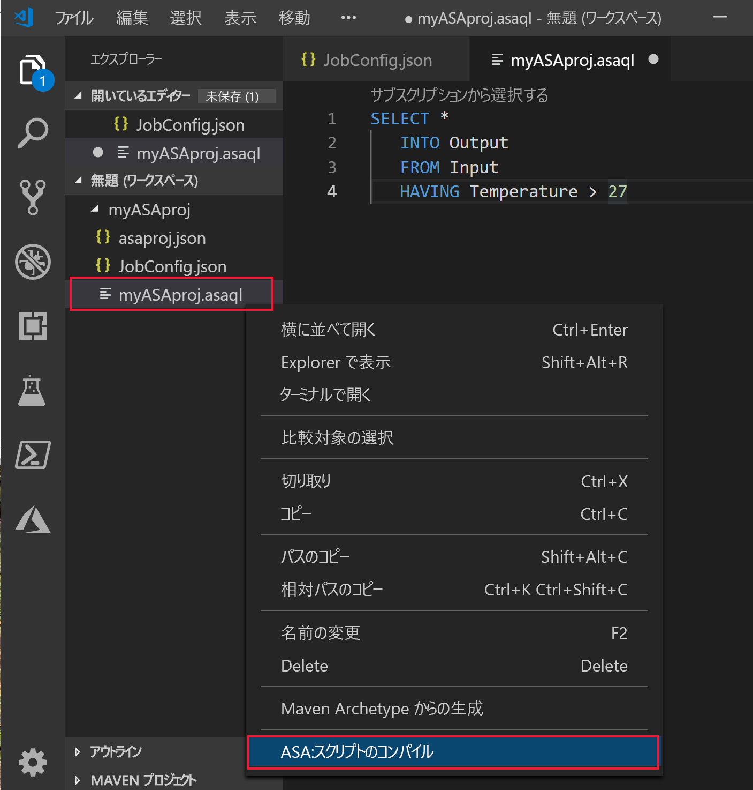

コンパイル後、2 つの Azure Resource Manager テンプレートがプロジェクトの **[デプロイ]** フォルダーに生成されます。 これら 2 つのファイルは自動デプロイに使用されます。

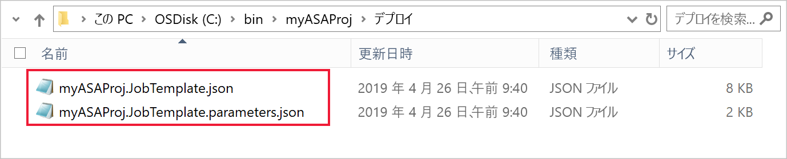

## <a name="submit-a-stream-analytics-job-to-azure"></a>Azure に Stream Analytics ジョブを送信する

1. クエリ スクリプトのスクリプト エディター ウィンドウで、 **[Azure に送信]** を選択します。

   

2. ポップアップ リストからサブスクリプションを選択します。

3. **[Select a job]\(ジョブの選択\)** を選択します。 次に、 **[新しいジョブの作成]** を選択します。

4. ジョブ名「**myASAjob**」を入力します。 次に、指示に従ってリソース グループと場所を選択します。

5. **[Azure に送信]** を選択します。 ログは出力ウィンドウで確認できます。 

6. ジョブが作成されると、**Stream Analytics Explorer** で確認できます。

    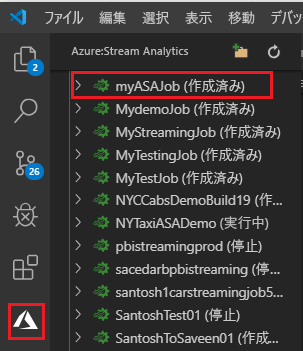

## <a name="start-the-stream-analytics-job-and-check-output"></a>Stream Analytics ジョブを開始して出力を確認する

1. Visual Studio Code で **Stream Analytics Explorer** を開き、ジョブ **myASAJob** を見つけます。

2. ジョブの名前を右クリックします。 次に、コンテキスト メニューから **[開始]** を選択します。

   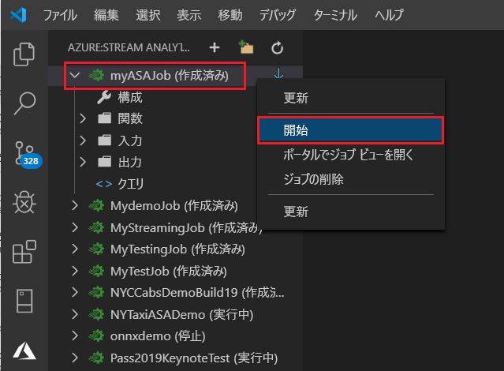

3. ポップアップ ウィンドウの **[今すぐ]** を選択してジョブを開始します。

4. ジョブの状態が **[実行中]** に変わったことに注目してください。 ジョブ名を右クリックして **[Open Job View in Portal]\(ポータルでジョブ ビューを開く\)** を選択し、入力および出力イベント メトリックを表示します。 この操作には数分かかることがあります。

5. 結果を表示するには、Visual Studio Code 拡張機能または Azure portal で BLOB ストレージを開きます。

## <a name="clean-up-resources"></a>リソースをクリーンアップする

リソース グループ、ストリーミング ジョブ、および関連するすべてのリソースは、不要になったら削除します。 ジョブを削除すると、ジョブによって消費されるストリーミング ユニットに対する課金を回避することができます。 

ジョブを後で使用する予定がある場合は、ジョブを停止し、再起動することができます。 このジョブを再度使用しない場合は、以下の手順に従って、このクイックスタートで作成したすべてのリソースを削除してください。

1. Azure portal の左側のメニューで **[リソース グループ]** を選択し、作成したリソースの名前を選択します。  

2. リソース グループ ページで **[削除]** を選択します。 削除するリソース グループの名前をテキスト ボックスに入力し、 **[削除]** を選択します。

## <a name="next-steps"></a>次のステップ

このクイックスタートでは、Visual Studio Code を使用してシンプルな Stream Analytics ジョブをデプロイしました。 [Azure portal](stream-analytics-quick-create-portal.md)、[PowerShell](stream-analytics-quick-create-powershell.md)、および [Visual Studio](stream-analytics-quick-create-vs.md) を使用して Stream Analytics ジョブをデプロイすることもできます。

Visual Studio Code の Azure Stream Analytics ツールについて学習するには、次の記事に進んでください。

* [Visual Studio Code を使用してサンプル データで Stream Analytics クエリをローカルでテストする](visual-studio-code-local-run.md)

* [Visual Studio Code を使用してライブ入力に対して Azure Stream Analytics ジョブをローカルでテストする](visual-studio-code-local-run-live-input.md)

* [Visual Studio Code を使用して Azure Stream Analytics ジョブを表示する](visual-studio-code-explore-jobs.md)

* [npm パッケージを使用して CI/CD パイプラインを設定する](setup-cicd-vs-code.md)
