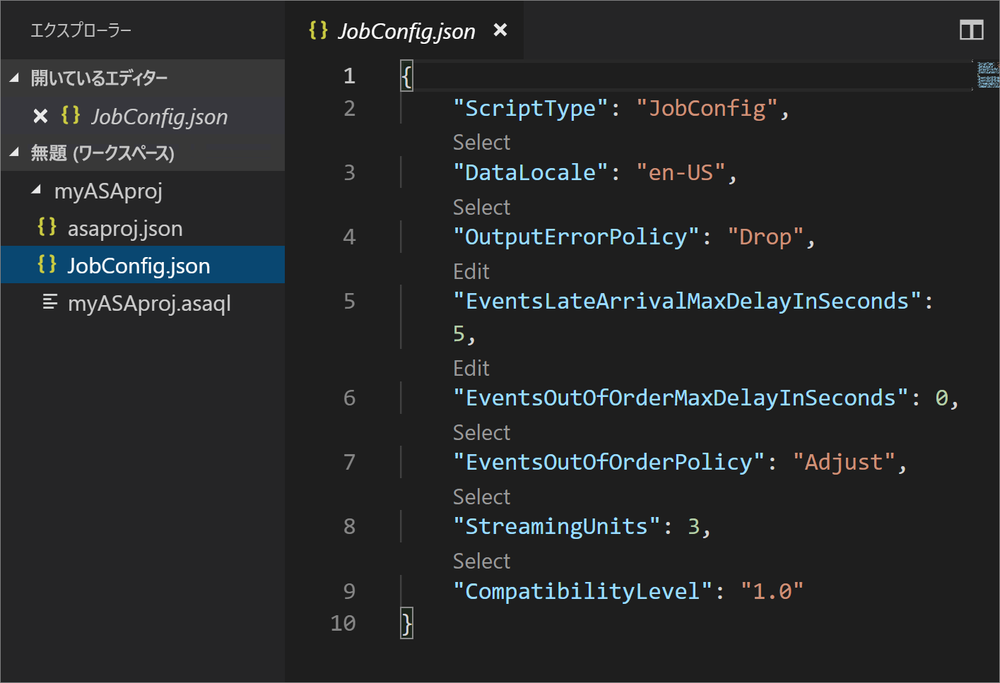
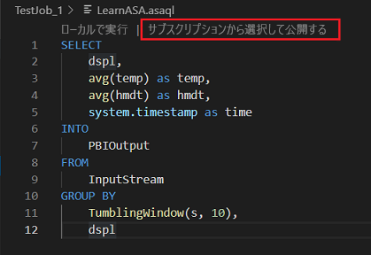

# <a name="quickstart-create-an-azure-stream-analytics-cloud-job-in-visual-studio-code-preview"></a>クイック スタート:Visual Studio Code で Azure Stream Analytics クラウド ジョブを作成する (プレビュー)

このクイックスタートでは、Visual Studio Code 用の Azure Stream Analytics 拡張機能を使用して Stream Analytics ジョブを作成および実行する方法について説明します。 サンプル ジョブでは、IoT Hub デバイスからストリーミング データを読み取ります。 温度が 27 度を超えるときに平均温度を計算し、結果の出力イベントを BLOB ストレージ内の新しいファイルに書き込むジョブを定義します。

## <a name="before-you-begin"></a>開始する前に

* Azure サブスクリプションをお持ちでない場合は、[無料アカウント](https://azure.microsoft.com/free/)を作成してください。

* [Azure Portal](https://portal.azure.com/) にサインインします。

* [Visual Studio Code](https://code.visualstudio.com/) をインストールします。

## <a name="install-the-azure-stream-analytics-extension"></a>Azure Stream Analytics 拡張機能をインストールする

1. Visual Studio Code を開きます。

2. 左ウィンドウの **[拡張機能]** から **Stream Analytics** を検索し、**Azure Stream Analytics** 拡張機能で **[インストール]** を選択します。

3. 拡張機能がインストールされたら、**Azure Stream Analytics ツール**が **[Enabled Extensions]\(有効な拡張機能\)** に表示されることを確認します。

   

## <a name="activate-the-azure-stream-analytics-extension"></a>Azure Stream Analytics 拡張機能をアクティブにする

1. VS Code アクティビティ バーの **Azure** アイコンを選択します。 サイド バーに **Stream Analytics** が表示されます。 **Stream Analytics** の **[Azure にサインイン]** を選択します。 

   

2. サインインすると、Azure アカウント名が VS Code ウィンドウの左下にあるステータス バーに表示されます。

> [!NOTE]
> サインアウトしない場合、次回は Azure Stream Analytics ツールによって自動的にサインインされます。アカウントに 2 要素認証がある場合は、PIN を使用せずに電話による認証を使用することをお勧めします。
> リソースの一覧表示に問題がある場合は、通常、サインアウトしてから再度サインインすると解決します。 サインアウトするには、コマンド `Azure: Sign Out` を入力します。

## <a name="prepare-the-input-data"></a>入力データを準備する

Stream Analytics ジョブを定義する前に、後でジョブの入力として構成されるデータを準備する必要があります。 ジョブで必要な入力データを準備するには、次の手順を完了します。

1. [Azure Portal](https://portal.azure.com/) にサインインします。

2. **[リソースの作成]**  >  **[モノのインターネット]**  >  **[IoT Hub]** を選択します。

3. **[IoT Hub]** ウィンドウで、以下の情報を入力します。
   
   |**設定**  |**推奨値**  |**説明**  |
   |---------|---------|---------|
   |Subscription  | \<該当するサブスクリプション\> |  使用する Azure サブスクリプションを選択します。 |
   |Resource group   |   asaquickstart-resourcegroup  |   **[新規作成]** を選択し、アカウントの新しいリソース グループ名を入力します。 |
   |リージョン  |  \<ユーザーに最も近いリージョンを選択\> | お客様の IoT ハブをホストできる地理的な場所を選択します。 お客様のユーザーに最も近い場所を使用します。 |
   |IoT Hub 名  | MyASAIoTHub  |   お客様の IoT ハブの名前を選択します。   |

   

4. **[次へ:Set size and scale]\(次へ: サイズとスケールの設定\)** を選択します。

5. **[価格とスケールティア]** を選択します。 このクイック スタートでは、 **[F1 - Free tier]\(F1 - Free レベル\)** を選択します (お客様のサブスクリプションでまだ使用可能な場合)。 Free レベルを使用できない場合は、使用可能な最も低いレベルを選択します。 詳細については、「[IoT Hub の価格](https://azure.microsoft.com/pricing/details/iot-hub/)」を参照してください。

   

6. **[Review + create]\(レビュー + 作成\)** を選択します。 お客様の IoT ハブの情報を確認して、 **[作成]** をクリックします。 お客様の IoT ハブの作成には数分かかることがあります。 **[通知]** ウィンドウで進行状況を監視できます。

7. お客様の IoT ハブ ナビゲーション メニューで、 **[IoT デバイス]** の **[追加]** をクリックします。 **デバイス ID** を追加して **[保存]** をクリックします。

   

8. デバイスが作成されたら、 **[IoT デバイス]** の一覧からデバイスを開きます。 後で使用するために **[接続文字列 (主キー)]** をコピーしてメモ帳に保存します。

   

## <a name="create-blob-storage"></a>BLOB ストレージを作成する

1. Azure Portal の左上隅で、 **[リソースの作成]**  >  **[ストレージ]**  >  **[ストレージ アカウント]** の順に選択します。

2. **[ストレージ アカウントの作成]** ウィンドウで、ストレージ アカウントの名前、場所、リソース グループを入力します。 お客様が作成した IoT ハブと同じ場所およびリソース グループを選択します。 **[確認および作成]** をクリックしてアカウントを作成します。

   

3. お客様のストレージ アカウントが作成されたら、 **[概要]** ウィンドウの **[BLOB]** タイルを選択します。

   

4. **[Blob service]** ページで、 **[コンテナー]** を選択し、お客様のコンテナーに名前を付けます (*container1* など)。 **[パブリック アクセス レベル]** を **[Private (no anonymous access)]\(プライベート (匿名アクセスなし)\)** のままにして、 **[OK]** を選択します。

   

## <a name="create-a-stream-analytics-project"></a>Stream Analytics プロジェクトを作成する

1. Visual Studio Code で、**Ctrl + Shift + P** キーを押してコマンド パレットを開きます。 次に「**ASA**」と入力し、 **[ASA:新しいプロジェクトの作成]** を選択します。

   

2. **myASAproj** のようにプロジェクト名を入力し、プロジェクトのフォルダーを選択します。

    

3. 新しいプロジェクトがワークスペースに追加されます。 ASA プロジェクトは、クエリ スクリプト **(*.asaql)** 、**JobConfig.json** ファイル、**asaproj.json** 構成ファイルから構成されます。

   

4. **asaproj.json** 構成ファイルには、Stream Analytics ジョブを Azure に送信するために必要な入力、出力、およびジョブ構成ファイルの情報が含まれています。

   

> [!Note]
> コマンド パレットから入力と出力を追加すると、対応するパスが自動的に **asaproj.json** に追加されます。 ディスク上で入力または出力を直接追加または削除する場合は、**asaproj.json** に手動で追加または削除する必要があります。 入力と出力を 1 か所にまとめてから、それぞれの **asaproj.json** にパスを指定して、それらを異なるジョブで参照するように選択することができます。

## <a name="define-the-transformation-query"></a>変換クエリを定義する

1. プロジェクト フォルダーから **myASAproj.asaql** を開きます。

2. 次のクエリを追加します。

   ```sql
   SELECT * 
   INTO Output
   FROM Input
   HAVING Temperature > 27
   ```
## <a name="test-with-sample-data"></a>サンプル データに対する
クラウドでクエリを実行する前に、定義したクエリをローカルのサンプル データでテストし、クエリのロジックを確認することができます。

詳細については、[サンプル データでのテスト](vscode-local-run.md)に関するページの手順に従ってください。 

 

## <a name="define-an-input"></a>入力の定義

1. **Ctrl + Shift + P** キーを押してコマンド パレットを開き、 **[ASA:入力の追加]** を入力します。

   

2. 入力の種類として **[IoT Hub]** を選択します。

   ![入力オプションとして [IoT Hub] を選択する](./media/quick-create-vs-code/iot-hub.png)

3. 入力を使用する ASA クエリ スクリプトを選択します。 **myASAproj.asaql** のファイル パスが自動的に入力されます。

   

4. 入力ファイル名を「**IotHub**」と入力します。

5. 以下の値を使用して **IoTHub.json** を編集します。 以下に記載されていないフィールドは既定値のままにします。 CodeLens を使用すると、文字列の入力、ドロップダウン リストからの選択、テキストの変更を直接行うことができます。

   |Setting|推奨値|説明|
   |-------|---------------|-----------|
   |名前|入力|ジョブの入力を識別する名前を入力します。|
   |IotHubNamespace|MyASAIoTHub|対象の IoT ハブの名前を選択または入力します。 IoT ハブが同じサブスクリプション内に作成されている場合、IoT ハブ名は自動的に検出されます。|
   |SharedAccessPolicyName|iothubowner| |

   


## <a name="define-an-output"></a>出力の定義

1. **Ctrl + Shift + P** キーを押してコマンド パレットを開きます。 次に、 **[ASA:出力の追加]** を入力します。

   

2. シンクの種類として **[BLOB Storage]** を選択します。

3. この入力を使用する ASA クエリ スクリプトを選択します。

4. 出力ファイル名を「**BlobStorage**」と入力します。

5. 以下の値を使用して **BlobStorage** を編集します。 以下に記載されていないフィールドは既定値のままにします。 CodeLens を使用すると、文字列を簡単にドロップダウン リストから選択したり入力したりすることができます。 

   |Setting|推奨値|説明|
   |-------|---------------|-----------|
   |名前|Output| ジョブの出力を識別する名前を入力します。|
   |ストレージ アカウント|asaquickstartstorage|ストレージ アカウントの名前を選択または入力します。 ストレージ アカウントが同じサブスクリプション内に作成されている場合、ストレージ アカウント名は自動的に検出されます。|
   |コンテナー|container1|ストレージ アカウントで作成した既存のコンテナーを選択します。|
   |パスのパターン|output|コンテナー内に作成するファイル パスの名前を入力します。|

 

## <a name="compile-the-script"></a>スクリプトをコンパイルする

スクリプトのコンパイルでは 2 つのことが行われます。構文の確認と、自動デプロイ用の Azure Resource Manager テンプレートの生成です。

スクリプトのコンパイルを開始する方法は 2 つあります。

1. ワークスペースからスクリプトを選択し、コマンド パレットからコンパイルを開始します。 

   

2. スクリプトを右クリックし、 **[ASA: compile script]\(ASA: コマンド スクリプト\)** を選択します。

    

3. コンパイル後は、生成された 2 つの Azure Resource Manager テンプレートがプロジェクトの **[デプロイ]** フォルダーに表示されます。 これら 2 つのファイルは自動デプロイに使用されます。

    

## <a name="submit-a-stream-analytics-job-to-azure"></a>Azure に Stream Analytics ジョブを送信する

1. Visual Studio Code のスクリプト エディター ウィンドウで、 **[Select from your subscriptions]\(サブスクリプションから選択\)** を選択します。

   

2. ポップアップ リストからサブスクリプションを選択します。

3. ジョブ**を選択します。 次に、[Create a new job]\(新しいジョブの作成\) を選択します。

4. ジョブ名「**myASAjob**」を入力し、指示に従ってリソース グループと場所を選択します。

5. **[Azure に送信]** を選択します。 ログは出力ウィンドウに表示されます。 

6. ジョブが作成されると、**Stream Analytics Explorer** で確認できます。


## <a name="run-the-iot-simulator"></a>IoT シミュレーターを実行する

1. 新しいブラウザー タブまたはウィンドウで [Raspberry Pi Azure IoT オンライン シミュレーター](https://azure-samples.github.io/raspberry-pi-web-simulator/)を開きます。

2. 前のセクションで保存した Azure IoT Hub デバイスの接続文字列を使用して、行 15 のプレースホルダーを置き換えます。

3. **[実行]** をクリックします。 お客様の IoT ハブに送信されているセンサー データとメッセージが出力に表示されます。

   

## <a name="start-the-stream-analytics-job-and-check-output"></a>Stream Analytics ジョブを開始して出力を確認する

1. Visual Studio Code で **Stream Analytics Explorer** を開き、ジョブ **myASAJob** を見つけます。

2. ジョブ名を右クリックします。 次に、コンテキスト メニューから **[開始]** を選択します。

   

3. ポップアップ ウィンドウの **[今すぐ]** を選択してジョブを開始します。

4. ジョブの状態が "**実行中**" に変わったことに注目してください。 ジョブ名を右クリックして **[Open Job View in Portal]\(ポータルでジョブ ビューを開く\)** を選択し、入力および出力イベント メトリックを表示します。 この操作には数分かかることがあります。

5. 結果を表示するには、Visual Studio Code 拡張機能または Azure portal で BLOB ストレージを開きます。

## <a name="clean-up-resources"></a>リソースのクリーンアップ

リソース グループ、ストリーミング ジョブ、および関連するすべてのリソースは、不要になったら削除します。 ジョブを削除すると、ジョブによって消費されるストリーミング ユニットに対する課金を回避することができます。 ジョブを後で使用する計画がある場合は、ジョブを停止し、必要なときに再起動することができます。 このジョブの使用を続けない場合は、以下の手順に従って、このクイック スタートで作成したすべてのリソースを削除してください。

1. Azure Portal の左側のメニューで **[リソース グループ]** を選択し、作成したリソースの名前を選択します。  

2. リソース グループのページで **[削除]** を選択し、削除するリソースの名前をテキスト ボックスに入力してから **[削除]** を選択します。

## <a name="next-steps"></a>次の手順

このクイックスタートでは、Visual Studio Code を使用してシンプルな Stream Analytics ジョブをデプロイしました。 [Azure portal](stream-analytics-quick-create-portal.md)、[PowerShell](stream-analytics-quick-create-powershell.md)、および Visual Studio (stream-analytics-quick-create-vs.md) を使用して Stream Analytics ジョブをデプロイすることもできます。 

Visual Studio の Azure Stream Analytics ツールについて学習するには、次の記事に進んでください。

> [!div class="nextstepaction"]
> [Visual Studio を使用して Azure Stream Analytics ジョブを表示する](stream-analytics-vs-tools.md)
