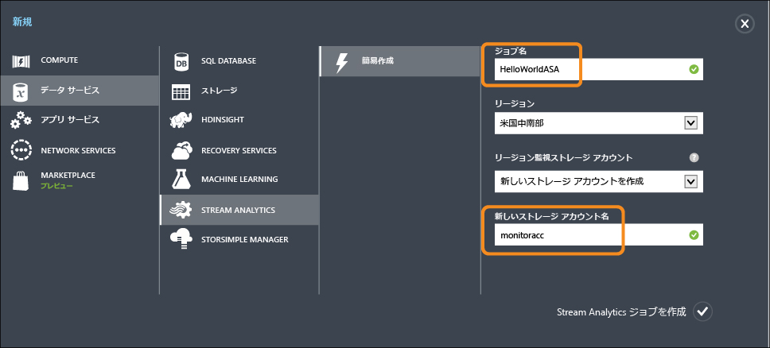
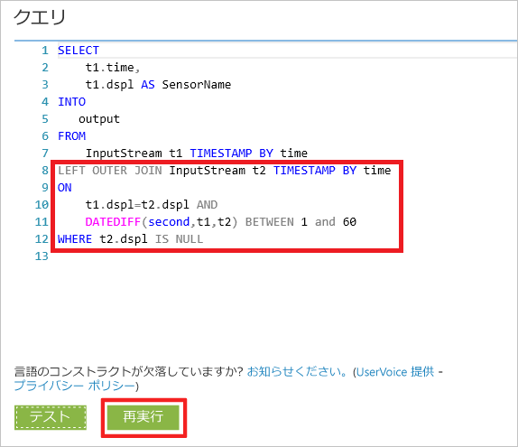
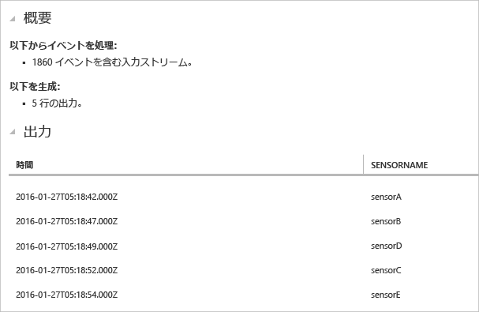

<properties
	pageTitle="Azure Stream Analytics の使用を開始して IoT デバイスからのデータを処理する | Stream Analytics"
	description="IoT センサー タグと、Stream Analytics によるデータ ストリームとリアルタイムのデータ処理"
    keywords="IoT ソリューション, IoT の概要"
	services="stream-analytics"
	documentationCenter=""
	authors="jeffstokes72"
	manager="jhubbard"
	editor="cgronlun"
/>

<tags 
	ms.service="stream-analytics" 
	ms.devlang="na" 
	ms.topic="hero-article" 
	ms.tgt_pltfrm="na" 
	ms.workload="data-services" 
	ms.date="09/26/2016"
	ms.author="jeffstok"
/>

# Azure Stream Analytics の使用を開始して IoT デバイスからのデータを処理する

このチュートリアルでは、モノのインターネット (IoT) デバイスからデータを収集するロジックを処理するストリームの作成について学習します。実際のモノのインターネット (IoT) ユース ケースを使用して、迅速で経済的なソリューションを構築する方法を紹介します。

## 前提条件

-   [Azure サブスクリプション](https://azure.microsoft.com/pricing/free-trial/)
-   [GitHub](https://aka.ms/azure-stream-analytics-get-started-iot) からダウンロード可能なサンプル クエリとデータ ファイル

## シナリオ

Contoso は工業オートメーション スペースの会社で、自社の製造工程を完全に自動化しています。この工場の機械には、リアルタイムでデータのストリームを生成することのできるセンサーがあります。このシナリオにおいて、生産現場マネージャーは、センサー データからリアルタイムの詳細情報を取得し、パターンを見つけて、それらに対処したいと考えています。センサー データに対して Stream Analytics クエリ言語 (SAQL) を使用し、データの受信ストリームの興味深いパターンを検出します。

ここに示すデータは、Texas Instrument Sensor Tag デバイスから生成されています。

データのペイロードは、JSON 形式で、次のようになります。

    
	{
    	"time": "2016-01-26T20:47:53.0000000",  
	    "dspl": "sensorE",  
    	"temp": 123,  
	    "hmdt": 34  
	}  
    
実際のシナリオでは、何百ものこのようなセンサーがストリームとしてイベントを生成することになります。何らかのコードを実行して [Azure Event Hubs](https://azure.microsoft.com/services/event-hubs/) または [Azure IoT Hub](https://azure.microsoft.com/services/iot-hub/) にこれらのイベントをプッシュするゲートウェイ デバイスがあれば理想的です。Stream Analytics ジョブでそれらのイベントを Event Hubs から取り込み、そのストリームに対してリアルタイム分析クエリを実行することになると思われます。そうすれば、その結果をいずれかの[サポートされている出力](stream-analytics-define-outputs.md)に送信することができます。

この概要ガイドでは、さまざまなクエリを実行し、それらの結果を表示できる実際の SensorTag デバイスからキャプチャされたサンプル データ ファイルを便宜的に用意しています。以降のチュートリアルでは、各自のジョブを入力と出力に関連付け、それらを Azure サービスにデプロイする方法を学習します。

## Stream Analytics ジョブの作成

[Azure ポータル](http://manage.windowsazure.com)で Stream Analytics を選択し、ページの左下隅にある **[新規]** ボタンをクリックして、新しい分析ジョブを作成します。

**[簡易作成]** をクリックします。

**[地域の監視ストレージ アカウント]** の設定で、**[新しいストレージ アカウントの作成]** を選択し、一意の名前を付けます。このアカウントは、今後実行するすべてのジョブの監視情報を保存するために、Azure Stream Analytics によって使用されます。

> [AZURE.NOTE] このストレージ アカウントはリージョンあたり 1 回だけ作成する必要があり、このストレージはそのリージョンで作成されたすべての Stream Analytics ジョブで共有されます。

ページ下部の **[Stream Analytics ジョブの作成]** をクリックします。

## Azure Stream Analytics クエリ

[クエリ] タブをクリックし、クエリ エディターに移動します。[クエリ] タブには、入力イベント データに対して変換を実行する T-SQL クエリが表示されます。

## 生データのアーカイブ

クエリの最も単純な形式は、すべての入力データを指定された出力にアーカイブするパススルーです。

ここで、[GitHub](https://aka.ms/azure-stream-analytics-get-started-iot) からサンプル データ ファイルをコンピューター内の場所にダウンロードします。**PassThrough.txt** ファイルからクエリをコピーして貼り付けます。下の [テスト] ボタンをクリックし、ダウンロードした場所から **HelloWorldASA InputStream.json** という名前のデータ ファイルを選択します。

次のようにブラウザーでクエリの結果を確認できます。

## 条件に基づいたデータのフィルター処理

条件に基づいて結果をフィルター処理しましょう。"SensorA" から取得されるイベントの結果のみを表示したいと考えます。クエリは **Filtering.txt** ファイルにあります。

ここでは文字列値を比較し、その大文字と小文字が区別されることに注意してください。**[再実行]** ボタンをクリックして、クエリを実行します。クエリは、1860 イベントのうち 389 行だけを返すはずです。

## ビジネス ワークフローをトリガーするアラート

それではクエリについて、もう少し詳しく説明します。すべてのセンサーの種類で、30 秒間隔で平均温度を監視し、平均温度が 100 度を超える場合にのみ結果を表示する場合、次のクエリを記述し、**[再実行]** をクリックして、結果を確認します。このクエリは **ThresholdAlerting.txt** ファイルにあります。

ご覧のように、結果に含まれるのは 245 行のみで、平均温度が 100 度を超えるセンサーが一覧表示されます。このクエリでは、センサー名である **dspl** 別に、30 秒の**タンブリング ウィンドウ**でイベントをグループ化しています。このような一時的なクエリを実行する場合、時間の進め方を示すことが必要です。**TIMESTAMP BY** 句を使用して、すべての一時的な計算に、時間を進める方法として、"time" 列を指定しました。詳細については、MSDN の[時間管理](https://msdn.microsoft.com/library/azure/mt582045.aspx)と[ウィンドウ関数](https://msdn.microsoft.com/library/azure/dn835019.aspx)に関するトピックを参照してください。

## イベントがないことを検出する

入力イベントがないことを検出するためのクエリは、どのように記述すればよいのでしょうか。 こうしたクエリの記述はごく簡単です。センサーが最後にデータを送信してから 1 分間イベントを送信しなかったタイミングを見つけましょう。このクエリは **AbsenseOfEvent.txt** ファイルにあります。

ここでは、同じデータ ストリームに対して **LEFT OUTER JOIN** を使用しています (自己結合)。内部結合では、一致が見つかった場合にのみ結果が返されます。ただし、**LEFT OUTER** 結合では、結合の左側からのイベントが一致していない場合、右の行のすべての列に対して NULL を含む行が返されます。この手法は、イベントの欠落を見つけるためにきわめて便利です。[JOIN](https://msdn.microsoft.com/library/azure/dn835026.aspx) の詳細については MSDN ドキュメントを参照してください。

## まとめ

このチュートリアルの目的は、Stream Analytics クエリ言語を使ったさまざまなクエリを記述し、その結果をブラウザーで確認する方法を紹介することです。ただし、これはほんの導入部に過ぎません。Stream Analytics でできることはたくさんあります。Stream Analytics は多様な入出力に対応していることに加え、Azure Machine Learning の関数も利用できることから、データ ストリームを分析するうえで強力な手段となっています。[学習マップ](https://azure.microsoft.com/documentation/learning-paths/stream-analytics/)を使用して、Stream Analytics の詳細を探究することができます。クエリの作成の詳細については、[一般的なクエリ パターン](./stream-analytics-stream-analytics-query-patterns.md)に関する記事をご覧ください。

<!---HONumber=AcomDC_0928_2016-->