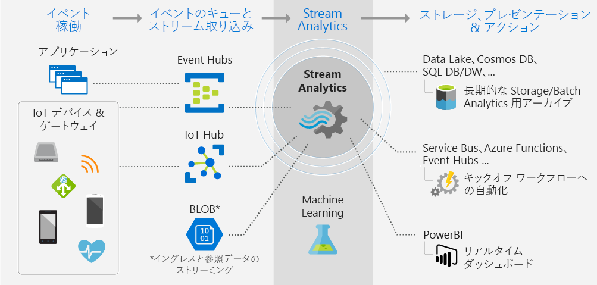

# Stream Analytics とは

Azure Stream Analytics は、完全に管理されたイベント処理エンジンであり、ストリーミング データを対象としたリアルタイム分析の計算を設定することができます。 対象となるデータは、デバイス、センサー、Web サイト、ソーシャル メディア フィード、アプリケーション、インフラストラクチャ システムなどから得ることができます。 

Stream Analytics を使うと、デバイスやプロセスから流れてくる大量のデータ ストリームを観察し、データ ストリームから情報を抽出して、パターンや傾向、関係を把握することができます。 そうしたパターンを利用して他のプロセスやアクション (アラート、オートメーション ワークフローなど) をトリガーしたり、レポート ツールに情報を取り込んだり、将来調査に使用するデータを保存したりすることができます。 

次に例をいくつか示します。

* 株式取引の分析とアラート。
* 不正行為の検出、データ、ID の保護。 
* 埋め込みセンサーとアクチュエータ分析。
* Web クリックストリーム分析。

## Stream Analytics の動作

この図は、Stream Analytics パイプラインでデータが取り込まれ、分析されて、表示または処理のために送信されるようすを示したものです。 

Stream Analytics の原点となるのは、ストリーミング データのソースです。 Azure には、Azure イベント ハブまたは IoT Hub を使用してデバイスからデータを取り込むことができます。 Azure Blob Storage などのデータ ストアからデータを取り込むこともできます。 

ストリームを観察するには、データをどこから取り込むかを指定する Stream Analytics "*ジョブ*" を作成します。 このジョブでは、"*変換*" (データやパターン、関係をどのように探し出すか) も指定します。 このタスクに関して、Stream Analytics は SQL に似たクエリ言語をサポートしており、特定の期間のストリーミング データに対してフィルター選択、並べ替え、集計、結合の処理を適用することができます。

また、変換したデータの出力もこのジョブで指定します。 分析した情報に応じて、処理の内容を制御することができます。 たとえば、分析結果に応じて次の処理を行うことが考えられます。

* デバイスの設定を変更するコマンドを送信する。 
* 監視対象キューにデータを送信し、調査結果に基づいてさらなるアクションを実行する。 
* Power BI ダッシュボードにデータを送信する。
* ストレージ (Data Lake Store、Azure SQL Database、Azure Blob Storage など) にデータを送信する。

ジョブの実行中に毎秒処理されるイベントの数は、調整することができます。 また、トラブルシューティング用の診断ログを生成することもできます。

## 主要な機能と利点

Stream Analytics は、あらゆるジョブの規模に対応するスケーラビリティ、使いやすさ、柔軟性を実現する設計になっています。

### 入力と出力の接続

Stream Analytics は、ストリーム データの取り込みに関しては [Azure Event Hubs](https://azure.microsoft.com/services/event-hubs/) と [Azure IoT Hub](https://azure.microsoft.com/services/iot-hub/) に、履歴データの取り込みに関しては [Azure Blob Storage サービス](https://docs.microsoft.com/azure/storage/storage-introduction#blob-storage-accounts)に直接接続されます。 イベント ハブからのデータは、Stream Analytics で他のデータ ソースや処理エンジンと結び付けることが可能です。 ジョブの入力に参照データ (静的なデータや変化の速度が遅いデータ) を含めることもできます。 この参照データにストリーミング データを結合すれば、データベースのクエリと同様のルックアップ操作を行うことができます。

Stream Analytics ジョブの出力は、さまざまな方向にルーティングすることができます。 書き込み先としては、Azure BLOB、Azure SQL Database、Azure Data Lake Store、Azure Cosmos DB などのストレージを利用できます。 そこから、Azure HDInsight で一括分析を実行することができます。 または、出力結果をイベント ハブや Azure Service Bus、キューなどのサービスに送って別の処理に投入したり、Power BI に送って視覚化したりすることもできます。

### 簡単に使用できる

変換の定義には、宣言型の単純な [Stream Analytics クエリ言語](https://msdn.microsoft.com/library/azure/dn834998.aspx)を使用します。プログラミングを一切行うことなく高度な分析を作成することができます。 ストリーミング データがクエリ言語の入力となります。 このデータに対して、フィルター選択や並べ替え、値の集計、計算の実行、データの結合 (ストリーム内での結合、または参照データとの結合) を行ったり、地理空間関数を使用したりすることができます。 クエリはポータルで IntelliSense や構文チェックを使って編集でき、ライブ ストリームから抽出できるサンプル データを使ってテストすることができます。

### 拡張可能なクエリ言語

クエリ言語の機能は、別の関数を定義したり呼び出したりすることで拡張することができます。 Azure Machine Learning サービスで関数の呼び出しを定義すれば、Azure Machine Learning のソリューションを最大限に活かすことができます。 JavaScript のユーザー定義関数 (UDF) を組み込んで、Stream Analytics のクエリ内で複雑な計算を行うこともできます。

### 拡張性

Stream Analytics では、1 秒あたり最大 1 GB の入力データを処理することができます。 [Azure Event Hubs](https://azure.microsoft.com/services/event-hubs/) や [Azure IoT Hub](https://azure.microsoft.com/services/iot-hub/) と統合することで、接続されたデバイス、クリックストリーム、およびログ ファイルから 1 秒間に数百万ものイベントを取り込むことができます。 イベント ハブのパーティション機能を使用すると、計算を論理上のステップに分割できます。スケーラビリティを高めるために、分割した各ステップは、さらに分割できるようになっています。

### 低コスト

クラウド サービスである Stream Analytics は、コストに最適化されています。 料金は、ストリーミング ユニットの使用量と処理されるデータ量に基づいて支払います。 使用量は、処理されたイベントのボリュームと、ジョブ クラスター内にプロビジョニングされたコンピューティング能力の量に基づいて算出されます。

### 信頼性

Stream Analytics は、管理されたサービスであるため、データ損失の防止とビジネス継続性を支援します。 障害が発生した場合は、組み込みの回復機能が作動します。 また、内部に状態を保持できる特性を通じて、繰り返し可能な処理結果を提供できます。これを利用して、イベントをアーカイブしておき、後で処理に再適用して常に同じ結果を取得することができます。 ユーザーは、根本原因の分析や what if 分析などを実行するときに、これを使用して時間をさかのぼり、計算処理を調査できます。

## 次の手順

* [IoT デバイスのデータを使って実際に入力とクエリを試す](stream-analytics-get-started-with-azure-stream-analytics-to-process-data-from-iot-devices.md)。
* 電話のメタデータを分析して不正行為を見つける[エンドツーエンドの Stream Analytics ソリューション](stream-analytics-real-time-fraud-detection.md)を構築する。
* [Azure Stream Analytics フォーラム](https://social.msdn.microsoft.com/Forums/en-US/home?forum=AzureStreamAnalytics)で Stream Analytics に関する質問の回答を見つける。

