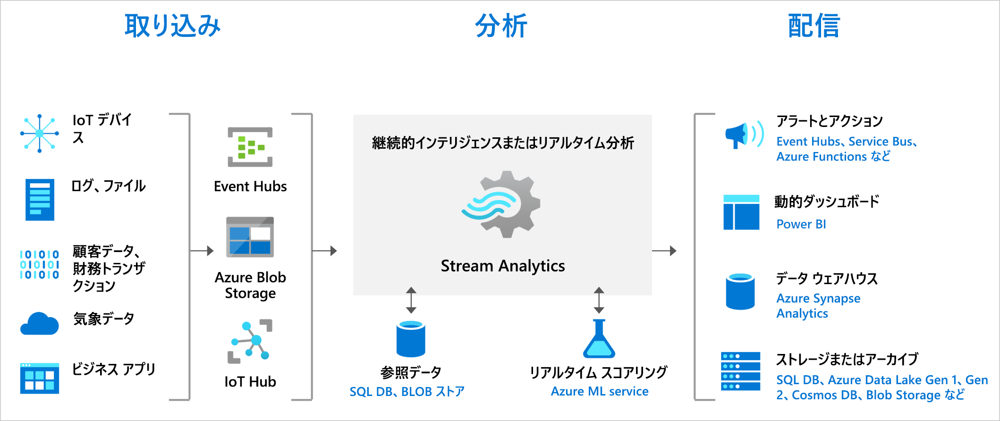

# Azure Stream Analytics へようこそ

Azure Stream Analytics は、複数のソースからの大量の高速ストリーミング データを同時に分析および処理するように設計された、リアルタイムの分析および複合イベント処理エンジンです。 パターンやリレーションシップは、デバイス、センサー、クリックストリーム、ソーシャル メディア フィード、アプリケーションなどのいくつかの入力ソースから抽出された情報内で識別できます。 これらのパターンを使用してアクションを起動し、アラートの作成、レポート作成ツールへの情報のフィード、または後で使用するための変換されたデータの保存などのワークフローを開始できます。 また、Stream Analytics は Azure IoT Edge ランタイムでも使用できます。これにより、IoT デバイス上のデータを処理できるようになります。

次のシナリオは、Azure Stream Analytics を使用できる場合の例です。

* IoT デバイスからのリアルタイムのテレメトリ ストリームの分析
* Web ログ/クリックストリーム分析
* フリート マネジメントや無人車両用の地理空間分析
* 高価な資産のリモート監視と予測メンテナンス
* 販売時点管理データのリアルタイム分析による在庫管理や異常検出

Azure Stream Analytics は、無料の Azure サブスクリプションでお試しいただけます。

> [!div class="nextstepaction"]
> [Azure Stream Analytics を試す](https://azure.microsoft.com/services/stream-analytics/)

## Stream Analytics の動作

Azure Stream Analytics ジョブは、入力、クエリ、および出力で構成されます。 Stream Analytics は、Azure Event Hubs (Apache Kafka からの Azure Event Hubs を含む)、Azure IoT Hub、または Azure Blob Storage からデータを取り込みます。 SQL クエリ言語に基づくクエリを使用して、ストリーミング データの一定期間にわたるフィルター処理、並べ替え、集計、および結合を容易に行うことができます。 この SQL 言語は、JavaScript および C# のユーザー定義関数 (UDF) で拡張することもできます。 単純な言語コンストラクトや構成を使用して集計操作を実行するときに、イベントの順序付けのオプションや時間枠の期間を簡単に調整できます。

各ジョブには変換されたデータの 1 つまたは複数の出力が含まれるため、分析した情報に応じてどのような処理を実行するかを制御できます。 たとえば、次のように操作できます。

* Azure Functions、Service Bus Topics、Queues などのサービスにデータを送信して、通信またはダウンストリームのカスタム ワークフローをトリガーする。
* リアルタイムのダッシュボード作成のためにデータを Power BI ダッシュボードに送信する。
* 履歴データに基づいて機械学習モデルをトレーニングするか、またはバッチ分析を実行するために、データを他の Azure ストレージ サービス (Azure Data Lake、Azure Synapse Analytics など) に格納する。

次の図は、データがどのように Stream Analytics に送信され、分析され、さらに格納やプレゼンテーションなどの他のアクションのために送信されるかを示しています。

## 主要な機能と利点

Azure Stream Analytics は、あらゆるジョブの規模に対応するスケーラビリティ、使いやすさ、柔軟性、信頼性を実現する設計になっています。 複数の Azure リージョンにまたがって使用でき、IoT Edge 上または Azure Stack 上で動作します。

## 簡単に始められる

Azure Stream Analytics は、簡単に始めることができます。 何回かクリックして複数のソースやシンクに接続するだけで、エンド ツー エンドのパイプラインが作成されます。 Stream Analytics は、ストリーミング データ インジェストのためには Azure Event Hubs や Azure IoT Hub に、履歴データの取り込みのためには Azure Blob Storage に接続できます。 また、ストリーミング データに結合して参照操作を実行するために使用できる Azure Blob Storage または SQL Database からの静的な、またはゆっくり変化する参照データをジョブ入力に含めることもできます。

Stream Analytics は、Azure Blob Storage、Azure SQL Database、Azure Data Lake Store、Azure CosmosDB などのさまざまなストレージ システムにジョブ出力をルーティングできます。 さらに、Azure Synapse Analytics または HDInsight を使用してストリーム出力に対してバッチ分析を実行したり、別のサービスに出力を送信したりすることもできます。たとえば、Event Hubs に送信して利用したり、Power BI に送信してリアルタイムに視覚化したりすることができます。

Stream Analytics の出力の完全な一覧については、「[Azure Stream Analytics からの出力を理解する](stream-analytics-define-outputs.md)」を参照してください。

## プログラマの生産性

Azure Stream Analytics では、移動中のデータを分析するための強力な時間的制約によって拡張された SQL クエリ言語を使用します。 ジョブはまた、Azure PowerShell、Azure CLI、Stream Analytics Visual Studio ツール、[Stream Analytics Visual Studio Code 拡張機能](quick-create-visual-studio-code.md)、Azure Resource Manager テンプレートなどの開発者ツールを使用して作成することもできます。 開発者ツールを使用することで、変換クエリをオフラインで開発したり、CI/CD パイプラインを使用して Azure にジョブを送ったりすることができます。

Stream Analytics クエリ言語には、ストリーミング データを分析するための豊富な関数が用意されているため、CEP (Complex Event Procssing、複合イベント処理) を実行することができます。 このクエリ言語では、シンプルなデータ操作、集計および分析関数、地理空間機能、パターン マッチング、異常検出がサポートされています。 ポータルや Microsoft の開発ツールを使用してクエリを編集し、ライブ ストリームから抽出されたサンプル データを使用してそれをテストできます。

クエリ言語の機能は、別の関数を定義したり呼び出したりすることで拡張することができます。 Azure Machine Learning ソリューションを利用するために Azure 機械学習で関数呼び出しを定義したり、Stream Analytics クエリの一部として複雑な計算を実行するために JavaScript または C# のユーザー定義関数 (UDF) またはユーザー定義集計を統合したりすることができます。

## フル マネージド

Azure Stream Analytics は、Azure のフル マネージド (PaaS) のプランです。 ハードウェアやインフラストラクチャをプロビジョニングしたり、OS やソフトウェアを更新したりする必要はありません。 Azure Stream Analytics によってジョブが完全に管理されるため、お客様はインフラストラクチャではなく、ビジネス ロジックに集中できます。

## クラウドまたはインテリジェント エッジ上で実行

Azure Stream Analytics は、クラウドで実行して大規模な分析を行ったり、IoT Edge や Azure Stack で実行して超低遅延の分析を実現したりすることができます。 Azure Stream Analytics によってクラウドとエッジの両方で同じツールとクエリ言語が使用されるため、開発者は、ストリーム処理のための真にハイブリッドなアーキテクチャを構築できます。 

## 低い総保有コスト

クラウド サービスである Stream Analytics は、コストに最適化されています。 関連する初期費用はありません。[消費するストリーミング ユニット](stream-analytics-streaming-unit-consumption.md)に対して支払うだけです。 コミットメントやクラスターのプロビジョニングは必要ないため、ビジネス ニーズに基づいて、ジョブをスケールアップまたはスケールダウンできます。

## ミッション クリティカル対応

Azure Stream Analytics は世界中の複数のリージョンで使用でき、信頼性、セキュリティ、コンプライアンスの要件をサポートすることで、ミッション クリティカルなワークロードを実行するように設計されています。

### [信頼性]

厳密には、Azure Stream Analytics で保証されるイベントの処理は 1 回、イベントの配信は 1 回以上となります。そのため、イベントが失われることはありません。 イベント配信の保証に関するページで説明されているように、選択した出力が提供される厳密に 1 回だけの処理が保証されます。

Azure Stream Analytics には、イベントの配信に失敗した場合のために、組み込みの回復機能が備わっています。 Stream Analytics にはまた、ジョブの状態を保持するための組み込みのチェックポイントも用意されており、反復可能な結果が提供されます。

Stream Analytics は、マネージド サービスとして、分レベルの細分性で 99.9% の可用性のイベント処理が保証されます。 

### セキュリティ

セキュリティに関しては、Azure Stream Analytics では、すべての着信および発信の通信が暗号化され、TLS 1.2 がサポートされています。 組み込みのチェックポイントも暗号化されます。 Stream Analytics では、すべての処理はメモリ内で実行されるため、受信データが格納されることはありません。 [Stream Analytics クラスター](./cluster-overview.md)でジョブを実行している場合、Stream Analytics は Azure Virtual Network (VNET) もサポートします。

### コンプライアンス

「[Overview of Microsoft Azure compliance (Microsoft Azure のコンプライアンスの概要)](https://gallery.technet.microsoft.com/Overview-of-Azure-c1be3942)」で説明されているように、Azure Stream Analytics は複数のコンプライアンス認定に従っています。 

## パフォーマンス

Stream Analytics は、1 秒間に何百万というイベントを処理できるため、きわめて短い待ち時間で結果を配信することができます。 大規模でリアルタイムの複雑なイベント処理アプリケーションに対応するために、スケールアップまたはスケールアウトを行うことができます。 Stream Analytics は、パーティション分割によってより高いパフォーマンスをサポートしているため、複雑なクエリを並列化し、複数のストリーミング ノードで実行できます。 Azure Stream Analytics の基盤となっている [Trill](https://github.com/Microsoft/Trill) は、Microsoft Research と共同で開発された、高パフォーマンスのメモリ内ストリーミング分析エンジンです。

## 次のステップ

Azure Stream Analytics の概要は以上です。 次はさらに踏み込んで、初めての Stream Analytics ジョブを作成してみましょう。

* [Azure portal を使用して Stream Analytics ジョブを作成する](stream-analytics-quick-create-portal.md)
* [Azure PowerShell を使用して Stream Analytics ジョブを作成する](stream-analytics-quick-create-powershell.md)
* [Visual Studio を使用して Stream Analytics ジョブを作成する](stream-analytics-quick-create-vs.md)
* [Visual Studio Code を使用して Stream Analytics ジョブを作成する](quick-create-visual-studio-code.md)
