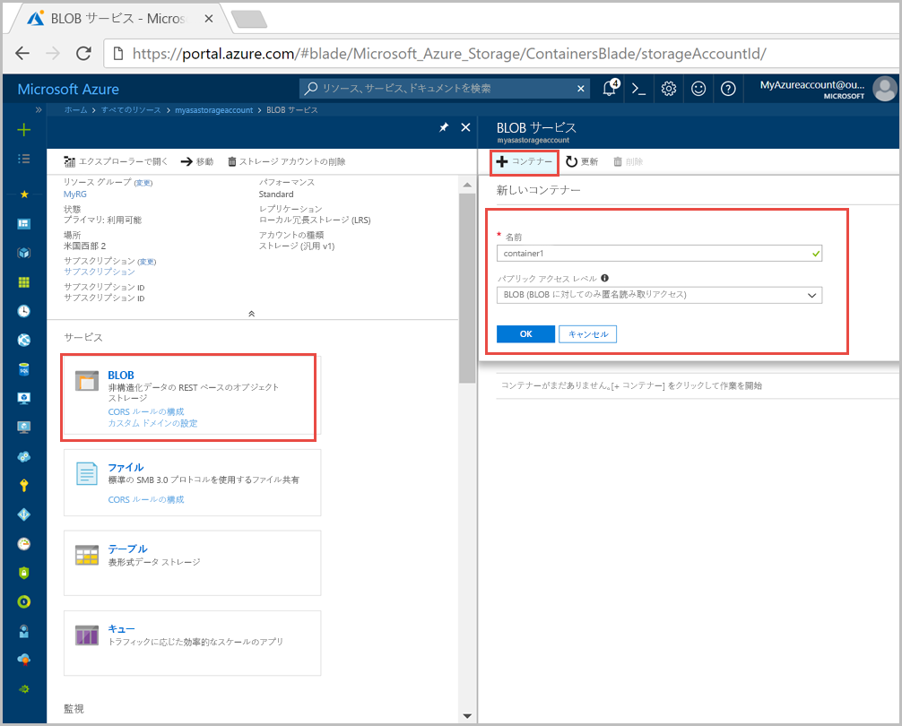
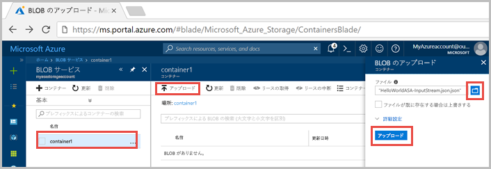
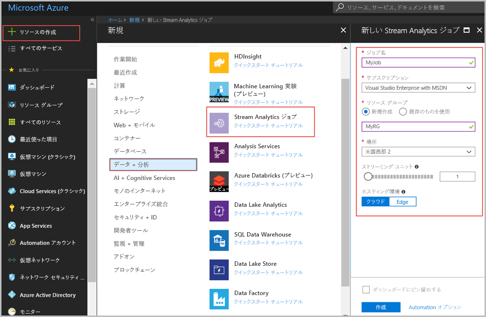
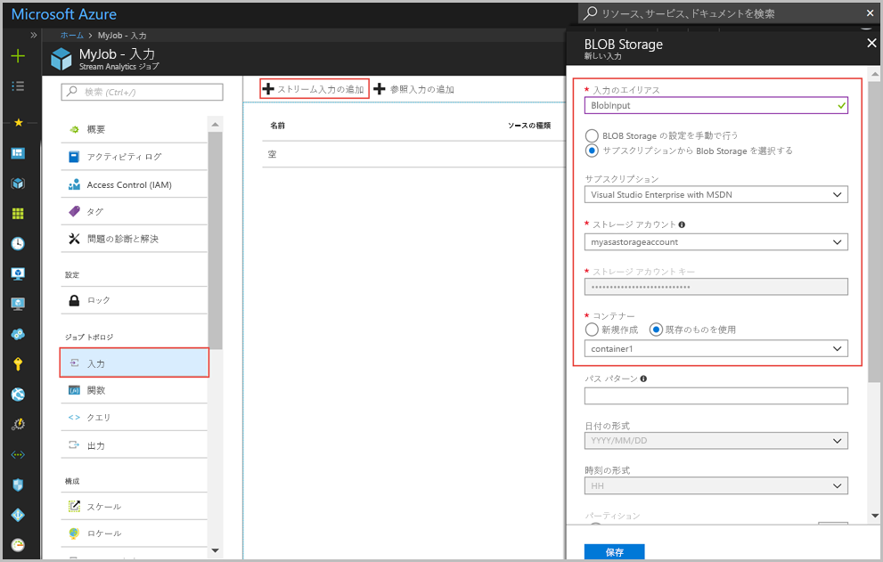
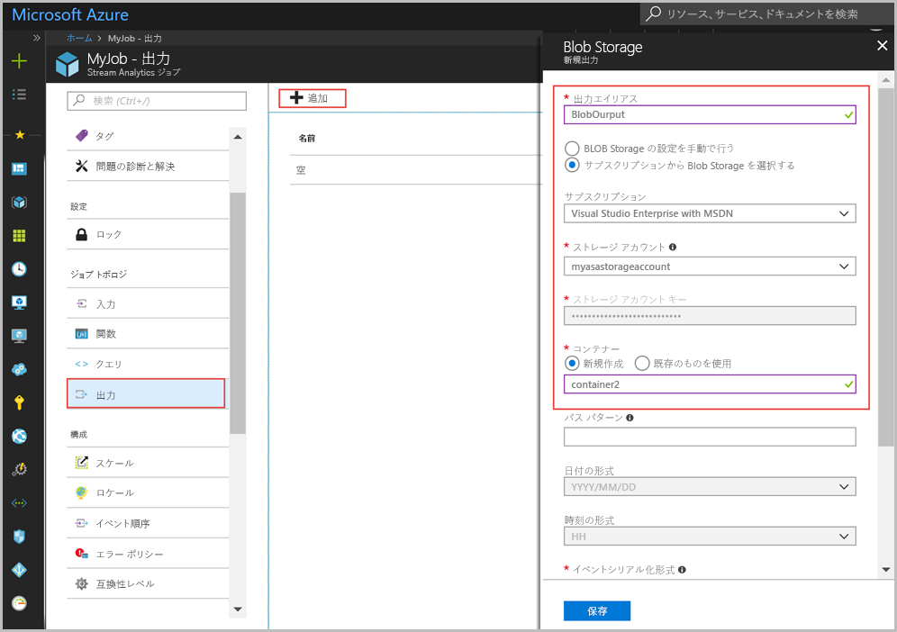
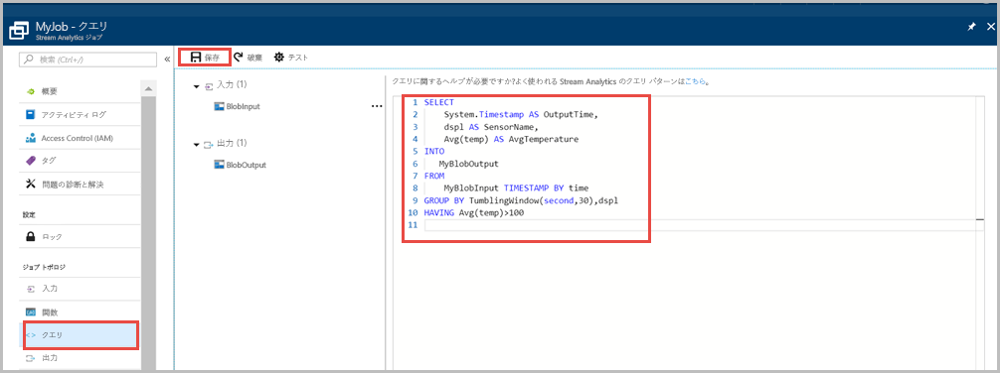
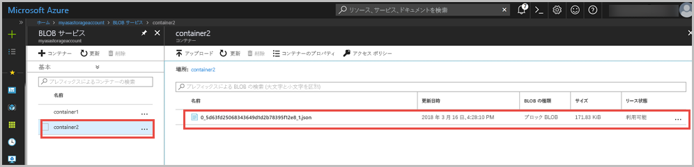

# <a name="quickstart-create-a-stream-analytics-job-by-using-the-azure-portal"></a>クイック スタート: Azure Portal を使用して Stream Analytics ジョブを作成する

このクイック スタートでは、Stream Analytics ジョブの作成によって作業を開始する方法を示します。 このクイック スタートでは、30 秒ごとにサンプル センサー データを読み込み、平均温度が 100 を超える行をフィルター処理する Stream Analytics ジョブを定義します。 この記事では、BLOB ストレージからデータを読み込み、データを変換して、同じ BLOB ストレージ内の別のコンテナーに書き戻します。 このクイック スタートで使用される入力データ ファイルには、わかりやすくするために静的なデータが含まれています。 実際のシナリオでは、Stream Analytics ジョブの入力データをストリーミングします。

## <a name="before-you-begin"></a>開始する前に

* Azure サブスクリプションをお持ちでない場合は、[無料アカウント](https://azure.microsoft.com/free/)を作成してください。

* [Azure Portal](https://portal.azure.com/) にサインインします。

## <a name="prepare-the-input-data"></a>入力データを準備する

Stream Analytics ジョブを定義する前に、ジョブへの入力として構成されるデータを準備する必要があります。 ジョブで必要な入力データを準備するには、次の手順を実行します。

1. GitHub から[サンプル センサー データ](https://raw.githubusercontent.com/Azure/azure-stream-analytics/master/Samples/GettingStarted/HelloWorldASA-InputStream.json)をダウンロードします。 サンプル データには、次の JSON 形式のセンサー情報が含まれています。  

   ```json
   {
     "time": "2018-01-26T21:18:52.0000000",
     "dspl": "sensorC",
     "temp": 87,
     "hmdt": 44
   }
   ```
2. [Azure Portal](https://portal.azure.com/) にサインインします。  

3. Azure Portal の左上隅で、**[リソースの作成]** > **[ストレージ]** > **[ストレージ アカウント]** の順に選択します。 ストレージ アカウント ジョブのページで、**[名前]** を「asaquickstartstorage」に、**[場所]** を「米国西部 2」に、**[リソース グループ]** を「asaquickstart-resourcegroup」に設定するよう入力します (パフォーマンスを高めるために、ストリーミング ジョブと同じリソース グループ内のストレージ アカウントをホストします)。 その他の設定は既定値のままにします。  

   ![[ストレージ アカウントの作成]](./media/stream-analytics-quick-create-portal/create-a-storage-account.png)

4. **[すべてのリソース]** ページで、前の手順で作成したストレージ アカウントを特定します。 **[概要]** ページを開き、**[BLOB]** タイルを開きます。  

5. **[Blob Service]** ページで **[コンテナー]** を選択し、コンテナーの**名前**を指定します (*container1* など)。次に、**[パブリック アクセス レベル]** を [Private (no anonymous access)]\(プライベート (匿名アクセスなし)\) に変更して、**[OK]** を選択します。  

   

6. 前の手順で作成したコンテナーに移動します。 **[アップロード]** を選択して、最初の手順で取得したセンサー データをアップロードします。  

   

## <a name="create-a-stream-analytics-job"></a>Stream Analytics のジョブの作成

1. Azure ポータルにサインインします。

2. Azure Portal の左上隅にある **[リソースの作成]** を選択します。  

3. 結果の一覧で、**[データ + 分析]** > **[Stream Analytics ジョブ]** の順に選択します。  

4. Stream Analytics ジョブ ページに、次の情報を入力します。

   |**設定**  |**推奨値**  |**説明**  |
   |---------|---------|---------|
   |ジョブ名   |  myasajob   |   Stream Analytics ジョブを識別するための名前を入力します。 Stream Analytics ジョブ名には、英数字、ハイフン、アンダースコアのみを使用することができます。長さは 3 文字以上 63 文字以下でなければなりません。 |
   |サブスクリプション  | \<該当するサブスクリプション\> |  このジョブで使用する Azure サブスクリプションを選択します。 |
   |リソース グループ   |   asaquickstart-resourcegroup  |   **[新規作成]** を選択し、アカウントの新しいリソース グループ名を入力します。 |
   |Location  |  \<ユーザーに最も近いリージョンを選択\> | Stream Analytics ジョブをホストすることができる地理的な場所を選択します。 パフォーマンスを向上させ、データ転送コストを削減するために、ユーザーに最も近い場所を使用します。 |
   |[ストリーミング ユニット]  | 1  |   ストリーミング ユニットとは、ジョブの実行に必要なコンピューティング リソースのことです。 既定では、この値は 1 に設定されています。 ストリーミング ユニットのスケーリングについては、[ストリーミング ユニットの理解と調整](stream-analytics-streaming-unit-consumption.md)に関する記事を参照してください。   |
   |ホスティング環境  |  クラウド  |   Stream Analytics ジョブは、クラウドまたはエッジにデプロイすることができます。 クラウドでは Azure Cloud にデプロイすることができ、エッジでは IoT エッジ デバイスにデプロイすることができます。 |

   

5. **[ダッシュボードにピン留めする]** ボックスをオンにしてジョブをダッシュボードに配置し、**[作成]** を選択します。  

6. ブラウザー ウィンドウの右上に "デプロイを実行しています..." と表示されます。 

## <a name="configure-input-to-the-job"></a>ジョブへの入力を構成する

このセクションでは、Stream Analytics ジョブへの入力として BLOB ストレージを構成します。 入力を構成する前に、BLOB ストレージ アカウントを作成します。  

### <a name="add-the-input"></a>入力を追加する 

1. Stream Analytics ジョブに移動します。  

2. **[入力]** > **[ストリーム入力の追加]** > **[Blob ストレージ]** の順に選択します。  

3. **[Blob ストレージ]** ページに、以下の値を入力します。

   |**設定**  |**推奨値**  |**説明**  |
   |---------|---------|---------|
   |入力のエイリアス  |  BlobInput   |  ジョブの入力を識別する名前を入力します。   |
   |サブスクリプション   |  \<該当するサブスクリプション\> |  作成したストレージ アカウントを持っている Azure サブスクリプションを選択します。 ストレージ アカウントは、同じサブスクリプションにある場合も、別のサブスクリプションにある場合もあります。 この例では、同じサブスクリプションにストレージ アカウントを作成したと想定しています。 |
   |ストレージ アカウント  |  myasastorageaccount |  ストレージ アカウントの名前を選択するか、入力します。 ストレージ アカウントが同じサブスクリプション内に作成されている場合、ストレージ アカウント名は自動的に検出されます。 |
   |コンテナー  | container1 | サンプル データがあるコンテナーの名前を選択します。 コンテナーが同じサブスクリプション内に作成されている場合、コンテナー名は自動的に検出されます。 |

4. 他のオプションは既定値のままにして、**[保存]** を選択し、設定を保存します。  

   
 
## <a name="configure-output-to-the-job"></a>ジョブへの出力を構成する

1. 前に作成した Stream Analytics ジョブに移動します。  

2. **[出力]、[追加]、[Blob ストレージ]** の順に選択します。  

3. **[Blob ストレージ]** ページに、以下の値を入力します。

   |**設定**  |**推奨値**  |**説明**  |
   |---------|---------|---------|
   |出力エイリアス |   BlobOutput   |   ジョブの出力を識別する名前を入力します。 |
   |サブスクリプション  |  \<該当するサブスクリプション\>  |  作成したストレージ アカウントを持っている Azure サブスクリプションを選択します。 ストレージ アカウントは、同じサブスクリプションにある場合も、別のサブスクリプションにある場合もあります。 この例では、同じサブスクリプションにストレージ アカウントを作成したと想定しています。 |
   |ストレージ アカウント |  asaquickstartstorage |   ストレージ アカウントの名前を選択するか、入力します。 ストレージ アカウントが同じサブスクリプション内に作成されている場合、ストレージ アカウント名は自動的に検出されます。       |
   |コンテナー |   container1  |  ストレージ アカウントで作成した既存のコンテナーを選択します。   |
   |パスのパターン |   output  |  出力用の既存のコンテナー内のパスとして使用する名前を入力します。   |

4. 他のオプションは既定値のままにして、**[保存]** を選択し、設定を保存します。  

   
 
## <a name="define-the-transformation-query"></a>変換クエリを定義する

1. 前に作成した Stream Analytics ジョブに移動します。  

2. **[クエリ]** を選択し、クエリを次のように更新します。  

   ```sql
   SELECT 
   System.Timestamp AS OutputTime,
   dspl AS SensorName,
   Avg(temp) AS AvgTemperature
   INTO
     BlobOutput
   FROM
     BlobInput TIMESTAMP BY time
   GROUP BY TumblingWindow(second,30),dspl
   HAVING Avg(temp)>100
   ```

3. この例では、クエリは BLOB からデータを読み取り、BLOB 内の新しいファイルにコピーします。**[保存]** を選択します。  

   

## <a name="start-the-stream-analytics-job-and-check-the-output"></a>Stream Analytics ジョブを開始して出力をチェックする

1. ジョブ概要ページに戻り、**[開始]** を選択します。

2. **[ジョブの開始]** で **[カスタム]** を選択します。**[開始時間]** フィールドで、 開始日付として `2018-01-24` を選択しますが、時刻は変更しないでください。 サンプル データからのイベント タイムスタンプ前に指定するために、この開始日が選択されます。 設定が終了したら、**[開始]** を選択します。

   

3. 数分経ったら、ポータルで、ジョブの出力として構成したストレージ アカウントとコンテナーを特定します。 出力パスを選択します。 コンテナーに出力ファイルが表示されるようになりました。 ジョブは初めて開始するときに数分かかり、開始後はデータが到着すると実行され続けます。  

   

## <a name="clean-up-resources"></a>リソースのクリーンアップ

リソース グループ、ストリーミング ジョブ、および関連するすべてのリソースは、不要になったら削除します。 ジョブを削除すると、ジョブによって消費されるストリーミング ユニットに対する課金を回避することができます。 ジョブを後で使用する計画がある場合は、ジョブを停止し、必要なときに再起動することができます。 このジョブの使用を続けない場合は、以下の手順に従って、このクイック スタートで作成したすべてのリソースを削除してください。

1. Azure Portal の左側のメニューで **[リソース グループ]** を選択し、作成したリソースの名前を選択します。  

2. リソース グループのページで **[削除]** を選択し、削除するリソースの名前をテキスト ボックスに入力してから **[削除]** を選択します。

## <a name="next-steps"></a>次の手順

このクイック スタートでは、単純な Stream Analytics ジョブを展開しました。 その他の入力ソースの構成やリアルタイム検出の実行について学習するには、次の記事に進んでください。

> [!div class="nextstepaction"]
> [Azure Stream Analytics を使用したリアルタイムの不正行為の検出](stream-analytics-real-time-fraud-detection.md)

