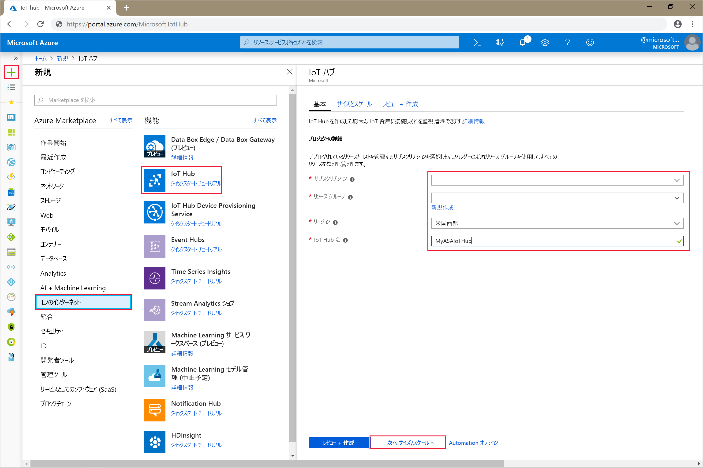
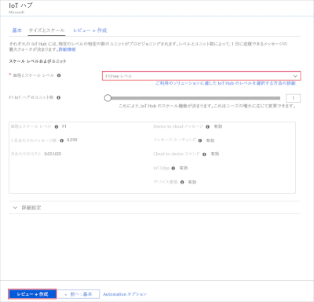
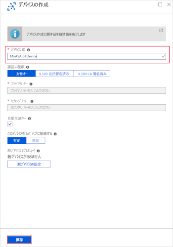
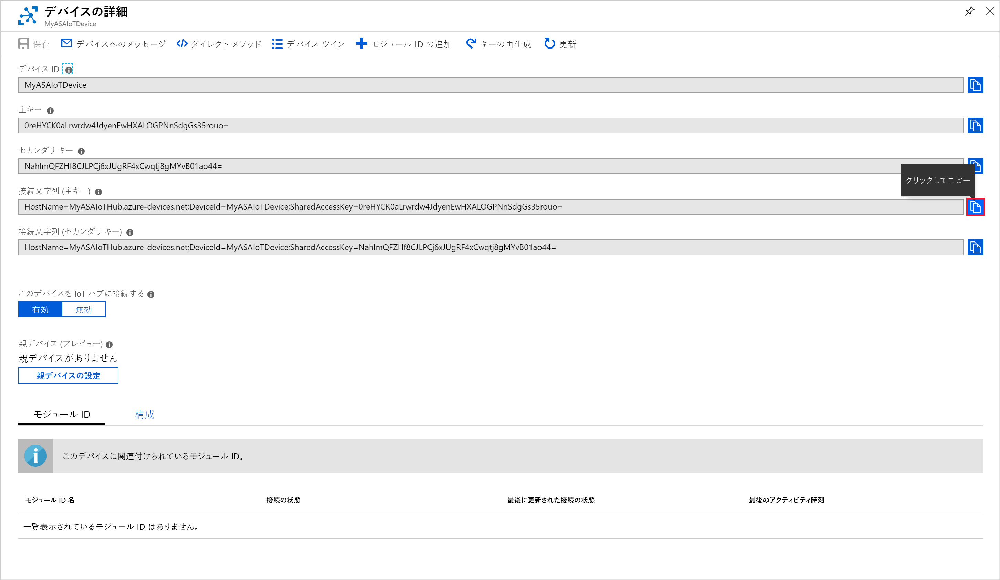
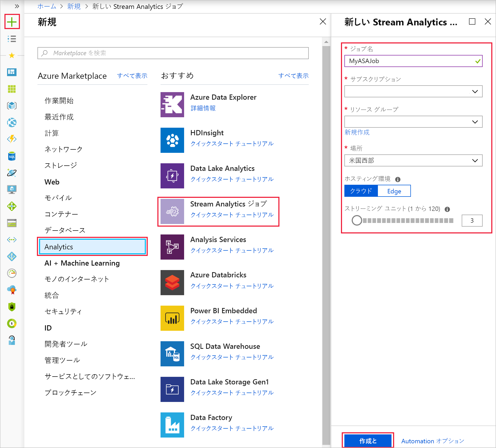
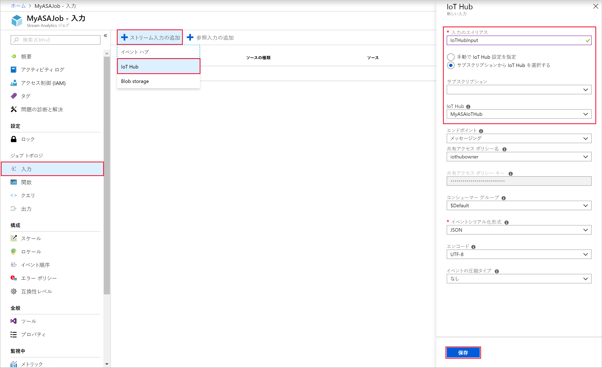
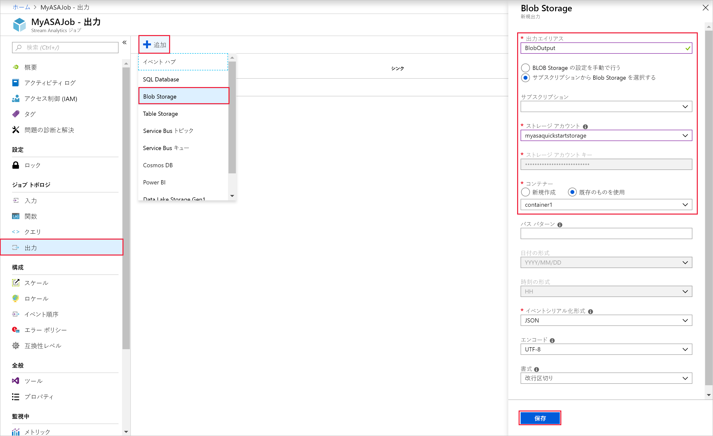
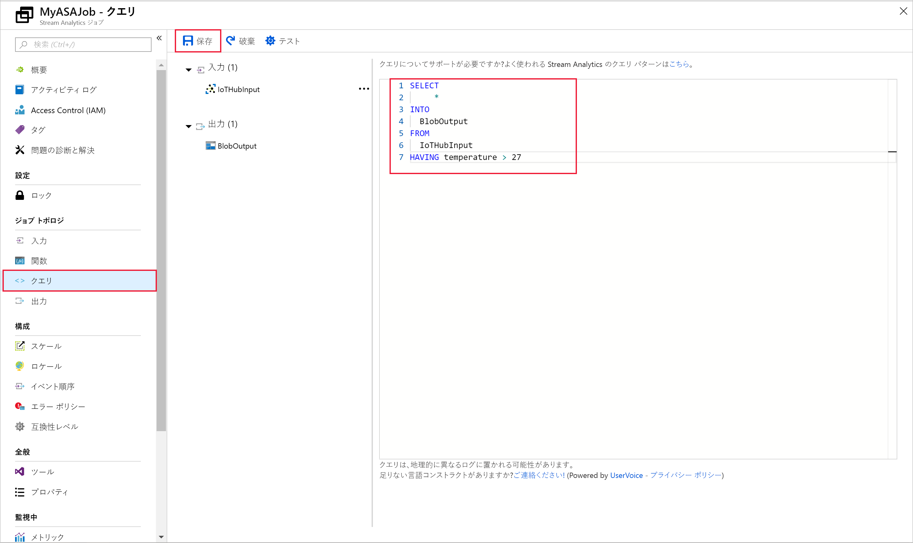
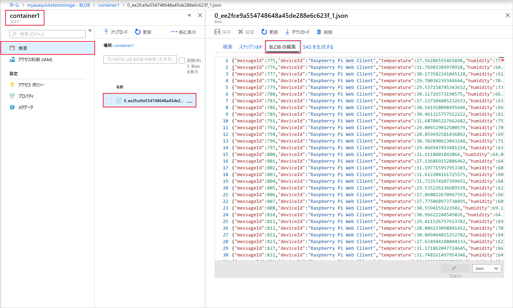

# <a name="quickstart-create-a-stream-analytics-job-by-using-the-azure-portal"></a>クイック スタート: Azure Portal を使用して Stream Analytics ジョブを作成する

このクイック スタートでは、Stream Analytics ジョブの作成によって作業を開始する方法を示します。 このクイック スタートでは、リアルタイム ストリーミング データを読み取り、温度が 27 を超えるメッセージをフィルター処理する Stream Analytics ジョブを定義します。 お客様の Stream Analytics ジョブによって IoT Hub からデータが読み取られ、変換されて BLOB ストレージ内のコンテナーに書き戻されます。 このクイック スタートで使用される入力データは、Raspberry Pi オンライン シミュレーターによって生成されます。 

## <a name="before-you-begin"></a>開始する前に

* Azure サブスクリプションをお持ちでない場合は、[無料アカウント](https://azure.microsoft.com/free/)を作成してください。

* [Azure portal](https://portal.azure.com/) にサインインする

## <a name="prepare-the-input-data"></a>入力データを準備する

Stream Analytics ジョブを定義する前に、入力データを準備する必要があります。 リアルタイムのセンサー データは、ジョブの入力として構成された IoT Hub に後で取り込まれます。 ジョブで必要な入力データを準備するには、次の手順を完了します。

1. [Azure portal](https://portal.azure.com/) にサインインする

2. **[リソースの作成]**  >  **[モノのインターネット]**  >  **[IoT Hub]** を選択します。

3. **[IoT Hub]** ウィンドウで、以下の情報を入力します。
   
   |**設定**  |**推奨値**  |**説明**  |
   |---------|---------|---------|
   |サブスクリプション  | \<該当するサブスクリプション\> |  使用する Azure サブスクリプションを選択します。 |
   |Resource group   |   asaquickstart-resourcegroup  |   **[新規作成]** を選択し、アカウントの新しいリソース グループ名を入力します。 |
   |リージョン  |  \<ユーザーに最も近いリージョンを選択\> | お客様の IoT ハブをホストできる地理的な場所を選択します。 お客様のユーザーに最も近い場所を使用します。 |
   |IoT Hub 名  | MyASAIoTHub  |   お客様の IoT ハブの名前を選択します。   |

   

4. **[Next: Set size and scale]\(次へ: サイズとスケールの設定\)** を選択します。

5. **[価格とスケールティア]** を選択します。 このクイック スタートでは、 **[F1 - Free tier]\(F1 - Free レベル\)** を選択します (お客様のサブスクリプションでまだ使用可能な場合)。 詳細については、「[IoT Hub の価格](https://azure.microsoft.com/pricing/details/iot-hub/)」を参照してください。

   

6. **[Review + create]\(レビュー + 作成\)** を選択します。 お客様の IoT ハブの情報を確認して、 **[作成]** をクリックします。 お客様の IoT ハブの作成には数分かかることがあります。 **[通知]** ウィンドウで進行状況を監視できます。

7. お客様の IoT ハブ ナビゲーション メニューで、 **[IoT デバイス]** の **[追加]** をクリックします。 **デバイス ID** を追加して **[保存]** をクリックします。

   

8. デバイスが作成されたら、 **[IoT デバイス]** の一覧からデバイスを開きます。 後で使用するために **[接続文字列 (主キー)]** をコピーしてメモ帳に保存します。

   

## <a name="create-blob-storage"></a>BLOB ストレージを作成する

1. Azure Portal の左上隅で、 **[リソースの作成]**  >  **[ストレージ]**  >  **[ストレージ アカウント]** の順に選択します。

2. **[ストレージ アカウントの作成]** ウィンドウで、ストレージ アカウントの名前、場所、リソース グループを入力します。 お客様が作成した IoT ハブと同じ場所およびリソース グループを選択します。 **[確認および作成]** をクリックしてアカウントを作成します。

   

3. お客様のストレージ アカウントが作成されたら、 **[概要]** ウィンドウの **[BLOB]** タイルを選択します。

   

4. **[Blob service]** ページで、 **[コンテナー]** を選択し、お客様のコンテナーに名前を付けます (*container1* など)。 **[パブリック アクセス レベル]** を **[Private (no anonymous access)]\(プライベート (匿名アクセスなし)\)** のままにして、 **[OK]** を選択します。

   

## <a name="create-a-stream-analytics-job"></a>Stream Analytics のジョブの作成

1. Azure portal にサインインします。

2. Azure Portal の左上隅にある **[リソースの作成]** を選択します。  

3. 結果の一覧で、 **[Analytics]**  >  **[Stream Analytics ジョブ]** の順に選択します。  

4. Stream Analytics ジョブ ページに、次の情報を入力します。

   |**設定**  |**推奨値**  |**説明**  |
   |---------|---------|---------|
   |ジョブ名   |  MyASAJob   |   Stream Analytics ジョブを識別するための名前を入力します。 Stream Analytics ジョブ名には、英数字、ハイフン、アンダースコアのみを使用することができます。長さは 3 文字以上 63 文字以下でなければなりません。 |
   |サブスクリプション  | \<該当するサブスクリプション\> |  このジョブで使用する Azure サブスクリプションを選択します。 |
   |Resource group   |   asaquickstart-resourcegroup  |   お客様の IoT ハブと同じリソース グループを選択します。 |
   |Location  |  \<ユーザーに最も近いリージョンを選択\> | Stream Analytics ジョブをホストすることができる地理的な場所を選択します。 パフォーマンスを向上させ、データ転送コストを削減するために、ユーザーに最も近い場所を使用します。 |
   |[ストリーミング ユニット]  | 1  |   ストリーミング ユニットとは、ジョブの実行に必要なコンピューティング リソースのことです。 既定では、この値は 1 に設定されています。 ストリーミング ユニットのスケーリングについては、[ストリーミング ユニットの理解と調整](stream-analytics-streaming-unit-consumption.md)に関する記事を参照してください。   |
   |ホスティング環境  |  クラウド  |   Stream Analytics ジョブは、クラウドまたはエッジにデプロイすることができます。 クラウドでは Azure Cloud にデプロイすることができ、エッジでは IoT Edge デバイスにデプロイすることができます。 |

   

5. **[ダッシュボードにピン留めする]** ボックスをオンにしてジョブをダッシュボードに配置し、 **[作成]** を選択します。  

6. ブラウザー ウィンドウの右上に *[デプロイを実行しています...]* という通知が表示されるのがわかります。 

## <a name="configure-job-input"></a>ジョブの入力を構成する

このセクションでは、Stream Analytics ジョブへの IoT Hub デバイス入力を構成します。 クイック スタート内の前のセクションでお客様が作成した IoT ハブを使用します。

1. Stream Analytics ジョブに移動します。  

2. **[入力]**  >  **[ストリーム入力の追加]**  >  **[IoT Hub]** の順に選択します。  

3. **[IoT Hub]** ページで以下の値を入力します。

   |**設定**  |**推奨値**  |**説明**  |
   |---------|---------|---------|
   |入力のエイリアス  |  IoTHubInput   |  ジョブの入力を識別する名前を入力します。   |
   |サブスクリプション   |  \<該当するサブスクリプション\> |  作成したストレージ アカウントを持っている Azure サブスクリプションを選択します。 ストレージ アカウントは、同じサブスクリプションにある場合も、別のサブスクリプションにある場合もあります。 この例では、同じサブスクリプションにストレージ アカウントを作成したと想定しています。 |
   |IoT Hub  |  MyASAIoTHub |  前のセクションでお客様が作成した IoT ハブの名前を入力します。 |

4. 他のオプションは既定値のままにして、 **[保存]** を選択し、設定を保存します。  

   
 
## <a name="configure-job-output"></a>ジョブの出力を構成する

1. 前に作成した Stream Analytics ジョブに移動します。  

2. **[出力]**  >  **[追加]**  >  **[Blob ストレージ]** の順に選択します。  

3. **[Blob ストレージ]** ページに、以下の値を入力します。

   |**設定**  |**推奨値**  |**説明**  |
   |---------|---------|---------|
   |出力エイリアス |   BlobOutput   |   ジョブの出力を識別する名前を入力します。 |
   |サブスクリプション  |  \<該当するサブスクリプション\>  |  作成したストレージ アカウントを持っている Azure サブスクリプションを選択します。 ストレージ アカウントは、同じサブスクリプションにある場合も、別のサブスクリプションにある場合もあります。 この例では、同じサブスクリプションにストレージ アカウントを作成したと想定しています。 |
   |ストレージ アカウント |  asaquickstartstorage |   ストレージ アカウントの名前を選択するか、入力します。 ストレージ アカウントが同じサブスクリプション内に作成されている場合、ストレージ アカウント名は自動的に検出されます。       |
   |コンテナー |   container1  |  ストレージ アカウントで作成した既存のコンテナーを選択します。   |

4. 他のオプションは既定値のままにして、 **[保存]** を選択し、設定を保存します。  

   
 
## <a name="define-the-transformation-query"></a>変換クエリを定義する

1. 前に作成した Stream Analytics ジョブに移動します。  

2. **[クエリ]** を選択し、クエリを次のように更新します。  

   ```sql
   SELECT *
   INTO BlobOutput
   FROM IoTHubInput
   HAVING Temperature > 27
   ```

3. この例では、クエリによって IoT Hub からデータが読み取られ、BLOB 内の新しいファイルにそれがコピーされます。 **[保存]** を選択します。  

   

## <a name="run-the-iot-simulator"></a>IoT シミュレーターを実行する

1. [Raspberry Pi Azure IoT オンライン シミュレーター](https://azure-samples.github.io/raspberry-pi-web-simulator/)を開きます。

2. 前のセクションで保存した Azure IoT Hub デバイスの接続文字列を使用して、行 15 のプレースホルダーを置き換えます。

3. **[実行]** をクリックします。 お客様の IoT ハブに送信されているセンサー データとメッセージが出力に表示されます。

   

## <a name="start-the-stream-analytics-job-and-check-the-output"></a>Stream Analytics ジョブを開始して出力をチェックする

1. ジョブ概要ページに戻り、 **[開始]** を選択します。

2. **[ジョブの開始]** の **[ジョブ出力の開始時刻]** フィールドで、 **[現在]** を選択します。 次に、 **[開始]** を選択してお客様のジョブを開始します。

3. 数分経ったら、ポータルで、ジョブの出力として構成したストレージ アカウントとコンテナーを特定します。 コンテナーに出力ファイルが表示されるようになりました。 ジョブは初めて開始するときに数分かかり、開始後はデータが到着すると実行され続けます。  

   

## <a name="clean-up-resources"></a>リソースをクリーンアップする

リソース グループ、Stream Analytics ジョブ、およびすべての関連するリソースは、不要になったら削除します。 ジョブを削除すると、ジョブによって消費されるストリーミング ユニットに対する課金を回避することができます。 ジョブを後で使用する計画がある場合は、ジョブを停止し、必要なときに再起動することができます。 このジョブの使用を続けない場合は、以下の手順に従って、このクイック スタートで作成したすべてのリソースを削除してください。

1. Azure Portal の左側のメニューで **[リソース グループ]** を選択し、作成したリソースの名前を選択します。  

2. リソース グループのページで **[削除]** を選択し、削除するリソースの名前をテキスト ボックスに入力してから **[削除]** を選択します。

## <a name="next-steps"></a>次のステップ

このクイック スタートでは、Azure portal を使用して、簡単な Stream Analytics ジョブをデプロイしました。 また、[PowerShell](stream-analytics-quick-create-powershell.md)、[Visual Studio](stream-analytics-quick-create-vs.md)、および [Visual Studio Code](quick-create-vs-code.md) を使用して Stream Analytics ジョブをデプロイすることもできます。

その他の入力ソースの構成やリアルタイム検出の実行について学習するには、次の記事に進んでください。

> [!div class="nextstepaction"]
> [Azure Stream Analytics を使用したリアルタイムの不正行為の検出](stream-analytics-real-time-fraud-detection.md)
