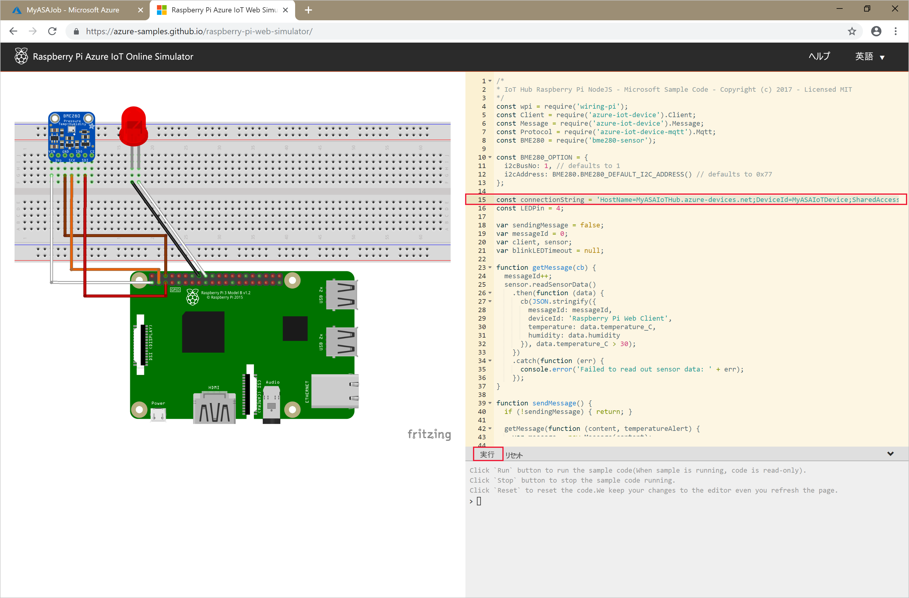

# <a name="quickstart-create-a-stream-analytics-job-using-azure-powershell"></a>クイック スタート:Azure PowerShell を使用して Stream Analytics ジョブを作成する

Azure PowerShell モジュールは、PowerShell コマンドレットまたはスクリプトを使用して Azure リソースを作成および管理するために使用します。 このクイック スタートでは、Azure PowerShell モジュールを使用して Azure Stream Analytics ジョブをデプロイおよび実行する方法について詳しく説明します。

サンプル ジョブでは、IoT Hub デバイスからストリーミング データを読み取ります。 入力データは、Raspberry Pi オンライン シミュレーターによって生成されます。 次に、温度が 27 度を上回っていることを示すメッセージをフィルター処理するために、Stream Analytics ジョブで Stream Analytics クエリ言語を使用してデータを変換します。 最後に、結果の出力イベントを BLOB ストレージ内のファイルに書き込みます。

## <a name="before-you-begin"></a>開始する前に

[!INCLUDE [updated-for-az](../../includes/updated-for-az.md)]

* Azure サブスクリプションをお持ちでない場合は、[無料アカウント](https://azure.microsoft.com/free/)を作成してください。

* このクイック スタートには、Azure PowerShell モジュールが必要です。 ローカル マシンにインストールされているバージョンを調べるには、`Get-Module -ListAvailable Az` を実行します。 インストールまたはアップグレードする必要がある場合は、[Azure PowerShell モジュールのインストール](https://docs.microsoft.com/powershell/azure/install-Az-ps)に関するページを参照してください。

* 一部の IoT Hub アクションは Azure PowerShell でサポートされていないため、Azure CLI バージョン 2.0.70 以降および Azure CLI の IoT 拡張機能を使用して完了する必要があります。 [Azure CLI をインストール](https://docs.microsoft.com/cli/azure/install-azure-cli?view=azure-cli-latest)し、`az extension add --name azure-iot` を使用して IoT 拡張機能をインストールします。


## <a name="sign-in-to-azure"></a>Azure へのサインイン

`Connect-AzAccount` コマンドを使用して Azure サブスクリプションにサインインし、ポップアップ ブラウザーに Azure 資格情報を入力します。

```powershell
# Connect to your Azure account
Connect-AzAccount
```

サブスクリプションが複数ある場合は、次のコマンドレットを実行して、このクイック スタートに使用するサブスクリプションを選択します。 `<your subscription name>` は、実際のサブスクリプションの名前に置き換えてください。

```powershell
# List all available subscriptions.
Get-AzSubscription

# Select the Azure subscription you want to use to create the resource group and resources.
Get-AzSubscription -SubscriptionName "<your subscription name>" | Select-AzSubscription
```

## <a name="create-a-resource-group"></a>リソース グループを作成する

[New-AzResourceGroup](https://docs.microsoft.com/powershell/module/az.resources/new-azresourcegroup) を使用して Azure リソース グループを作成します。 リソース グループとは、Azure リソースのデプロイと管理に使用する論理コンテナーです。

```powershell
$resourceGroup = "StreamAnalyticsRG"
$location = "WestUS2"
New-AzResourceGroup `
    -Name $resourceGroup `
    -Location $location
```

## <a name="prepare-the-input-data"></a>入力データを準備する

Stream Analytics ジョブを定義する前に、ジョブへの入力として構成されるデータを準備します。

次の Azure CLI コード ブロックでは、ジョブに必要な入力データを準備するための多くのコマンドが実行されます。 コードを理解するためにセクションを確認してください。

1. PowerShell ウィンドウで [az login](https://docs.microsoft.com/cli/azure/authenticate-azure-cli?view=azure-cli-latest) コマンドを実行して、ご利用の Azure アカウントにサインインします。

    サインインに成功すると、Azure CLI からサブスクリプションの一覧が返されます。 このクイック スタートに使用しているサブスクリプションをコピーし、[az account set](https://docs.microsoft.com/cli/azure/manage-azure-subscriptions-azure-cli?view=azure-cli-latest#change-the-active-subscription) コマンドを実行してそのサブスクリプションを選択します。 PowerShell を使用した前のセクションで選択したのと同じサブスクリプションを選択します。 `<your subscription name>` は、必ず実際のサブスクリプションの名前に置き換えてください。

    ```azurecli
    az login

    az account set --subscription "<your subscription>"
    ```

2. [az iot hub create](../iot-hub/iot-hub-create-using-cli.md#create-an-iot-hub) コマンドを使用して、IoT ハブを作成します。 この例では、**MyASAIoTHub** という名前の IoT ハブを作成します。 IoT ハブの名前は一意であるため、独自の IoT ハブ名を考案する必要があります。 サブスクリプションで Free レベルを使用できる場合は、SKU を F1 に設定して Free レベルを使用します。 そうでない場合は、次に低いレベルを選択します。

    ```azurecli
    az iot hub create --name "<your IoT Hub name>" --resource-group $resourceGroup --sku S1
    ```

    IoT ハブが作成されたら、[az iot hub show-connection-string](https://docs.microsoft.com/cli/azure/iot/hub?view=azure-cli-latest) コマンドを使用して IoT ハブの接続文字列を取得します。 IoT ハブを Stream Analytics ジョブへの入力として追加するときに備えて、接続文字列全体をコピーして保存します。

    ```azurecli
    az iot hub show-connection-string --hub-name "MyASAIoTHub"
    ```

3. [az iothub device-identity create](../iot-hub/quickstart-send-telemetry-c.md#register-a-device) コマンドを使用して、デバイスを IoT ハブに追加します。 この例では、**MyASAIoTDevice** という名前のデバイスを作成します。

    ```azurecli
    az iot hub device-identity create --hub-name "MyASAIoTHub" --device-id "MyASAIoTDevice"
    ```

4. [az iot hub device-identity show-connection-string](/cli/azure/ext/azure-iot/iot/hub/device-identity#ext-azure-iot-az-iot-hub-device-identity-show-connection-string) コマンドを使用してデバイスの接続文字列を取得します。 Raspberry Pi シミュレーターを作成するときに備えて、接続文字列全体をコピーして保存します。

    ```azurecli
    az iot hub device-identity show-connection-string --hub-name "MyASAIoTHub" --device-id "MyASAIoTDevice" --output table
    ```

    **出力例:**

    ```output
    HostName=MyASAIoTHub.azure-devices.net;DeviceId=MyASAIoTDevice;SharedAccessKey=a2mnUsg52+NIgYudxYYUNXI67r0JmNubmfVafojG8=
    ```

## <a name="create-blob-storage"></a>BLOB ストレージを作成する

次の Azure PowerShell コード ブロックでは、コマンドを使用して、ジョブの出力に使用される BLOB ストレージを作成します。 コードを理解するためにセクションを確認してください。

1. [New-AzStorageAccount](https://docs.microsoft.com/powershell/module/az.storage/New-azStorageAccount) コマンドレットを使用して、標準の汎用ストレージ アカウントを作成します。  この例では、ローカル冗長ストレージ (LRS) と BLOB 暗号化 (既定で有効) を使用する、**myasaquickstartstorage** と呼ばれるストレージ アカウントを作成します。

2. 使用されるストレージ アカウントを定義するストレージ アカウント コンテキスト `$storageAccount.Context` を取得します。 ストレージ アカウントを操作するとき、資格情報を繰り返し入力する代わりに、このコンテキストを参照します。

3. [New-AzStorageContainer](https://docs.microsoft.com/powershell/module/az.storage/new-azstoragecontainer) を使用して、ストレージ コンテナーを作成します。

4. コードによって出力されたストレージ キーをコピーし、そのキーを保存します。これは、後でストリーミング ジョブの出力を作成するために使用します。

    ```powershell
    $storageAccountName = "myasaquickstartstorage"
    $storageAccount = New-AzStorageAccount `
      -ResourceGroupName $resourceGroup `
      -Name $storageAccountName `
      -Location $location `
      -SkuName Standard_LRS `
      -Kind Storage

    $ctx = $storageAccount.Context
    $containerName = "container1"

    New-AzStorageContainer `
      -Name $containerName `
      -Context $ctx

    $storageAccountKey = (Get-AzStorageAccountKey `
      -ResourceGroupName $resourceGroup `
      -Name $storageAccountName).Value[0]

    Write-Host "The <storage account key> placeholder needs to be replaced in your output json files with this key value:"
    Write-Host $storageAccountKey -ForegroundColor Cyan
    ```

## <a name="create-a-stream-analytics-job"></a>Stream Analytics のジョブの作成

[New-AzStreamAnalyticsJob](https://docs.microsoft.com/powershell/module/az.streamanalytics/new-azstreamanalyticsjob) コマンドレットを使用して、Stream Analytics ジョブを作成します。 このコマンドレットは、パラメーターとしてジョブ名、リソース グループ名、およびジョブ定義を受け取ります。 ジョブ名は、ジョブを識別する任意のフレンドリ名にすることができます。 これには英数字、ハイフン、アンダースコアのみを使用できます。長さは 3 文字以上 63 文字以下でなければなりません。 ジョブ定義は、ジョブの作成に必要なプロパティを含む JSON ファイルです。 ローカル マシンに `JobDefinition.json` という名前のファイルを作成し、次の JSON データを追加します。

```json
{
  "location":"WestUS2",
  "properties":{
    "sku":{
      "name":"standard"
    },
    "eventsOutOfOrderPolicy":"adjust",
    "eventsOutOfOrderMaxDelayInSeconds":10,
    "compatibilityLevel": 1.1
  }
}
```

次に、`New-AzStreamAnalyticsJob` コマンドレットを実行します。 `jobDefinitionFile` 変数の値は、ジョブ定義 JSON ファイルを保存したパスに置き換えてください。

```powershell
$jobName = "MyStreamingJob"
$jobDefinitionFile = "C:\JobDefinition.json"
New-AzStreamAnalyticsJob `
  -ResourceGroupName $resourceGroup `
  -File $jobDefinitionFile `
  -Name $jobName `
  -Force
```

## <a name="configure-input-to-the-job"></a>ジョブへの入力を構成する

[New-AzStreamAnalyticsInput](https://docs.microsoft.com/powershell/module/az.streamanalytics/new-azstreamanalyticsinput) コマンドレットを使用して、ジョブへの入力を追加します。 このコマンドレットは、パラメーターとして、ジョブ名、ジョブ入力名、リソース グループ名、およびジョブ入力定義を受け取ります。 ジョブ入力定義は、ジョブの入力の構成に必要なプロパティを含む JSON ファイルです。 この例では、BLOB ストレージを入力として作成します。

ローカル マシンに `JobInputDefinition.json` という名前のファイルを作成し、次の JSON データを追加します。 `accesspolicykey` の値は必ず、前のセクションで保存した IoT ハブの接続文字列の `SharedAccessKey` 部分に置き換えてください。

```json
{
    "properties": {
        "type": "Stream",
        "datasource": {
            "type": "Microsoft.Devices/IotHubs",
            "properties": {
                "iotHubNamespace": "MyASAIoTHub",
                "sharedAccessPolicyName": "iothubowner",
                "sharedAccessPolicyKey": "accesspolicykey",
                "endpoint": "messages/events",
                "consumerGroupName": "$Default"
                }
        },
        "compression": {
            "type": "None"
        },
        "serialization": {
            "type": "Json",
            "properties": {
                "encoding": "UTF8"
            }
        }
    },
    "name": "IoTHubInput",
    "type": "Microsoft.StreamAnalytics/streamingjobs/inputs"
}
```

次に、`New-AzStreamAnalyticsInput` コマンドレットを実行します。`jobDefinitionFile` 変数の値は必ず、ジョブ入力定義 JSON ファイルを保存したパスに置き換えてください。

```powershell
$jobInputName = "IoTHubInput"
$jobInputDefinitionFile = "C:\JobInputDefinition.json"
New-AzStreamAnalyticsInput `
  -ResourceGroupName $resourceGroup `
  -JobName $jobName `
  -File $jobInputDefinitionFile `
  -Name $jobInputName
```

## <a name="configure-output-to-the-job"></a>ジョブへの出力を構成する

[New-AzStreamAnalyticsOutput](https://docs.microsoft.com/powershell/module/az.streamanalytics/new-azstreamanalyticsoutput) コマンドレットを使用して、ジョブへの出力を追加します。 このコマンドレットは、パラメーターとして、ジョブ名、ジョブ出力名、リソース グループ名、およびジョブ出力定義を受け取ります。 ジョブ出力定義は、ジョブの出力の構成に必要なプロパティを含む JSON ファイルです。 この例では、BLOB ストレージを出力として使用します。

ローカル マシンに `JobOutputDefinition.json` という名前のファイルを作成し、次の JSON データを追加します。 `accountKey` の値は、ストレージ アカウントのアクセス キー ($storageAccountKey 値に格納されている値) に置き換えてください。

```json
{
    "properties": {
        "datasource": {
            "type": "Microsoft.Storage/Blob",
            "properties": {
                "storageAccounts": [
                    {
                      "accountName": "asaquickstartstorage",
                      "accountKey": "<storage account key>"
                    }
                ],
                "container": "container1",
                "pathPattern": "output/",
                "dateFormat": "yyyy/MM/dd",
                "timeFormat": "HH"
            }
        },
        "serialization": {
            "type": "Json",
            "properties": {
                "encoding": "UTF8",
                "format": "LineSeparated"
            }
        }
    },
    "name": "BlobOutput",
    "type": "Microsoft.StreamAnalytics/streamingjobs/outputs"
}
```

次に、`New-AzStreamAnalyticsOutput` コマンドレットを実行します。 `jobOutputDefinitionFile` 変数の値は、ジョブ出力定義 JSON ファイルを保存したパスに置き換えてください。

```powershell
$jobOutputName = "BlobOutput"
$jobOutputDefinitionFile = "C:\JobOutputDefinition.json"
New-AzStreamAnalyticsOutput `
  -ResourceGroupName $resourceGroup `
  -JobName $jobName `
  -File $jobOutputDefinitionFile `
  -Name $jobOutputName -Force
```

## <a name="define-the-transformation-query"></a>変換クエリを定義する

[New-AzStreamAnalyticsTransformation](https://docs.microsoft.com/powershell/module/az.streamanalytics/new-azstreamanalyticstransformation) コマンドレットを使用して、ジョブの変換を追加します。 このコマンドレットは、パラメーターとして、ジョブ名、ジョブ変換名、リソース グループ名、およびジョブ変換定義を受け取ります。 ローカル マシンに `JobTransformationDefinition.json` という名前のファイルを作成し、次の JSON データを追加します。 JSON ファイルには、変換クエリを定義するクエリ パラメーターが含まれています。

```json
{
    "name":"MyTransformation",
    "type":"Microsoft.StreamAnalytics/streamingjobs/transformations",
    "properties":{
        "streamingUnits":1,
        "script":null,
        "query":" SELECT * INTO BlobOutput FROM IoTHubInput HAVING Temperature > 27"
    }
}
```

次に、`New-AzStreamAnalyticsTransformation` コマンドレットを実行します。 `jobTransformationDefinitionFile` 変数の値は必ず、ジョブ変換定義 JSON ファイルを保存したパスに置き換えてください。

```powershell
$jobTransformationName = "MyJobTransformation"
$jobTransformationDefinitionFile = "C:\JobTransformationDefinition.json"
New-AzStreamAnalyticsTransformation `
  -ResourceGroupName $resourceGroup `
  -JobName $jobName `
  -File $jobTransformationDefinitionFile `
  -Name $jobTransformationName -Force
```

## <a name="run-the-iot-simulator"></a>IoT シミュレーターを実行する

1. [Raspberry Pi Azure IoT オンライン シミュレーター](https://azure-samples.github.io/raspberry-pi-web-simulator/)を開きます。

2. 行 15 のプレースホルダーを、前のセクションで保存した Azure IoT Hub デバイスの接続文字列全体で置き換えます。

3. **[実行]** をクリックします。 お客様の IoT ハブに送信されているセンサー データとメッセージが出力に表示されます。

    

## <a name="start-the-stream-analytics-job-and-check-the-output"></a>Stream Analytics ジョブを開始して出力をチェックする

[Start-AzStreamAnalyticsJob](https://docs.microsoft.com/powershell/module/az.streamanalytics/start-azstreamanalyticsjob) コマンドレットを使用して、ジョブを開始します。 このコマンドレットは、パラメーターとして、ジョブ名、リソース グループ名、出力開始モード、および開始時刻を受け取ります。 `OutputStartMode` には、`JobStartTime`、`CustomTime`、または `LastOutputEventTime` の値が使用できます。 これらの値がそれぞれ何を意味しているかについては、PowerShell ドキュメントの[パラメーター](https://docs.microsoft.com/powershell/module/az.streamanalytics/start-azstreamanalyticsjob)に関するセクションを参照してください。

次のコマンドレットを実行すると、ジョブが開始されたときに出力として `True` が返されます。 変換されたデータが含まれた出力フォルダーがストレージ コンテナーに作成されます。

```powershell
Start-AzStreamAnalyticsJob `
  -ResourceGroupName $resourceGroup `
  -Name $jobName `
  -OutputStartMode 'JobStartTime'
```

## <a name="clean-up-resources"></a>リソースをクリーンアップする

リソース グループ、ストリーミング ジョブ、および関連するすべてのリソースは、不要になったら削除します。 ジョブを削除すると、ジョブによって消費されるストリーミング ユニットに対する課金を回避することができます。 ジョブを後で使用する計画がある場合、削除をスキップしてこのジョブを一時的に停止できます。 このジョブを今後使用しない場合には、次のコマンドレットを実行して、このクイック スタートで作成したすべてのリソースを削除してください。

```powershell
Remove-AzResourceGroup `
  -Name $resourceGroup
```

## <a name="next-steps"></a>次のステップ

このクイック スタートでは、PowerShell を使用して、簡単な Stream Analytics ジョブをデプロイしました。 [Azure portal](stream-analytics-quick-create-portal.md) と [Visual Studio](stream-analytics-quick-create-vs.md) を使用して Stream Analytics ジョブをデプロイすることもできます。

その他の入力ソースの構成やリアルタイム検出の実行について学習するには、次の記事に進んでください。

> [!div class="nextstepaction"]
> [Azure Stream Analytics を使用したリアルタイムの不正行為の検出](stream-analytics-real-time-fraud-detection.md)
