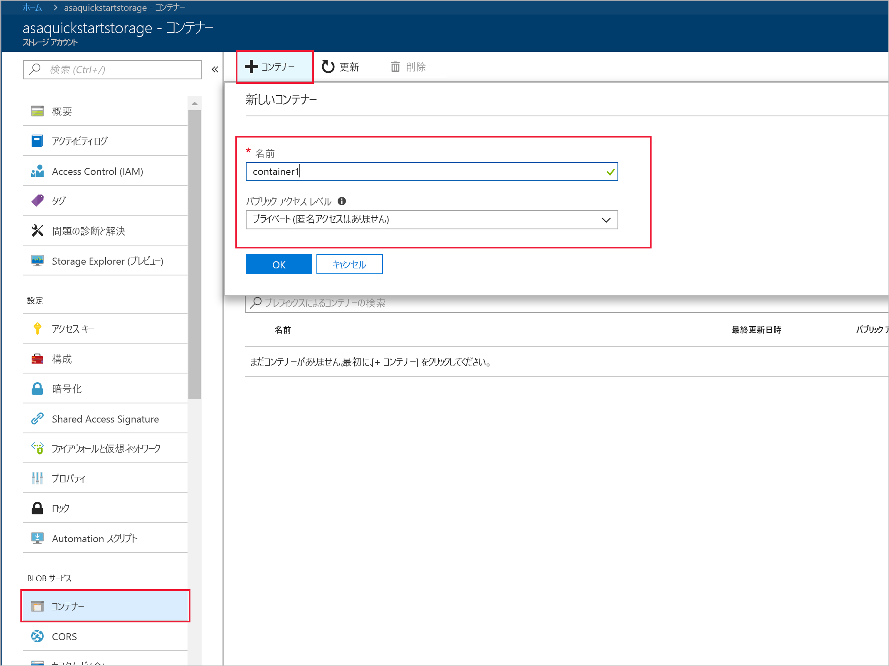
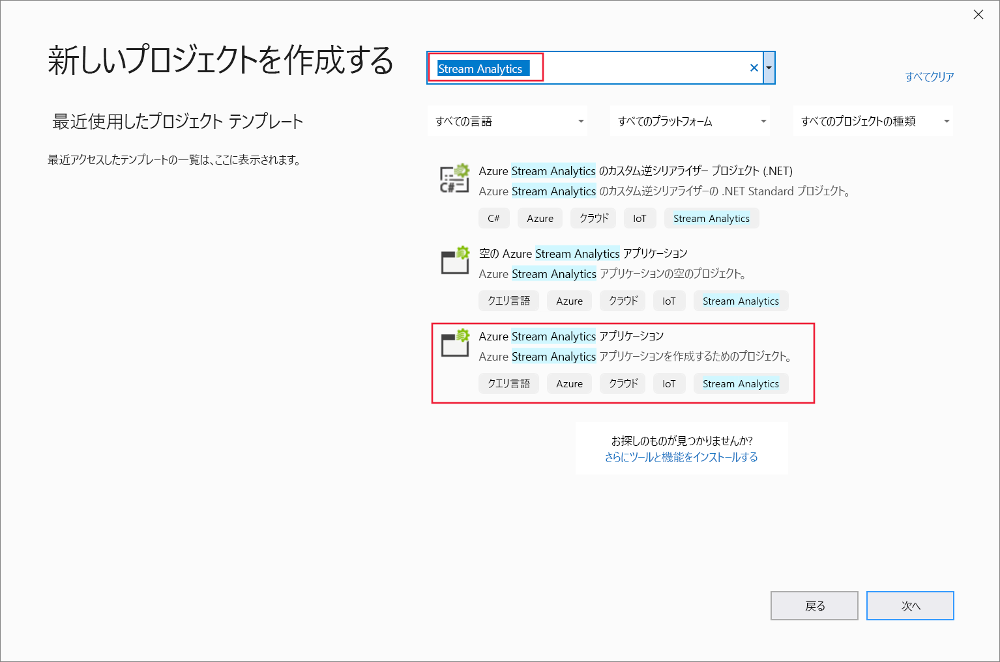
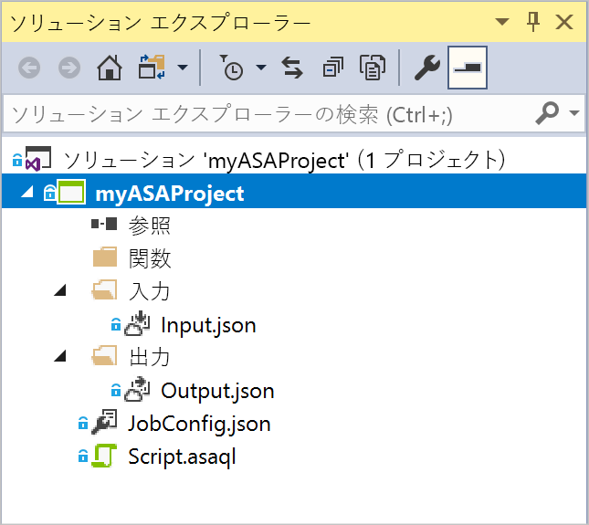
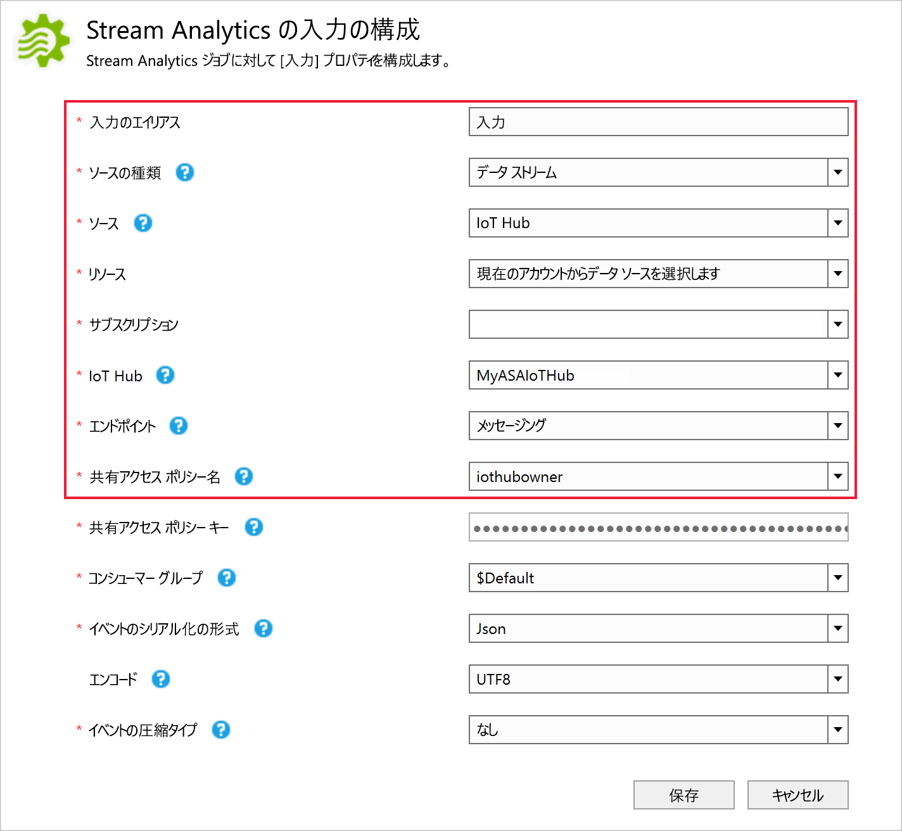
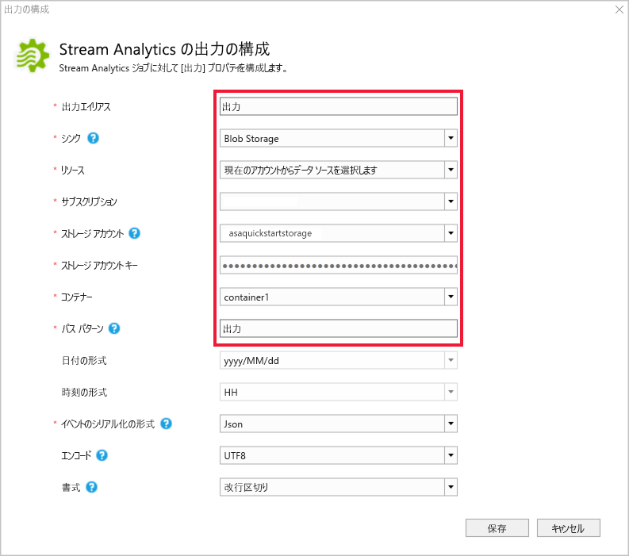
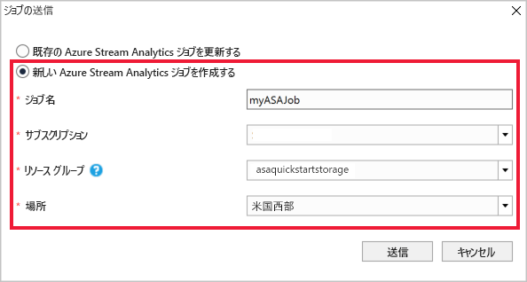
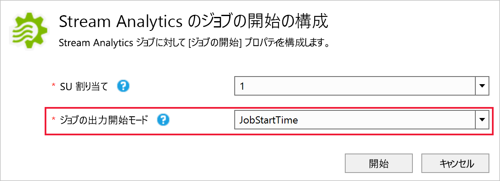
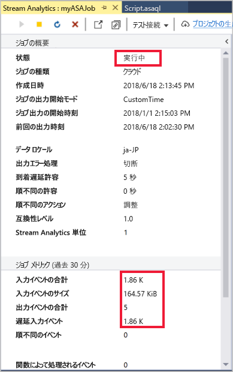

# <a name="quickstart-create-a-stream-analytics-job-by-using-the-azure-stream-analytics-tools-for-visual-studio"></a>クイック スタート: Visual Studio の Azure Stream Analytics ツールを使用した Stream Analytics ジョブの作成

このクイック スタートでは、Visual Studio の Azure Stream Analytics ツールを使用して Stream Analytics ジョブを作成および実行する方法を示します。 サンプル ジョブでは、Azure Blob Storage からストリーミング データを読み取ります。 このクイック スタートで使用される入力データ ファイルには、わかりやすくするために静的なデータが含まれています。 実際のシナリオでは、Stream Analytics ジョブの入力データをストリーミングします。 このクイック スタートでは、100°を超えるときに平均温度を計算し、結果の出力イベントを新しいファイルに書き込むジョブを定義します。

## <a name="before-you-begin"></a>開始する前に

* Azure サブスクリプションをお持ちでない場合は、[無料アカウント](https://azure.microsoft.com/free/)を作成してください。

* [Azure Portal](https://portal.azure.com/) にサインインします。

* Visual Studio 2017、Visual Studio 2015、または Visual Studio 2013 Update 4 をインストールします。 Enterprise (Ultimate/Premium)、Professional、Community の各エディションがサポートされています。 Express エディションはサポートされていません。

* [インストール手順](https://docs.microsoft.com/azure/stream-analytics/stream-analytics-tools-for-visual-studio-install)に従って、Visual Studio の Stream Analytics ツールをインストールします。

## <a name="prepare-the-input-data"></a>入力データを準備する

Stream Analytics ジョブを定義する前に、ジョブへの入力として構成されるデータを準備する必要があります。 ジョブで必要な入力データを準備するには、次の手順を実行します。

1. GitHub から[サンプル センサー データ](https://raw.githubusercontent.com/Azure/azure-stream-analytics/master/Samples/GettingStarted/HelloWorldASA-InputStream.json)をダウンロードします。 サンプル データには、次の JSON 形式のセンサー情報が含まれています。  

   ```json
   {
     "time": "2018-01-26T21:18:52.0000000",
     "dspl": "sensorC",
     "temp": 87,
     "hmdt": 44
   }
   ```
2. [Azure Portal](https://portal.azure.com/) にサインインします。

3. Azure Portal の左上隅で、**[リソースの作成]** > **[ストレージ]** > **[ストレージ アカウント]** の順に選択します。 ストレージ アカウント ジョブのページで、**[名前]** を "asaquickstartstorage" に、**[場所]** を "米国西部" に、**[リソース グループ]** を "asaquickstart-resourcegroup" に設定するよう入力します (パフォーマンスを高めるために、ストリーミング ジョブと同じリソース グループ内のストレージ アカウントをホストします)。 その他の設定は既定値のままにします。  

   ![[ストレージ アカウントの作成]](./media/stream-analytics-quick-create-vs/create-a-storage-account-vs.png)

4. **[すべてのリソース]** ページで、前の手順で作成したストレージ アカウントを特定します。 **[概要]** ページを開き、**[BLOB]** タイルを開きます。  

5. **[Blob service]** ページで、**[コンテナー]** を選択し、コンテナーに**名前**を付けます (たとえば、*container1*)。次に、**[OK]** を選択します。  

   

6. 前の手順で作成したコンテナーに移動します。 **[アップロード]** を選択して、最初の手順で取得したセンサー データをアップロードします。  

   

## <a name="create-a-stream-analytics-project"></a>Stream Analytics プロジェクトを作成する

1. Visual Studio を起動します。

2. **[ファイル] > [新しいプロジェクト]** を選択します。  

3. 左側のテンプレートの一覧で **[Stream Analytics]** を選択し、**[Azure Stream Analytics アプリケーション]** を選択します。  

4. プロジェクトの**名前**、**場所**、および**ソリューション名**を入力し、**[OK]** を選択します。

   

Azure Stream Analytics プロジェクトに含まれる要素に注目してください。

   


## <a name="choose-the-required-subscription"></a>必要なサブスクリプションを選択する

1. Visual Studio の **[表示]** メニューで **[サーバー エクスプローラー]** を選択します。

2. **[Azure]** を右クリックし、**[Connect to Microsoft Azure Subscription]\(Microsoft Azure サブスクリプションへの接続\)** を選択します。その後、Azure アカウントでサインインします。

## <a name="define-input"></a>入力を定義する

1. **ソリューション エクスプローラー**で **[入力]** ノードを展開し、**[Input.json]** をダブルクリックします。

2. **[Stream Analytics Input Configuration]\(Stream Analytics 入力構成\)** で、次の値を入力します。

   |**設定**  |**推奨値**  |**説明**   |
   |---------|---------|---------|
   |入力のエイリアス  |  入力   |  ジョブの入力を識別する名前を入力します。   |
   |ソースの種類   |  データ ストリーム |  適切な入力ソース ([データ ストリーム] または [参照データ]) を選択します。   |
   |ソース  |  Blob Storage |  適切な入力ソースを選択します。   |
   |Resource  | 現在のアカウントからデータ ソースを選択します | 手動でデータを入力するか、既存のアカウントを選択するかを選択します。   |
   |サブスクリプション  |  \<該当するサブスクリプション\>   | 作成したストレージ アカウントを持っている Azure サブスクリプションを選択します。 ストレージ アカウントは、同じサブスクリプションにある場合も、別のサブスクリプションにある場合もあります。 この例では、同じサブスクリプションにストレージ アカウントを作成したと想定しています。   |
   |ストレージ アカウント  |  asaquickstartstorage   |  ストレージ アカウントの名前を選択するか、入力します。 ストレージ アカウントが同じサブスクリプション内に作成されている場合、ストレージ アカウント名は自動的に検出されます。   |
   |コンテナー  |  container1   |  ストレージ アカウントで作成した既存のコンテナーを選択します。   |
   
3. 他のオプションは既定値のままにして、**[保存]** を選択し、設定を保存します。  

   

## <a name="define-output"></a>出力の定義

1. **ソリューション エクスプローラー**で **[出力]** ノードを展開し、**[Output.json]** をダブルクリックします。

2. **[Stream Analytics Output Configuration]\(Stream Analytics 出力構成\)** で、次の値を入力します。

   |**設定**  |**推奨値**  |**説明**   |
   |---------|---------|---------|
   |出力のエイリアス  |  出力   |  ジョブの出力を識別する名前を入力します。   |
   |シンク   |  Blob Storage |  適切なシンクを選択します。    |
   |Resource  |  データ ソース設定を手動で提供します |  手動でデータを入力するか、既存のアカウントを選択するかを選択します。   |
   |サブスクリプション  |  \<該当するサブスクリプション\>   | 作成したストレージ アカウントを持っている Azure サブスクリプションを選択します。 ストレージ アカウントは、同じサブスクリプションにある場合も、別のサブスクリプションにある場合もあります。 この例では、同じサブスクリプションにストレージ アカウントを作成したと想定しています。   |
   |ストレージ アカウント  |  asaquickstartstorage   |  ストレージ アカウントの名前を選択するか、入力します。 ストレージ アカウントが同じサブスクリプション内に作成されている場合、ストレージ アカウント名は自動的に検出されます。   |
   |コンテナー  |  container1   |  ストレージ アカウントで作成した既存のコンテナーを選択します。   |
   |パスのパターン  |  output   |  コンテナー内に作成するファイル パスの名前を入力します。   |
   
3. 他のオプションは既定値のままにして、**[保存]** を選択し、設定を保存します。  

   

## <a name="define-the-transformation-query"></a>変換クエリを定義する

1. Visual Studio の**ソリューション エクスプローラー**から **Script.asaql** を開きます。

2. 次のクエリを追加します。

   ```sql
   SELECT 
   System.Timestamp AS OutputTime,
   dspl AS SensorName,
   Avg(temp) AS AvgTemperature
   INTO
     Output
   FROM
     Input TIMESTAMP BY time
   GROUP BY TumblingWindow(second,30),dspl
   HAVING Avg(temp)>100
   ```

## <a name="submit-a-stream-analytics-query-to-azure"></a>Stream Analytics クエリを Azure に送信する

1. **クエリ エディター**で、スクリプト エディターの **[Azure に送信]** を選択します。

2. **[新しい Azure Stream Analytics ジョブを作成する]** を選択し、**ジョブ名**を入力します。 クイック スタートの最初に使用した**サブスクリプション**、**リソース グループ**、および**場所**を選択します。

   

## <a name="start-the-stream-analytics-job-and-check-output"></a>Stream Analytics ジョブを開始して出力を確認する

1. ジョブが作成されると、ジョブ ビューが自動的に開きます。 緑色の矢印ボタンを選択して、ジョブを開始します。

   

2. 日付の **[ユーザー設定時刻]** を `2018-01-01` に変更し、**[開始]** を選択します。

   

3. ジョブの状態が **[実行中]** に変わり、入力/出力イベントが表示されることに注目してください。 これには数分かかることがあります。

   

4. 結果を表示するには、**[表示]** メニューで **[Cloud Explorer]** を選択し、リソース グループ内のストレージ アカウントに移動します。 **[BLOB コンテナー]** で、**[container1]** をダブルクリックし、**[出力]** ファイル パスをダブルクリックします。

   

## <a name="clean-up-resources"></a>リソースのクリーンアップ

リソース グループ、ストリーミング ジョブ、および関連するすべてのリソースは、不要になったら削除します。 ジョブを削除すると、ジョブによって消費されるストリーミング ユニットに対する課金を回避することができます。 ジョブを後で使用する計画がある場合は、ジョブを停止し、必要なときに再起動することができます。 このジョブの使用を続けない場合は、以下の手順に従って、このクイック スタートで作成したすべてのリソースを削除してください。

1. Azure Portal の左側のメニューで **[リソース グループ]** を選択し、作成したリソースの名前を選択します。  

2. リソース グループのページで **[削除]** を選択し、削除するリソースの名前をテキスト ボックスに入力してから **[削除]** を選択します。

## <a name="next-steps"></a>次の手順

このクイック スタートでは、単純な Stream Analytics ジョブを展開しました。 その他の入力ソースの構成やリアルタイム検出の実行について学習するには、次の記事に進んでください。

> [!div class="nextstepaction"]
> [Azure Stream Analytics を使用したリアルタイムの不正行為の検出](stream-analytics-real-time-fraud-detection.md)
