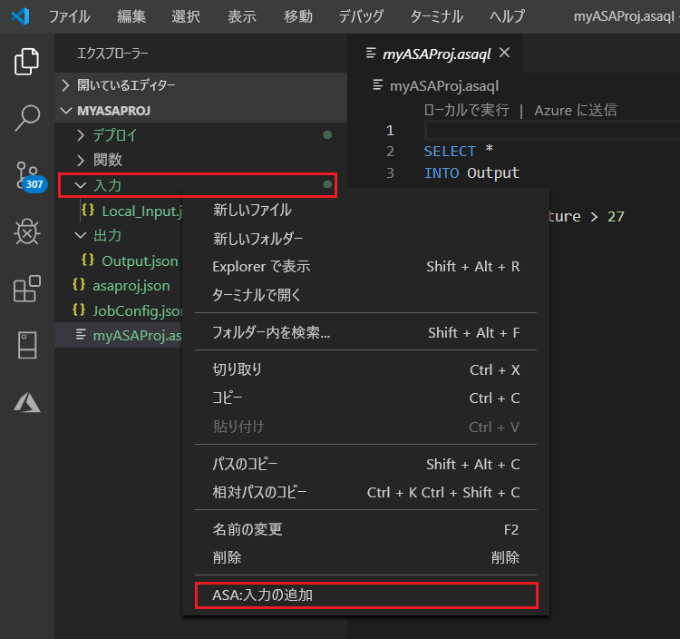
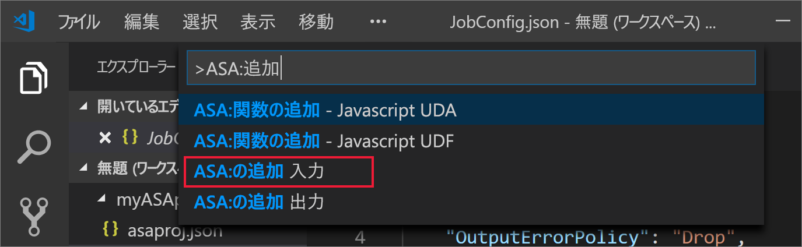
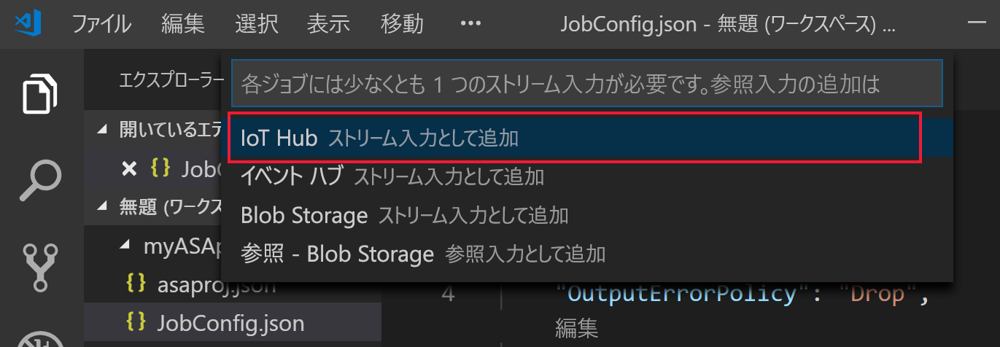
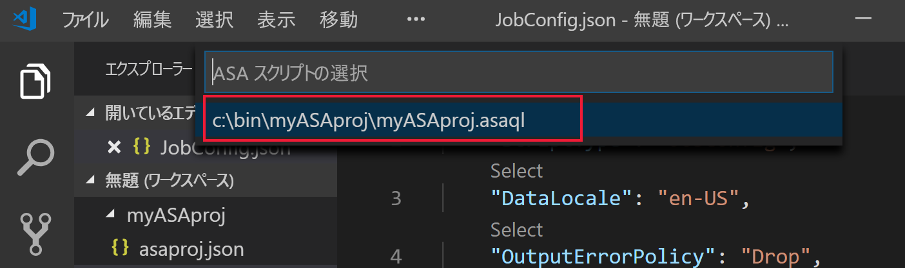
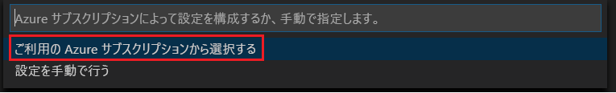
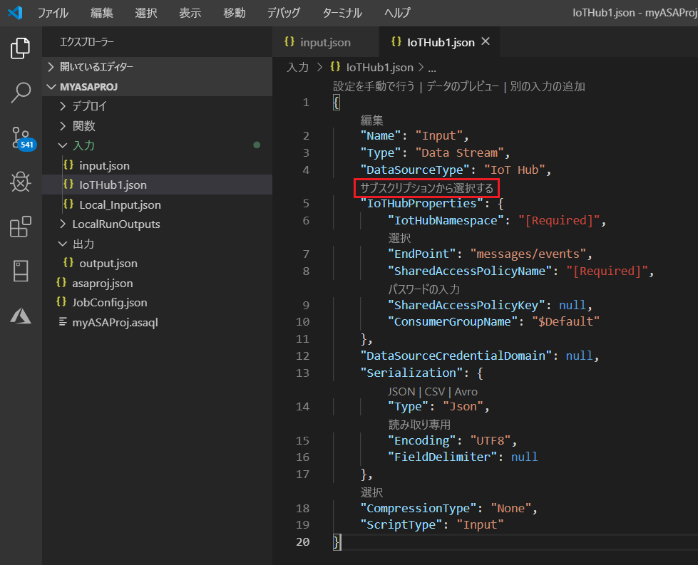
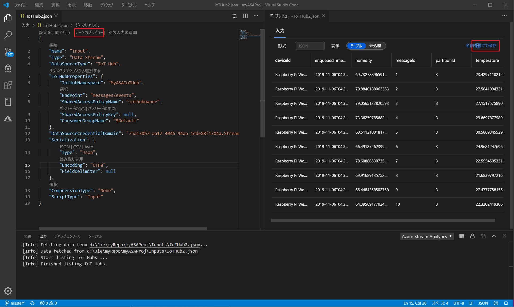

# Visual Studio Code を使用してライブ ストリーム入力に対して Stream Analytics クエリをローカルでテストする

Visual Studio Code の Azure Stream Analytics ツールを使用して、Stream Analytics ジョブをライブ ストリーム入力に対してローカルでテストすることができます。 入力は、Azure Event Hubs や Azure IoT Hub などのソースから取得できます。 出力結果は、プロジェクト内の **LocalRunOutputs** という名前のフォルダーに JSON ファイルとして送信されます。

## 前提条件

* [.NET Core SDK](https://dotnet.microsoft.com/download) をインストールし、Visual Studio Code を再起動します。

* この[クイックスタート](quick-create-vs-code.md)を使用して、Visual Studio Code を使って Stream Analytics ジョブを作成する方法を学習します。

## ライブ ストリーム入力を定義する

1. Stream Analytics プロジェクトの **[Inputs]** フォルダーを右クリックします。 次に、コンテキスト メニューから **[ASA: 入力の追加]** を選択します。

   

   または、**Ctrl + Shift + P** キーを選択してコマンド パレットを開き、 **[ASA: 入力の追加]** を入力します。

   

2. ドロップダウン リストから入力ソースの種類を選択します。

   

3. コマンド パレットから入力を追加した場合は、その入力を使用する Stream Analytics クエリ スクリプトを選択します。 **myASAproj.asaql** へのファイル パスが自動的に入力されます。

   

4. ドロップダウン メニューで **[Select from your Azure Subscriptions]\(自分の Azure サブスクリプションから選択\)** を選択します。

    

5. 新しく生成された JSON ファイルを構成します。 CodeLens 機能を使用すると、文字列の入力、ドロップダウン リストからの選択、テキストの変更をファイル内で直接行うことができます。 次のスクリーンショットは、例として **[Select from your Subscriptions]\(自分のサブスクリプションから選択\)** を示しています。

   

## 入力をプレビューする

入力データが表示されるのを確認するには、ライブ入力構成ファイルの一番上の行から **[Preview data]\(データのプレビュー\)** を選択します。 一部の入力データが IoT Hub から取得され、プレビュー ウィンドウに表示されます。 プレビューが表示されるまでには数秒かかる場合があります。

 

## ローカルでのクエリの実行

クエリ エディターに戻り、 **[ローカルで実行]** を選択します。 次に、ドロップダウン リストから **[Use Live Input]\(ライブ入力の使用\)** を選択します。

![クエリ エディターで [Run locally]\(ローカルで実行\) を選択する](./media/vscode-local-run/run-locally.png)

![[Use Live Input]\(ライブ入力を使用\) を選択する](./media/vscode-local-run-live-input/run-locally-use-live-input.png)

右側のウィンドウに結果が表示され、3 秒ごとに最新の情報に更新されます。 **[実行]** を選択して、もう一度テストすることができます。 **[フォルダーで開く]** を選択して、エクスプローラーで結果ファイルを表示し、Visual Studio Code や Excel のようなツールで開くこともできます。 結果ファイルは JSON 形式でのみ使用できることに注意してください。

出力の作成を開始するジョブの既定の時刻は、 **[Now]\(今すぐ\)** に設定されています。 この時刻は、結果ウィンドウの **[Output start time]\(出力の開始時刻\)** ボタンを選択してカスタマイズできます。

## 次のステップ

* [Visual Studio Code で使用する Azure Stream Analytics ジョブの詳細 (プレビュー)](visual-studio-code-explore-jobs.md)

* [npm パッケージを使用して CI/CD パイプラインを設定する](setup-cicd-vs-code.md)
