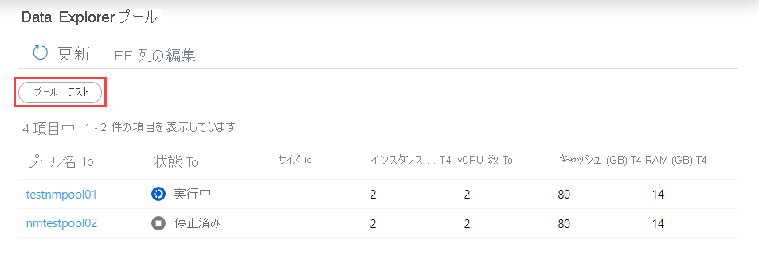

# クイックスタート: Synapse Studio を使用して Data Explorer プールを監視する (プレビュー)

Azure Synapse Analytics では、Data Explorer を使用して、ワークスペース内の Data Explorer プールでクエリ、ダッシュボードなどを実行できます。

この記事では、Data Explorer プールを監視する方法について説明します。この方法により、さまざまなワークスペース ユーザーによって使用中の仮想コアの数を含め、プールの状態を監視することができます。

## Data Explorer プールの一覧にアクセスする

ワークスペースで Data Explorer プールの一覧を表示するには、最初に [Synapse Studio を開き](https://web.azuresynapse.net/)、ワークスペースを選択します。

ワークスペースを開いたら、左側の **[監視]** セクションを選択します。

![[監視] ハブを選択する](../monitoring/media/common/left-nav.png)

Data Explorer プールの一覧を表示するには、 **[Data Explorer pools]\(Data Explorer プール\)** を選択します。

## Data Explorer プールをフィルター処理する

Data Explorer プールの一覧をフィルター処理して、関心のあるものに絞ることができます。 画面の上部にあるフィルターを使用して、フィルター処理を行うフィールドを指定できます。

たとえば、ビューをフィルター処理して、"test" という名前を含む Data Explorer プールのみを表示することができます。

## 特定の Data Explorer プールに関する詳細を表示する

Data Explorer プールのいずれか 1 つの詳細を表示するには、詳細を表示する Data Explorer プールを選択します。

