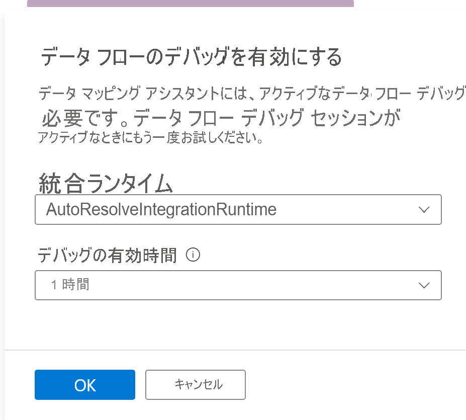
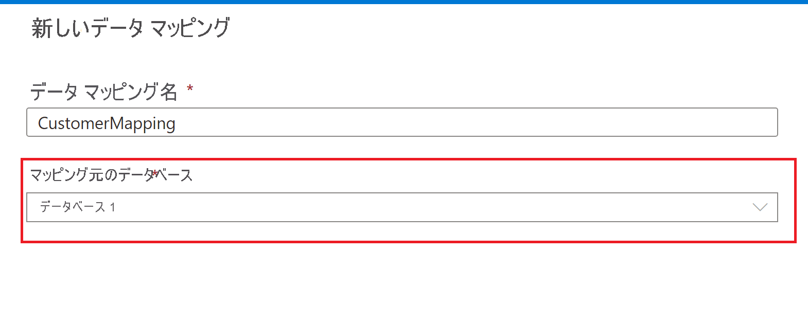

# Azure Synapse Analytics でデータをマッピングする

## Map Data (データのマッピング) ツールとは

Map Data (データのマッピング) ツールは、ユーザーがコードを書くことなく、ソース データから Synapse Lake データベースのテーブルへの ETL マッピングやマッピング データ フローを作成するために使用できる、ガイド付きのプロセスです。 このプロセスは、ユーザーが Synapse Lake データベースの変換先テーブルを選択し、ソース データをこれらのテーブルにマッピングすることから始まります。 

Synapse Lake データベースの詳細については、[Azure Synappse データベース テーブルの概要 - Azure Synapse Analytics | Microsoft Docs](overview-database-templates.md) に関するページを参照してください

Map Data (データのマッピング) を使用すると、ユーザーはガイド付きのエクスペリエンスにより、キャンバスを 1 から始めなくてもマッピング データ フローを生成できるため、Synapse パイプラインで実行できる、スケーラブルなマッピング データ フローを迅速に生成できます。

> [!NOTE] 
> Synapse Analytics パイプラインの Map Data (データのマッピング) 機能は、現在パブリック プレビュー中です

## 作業の開始

Map Data (データのマッピング) ツールは、Synapse Lake データベース エクスペリエンス内から起動します。 ここから、Map Data (データのマッピング) ツールを選択してプロセスを開始します。 

Map Data (データのマッピング) を利用するには、データのプレビューやソース ファイルのスキーマを読み取るための計算能力が必要です。 セッションで初めて Map Data (データのマッピング) を使用する場合は、クラスターをウォームアップする必要があります。

まず、Lake データベース テーブルにマップするデータ ソースを選択します。 現在サポートされているデータ ソースは、Azure Data Lake Storage Gen 2 および Synapse Lake データベースです。

### 選択できるファイルの種類
Azure Data Lake Storage Gen 2 などのファイル ストアを選択する場合は、次のファイルの種類がサポートされます。

* Common Data Model
* 区切りテキスト
* Parquet

## データ マッピングを作成する
データ マッピングに名前を付け、Synapse Lake データベースの変換先を選択します。

## ソースからターゲットへのマッピング
Synapse Lake データベースの変換先テーブルにマップするプライマリ ソース テーブルを選択します。

### 新しいマッピング
[New Mapping]\(新しいマッピング\) ボタンを使用して、マッピングまたは変換を作成するマッピング メソッドを追加します。

### その他のソース
マッピングに他のソースを結合および追加するには、[Additional source]\(追加のソース\) ボタンを使用します。

### データのプレビュー
**[データのプレビュー]** タブには、各変換のデータの対話型スナップショットが表示されます。 詳細については、[デバッグ モードでのデータのプレビュー](../../data-factory/concepts-data-flow-debug-mode.md#data-preview)に関するセクションを参照してください。

### マッピング メソッド

次のマッピング メソッドがサポートされています。

* [直接](../../data-factory/data-flow-select.md)
* [代理キー](../../data-factory/data-flow-surrogate-key.md)
* [Lookup](../../data-factory/data-flow-lookup.md)
* [ピボット解除](../../data-factory/data-flow-unpivot.md)
* [集計](../../data-factory/data-flow-aggregate.md)
    * SUM
    * 最小値
    * 最大値
    * First (先頭へ)
    * Last (最後へ)
    * 標準偏差
    * Average
    * 平均
* [[派生列]](../../data-factory/data-flow-derived-column.md)
    * Trim
    * Upper
    * 低
    * 上級 

## パイプラインの作成

Map Data (データのマッピング) による変換が完了したら、[Create pipeline]\(パイプラインの作成\) ボタンを選択してマッピング データ フローとパイプラインを生成し、変換をデバッグして実行します。