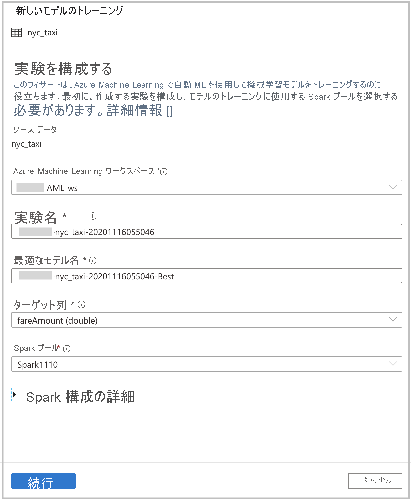
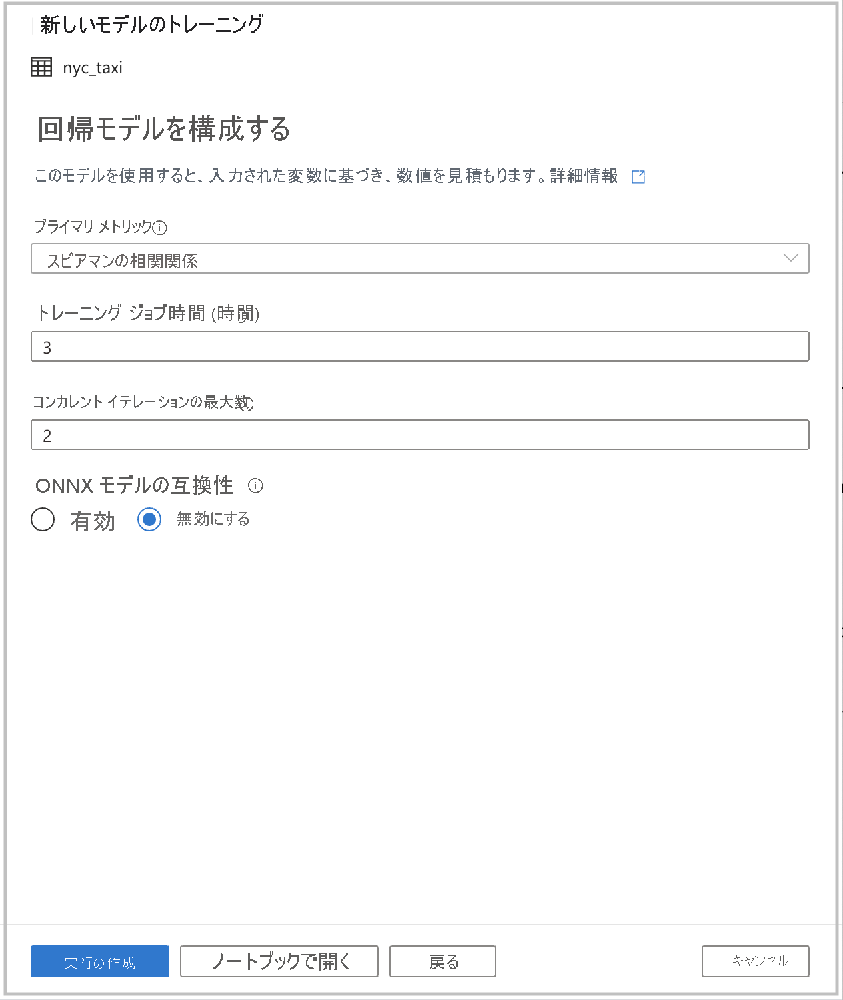
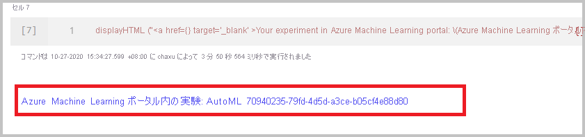

# チュートリアル:コードなしで機械学習モデルをトレーニングする

[自動機械学習](../../machine-learning/concept-automated-ml.md)を使用してトレーニングする新しい機械学習モデルによって、Spark テーブルのデータをエンリッチすることができます。 Azure Synapse Analytics では、機械学習モデルを構築するためのトレーニング データセットとして使用する Spark テーブルをワークスペースで選択できます。この作業にコーディングは必要ありません。

このチュートリアルでは、Synapse Studio のコード不要のエクスペリエンスを使用して機械学習モデルをトレーニングする方法について説明します。 Synapse Studio は Azure Synapse Analytics の機能です。 

手動でコーディングするのではなく、Azure Machine Learning の自動機械学習を使用します。 トレーニングするモデルの種類は、解決しようとしている問題によって異なります。

Azure サブスクリプションをお持ちでない場合は、[開始する前に無料アカウントを作成](https://azure.microsoft.com/free/)してください。

## 前提条件

- [Azure Synapse Analytics ワークスペース](../get-started-create-workspace.md)。 Azure Data Lake Storage Gen2 ストレージ アカウントが既定のストレージとして構成されていることを確認します。 必ず、Data Lake Storage Gen2 ファイル システムの *Storage Blob データ共同作成者* として作業してください。
- Azure Synapse Analytics ワークスペースの Apache Spark プール。 詳細については、「[クイック スタート:Synapse Studio を使用して専用 SQL プールを作成する](../quickstart-create-sql-pool-studio.md)」をご覧ください。
- Azure Synapse Analytics ワークスペースの Azure Machine Learning のリンクされたサービス。 詳細については、「[クイック スタート:Azure Synapse Analytics での Azure Machine Learning のリンクされたサービスの新規作成](quickstart-integrate-azure-machine-learning.md)。

## Azure portal にサインインする

[Azure portal](https://portal.azure.com/) にサインインします。

## トレーニング データセットの Spark テーブルを作成する

このチュートリアルには Spark テーブルが必要です。 次のノートブックで作成します。

1. ノートブック [Create-Spark-Table-NYCTaxi- Data.ipynb](https://go.microsoft.com/fwlink/?linkid=2149229) をダウンロードします。

1. ノートブックを Synapse Studio にインポートします。
![[インポート] オプションが強調表示された Azure Synapse Analytics のスクリーンショット。](media/tutorial-automl-wizard/tutorial-automl-wizard-00a.png)

1. 使用する Spark プールを選択し、 **[すべて実行]** を選択します。 この手順により、開いているデータセットからニューヨークのタクシー データが取得され、既定の Spark データベースに保存されます。
![Azure Synapse Analytics のスクリーンショット。[すべて実行] と Spark データベースが強調表示されています。](media/tutorial-automl-wizard/tutorial-automl-wizard-00b.png)

1. ノートブックの実行が完了すると、既定の Spark データベースの下に新しい Spark テーブルが表示されます。 **[データ]** から **nyc_taxi** という名前のテーブルを探します。
![新しいテーブルが強調表示された、Azure Synapse Analytics の [データ] タブのスクリーンショット。](media/tutorial-automl-wizard/tutorial-automl-wizard-00c.png)

## 自動機械学習ウィザードを開く

ウィザードを開くには、次の手順を実行します。

1. 前の手順で作成した Spark テーブルを右クリックします。 **[Machine Learning]**  >  **[Enrich with new model]\(新しいモデルを使用してエンリッチ\)** の順に選択します。
![Spark テーブルのスクリーンショット。[Machine Learning] と [Enrich with new model]\(新しいモデルを使用してエンリッチ\) が強調表示されています。](media/tutorial-automl-wizard/tutorial-automl-wizard-00d.png)

1. Azure Machine Learning での自動機械学習の実験実行を作成するための構成の詳細を指定します。 この実行により、複数のモデルがトレーニングされます。 実行が成功すると、最適なモデルが Azure Machine Learning モデル レジストリに登録されます。

   

    - **Azure Machine Learning ワークスペース**: 自動機械学習の実験の実行を作成するには、Azure Machine Learning ワークスペースが必要です。 また、[リンクされたサービス](quickstart-integrate-azure-machine-learning.md)を使用して、Azure Synapse Analytics ワークスペースを Azure Machine Learning ワークスペースにリンクする必要があります。 すべての前提条件を満たしたら、この自動実行に使用する Azure Machine Learning ワークスペースを指定できます。

    - **実験名**: 実験名を指定します。 自動機械学習の実行を送信するときは、実験名を指定します。 実行に関する情報は、Azure Machine Learning ワークスペースでその実験に保存されます。 このエクスペリエンスでは、新しい実験が既定で作成され、提案された名前が生成されますが、既存の実験の名前を指定することもできます。

    - **Best model name\(最適なモデル名\)** : 自動実行での最適なモデルの名前を指定します。 最適なモデルにはこの名前が付けられ、この実行の後に、Azure Machine Learning モデル レジストリに自動的に保存されます。 自動機械学習の実行によって、多数の機械学習モデルが作成されます。 後の手順で選択する主要メトリックに基づいて、それらのモデルを比較し、最適なモデルを選択できます。

    - **Target column\(ターゲット列\)** : モデルをトレーニングする際の予測対象です。 予測する列を選択します。 (このチュートリアルでは、ターゲット列として数値列の `fareAmount` を選択します。)

    - **Spark プール**: 自動実験実行に使用する Spark プールを指定します。 指定したプールに対して計算が実行されます。

    - **Spark configuration details\(Spark 構成の詳細\)** : Spark プールに加えて、セッション構成の詳細を指定するオプションもあります。

1. **[続行]** をクリックします。

## タスクの種類を選択する

答えようとしている質問に基づいて、実験の機械学習モデルの種類を選択します。 `fareAmount` がターゲット列であり、これは数値であるため、ここでは **[回帰]** を選択することをお勧めします。 その後 **[続行]** を選択します。

![[Enrich with new model]\(新しいモデルを使用してエンリッチ\) のスクリーンショット。[回帰] が強調表示されています。](media/tutorial-automl-wizard/tutorial-automl-wizard-configure-run-00b.png)

## 追加の構成

前のセクションで、モデルの種類として **[回帰]** または **[分類]** を選択した場合は、次の構成を使用できます。

- **Primary metric\(主要メトリック\)** : モデルのパフォーマンスを測定するメトリックを入力します。 このメトリックを使用して、自動実行で作成されたさまざまなモデルを比較し、パフォーマンスが最も高いモデルを特定します。

- **トレーニング ジョブ時間 (時間単位)** :実験でモデルを実行してトレーニングするときの最大時間 (時間単位) を指定します。 1 未満の値 (**0.5** など) を指定することもできます。

- **コンカレント イテレーションの最大数**:並列で実行するイテレーションの最大数を選択します。

- **ONNX model compatibility\(ONNX モデルの互換性\)** : このオプションを有効にすると、自動機械学習によってトレーニングされたモデルが ONNX 形式に変換されます。 これは、モデルを Azure Synapse Analytics SQL プールでのスコアリングに使用する場合に特に関連します。

これらの設定にはすべて、カスタマイズできる既定値があります。

必須の構成がすべて完了したら、自動実行を開始できます。 **[Create run]\(実行の作成\)** を選択すれば、コードなしで実行が直接開始されます。 代わりにコードを使用したい場合は、 **[Open in notebook]\(ノートブックで開く\)** を選択することができます。 このオプションを使用すると、実行を作成するコードを確認し、ノートブックを実行できます。

>[!NOTE]
>前のセクションで、モデルの種類として **[時系列の予測]** を選択した場合は、追加の構成を行う必要があります。 また、予測では、ONNX モデルの互換性はサポートされていません。

### 実行を直接作成する

自動機械学習の実行を直接開始するには、 **[Start Run]\(実行の開始\)** を選択します。 実行が開始されることを示す通知が表示されます。 その後、成功を示す別の通知が表示されます。 Azure Machine Learning で通知内のリンクを選択して状態を確認することもできます。

### ノートブックを使用して実行を作成する

ノートブックを生成するには、 **[Open In Notebook]\(ノートブックで開く\)** を選択します。 その後、 **[すべて実行]** を選択します。 これにより、自動機械学習の実行に設定を追加する機会も得られます。

![[すべて実行] が強調表示されたノートブックのスクリーンショット。](media/tutorial-automl-wizard/tutorial-automl-wizard-configure-run-00e.png)

実行が正常に送信されたら、ノートブックの出力に、Azure Machine Learning ワークスペースでの実験実行へのリンクが表示されます。 リンクを選択すると、Azure Machine Learning で自動実行を監視できます。

## 次の手順

- [チュートリアル:専用 SQL プール向けの機械学習モデル スコアリング ウィザード (プレビュー)](tutorial-sql-pool-model-scoring-wizard.md)
- [クイック スタート: Azure Synapse Analytics で Azure Machine Learning のリンクされたサービスを新規作成する](quickstart-integrate-azure-machine-learning.md)
- [Azure Synapse Analytics の機械学習機能](what-is-machine-learning.md)