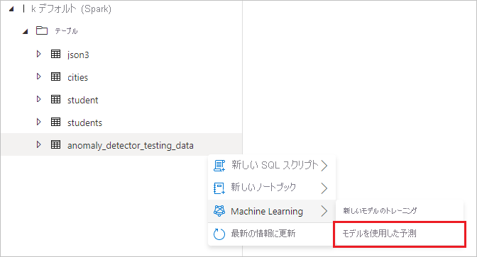
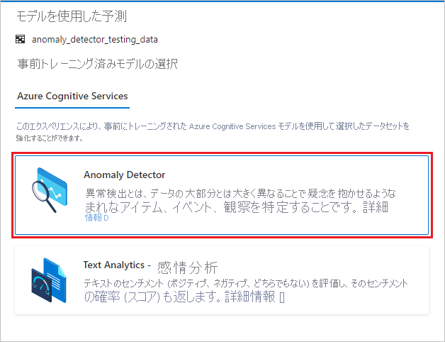
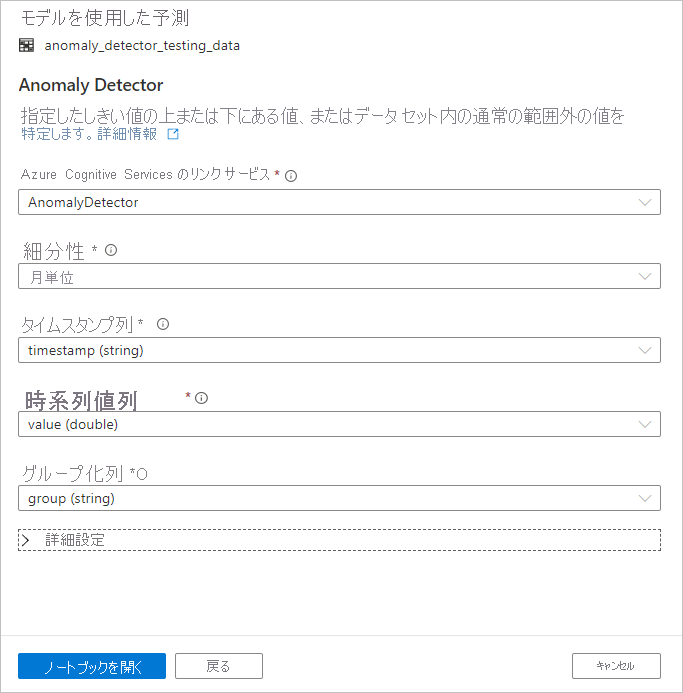

# チュートリアル:Cognitive Services を使用した異常検出

このチュートリアルでは、[Azure Cognitive Services](../../cognitive-services/index.yml) を使用して、Azure Synapse Analytics でデータを簡単に強化する方法について説明します。 [Anomaly Detector](../../cognitive-services/anomaly-detector/index.yml) を使用して異常を検出します。 Azure Synapse のユーザーは、異常を検出するために強化するテーブルを選択するだけです。

このチュートリアルの内容:

> [!div class="checklist"]
> - 時系列データを含む Spark テーブル データセットを取得するための手順。
> - Azure Synapse のウィザード エクスペリエンスを使用して、Cognitive Services で Anomaly Detector を使ってデータを強化する。

Azure サブスクリプションをお持ちでない場合は、[開始する前に無料アカウントを作成](https://azure.microsoft.com/free/)してください。

## 前提条件

- Azure Data Lake Storage Gen2 ストレージ アカウントが既定のストレージとして構成されている [Azure Synapse Analytics ワークスペース](../get-started-create-workspace.md)。 使用する Data Lake Storage Gen2 ファイル システムの "*Storage Blob データ共同作成者*" である必要があります。
- Azure Synapse Analytics ワークスペースの Spark プール。 詳細については、[Azure Synapse での Spark プールの作成](../quickstart-create-sql-pool-studio.md)に関する記事を参照してください。
- [Azure Synapse での Cognitive Services の構成](tutorial-configure-cognitive-services-synapse.md)に関するチュートリアルの事前構成手順を完了します。

## Azure portal にサインインする

[Azure portal](https://portal.azure.com/) にサインインします。

## Spark テーブルを作成する

このチュートリアルには Spark テーブルが必要です。

1. Spark テーブルを生成するコードを含むノートブック ファイル ([prepare_anomaly_detector_data.ipynb](https://go.microsoft.com/fwlink/?linkid=2149577)) をダウンロードします。

1. このファイルをご利用の Azure Synapse ワークスペースにアップロードします。

   

1. ノートブック ファイルを開き、 **[すべて実行]** を選択してすべてのセルを実行します。

   

1. **anomaly_detector_testing_data** という名前の Spark テーブルが既定の Spark データベースに表示されます。

## Cognitive Services ウィザードを開く

1. 前の手順で作成した Spark テーブルを右クリックします。 **[機械学習]**  >  **[モデルを使用した予測]** を選択し、ウィザードを開きます。

   

2. 構成パネルが表示され、Cognitive Services モデルを選択するよう求められます。 **[Anomaly Detector]** を選択します。

   

## Anomaly Detector を構成する

次の詳細を指定して、Anomaly Detector を構成します。

- **Azure Cognitive Services のリンク サービス**: 前提条件の手順の一部として、[Cognitive Services](tutorial-configure-cognitive-services-synapse.md) へのリンク サービスを作成しました。 それをここで選択します。

- **[細分性]** : データがサンプリングされる速度。 **[monthly]\(月単位\)** を選択します。 

- **[Timestamp column]\(タイムスタンプ列\)** : 系列の時間を表す列。 **[timestamp (string)]\(timestamp (文字列)\)** を選択します。

- **[Time series value column]\(時系列値列\)** : [Timestamp column]\(タイムスタンプ列\) で指定した時間における系列の値を表す列。 **[value (double)]** を選択します。

- **[Grouping column]\(グループ化列\)** : 系列をグループ化する列。 つまり、この列に同じ値を含むすべての行は 1 つの時系列を形成します。 **[group (string)]\(group (文字列)\)** を選択します。

完了したら、 **[Open notebook]\(ノートブックを開く\)** を選択します。 これにより、Azure Cognitive Services を使用して異常を検出する PySpark コードを含むノートブックが生成されます。

## ノートブックを実行する

先ほど開いたノートブックでは、[SynapseML ライブラリ](https://github.com/microsoft/SynapseML)を使用して Cognitive Services に接続します。 指定した Azure Cognitive Services のリンク サービスを使用すると、シークレットを開示することなく、このエクスペリエンスからコグニティブ サービスを安全に参照できます。

これで、すべてのセルを実行して異常検出を実行できるようになりました。 **[すべて実行]** を選択します。 [Cognitive Services の Anomaly Detector の詳細をご覧ください](../../cognitive-services/anomaly-detector/index.yml)。

## 次の手順

- [チュートリアル: Azure Cognitive Services を使用した感情分析](tutorial-cognitive-services-sentiment.md)
- [チュートリアル: Azure Synapse 専用 SQL プールでの機械学習モデルのスコアリング](tutorial-sql-pool-model-scoring-wizard.md)
- [Azure Synapse Analytics の機械学習機能](what-is-machine-learning.md)
