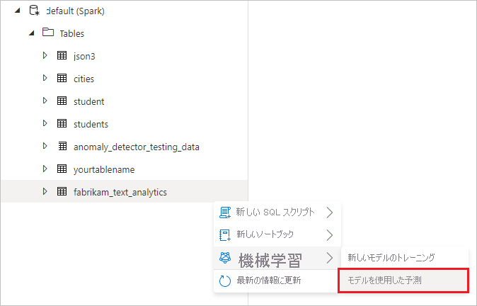
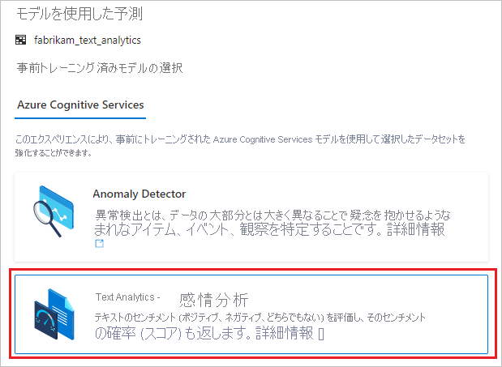
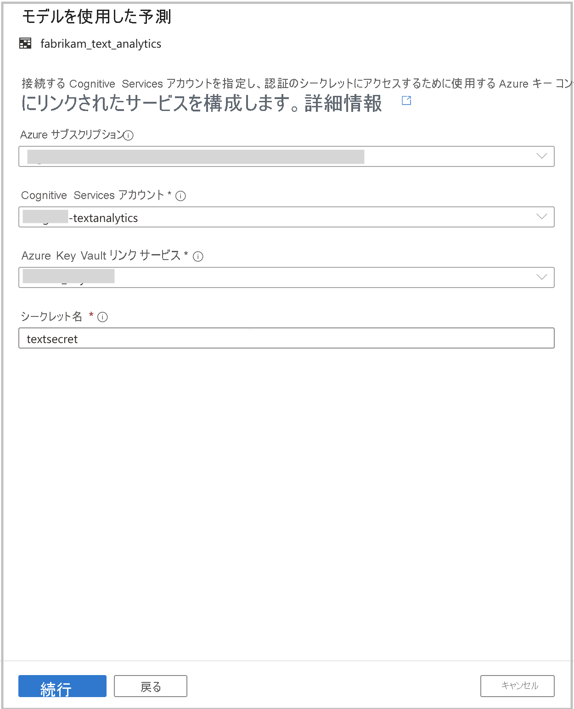
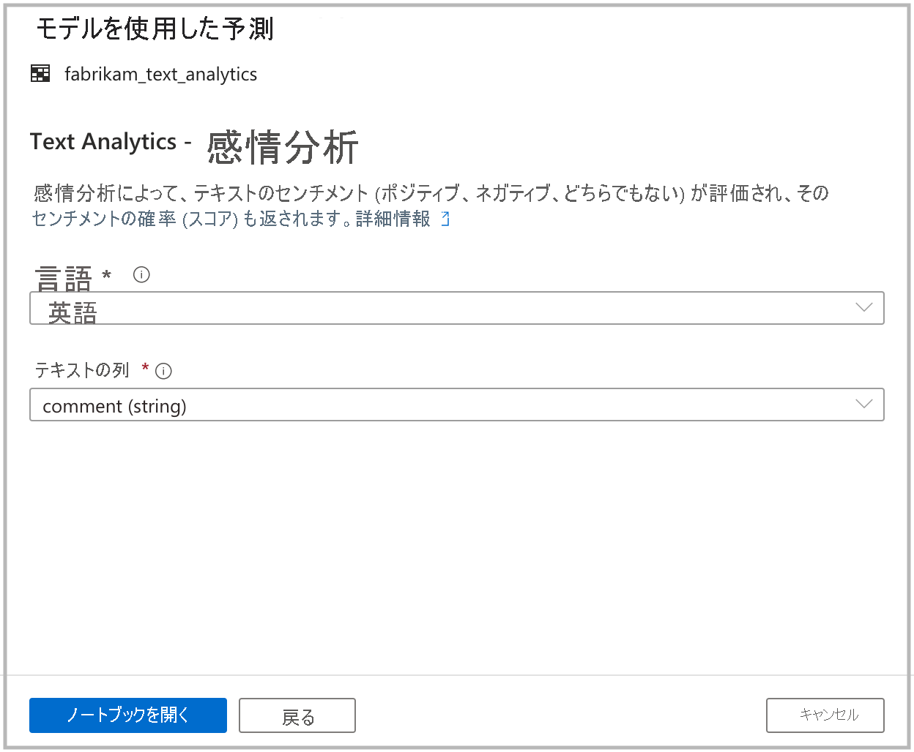

# <a name="tutorial-sentiment-analysis-with-cognitive-services-preview"></a>チュートリアル:Cognitive Services を使用した感情分析 (プレビュー)

このチュートリアルでは、[Azure Cognitive Services](../../cognitive-services/index.yml) を使用して、Azure Synapse Analytics でデータを簡単に強化する方法について説明します。 [Text Analytics](../../cognitive-services/text-analytics/index.yml) の機能を使用して感情分析を実行します。 

Azure Synapse のユーザーは、センチメントを使用して強化するテキスト列を含むテーブルを選択するだけで済みます。 これらのセンチメントは、positive (ポジティブ)、negative (ネガティブ)、mixed (混合)、neutral (中立) のいずれかになります。 確率も返されます。

このチュートリアルの内容:

> [!div class="checklist"]
> - 感情分析用のテキスト列を含む Spark テーブル データセットを取得するための手順。
> - Azure Synapse のウィザード エクスペリエンスを使用して、Cognitive Services で Text Analytics を使ってデータを強化します。

Azure サブスクリプションをお持ちでない場合は、[開始する前に無料アカウントを作成](https://azure.microsoft.com/free/)してください。

## <a name="prerequisites"></a>前提条件

- Azure Data Lake Storage Gen2 ストレージ アカウントが既定のストレージとして構成されている [Azure Synapse Analytics ワークスペース](../get-started-create-workspace.md)。 使用する Data Lake Storage Gen2 ファイル システムの "*Storage Blob データ共同作成者*" である必要があります。
- Azure Synapse Analytics ワークスペースの Spark プール。 詳細については、[Azure Synapse での Spark プールの作成](../quickstart-create-sql-pool-studio.md)に関する記事を参照してください。
- [Azure Synapse での Cognitive Services の構成](tutorial-configure-cognitive-services-synapse.md)に関するチュートリアルで説明されている事前構成手順。

## <a name="sign-in-to-the-azure-portal"></a>Azure portal にサインインする

[Azure portal](https://portal.azure.com/) にサインインします。

## <a name="create-a-spark-table"></a>Spark テーブルを作成する

このチュートリアルには Spark テーブルが必要です。

1. テキスト分析用のデータセットが含まれた [FabrikamComments.csv](https://github.com/Kaiqb/KaiqbRepo0731190208/blob/master/CognitiveServices/TextAnalytics/FabrikamComments.csv) ファイルをダウンロードします。 

1. このファイルを Data Lake Storage Gen2 の Azure Synapse ストレージ アカウントにアップロードします。
  
   

1. .csv ファイルを右クリックし、 **[新しいノートブック]**  >  **[Spark テーブルの作成]** を選択して、このファイルから Spark テーブルを作成します。

   

1. コード セルでテーブルに名前を付け、Spark プールでノートブックを実行します。 必ず `header=True` を設定してください。

   

   ```python
   %%pyspark
   df = spark.read.load('abfss://default@azuresynapsesa.dfs.core.windows.net/data/FabrikamComments.csv', format='csv'
   ## If a header exists, uncomment the line below
   , header=True
   )
   df.write.mode("overwrite").saveAsTable("default.YourTableName")
   ```

## <a name="open-the-cognitive-services-wizard"></a>Cognitive Services ウィザードを開く

1. 前の手順で作成した Spark テーブルを右クリックします。 **[Machine Learning]**  >  **[Enrich with existing model]\(既存のモデルを使用して強化\)** を選択してウィザードを開きます。

   

2. 構成パネルが表示され、Cognitive Services モデルを選択するよう求められます。 **[Text analytics - Sentiment Analysis]\(テキスト分析 - 感情分析\)** を選択します。

   

## <a name="provide-authentication-details"></a>認証の詳細を指定する

Cognitive Services に対して認証するには、キー コンテナーのシークレットを参照する必要があります。 次の入力は、この時点までに完了しておく必要がある[前提条件の手順](tutorial-configure-cognitive-services-synapse.md)によって異なります。

- **Azure サブスクリプション**:ご利用のキー コンテナーが属する Azure サブスクリプションを選択します。
- **[Cognitive Services アカウント]** : 接続先の Text Analytics リソースを入力します。
- **[Azure Key Vault linked service]\(Azure Key Vault リンク サービス\)** : 前提条件の手順の中で、Text Analytics リソースへのリンク サービスを作成しました。 それをここで選択します。
- **[シークレット名]** : Cognitive Services リソースに対して認証するためのキーが含まれた、キー コンテナーのシークレットの名前を入力します。



## <a name="configure-sentiment-analysis"></a>感情分析を構成する

次に、感情分析を構成します。 次の詳細を選択します。
- **言語**: 感情分析の実行対象となるテキストの言語として、 **[英語]** を選択します。
- **[テキスト列]** : センチメントを判断するために分析するデータセット内のテキスト列として、 **[comment (string)]\(comment (文字列)\)** を選択します。

完了したら、 **[Open notebook]\(ノートブックを開く\)** を選択します。 これにより、Azure Cognitive Services を使用して感情分析を実行する PySpark コードを含むノートブックが自動的に生成されます。



## <a name="run-the-notebook"></a>ノートブックを実行する

先ほど開いたノートブックでは、[mmlspark ライブラリ](https://github.com/Azure/mmlspark)を使用して Cognitive Services に接続します。 指定した Azure Key Vault の詳細により、シークレットが公開されることなく、このエクスペリエンスからシークレットを安全に参照できます。

これで、すべてのセルを実行し、センチメントを使用してデータを強化できるようになりました。 **[すべて実行]** を選択します。 

センチメントは、 **[positive]\(ポジティブ\)** 、 **[negative]\(ネガティブ\)** 、 **[neutral]\(中立\)** 、または **[mixed]\(混合\)** として返されます。 また、センチメントごとの確率も返されます。 [Cognitive Services での感情分析の詳細をご覧ください](../../cognitive-services/text-analytics/how-tos/text-analytics-how-to-sentiment-analysis.md)。


## <a name="next-steps"></a>次の手順
- [チュートリアル: Azure Cognitive Services を使用した異常検出](tutorial-cognitive-services-sentiment.md)
- [チュートリアル: Azure Synapse 専用 SQL プールでの機械学習モデルのスコアリング](tutorial-sql-pool-model-scoring-wizard.md)
- [Azure Synapse Analytics の機械学習機能](what-is-machine-learning.md)