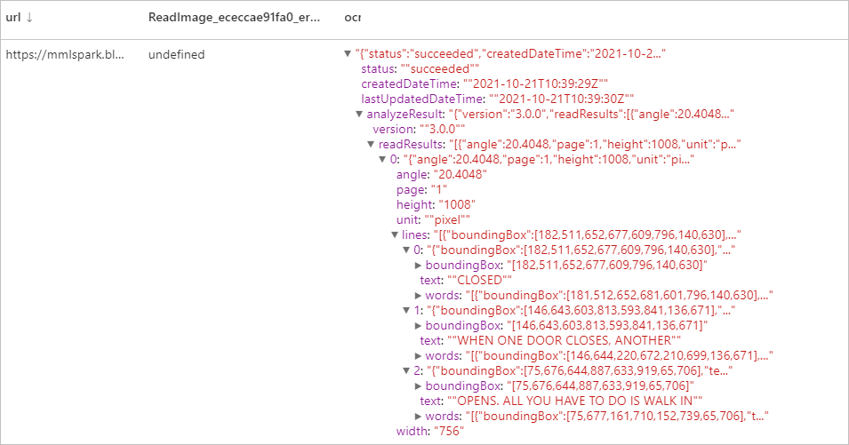
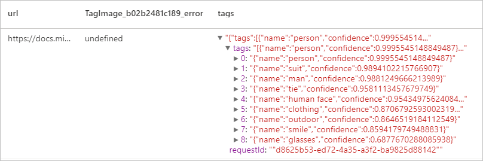
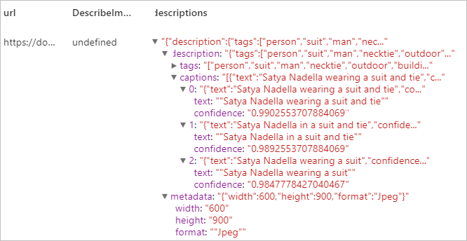
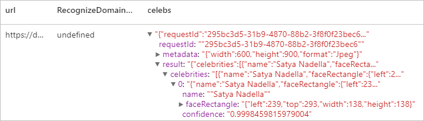

# <a name="tutorial-computer-vision-with-cognitive-service"></a>チュートリアル: Computer Vision と Cognitive Service

[Computer Vision](../../cognitive-services/computer-vision/index.yml) は、画像を処理し、視覚的特徴に基づく情報を返すことができるようにする、[Azure Cognitive Service](../../cognitive-services/index.yml) です。 このチュートリアルでは、[Computer Vision](../../cognitive-services/computer-vision/index.yml) を使用して Azure Synapse Analytics で画像を分析する方法について説明します。

このチュートリアルでは、[SynapseML](https://github.com/microsoft/SynapseML) でテキスト分析を使用して次の処理を行う方法を示します。

> [!div class="checklist"]
> - 画像コンテンツから視覚的特徴を抽出する
> - 画像内の文字を認識する (OCR)
> - 画像コンテンツを分析してサムネイルを生成する
> - 画像内のドメイン固有のコンテンツを検出して識別する
> - 画像に関連するタグを生成する
> - 人間が判読できる言語で画像全体の説明を生成する


## <a name="analyze-image"></a>画像を分析する
画像コンテンツに基づいて、オブジェクト、顔、成人向けコンテンツ、自動生成されたテキストの説明など、豊富な視覚的特徴のセットを抽出します。 
### <a name="example-input"></a>入力の例


```python
# Create a dataframe with the image URLs
df = spark.createDataFrame([
        ("<replace with your file path>/dog.jpg", )
    ], ["image", ])

# Run the Computer Vision service. Analyze Image extracts infortmation from/about the images.
analysis = (AnalyzeImage()
    .setLinkedService(cognitive_service_name)
    .setVisualFeatures(["Categories","Color","Description","Faces","Objects","Tags"])
    .setOutputCol("analysis_results")
    .setImageUrlCol("image")
    .setErrorCol("error"))

# Show the results of what you wanted to pull out of the images.
display(analysis.transform(df).select("image", "analysis_results.description.tags"))

```
### <a name="expected-results"></a>予想される結果

```json
["dog","outdoor","fence","wooden","small","brown","building","sitting","front","bench","standing","table","walking","board","beach","holding","bridge"]
```

## <a name="optical-character-recognition-ocr"></a>光学式文字認識 (OCR)
印刷されたテキスト、手書きのテキスト、数字、および通貨記号を、道路標識や製品の写真などの画像から、または納品書、請求書、財務レポート、記事などのドキュメントから抽出します。 これは、テキストの多い画像や、混合言語を含む複数ページの PDF ドキュメントからテキストを抽出するように最適化されています。 同じ画像またはドキュメントで、印刷と手書き両方のテキストの検出がサポートされています。

### <a name="example-input"></a>入力の例


```python
df = spark.createDataFrame([
        ("<replace with your file path>/ocr.jpg", )
    ], ["url", ])

ri = (ReadImage()
    .setLinkedService(cognitive_service_name)
    .setImageUrlCol("url")
    .setOutputCol("ocr"))

display(ri.transform(df))
```
### <a name="expected-results"></a>予想される結果


## <a name="generate-thumbnails"></a>サムネイルを生成する
イメージのコンテンツを分析して、そのイメージの適切なサムネイルを生成します。 Computer Vision では、最初に高品質のサムネイルを生成した後、画像内のオブジェクトを分析して "関心領域" を特定します。 Computer Vision では、その後、関心領域の要件に合わせて、画像がトリミングされます。 ユーザーのニーズに応じて、元のイメージの縦横比とは異なる縦横比を使用して、生成されたサムネイルを表示することができます。

### <a name="example-input"></a>入力の例


```python
df = spark.createDataFrame([
        ("<replace with your file path>/satya.jpeg", )
    ], ["url", ])

gt =  (GenerateThumbnails()
    .setLinkedService(cognitive_service_name)
    .setHeight(50)
    .setWidth(50)
    .setSmartCropping(True)
    .setImageUrlCol("url")
    .setOutputCol("thumbnails"))

thumbnails = gt.transform(df).select("thumbnails").toJSON().first()

import json
img = json.loads(thumbnails)["thumbnails"]

displayHTML("")

```

### <a name="expected-results"></a>予想される結果


## <a name="tag-image"></a>タグ画像
指定された画像のコンテンツに関連する単語つまりタグのリストを生成します。 タグは、画像内で検出された何千もの認識可能なオブジェクト、生き物、景色、または動作に基づいて返されます。 タグにあいまいさを回避するためのヒントが含まれたり、タグによってコンテキストが提供されたりすることがあります。たとえば、"ascomycete" (子嚢菌) というタグに "fungus" (菌類) というヒントが付く場合があります。

例として、Satya の画像を引き続き使用しましょう。

```python
df = spark.createDataFrame([
        ("<replace with your file path>/satya.jpeg", )
    ], ["url", ])

ti = (TagImage()
    .setLinkedService(cognitive_service_name)
    .setImageUrlCol("url")
    .setOutputCol("tags"))

display(ti.transform(df))
```

### <a name="expected-result"></a>予想される結果



## <a name="describe-image"></a>画像を説明する
完全な文を使用して、人間が判読できる言語でイメージ全体の説明を生成します。 Computer Vision のアルゴリズムでは、イメージ内の識別されるオブジェクトに基づいて、さまざまな説明が生成されます。 説明はそれぞれ評価され、信頼度スコアが生成されます。 その後、信頼度スコアが最も高いものから最も低いものの順に並べられたリストが返されます。

例として、Satya の画像を引き続き使用しましょう。

```python
df = spark.createDataFrame([
        ("<replace with your file path>/satya.jpeg", )
    ], ["url", ])

di = (DescribeImage()
    .setLinkedService(cognitive_service_name)
    .setMaxCandidates(3)
    .setImageUrlCol("url")
    .setOutputCol("descriptions"))

display(di.transform(df))
```
### <a name="expected-result"></a>予想される結果


## <a name="recognize-domain-specific-content"></a>ドメイン固有のコンテンツを認識する
ドメイン モデルを使用して、有名人やランドマークなど、イメージ内のドメイン固有のコンテンツを検出して識別します。 たとえば、画像に人物が含まれている場合、Computer Vision では、有名人用のドメイン モデルを使用して、画像内で検出された人物が既知の有名人と一致するかどうかを判断できます。

例として、Satya の画像を引き続き使用しましょう。

```python

df = spark.createDataFrame([
        ("<replace with your file path>/satya.jpeg", )
    ], ["url", ])

celeb =  (RecognizeDomainSpecificContent()
    .setLinkedService(cognitive_service_name)
    .setModel("celebrities")
    .setImageUrlCol("url")
    .setOutputCol("celebs"))

display(celeb.transform(df))
```

### <a name="expected-result"></a>予想される結果


## <a name="clean-up-resources"></a>リソースをクリーンアップする
Spark インスタンスがシャットダウンされるようにするには、接続されているセッション (ノートブック) を終了します。 プールは、Apache Spark プールに指定されている **アイドル時間** に達したときにシャットダウンされます。 また、ノートブックの右上にあるステータス バーから **[セッションの停止]** を選択することもできます。

![ステータス バーの [セッションの停止] ボタンを示すスクリーンショット。](./media/tutorial-build-applications-use-mmlspark/stop-session.png)

## <a name="next-steps"></a>次のステップ

* [Synapse サンプル ノートブックをチェックアウトする](https://github.com/Azure-Samples/Synapse/tree/main/MachineLearning) 
* [SynapseML GitHub リポジトリ](https://github.com/Azure/mmlspark)
