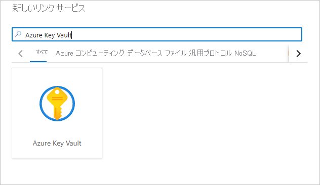

# チュートリアル:Azure Synapse Analytics で Cognitive Services を使用するための前提条件

このチュートリアルでは、Azure Synapse Analytics で Cognitive Services を安全に使用するための前提条件を設定する方法について説明します。

このチュートリアルの内容:
> [!div class="checklist"]
> - Cognitive Services リソース (Text Analytics や Anomaly Detector など) を作成する。
> - Cognitive Services リソースの認証キーをシークレットとして Azure Key Vault に格納し、Azure Synapse Analytics ワークスペースのアクセスを構成する。
> - Azure Synapse Analytics ワークスペースで Azure Key Vault リンク サービスを作成する。

Azure サブスクリプションをお持ちでない場合は、[開始する前に無料アカウントを作成](https://azure.microsoft.com/free/)してください。

## 前提条件

- Azure Data Lake Storage Gen2 ストレージ アカウントが既定のストレージとして構成されている [Azure Synapse Analytics ワークスペース](../get-started-create-workspace.md)。 使用する Azure Data Lake Storage Gen2 ファイル システムの "*Storage Blob データ共同作成者*" である必要があります。

## Azure portal にサインインする

[Azure portal](https://portal.azure.com/) にサインインします。

## Cognitive Services リソースの作成

[Azure Cognitive Services](../../cognitive-services/index.yml) には、さまざまな種類のサービスが含まれています。 Azure Synapse のチュートリアルでは、Text Analytics と Anomaly Detector の 2 つが例として使用されています。

Azure portal で [Text Analytics](https://ms.portal.azure.com/#create/Microsoft.CognitiveServicesTextAnalytics) リソースを作成できます。

![ポータルの Text Analytics と [作成] ボタンを示すスクリーンショット。](media/tutorial-configure-cognitive-services/tutorial-configure-cognitive-services-00b.png)

Azure portal で [Anomaly Detector](https://ms.portal.azure.com/#create/Microsoft.CognitiveServicesTextAnalytics) リソースを作成できます。

![ポータルの Anomaly Detector と [作成] ボタンを示すスクリーンショット。](media/tutorial-configure-cognitive-services/tutorial-configure-cognitive-services-00a.png)

## キー コンテナーを作成してシークレットとアクセスを構成する

1. Azure portal で[キー コンテナー](https://ms.portal.azure.com/#create/Microsoft.KeyVault)を作成します。
2. **[Key Vault]**  >  **[アクセス ポリシー]** の順に移動し、[Azure Synapse ワークスペースの MSI](../security/synapse-workspace-managed-identity.md) に、Azure Key Vault からシークレットを読み取るためのアクセス許可を付与します。

   > [!NOTE]
   > ポリシーの変更を必ず保存します。 これは見逃されやすい手順です。

   

3. Cognitive Services リソースに移動します。 たとえば、 **[Anomaly Detector]**  >  **[Keys and Endpoint]\(キーとエンドポイント\)** に移動します。 次に、2 つのキーのいずれかをクリップボードにコピーします。

4. **[Key Vault]**  >  **[シークレット]** の順に移動して、新しいシークレットを作成します。 シークレットの名前を指定し、前の手順のキーを **[値]** フィールドに貼り付けます。 最後に、 **[作成]** を選択します。

   

   > [!IMPORTANT]
   > このシークレット名を覚えておくか、書き留めておいてください。 後で Azure Synapse Studio から Cognitive Services に接続するときに使用します。

## Azure Synapse で Azure Key Vault リンク サービスを作成する

1. Azure Synapse Studio でワークスペースを開きます。 
2. **[管理]**  >  **[リンクされたサービス]** に移動します。 先ほど作成したキー コンテナーを参照して、**Azure Key Vault** リンク サービスを作成します。 
3. **[テスト接続]** ボタンを選択して、接続を確認します。 接続が緑色の場合は、 **[作成]** を選択し、 **[すべて公開]** を選択して変更を保存します。

これで、Azure Synapse Studio で Azure Cognitive Services エクスペリエンスを使用するためのチュートリアルのいずれかに進む準備ができました。

## 次の手順

- [チュートリアル: Azure Cognitive Services を使用した感情分析](tutorial-cognitive-services-sentiment.md)
- [チュートリアル: Azure Cognitive Services を使用した異常検出](tutorial-cognitive-services-sentiment.md)
- [チュートリアル: Azure Synapse 専用 SQL プールでの機械学習モデルのスコアリング](tutorial-sql-pool-model-scoring-wizard.md)
- [Azure Synapse Analytics の機械学習機能](what-is-machine-learning.md)