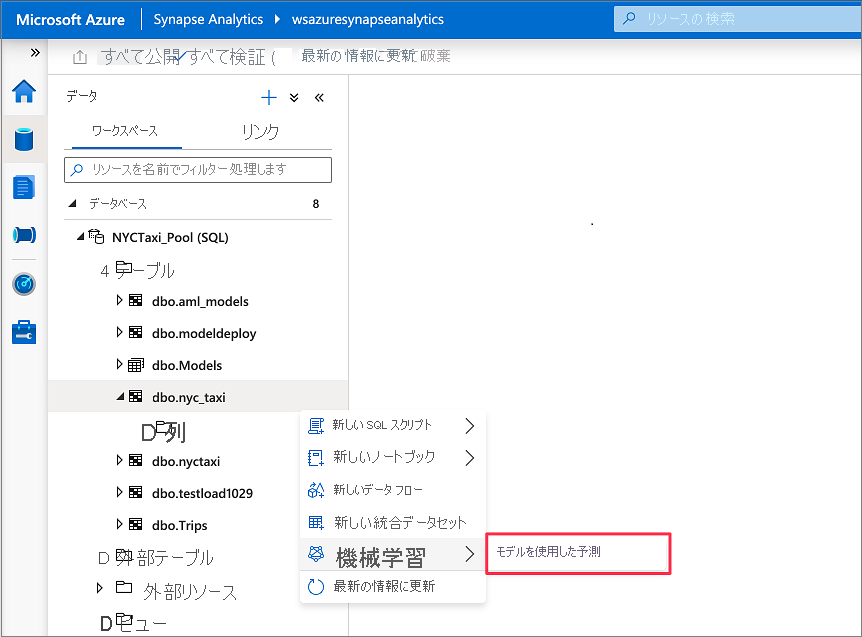
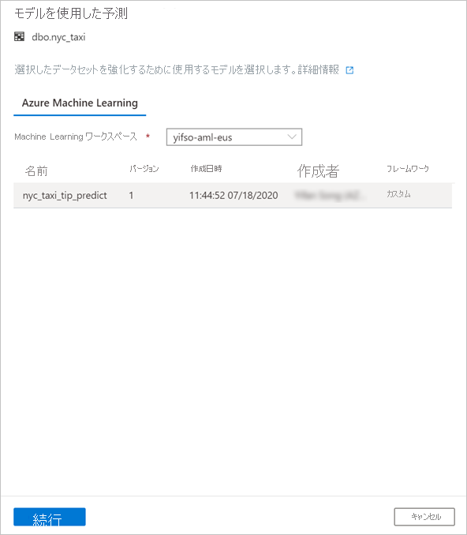
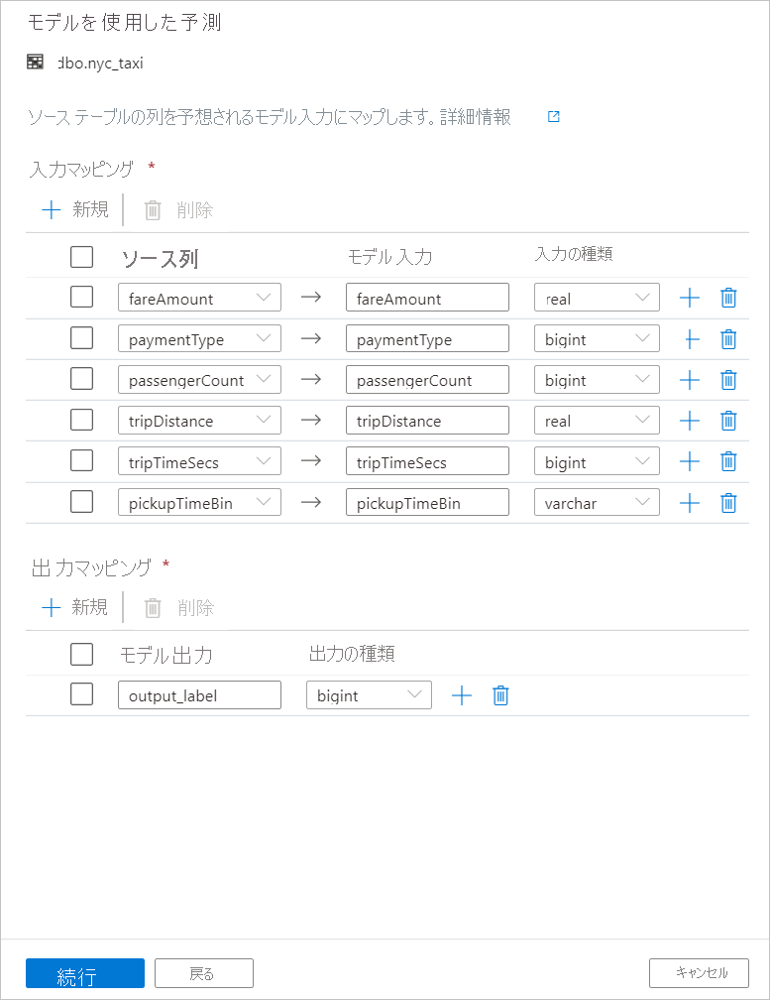

# <a name="tutorial-machine-learning-model-scoring-wizard-preview-for-dedicated-sql-pools"></a>チュートリアル:専用 SQL プール向けの機械学習モデル スコアリング ウィザード (プレビュー)

予測機械学習モデルを使用して、専用 SQL プールのデータを簡単に強化する方法について説明します。 データ科学者が作成したモデルは、予測分析のためにデータ専門家から簡単にアクセスできるようになりました。 Azure Synapse Analytics のデータ専門家は、Azure Synapse SQL プールに配置するために Azure Machine Learning モデル レジストリからモデルを選択し、予測を開始するだけでデータを強化できます。

このチュートリアルでは、次の作業を行う方法について説明します。

> [!div class="checklist"]
> - 予測機械学習モデルをトレーニングし、モデルを Azure Machine Learning モデル レジストリに登録する。
> - SQL スコアリング ウィザードを使用して、専用 SQL プールで予測を開始する。

Azure サブスクリプションをお持ちでない場合は、[開始する前に無料アカウントを作成](https://azure.microsoft.com/free/)してください。

## <a name="prerequisites"></a>前提条件

- Azure Data Lake Storage Gen2 ストレージ アカウントが既定のストレージとして構成されている [Azure Synapse Analytics ワークスペース](../get-started-create-workspace.md)。 使用する Data Lake Storage Gen2 ファイル システムの "*Storage Blob データ共同作成者*" である必要があります。
- Azure Synapse Analytics ワークスペースの専用 SQL プール。 詳細については、[専用 SQL プールの作成](../quickstart-create-sql-pool-studio.md)に関する記事をご覧ください。
- Azure Synapse Analytics ワークスペースの Azure Machine Learning のリンクされたサービス。 詳細については、[Azure Synapse での Azure Machine Learning のリンクされたサービスの作成](quickstart-integrate-azure-machine-learning.md)に関する記事を参照してください。

## <a name="sign-in-to-the-azure-portal"></a>Azure portal にサインインする

[Azure portal](https://portal.azure.com/) にサインインします。

## <a name="train-a-model-in-azure-machine-learning"></a>Azure Machine Learning でモデルをトレーニングする

開始する前に、sklearn のバージョンが 0.20.3 であることを確認します。

ノートブック内のすべてのセルを実行する前に、コンピューティング インスタンスが実行されていることを確認します。


1. Azure Machine Learning ワークスペースに移動します。

1. [Predict NYC Taxi Tips.ipynb](https://go.microsoft.com/fwlink/?linkid=2144301) をダウンロードします。

1. [Azure Machine Learning スタジオ](https://ml.azure.com)で Azure Machine Learning ワークスペースを開きます。

1. **[ノートブック]**  >  **[ファイルのアップロード]** の順に移動します。 次に、ダウンロードした **Predict NYC Taxi Tips.ipynb** ファイルを選択してアップロードします。
   

1. ノートブックがアップロードされ、開いたら、 **[すべてのセルを実行]** を選択します。

   いずれかのセルが失敗し、Azure に対して認証するよう求められる場合があります。 セルの出力でこれを確認し、リンクに従ってコードを入力することによって、ブラウザーで認証します。 その後、ノートブックを再実行します。

1. ノートブックで ONNX モデルがトレーニングされ、MLflow に登録されます。 **[モデル]** に移動して、新しいモデルが適切に登録されていることを確認します。
   

1. ノートブックを実行すると、テスト データも CSV ファイルにエクスポートされます。 この CSV ファイルをローカル システムにダウンロードします。 その後、CSV ファイルを専用 SQL プールにインポートし、そのデータを使用してモデルをテストします。

   CSV ファイルは、ノートブック ファイルと同じフォルダーに作成されます。 すぐに表示されない場合は、エクスプローラーで **[最新の情報に更新]** を選択します。

   

## <a name="launch-predictions-with-the-sql-scoring-wizard"></a>SQL スコアリング ウィザードを使用して予測を開始する

1. Synapse Studio で Azure Synapse ワークスペースを開きます。

1. **[データ]**  >  **[リンク済み]**  >  **[ストレージ アカウント]** の順に移動します。 `test_data.csv` を既定のストレージ アカウントにアップロードします。

   

1. **[開発]**  >  **[SQL スクリプト]** の順に移動します。 専用 SQL プールに `test_data.csv` を読み込む新しい SQL スクリプトを作成します。

   > [!NOTE]
   > このスクリプトのファイル URL を更新してから実行してください。

   ```SQL
   IF NOT EXISTS (SELECT * FROM sys.objects WHERE NAME = 'nyc_taxi' AND TYPE = 'U')
   CREATE TABLE dbo.nyc_taxi
   (
       tipped int,
       fareAmount float,
       paymentType int,
       passengerCount int,
       tripDistance float,
       tripTimeSecs bigint,
       pickupTimeBin nvarchar(30)
   )
   WITH
   (
       DISTRIBUTION = ROUND_ROBIN,
       CLUSTERED COLUMNSTORE INDEX
   )
   GO
   
   COPY INTO dbo.nyc_taxi
   (tipped 1, fareAmount 2, paymentType 3, passengerCount 4, tripDistance 5, tripTimeSecs 6, pickupTimeBin 7)
   FROM '<URL to linked storage account>/test_data.csv'
   WITH
   (
       FILE_TYPE = 'CSV',
       ROWTERMINATOR='0x0A',
       FIELDQUOTE = '"',
       FIELDTERMINATOR = ',',
       FIRSTROW = 2
   )
   GO
   
   SELECT TOP 100 * FROM nyc_taxi
   GO
   ```

   

1. **[データ]**  >  **[ワークスペース]** の順に移動します。 専用 SQL プール テーブルを右クリックして、SQL スコアリング ウィザードを開きます。 **[機械学習]**  >  **[既存のモデルで強化]** の順に移動します。

   > [!NOTE]
   > Azure Machine Learning 用に作成したリンク サービスがない場合、機械学習オプションは表示されません (このチュートリアルの冒頭にある「[前提条件](#prerequisites)」をご覧ください)。

   

1. ドロップダウン ボックスで、リンク済みの Azure Machine Learning ワークスペースを選択します。 この手順により、選択した Azure Machine Learning ワークスペースのモデル レジストリから機械学習モデルの一覧が読み込まれます。 現時点では、ONNX モデルだけがサポートされているので、ONNX モデルだけが表示されます。

1. 先ほどトレーニングしたモデルを選択し、 **[続行]** を選択します。

   

1. テーブルの列をモデル入力にマップし、モデル出力を指定します。 モデルが MLflow 形式で保存され、モデル シグネチャが設定されている場合、名前の類似性に基づくロジックを使用してマッピングが自動的に実行されます。 インターフェイスでは、手動マッピングもサポートされています。

   **[続行]** をクリックします。

   

1. 生成された T-SQL コードは、ストアド プロシージャ内にラップされます。 そのため、ストアド プロシージャ名を指定する必要があります。 メタデータ (バージョン、説明、その他の情報) を含むモデル バイナリは、Azure Machine Learning から専用 SQL プール テーブルに物理的にコピーされます。 そのため、モデルを保存するテーブルを指定する必要があります。 

   **[Existing table]\(既存のテーブル\)** または **[新規作成]** を選択できます。 完了したら、 **[Deploy model + open script]\(モデルの配置 + スクリプトを開く\)** を選択して、モデルを配置し、T-SQL 予測スクリプトを生成します。

   

1. スクリプトが生成されたら、 **[実行]** を選択してスコアリングを実行し、予測を取得します。

   

## <a name="next-steps"></a>次のステップ

- [クイック スタート: Azure Synapse で Azure Machine Learning のリンクされたサービスを新規作成する](quickstart-integrate-azure-machine-learning.md)
- [Azure Synapse Analytics の機械学習機能](what-is-machine-learning.md)
