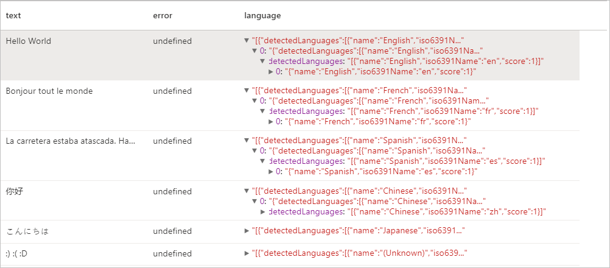
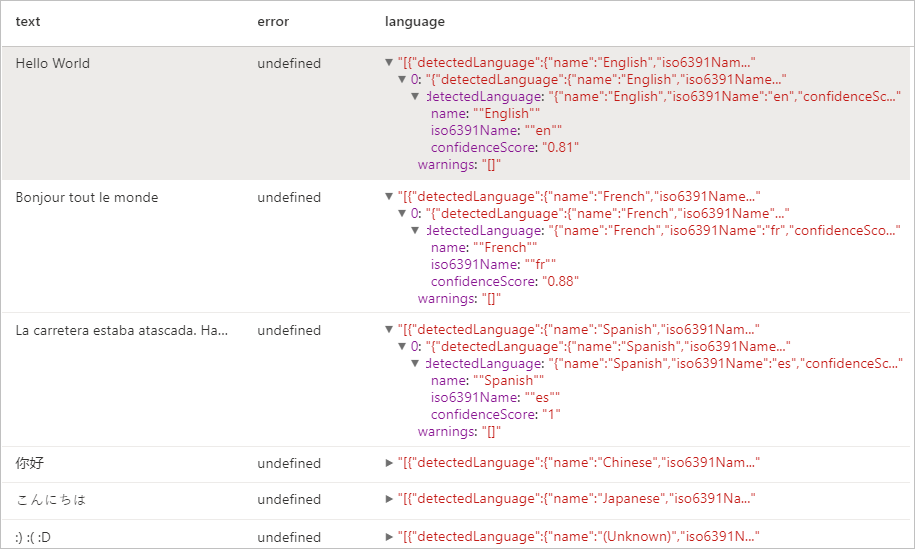
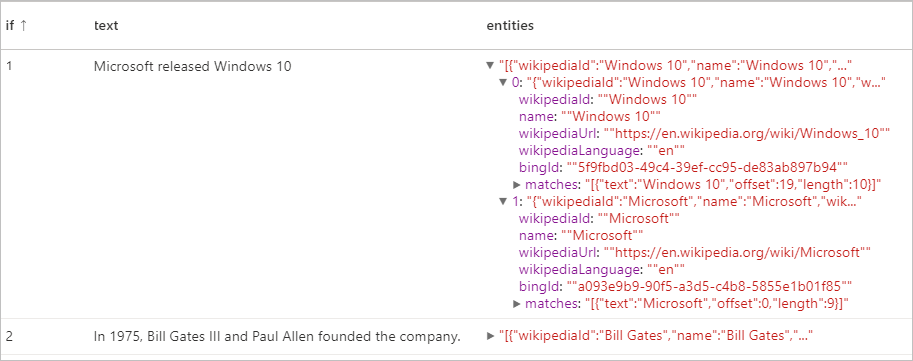
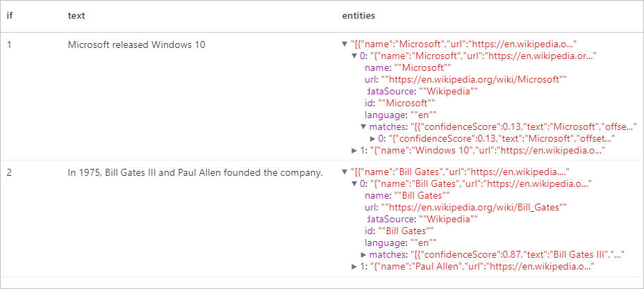
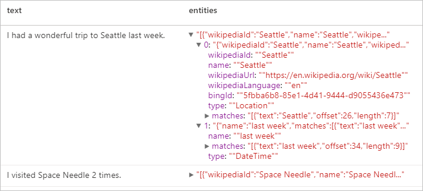
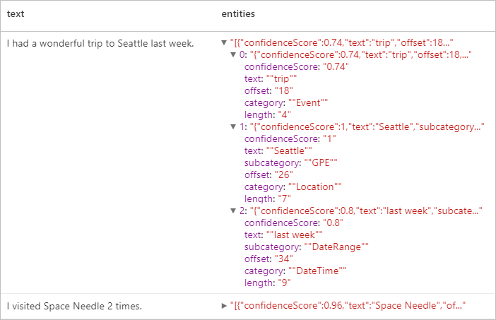
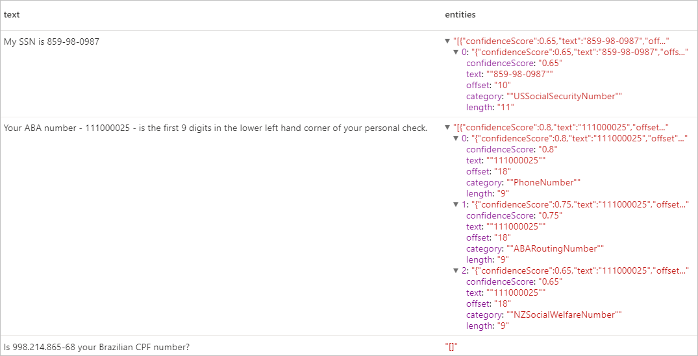

# <a name="tutorial-text-analytics-with-cognitive-service"></a>チュートリアル: コグニティブ サービスを使用した Text Analytics

[Text Analytics](../../cognitive-services/text-analytics/index.yml) は、自然言語処理 (NLP) 機能を使用してテキスト マイニングとテキスト分析を実行できる [Azure Cognitive Service](../../cognitive-services/index.yml) です。 このチュートリアルでは、[Text Analytics](../../cognitive-services/text-analytics/index.yml) を使用して、Azure Synapse Analytics の非構造化テキストを分析する方法を説明します。

このチュートリアルでは、[SynapseML](https://github.com/microsoft/SynapseML) でテキスト分析を使用して次の処理を行う方法を示します。

> [!div class="checklist"]
> - 文またはドキュメント レベルでセンチメント ラベルを検出する
> - 特定のテキスト入力の言語を識別する
> - 既知のナレッジ ベースへのリンクを使用して、テキストからエンティティを認識する
> - テキストから主要なフェーズを抽出する
> - テキスト内の異なるエンティティを識別し、事前定義済みのクラスまたは型に分類する
> - 特定のテキスト内の機密性の高いエンティティを識別して編集する

Azure サブスクリプションをお持ちでない場合は、[開始する前に無料アカウントを作成](https://azure.microsoft.com/free/)してください。

## <a name="prerequisites"></a>前提条件

- Azure Data Lake Storage Gen2 ストレージ アカウントが既定のストレージとして構成されている [Azure Synapse Analytics ワークスペース](../get-started-create-workspace.md)。 使用する Data Lake Storage Gen2 ファイル システムの "*Storage Blob データ共同作成者*" である必要があります。
- Azure Synapse Analytics ワークスペースの Spark プール。 詳細については、[Azure Synapse での Spark プールの作成](../quickstart-create-sql-pool-studio.md)に関する記事を参照してください。
- [Azure Synapse での Cognitive Services の構成](tutorial-configure-cognitive-services-synapse.md)に関するチュートリアルで説明されている事前構成手順。


## <a name="get-started"></a>開始
Synapse Studio を開き、新しいノートブックを作成します。 はじめに、[SynapseML](https://github.com/microsoft/SynapseML) をインポートします。 

```python
import synapse.ml
from synapse.ml.cognitive import *
from pyspark.sql.functions import col
```

## <a name="configure-text-analytics"></a>テキスト分析を構成する

[構成前の手順](tutorial-configure-cognitive-services-synapse.md)で構成した、リンクされたテキスト分析を使用します。 

```python
cognitive_service_name = "<Your linked service for text analytics>"
```

## <a name="text-sentiment"></a>テキスト センチメント
テキスト感情分析を使用すると、文とドキュメントのレベルでセンチメント ラベル ("negative"、"neutral"、"positive" など) と信頼度スコアを検出する手段が得られます。 有効な言語の一覧については、「[Text Analytics API でサポートされている言語](../../cognitive-services/text-analytics/language-support.md?tabs=sentiment-analysis)」を参照してください。

### <a name="v2"></a>V2

```python

# Create a dataframe that's tied to it's column names
df = spark.createDataFrame([
  ("I am so happy today, its sunny!", "en-US"),
  ("I am frustrated by this rush hour traffic", "en-US"),
  ("The cognitive services on spark aint bad", "en-US"),
], ["text", "language"])

# Run the Text Analytics service with options
sentimentv2 = (TextSentimentV2()
    .setLinkedService(linked_service_name)
    .setTextCol("text")
    .setOutputCol("sentiment")
    .setErrorCol("error")
    .setLanguageCol("language"))

# Show the results of your text query in a table format
display(sentimentv2.transform(df).select("text", col("sentiment")[0].getItem("score").alias("positive score")))

```
### <a name="expected-results"></a>予想される結果

|text|肯定的なスコア|
|---|---|
|I am so happy today, its sunny!|0.99511755|
|I am frustrated by this rush hour traffic|0.007274598|
|The cognitive services on spark aint bad|0.9144157|

### <a name="v31"></a>V3.1

```python

# Create a dataframe that's tied to it's column names
df = spark.createDataFrame([
  ("I am so happy today, its sunny!", "en-US"),
  ("I am frustrated by this rush hour traffic", "en-US"),
  ("The cognitive services on spark aint bad", "en-US"),
], ["text", "language"])

# Run the Text Analytics service with options
sentiment = (TextSentiment()
    .setLinkedService(linked_service_name)
    .setTextCol("text")
    .setOutputCol("sentiment")
    .setErrorCol("error")
    .setLanguageCol("language"))

# Show the results of your text query in a table format
display(sentiment.transform(df).select("text", col("sentiment")[0].getItem("sentiment").alias("sentiment")))

```
### <a name="expected-results"></a>予想される結果

|text|センチメント|
|---|---|
|I am so happy today, its sunny!|肯定的|
|I am frustrated by this rush hour traffic|否定的|
|The cognitive services on spark aint bad|肯定的|

---

## <a name="language-detector"></a>Language Detector

Language Detector では、テキスト入力が評価され、各ドキュメントについて言語識別子と、分析の強度を示すスコアが返されます。 この機能は、言語が不明な任意のテキストを取集するコンテンツ ストアに役立ちます。 有効な言語の一覧については、「[Text Analytics API でサポートされている言語](../../cognitive-services/text-analytics/language-support.md?tabs=language-detection)」を参照してください。

### <a name="v2"></a>V2
```python
# Create a dataframe that's tied to it's column names
df = spark.createDataFrame([
  ("Hello World",),
  ("Bonjour tout le monde",),
  ("La carretera estaba atascada. Había mucho tráfico el día de ayer.",),
  ("你好",),
  ("こんにちは",),
  (":) :( :D",)
], ["text",])

# Run the Text Analytics service with options
languagev2 = (LanguageDetectorV2()
    .setLinkedService(linked_service_name)
    .setTextCol("text")
    .setOutputCol("language")
    .setErrorCol("error"))

# Show the results of your text query in a table format
display(languagev2.transform(df))
```
### <a name="expected-results"></a>予想される結果


### <a name="v31"></a>V3.1
```python
# Create a dataframe that's tied to it's column names
df = spark.createDataFrame([
  ("Hello World",),
  ("Bonjour tout le monde",),
  ("La carretera estaba atascada. Había mucho tráfico el día de ayer.",),
  ("你好",),
  ("こんにちは",),
  (":) :( :D",)
], ["text",])

# Run the Text Analytics service with options
language = (LanguageDetector()
    .setLinkedService(linked_service_name)
    .setTextCol("text")
    .setOutputCol("language")
    .setErrorCol("error"))

# Show the results of your text query in a table format
display(language.transform(df))
```
### <a name="expected-results"></a>予想される結果
<a name="expected-results-for-language-detector-v31"></a>
---

## <a name="entity-detector"></a>Entity Detector
Entity Detector は、既知のナレッジ ベースへのリンクを含む認識されたエンティティの一覧を返します。 有効な言語の一覧については、「[Text Analytics API でサポートされている言語](../../cognitive-services/text-analytics/language-support.md?tabs=entity-linking)」を参照してください。

### <a name="v2"></a>V2

```python
df = spark.createDataFrame([
    ("1", "Microsoft released Windows 10"),
    ("2", "In 1975, Bill Gates III and Paul Allen founded the company.")
], ["if", "text"])

entityv2 = (EntityDetectorV2()
    .setLinkedService(linked_service_name)
    .setLanguage("en")
    .setOutputCol("replies")
    .setErrorCol("error"))

display(entityv2.transform(df).select("if", "text", col("replies")[0].getItem("entities").alias("entities")))
```
### <a name="expected-results"></a>予想される結果



### <a name="v31"></a>V3.1

```python
df = spark.createDataFrame([
    ("1", "Microsoft released Windows 10"),
    ("2", "In 1975, Bill Gates III and Paul Allen founded the company.")
], ["if", "text"])

entity = (EntityDetector()
    .setLinkedService(linked_service_name)
    .setLanguage("en")
    .setOutputCol("replies")
    .setErrorCol("error"))

display(entity.transform(df).select("if", "text", col("replies")[0].getItem("entities").alias("entities")))
```
### <a name="expected-results"></a>予想される結果


---

## <a name="key-phrase-extractor"></a>キー フレーズ抽出

キー フレーズ抽出は、非構造化テキストを評価し、キー フレーズのリストを返します。 この機能は、ドキュメントのコレクション内の要点をすばやく特定する必要がある場合に便利です。 有効な言語の一覧については、「[Text Analytics API でサポートされている言語](../../cognitive-services/text-analytics/language-support.md?tabs=key-phrase-extraction)」を参照してください。

### <a name="v2"></a>V2
```python
df = spark.createDataFrame([
    ("en", "Hello world. This is some input text that I love."),
    ("fr", "Bonjour tout le monde"),
    ("es", "La carretera estaba atascada. Había mucho tráfico el día de ayer.")
], ["lang", "text"])

keyPhrasesv2 = (KeyPhraseExtractorV2()
    .setLinkedService(linked_service_name)
    .setLanguageCol("lang")
    .setOutputCol("replies")
    .setErrorCol("error"))

display(keyPhrasesv2.transform(df).select("text", col("replies")[0].getItem("keyPhrases").alias("keyPhrases")))
```

### <a name="expected-results"></a>予想される結果

|text|keyPhrases|
|---|---|
|Hello world. これは、私が気に入っている入力テキストです。|"["input text","world"]"|
|Bonjour tout le monde|"["monde"]"|
|La carretera estaba atascada. Había mucho tráfico el día de ayer.|"["carretera","tráfico","día"]"|


### <a name="v31"></a>V3.1

```python
df = spark.createDataFrame([
    ("en", "Hello world. This is some input text that I love."),
    ("fr", "Bonjour tout le monde"),
    ("es", "La carretera estaba atascada. Había mucho tráfico el día de ayer.")
], ["lang", "text"])

keyPhrase = (KeyPhraseExtractor()
    .setLinkedService(linked_service_name)
    .setLanguageCol("lang")
    .setOutputCol("replies")
    .setErrorCol("error"))

display(keyPhrase.transform(df).select("text", col("replies")[0].getItem("keyPhrases").alias("keyPhrases")))
```

### <a name="expected-results"></a>予想される結果

|text|keyPhrases|
|---|---|
|Hello world. これは、私が気に入っている入力テキストです。|"["Hello world","input text"]"|
|Bonjour tout le monde|"["Bonjour","monde"]"|
|La carretera estaba atascada. Había mucho tráfico el día de ayer.|"["mucho tráfico","día","carretera","ayer"]"|

---

## <a name="named-entity-recognition-ner"></a>名前付きエンティティの認識 (NER)

固有表現認識 (NER) とは、人、場所、イベント、製品や組織などの事前に定義されているさまざまなテキスト形式のエンティティを、クラスまたは種類に分類する機能です。 有効な言語の一覧については、「[Text Analytics API でサポートされている言語](../../cognitive-services/text-analytics/language-support.md?tabs=named-entity-recognition)」を参照してください。

### <a name="v2"></a>V2
```python
df = spark.createDataFrame([
    ("1", "en", "I had a wonderful trip to Seattle last week."),
    ("2", "en", "I visited Space Needle 2 times.")
], ["id", "language", "text"])

nerv2 = (NERV2()
    .setLinkedService(linked_service_name)
    .setLanguageCol("language")
    .setOutputCol("replies")
    .setErrorCol("error"))

display(nerv2.transform(df).select("text", col("replies")[0].getItem("entities").alias("entities")))
```
### <a name="expected-results"></a>予想される結果


### <a name="v31"></a>V3.1

```python
df = spark.createDataFrame([
    ("1", "en", "I had a wonderful trip to Seattle last week."),
    ("2", "en", "I visited Space Needle 2 times.")
], ["id", "language", "text"])

ner = (NER()
    .setLinkedService(linked_service_name)
    .setLanguageCol("language")
    .setOutputCol("replies")
    .setErrorCol("error"))

display(ner.transform(df).select("text", col("replies")[0].getItem("entities").alias("entities")))
```
### <a name="expected-results"></a>予想される結果


---

## <a name="personally-identifiable-information-pii-v31"></a>個人を特定できる情報 (PII) V3.1
PII 機能は NER の一部であり、電話番号、メール アドレス、郵送先住所、パスポート番号など、テキスト内で個人に関連付けられている機密性の高いエンティティを識別し、編集することができます。 有効な言語の一覧については、「[Text Analytics API でサポートされている言語](../../cognitive-services/text-analytics/language-support.md?tabs=pii)」を参照してください。

### <a name="v31"></a>V3.1

```python
df = spark.createDataFrame([
    ("1", "en", "My SSN is 859-98-0987"),
    ("2", "en", "Your ABA number - 111000025 - is the first 9 digits in the lower left hand corner of your personal check."),
    ("3", "en", "Is 998.214.865-68 your Brazilian CPF number?")
], ["id", "language", "text"])

pii = (PII()
    .setLinkedService(linked_service_name)
    .setLanguageCol("language")
    .setOutputCol("replies")
    .setErrorCol("error"))

display(pii.transform(df).select("text", col("replies")[0].getItem("entities").alias("entities")))
```
### <a name="expected-results"></a>予想される結果


---

## <a name="clean-up-resources"></a>リソースをクリーンアップする
Spark インスタンスがシャットダウンされるようにするには、接続されているセッション (ノートブック) を終了します。 プールは、Apache Spark プールに指定されている **アイドル時間** に達したときにシャットダウンされます。 また、ノートブックの右上にあるステータス バーから **[セッションの停止]** を選択することもできます。

![ステータス バーの [セッションの停止] ボタンを示すスクリーンショット。](./media/tutorial-build-applications-use-mmlspark/stop-session.png)

## <a name="next-steps"></a>次のステップ

* [Synapse サンプル ノートブックをチェックアウトする](https://github.com/Azure-Samples/Synapse/tree/main/MachineLearning) 
* [SynapseML GitHub リポジトリ](https://github.com/microsoft/SynapseML)
