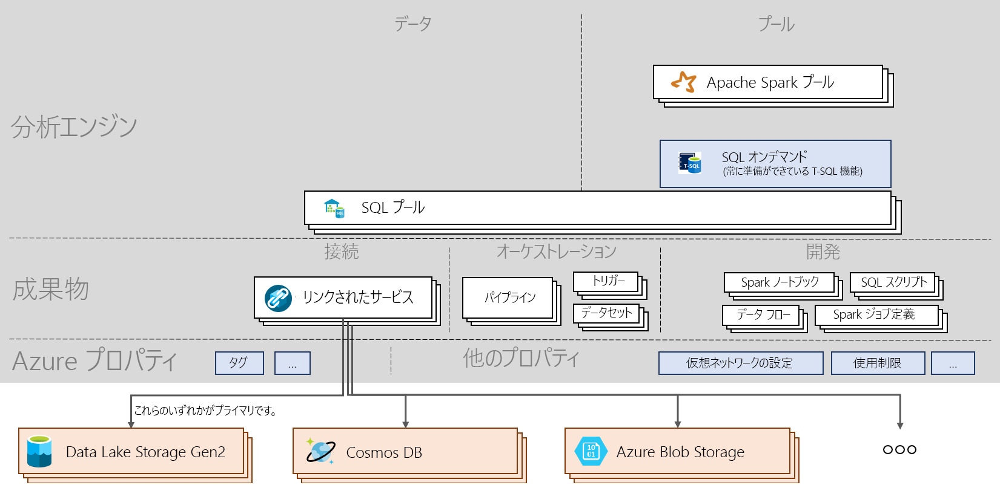

# Azure Synapse Analytics のチート シート

[!INCLUDE [preview](includes/note-preview.md)]

Azure Synapse Analytics のチート シートでは、サービスの基本的な概念と重要なコマンドについて説明します。 この記事は、新しい学習者と、Azure Synapse の重要なトピックのハイライトを希望する学習者の両方に役立ちます。

## Architecture

> [!div class="mx-imgBorder"]
>

## 概念
| 名詞と動詞                         | 実行内容       |
|:---                                 |:---                 |
| **Synapse ワークスペース (プレビュー)** | Azure でクラウドベースのエンタープライズ分析を行うための、セキュリティ保護可能なコラボレーション境界。 ワークスペースは、特定のリージョンにデプロイされ、関連付けられた ADLSg2 アカウントと (一時データを格納するための) ファイル システムを持ちます。 ワークスペースは、リソース グループに属します。 |
| **SQL Analytics**   | プールまたはオンデマンド機能を使用して分析を実行します。  |
| **SQL プール**   | 対応するデータベースをワークスペースにデプロイできる、0 対 N の SQL プロビジョニング済みのリソース。 各 SQL プールには、データベースが関連付けられています。 SQL プールは、手動または自動でスケーリング、一時停止、または再開できます。 SQL プールは、100 DWU から最大 30,000 DWU までスケーリングできます。       |
| **SQL オンデマンド (プレビュー)**   | データ レイク内のデータに対して T-SQL クエリを実行できる、大規模データ用に構築された分散データ処理システム。 サーバーレスであるため、インフラストラクチャを管理する必要はありません。       |
|**Apache Spark** | Spark プールで使用される Spark ランタイム。 現在サポートされているバージョンは、Python 3.6.1、Scala 2.11.12、Apache Spark 0.5 向け .NET サポート、および Delta Lake 0.3 を使用する Spark 2.4 です。  | 
| **Apache Spark プール (プレビュー)**  | 対応するデータベースをワークスペースにデプロイできる、0 対 N の Spark プロビジョニング済みのリソース。 Spark プールは、自動で一時停止、再開、およびスケーリングできます。  |
| **Spark アプリケーション**  |   ドライバー プロセスと Executor プロセスのセットで構成されます。 Spark アプリケーションは Spark プールで実行されます。            |
| **Spark セッション**  |   Spark アプリケーションの統合エントリ ポイント。 これにより、Spark のさまざまな機能との対話、および少数のコンストラクトとの対話が可能になります。 ノートブックを実行するには、セッションを作成する必要があります。 セッションは、特定のサイズの特定の数の Executor で実行するように構成できます。 ノートブック セッションの既定の構成では、2 つの中規模の Executor で実行されます。 |
| **SQL 要求**  |   SQL プールまたは SQL オンデマンドを介して実行されるクエリなどの操作。 |
|**データの統合**| さまざまなソース間でデータを取り込み、ワークスペース内またはワークスペース外で実行されるアクティビティを調整する機能を提供します。| 
|**アイテム**| ユーザーがデータ ソースの管理、開発、調整、および視覚化を行うために必要なすべてのオブジェクトをカプセル化する概念。|
|**ノートブック**| Scala、PySpark、C#、および SparkSQL をサポートする、インタラクティブかつリアクティブなデータ サイエンスおよびエンジニアリング インターフェイス。 |
|**Spark ジョブ定義**|コードとその依存関係を含むアセンブリ jar を使用して Spark ジョブを送信するためのインターフェイス。|
|**データ フロー**|  ビッグ データの変換を行うために、コーディングを必要としない、完全に視覚的なエクスペリエンスを提供します。 すべての最適化と実行は、サーバーレス方式で処理されます。 |
|**SQL スクリプト**| ファイルに保存された SQL コマンドのセット。 1 つの SQL スクリプトに 1 つまたは複数の SQL ステートメントを含めることができます。 SQL プールまたは SQL オンデマンドを介して SQL 要求を実行するために使用できます。|
|**パイプライン**| 1 つのタスクを連携して実行するアクティビティの論理的なグループ。|
|**アクティビティ**| データのコピー、ノートブックや SQL スクリプトの実行など、データに対して実行するアクションを定義します。|
|**トリガー**| パイプラインを実行します。 手動または自動で実行できます (スケジュール、タンブリング ウィンドウ、またはイベントベース)。|
|**リンクされたサービス**| ワークスペースが外部リソースに接続するために必要な接続情報を定義する接続文字列。|
|**データセット**|  アクティビティで入力および出力として使用されるデータを単にポイントまたは参照する、データの名前付きビュー。 リンクされたサービスに属します。|

## 次のステップ

- [ワークスペースを作成する](quickstart-create-workspace.md)
- [Synapse Studio を使用する](quickstart-synapse-studio.md)
- [SQL プールを作成する](quickstart-create-sql-pool.md)
- [SQL オンデマンドを使用する](quickstart-sql-on-demand.md)
- [Apache Spark プールを作成する](quickstart-create-apache-spark-pool.md)

