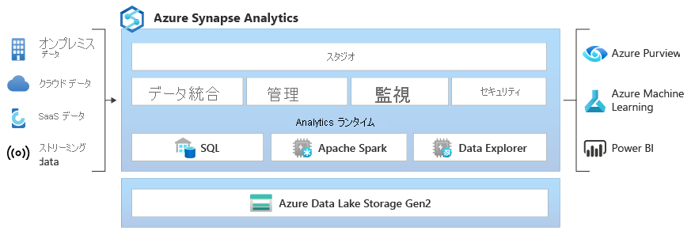

# Azure Synapse Analytics とは

**Azure Synapse** は、データ ウェアハウスやビッグ データ システム全体にわたって分析情報を取得する時間を早めるエンタープライズ分析サービスです。 Azure Synapse は、エンタープライズ データ ウェアハウスで使用される **SQL** テクノロジ、ビッグ データに使用される **Spark** テクノロジ、データ統合と ETL および ELT のための **パイプライン**、**Power BI**、**CosmosDB**、**AzureML** などの他の Azure サービスとの緊密な統合の長所を組み合わせたものです。

## 業界最高水準の SQL

**Synapse SQL** は、T-SQL の分散クエリ システムです。データ ウェアハウジングやデータ仮想化のシナリオが可能となるほか、T-SQL を拡張してストリーミングや機械学習のシナリオにも対応することができます。

* Synapse SQL では、**サーバーレス** と **専用** の両方のリソース モデルが提供されます。 予測可能なパフォーマンスとコストに対しては、専用 SQL プールを作成して、SQL テーブルに格納されているデータの処理能力を確保します。 計画外または突発性のワークロードに対しては、常に使用可能なサーバーレスの SQL エンドポイントを使用します。
* 組み込みの **ストリーミング** 機能を使用して、クラウド データ ソースから SQL テーブルにデータを取り込みます
* **機械学習** モデルを使用し、[T-SQL PREDICT 関数](/sql/t-sql/queries/predict-transact-sql?view=azure-sqldw-latest&preserve-view=true)を使用してデータをスコア付けすることにより、AI を SQL と統合します

## 業界標準の Apache Spark

**Apache Spark for Azure Synapse** は、Apache Spark と密にシームレスに統合されます。Apache Spark は、データ準備、データ エンジニアリング、ETL、および機械学習に使用される最も人気のあるオープン ソースのビッグ データ エンジンです。

* SparkML アルゴリズムを使用した ML モデルと、Linux Foundation Delta Lake の組み込みサポートを備える Apache Spark 2.4 用の AzureML 統合。
* クラスターの管理について心配する必要からユーザーを解放する、簡素化されたリソース モデル。
* Spark の迅速なスタートアップと積極的な自動スケーリング。
* Spark 向け .NET の組み込みサポートにより、C# の専門知識と既存の .NET コードを Spark アプリケーション内で再利用できます。

## データ レイクの操作

Azure Synapse は、SQL と Spark を組み合わせて使用する場合の従来のテクノロジーの障害を取り除きます。 ニーズと専門知識に基づいて、シームレスにいろいろな組み合わせを使用することができます。

* データ レイク内のファイルで定義されたテーブルを、Spark または Hive でシームレスに使用できます。
* SQL と Spark を使用して、データ レイクに保存されている Parquet、CSV、TSV、JSON ファイルを直接探索して分析できます。
* SQL データベースと Spark データベース間の高速かつスケーラブルなデータ読み込み

## 組み込みのデータ統合

Azure Synapse には Azure Data Factory と同じデータ統合エンジンとエクスペリエンスが含まれているため、Azure Synapse Analytics から離れることなく、多機能で大規模な ETL パイプラインを作成できます。

* 90 以上のデータ ソースからデータを取り込む
* データ フロー アクティビティを使用したコードフリーの ETL
* ノートブック、Spark ジョブ、ストアド プロシージャ、SQL スクリプトなどを調整する

## 統合された管理、監視、およびセキュリティ

Azure Synapse は、エンタープライズが分析リソースを管理し、使用状況とアクティビティを監視し、セキュリティを適用するための唯一の方法を提供します。

* ユーザーをロールに割り当てて、分析リソースへのアクセスを簡素化
* データとコードに対するきめ細かなアクセス制御
* SQL と Spark 全体のリソース、使用状況、およびユーザーを監視するための単一のダッシュボード

## 統合エクスペリエンス

**Synapse Studio** のユーザー エクスペリエンスには、データ エンジニアに必要なすべてのものがまとまっています。 優れた分析ソリューションを構築するために必要なすべてのタスクを実行できます。

* データ エンジニアの主要なタスクを 1 か所に集約: 取り込み、探索、準備、調整、視覚化
* SQL または Spark コードを記述するための業界最高水準の生産性: 作成、デバッグ、およびパフォーマンスの最適化
* エンタープライズ CI/CD プロセスとの統合

## Synapse コミュニティへの参加

- [Microsoft Q&A](/answers/topics/azure-synapse-analytics.html): 技術的なご質問はこちらへ。
- [Stack Overflow](https://stackoverflow.com/questions/tagged/azure-synapse):開発に関する質問はこちらへ

## 次の手順

* [Azure Synapse Analytics の使用を開始する](get-started.md)
* [ワークスペースを作成する](quickstart-create-workspace.md)
* [サーバーレス SQL プールを使用する](quickstart-sql-on-demand.md)
