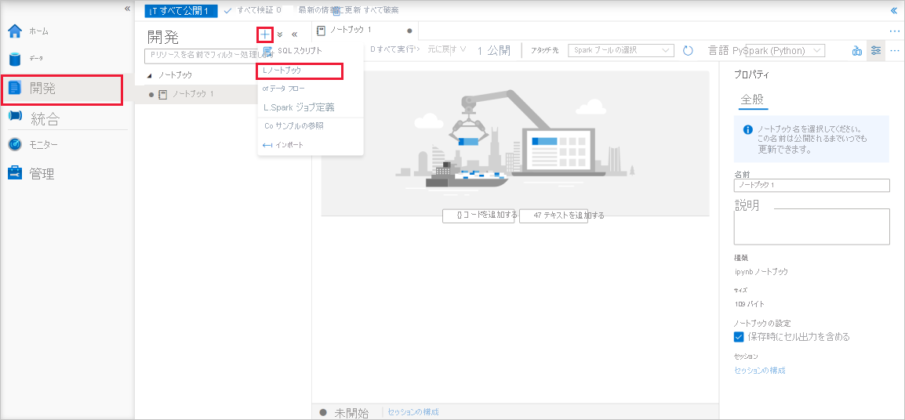
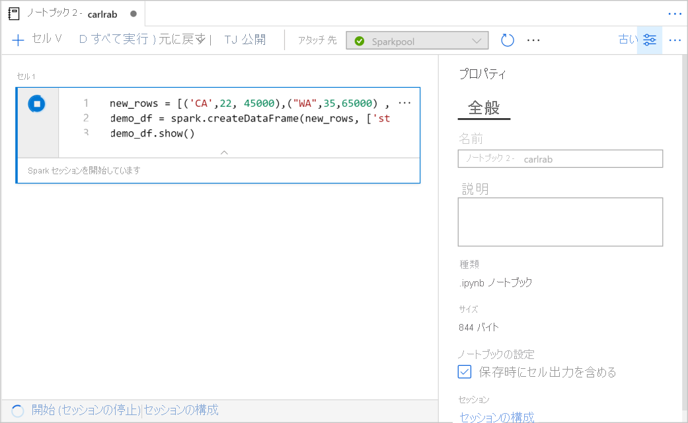
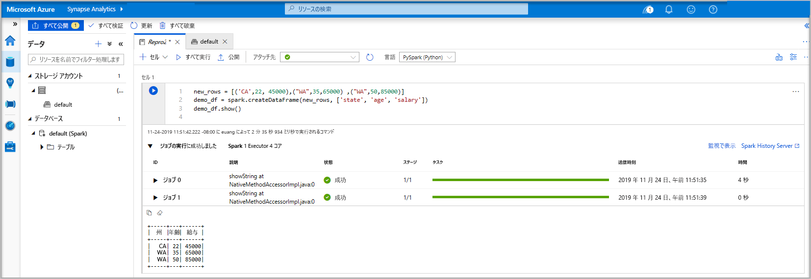
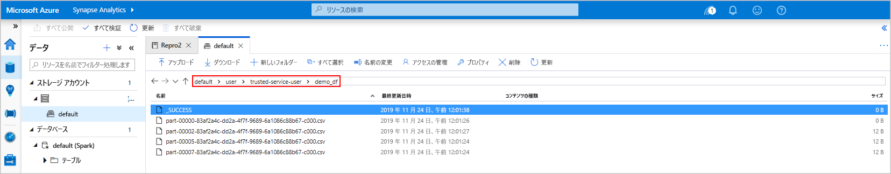
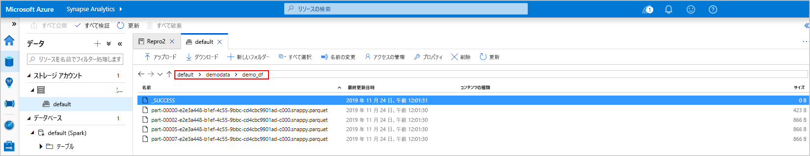
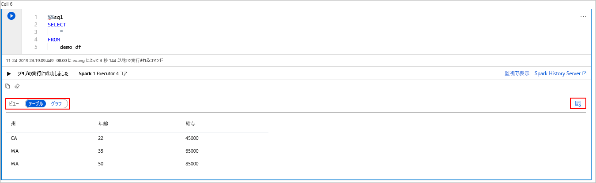
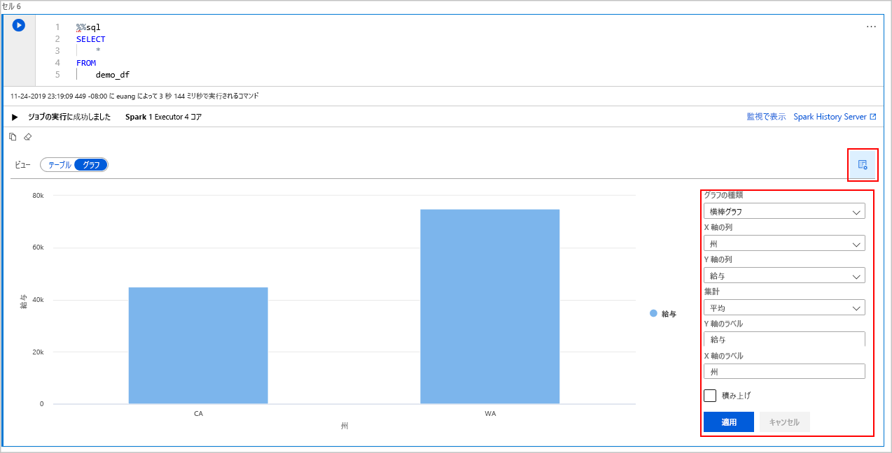

# <a name="quickstart-create-an-apache-spark-pool-preview-in-azure-synapse-analytics-using-web-tools"></a>クイック スタート:Web ツールを使用して Azure Synapse Analytics で Apache Spark プール (プレビュー) を作成する

このクイックスタートでは、Web ツールを使用して Azure Synapse で Apache Spark プール (プレビュー) を作成する方法について説明します。 次に、Apache Spark プールに接続し、ファイルとテーブルに対して Spark SQL クエリを実行する方法について説明します。 Apache Spark により、メモリ内処理を使用した、高速のデータ分析とクラスター コンピューティングが可能になります。 Azure Synapse の Spark については、[Azure Synapse 上の Apache Spark の概要に関するページ](./spark/apache-spark-overview.md)を参照してください。

> [!IMPORTANT]
> Spark インスタンスの料金は、それを使用しているかどうかに関係なく、分単位で課金されます。 必ず、Spark インスタンスの使用を終了した後にシャットダウンするか、短いタイムアウトを設定してください。 詳しくは、この記事の「**リソースのクリーンアップ**」をご覧ください。

Azure サブスクリプションをお持ちでない場合は、[開始する前に無料アカウントを作成](https://azure.microsoft.com/free/)してください。

## <a name="prerequisites"></a>前提条件

- Azure サブスクリプション - [無料アカウントを作成する](https://azure.microsoft.com/free/)
- [Synapse Analytics ワークスペース](quickstart-create-workspace.md)
- [Apache Spark プール](quickstart-create-apache-spark-pool.md)

## <a name="sign-in-to-the-azure-portal"></a>Azure portal にサインインする

[Azure portal](https://portal.azure.com/) にサインインします。

Azure サブスクリプションをお持ちでない場合は、開始する前に[無料アカウントを作成](https://azure.microsoft.com/free/)してください。

## <a name="create-a-notebook"></a>ノートブックを作成する

ノートブックとは、さまざまなプログラミング言語をサポートする対話型の環境のことです。 ノートブックを使用すると、データを対話的に操作したり、コードを Markdown テキストと結合したり、簡単な視覚化を行ったりすることができます。

1. 使用する Azure Synapse ワークスペースの Azure portal ビューで、 **[Synapse Studio の起動]** を選択します。
2. Synapse Studio が起動したら、 **[開発]** を選択します。 次に、 **[ノートブック]** エントリの上にマウス ポインターを移動します。 省略記号 ( **...** ) を選択します。
3. そこから、 **[新しいノートブック]** を選択します。 新しいノートブックが作成され、自動的に生成された名前で開きます。
  

4. **[プロパティ]** ウィンドウで、ノートブックの名前を指定します。
5. ツール バーの **[Publish]\(発行\)** をクリックします。
6. ワークスペースに Apache Spark プールが 1 つしかない場合は、これが既定で選択されます。 何も選択されていない場合は、ドロップダウン リストを使用して、適切な Apache Spark プールを選択します。
7. **[コードの追加]** をクリックします。 既定の言語は `Pyspark` です。 Pyspark と Spark SQL を組み合わせて使用するため、既定の選択でかまいません。
8. 次に、操作する単純な Spark データフレーム オブジェクトを作成します。 この場合は、コードから作成します。 3 つの行と 3 つの列があります。

   ```python
   new_rows = [('CA',22, 45000),("WA",35,65000) ,("WA",50,85000)]
   demo_df = spark.createDataFrame(new_rows, ['state', 'age', 'salary'])
   demo_df.show()
   ```

9. ここでは次のいずれかの方法でセルを実行できます。

   - **Shift + Enter**キーを押します。
   - セルの左側にある青い再生アイコンを選択します。
   - ツールバーの **[すべて実行]** ボタンを選択します。

   

10. Apache Spark プール インスタンスがまだ実行されていない場合は、自動的に起動されます。 Apache Spark プール インスタンスの状態は、実行しているセルの下に表示されます。また、ノートブックの下部にある状態パネルでも確認できます。 プールのサイズによっては、開始に 2 から 5 分かかります。 コードの実行が完了すると、セルの下の情報に、実行にかかった時間と実行内容が表示されます。 出力セルに出力が表示されます。

    

11. データがデータフレームに存在しているため、さまざまな方法でデータを使用できます。 このクイックスタートの残りの部分では、さまざまな形式のデータが必要になります。
12. 次のコードを別のセルに入力して実行します。これにより、Spark テーブル、CSV、Parquet ファイルが作成され、すべてにデータがコピーされます。

    ```python
     demo_df.createOrReplaceTempView('demo_df')
     demo_df.write.csv('demo_df', mode='overwrite')
     demo_df.write.parquet('abfss://<<TheNameOfAStorageAccountFileSystem>>@<<TheNameOfAStorageAccount>>.dfs.core.windows.net/demodata/demo_df', mode='overwrite')
    ```

    ストレージ エクスプローラーを使用すると、上記で使用したファイルの 2 つの書き込み方法の影響を確認できます。 ファイル システムが指定されていない場合は、既定値が使用されます (ここでは `default>user>trusted-service-user>demo_df`)。 データは指定されたファイル システムの場所に保存されます。

    "csv" と "parquet" の両方の形式において、書き込み操作により、パーティション分割された多数のファイルを含むディレクトリが作成されることに注意してください。

    

    

## <a name="run-spark-sql-statements"></a>Spark SQL ステートメントを実行する

構造化照会言語 (SQL) は、データ照会とデータ定義のための言語として最も一般的かつ広く使用されています。 Spark SQL を Apache Spark の拡張機能として導入することで、使い慣れた SQL 構文を使って構造化データを扱うことができます。

1. 次のコードを空のセルに貼り付け、コードを実行します。 このコマンドを実行すると、プール上のテーブルが一覧表示されます。

   ```sql
   %%sql
   SHOW TABLES
   ```

   Azure Synapse Apache Spark プールで Notebook を使用すると、Spark SQL を使用してクエリを実行するために使用できるプリセット `sqlContext` が手に入ります。 `%%sql` により、プリセット `sqlContext` を使用してクエリを実行するよう Notebook に指示します。 このクエリは、既定ですべての Azure Synapse Apache Spark プールに付属するシステム テーブルから上位 10 行を取得します。

2. 別のクエリを実行して、`demo_df` のデータを確認します。

    ```sql
    %%sql
    SELECT * FROM demo_df
    ```

    このコードでは 2 つの出力セルが生成されます。1 つはデータ結果を格納し、もう 1 つはジョブ ビューを示します。

    結果ビューには既定でグリッドが表示されます。 ただし、グリッドの下にビュー スイッチャーがあり、ビューでグリッド ビューとグラフ ビューを切り替えることができます。

    

3. **[ビュー]** スイッチャーで **[グラフ]** を選択します。
4. 右端から **[表示のオプション]** アイコンを選択します。
5. **[グラフの種類]** フィールドで、[横棒グラフ] を選択します。
6. X 軸の列 フィールドで、[state]\(州\) を選択します。
7. Y 軸の列 フィールドで、[salary]\(給与\) を選択します。
8. **[Aggregation]\(集計\)** フィールドで、[AVG]\(平均\) を選択します。
9. **[適用]** を選択します。

   

10. SQL を実行するのと同じエクスペリエンスを得ることができますが、言語を切り替える必要はありません。 これを行うには、上の SQL セルをこの PySpark セルに置き換えます。**display** コマンドが使用されているため、出力エクスペリエンスは同じです。

    ```python
    display(spark.sql('SELECT * FROM demo_df'))
    ```

11. 以前に実行した各セルには、**History Server** と**監視**にアクセスするためのオプションがありました。 リンクをクリックすると、ユーザー エクスペリエンスのさまざまな部分に移動します。

## <a name="clean-up-resources"></a>リソースをクリーンアップする

Azure Synapse では Azure Data Lake Storage にデータが保存されます。 Spark インスタンスは、使用されていないときに安全にシャットダウンできます。 Azure Synapse Apache Spark プールは、使用されていない場合でも、実行されている限り課金されます。 プールの料金は、ストレージの料金の何倍にもなります。 そのため、Spark インスタンスを使用していないときにシャットダウンすることは、経済的に意味があります。

Spark インスタンスがシャットダウンされるようにするには、接続されているセッション (ノートブック) を終了します。 プールは、Apache Spark プールに指定されている**アイドル時間**に達したときにシャットダウンされます。 また、ノートブックの下部にあるステータスバーから **[セッションの終了]** を選択することもできます。

## <a name="next-steps"></a>次のステップ

このクイックスタートでは、Azure Synapse Apache Spark プールを作成し、基本的な Spark SQL クエリを実行する方法を学習しました。

- [Azure Synapse Analytics](overview-what-is.md)
- [.NET for Apache Spark のドキュメント](/dotnet/spark?toc=/azure/synapse-analytics/toc.json&bc=/azure/synapse-analytics/breadcrumb/toc.json)
- [Apache Spark の公式ドキュメント](https://spark.apache.org/docs/latest/)

>[!NOTE]
> Apache Spark の公式ドキュメントの一部では、Spark コンソールの使用を前提としていますが、これは Azure Synapse Spark では利用できません。 代わりに、[ノートブック](quickstart-apache-spark-notebook.md)または [IntelliJ](./spark/intellij-tool-synapse.md) のエクスペリエンスを使用してください。
