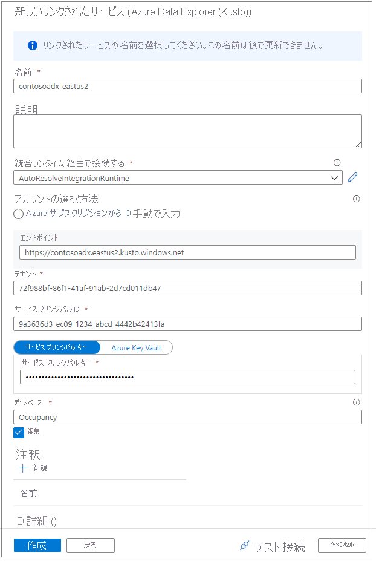
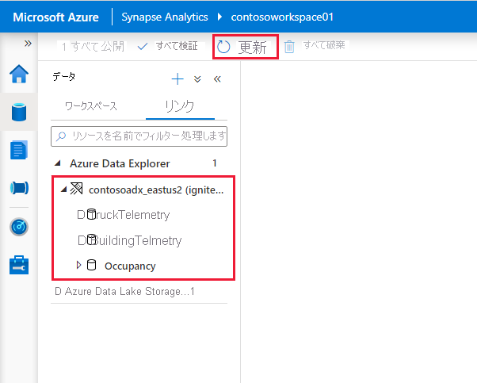
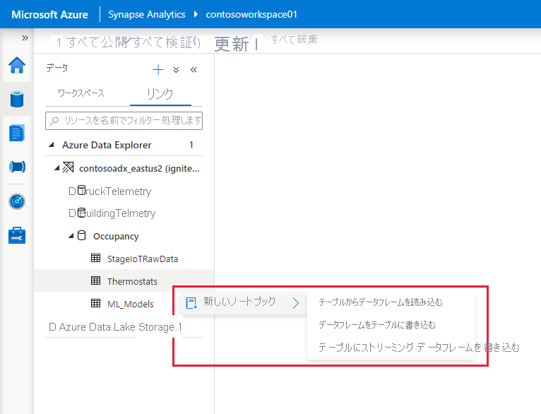

# Apache Spark for Azure Synapse Analytics を使用して Azure Data Explorer に接続する

この記事では、Apache Spark for Azure Synapse Analytics を使用して Synapse Studio から Azure Data Explorer データベースにアクセスする方法について説明します。

## 前提条件

* [Azure Data Explorer クラスターとデータベースを作成します](/azure/data-explorer/create-cluster-database-portal)。
* 既存の Azure Synapse Analytics ワークスペースを用意するか、[Azure Synapse ワークスペースの作成](./quickstart-create-workspace.md)に関するクイックスタートの手順に従って新しいワークスペースを作成します。
* 既存の Synapse Apache Spark プールを用意するか、次の記事の手順に従って新しいプールを作成します: [クイックスタート: Azure portal を使用して Apache Spark プールを作成する](./quickstart-create-apache-spark-pool-portal.md)。
* [Azure Active Directory (Azure AD) アプリケーションをプロビジョニングすることによって、Azure AD アプリを作成します](/azure/data-explorer/kusto/management/access-control/how-to-provision-aad-app)。
* 「[Azure Data Explorer のデータベース アクセス許可を管理する](/azure/data-explorer/manage-database-permissions)」の手順に従って、データベースへのアクセスを Azure AD アプリに許可します。

## Synapse Studio に移動する

Azure Synapse ワークスペースから、 **[Synapse Studio の起動]** を選択します。 Synapse Studio のホーム ページで、 **[データ]** を選択して **データ オブジェクト エクスプローラー** に移動します。

## Azure Data Explorer データベースを Azure Synapse ワークスペースに接続する

Azure Data Explorer データベースをワークスペースに接続するには、リンクされたサービスを使用します。 Azure Data Explorer のリンクされたサービスを使用すると、ユーザーは、Apache Spark for Azure Synapse からデータを参照して探索したり、読み書きしたりできます。 また、統合ジョブをパイプラインで実行することもできます。

データ オブジェクト エクスプローラーから Azure Data Explorer クラスターに直接接続するには、次の手順に従います。

1. **[データ]** の近くにある **+** アイコンを選択します。
1. 外部データに接続するために、 **[接続]** を選択します。
1. **[Azure Data Explorer (Kusto)]** を選択します。
1. **[続行]** をクリックします。
1. フレンドリ名を使用して、リンクされたサービスに名前を付けます。 この名前は、データ オブジェクト エクスプローラーに表示され、データベースに接続するために Azure Synapse ランタイムによって使用されます。
1. ご利用のサブスクリプションから Azure Data Explorer クラスターを選択するか、URI を入力します。
1. **[サービス プリンシパル ID]** と **[サービス プリンシパル キー]** に値を入力します。 このサービス プリンシパルに、読み取り操作用にデータベースに対する表示アクセス権と、データの取り込み用にインジェスターのアクセス権があることを確認します。
1. Azure Data Explorer データベースの名前を入力します。
1. **[接続のテスト]** を選択して、適切なアクセス許可があることを確認します。
1. **［作成］** を選択します

    

    > [!NOTE]
    > (省略可能) **[接続のテスト]** では、書き込みアクセス権は確認されません。 Azure Data Explorer データベースに対する書き込みアクセス権がサービス プリンシパル ID にあることを確認してください。

1. **[Linked]\(リンク済み\)** タブの **[Azure Data Explorer]** セクションに、Azure Data Explorer のクラスターとデータベースが表示されます。

    

    > [!NOTE]
    > 最新のリリースでは、Azure Data Explorer データベースに対する Azure AD アカウントのアクセス許可に基づいて、データベース オブジェクトの内容が設定されます。 Apache Spark ノートブックや統合ジョブを実行すると、リンク サービスにおける資格情報 (サービス プリンシパルなど) が使用されます。

## コード生成アクションをすばやく操作する

データベースまたはテーブルを右クリックすると、サンプルの Spark ノートブックの一覧が表示されます。 データの読み取り、書き込み、または Azure Data Explorer へのストリーム配信を行うオプションを選択します。

データ読み取りの例を次に示します。 ノートブックを対象の Spark プールにアタッチし、セルを実行します。

   > [!NOTE]
   > 初回実行時は、Spark セッションが開始されるまで 3 分以上かかる場合があります。 2 回目以降の実行時間は大幅に短縮されます。

## 制限事項

Azure Synapse マネージド仮想ネットワークでは現在、Azure Data Explorer コネクタがサポートされません。

## 次のステップ

* [高度なオプションを使用したサンプル コード](https://github.com/Azure/azure-kusto-spark/blob/master/samples/src/main/python/SynapseSample.py)
* [Azure Data Explorer (Kusto) Spark コネクタ](https://github.com/Azure/azure-kusto-spark)