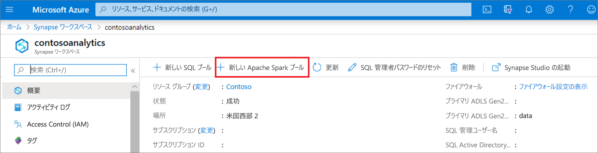
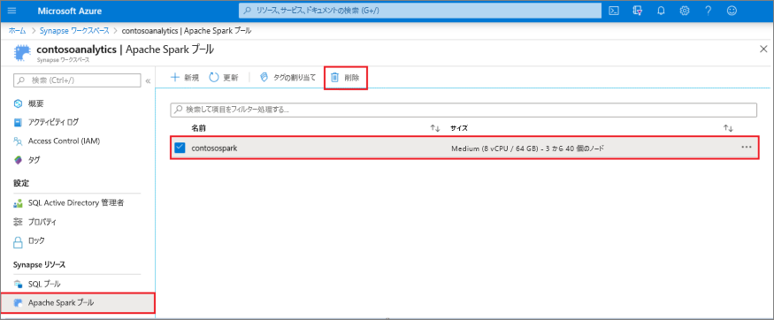
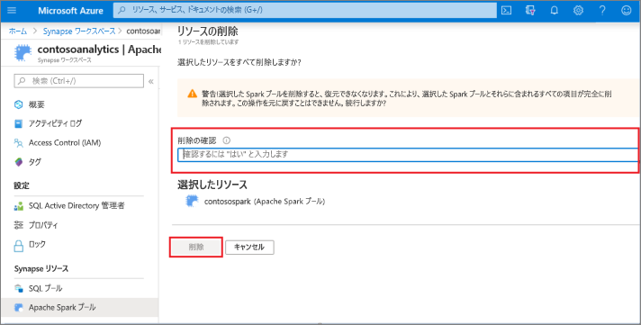

# クイック スタート: Azure portal を使用して Azure Synapse Analytics で Apache Spark GPU 対応プールを作成する

Apache Spark プールは、データの読み込み、モデル化、処理、および配布が可能なオープンソースのビッグデータのコンピューティング機能を提供し、より迅速な分析洞察を実現します。 Synapse では、バックエンドで GPU を使用する Apache Spark プールを作成し、高速処理のために GPU 上で Spark ワークロードを実行する機能が提供されるようになりました。

このクイックスタートでは、Azure portal を使用して、Azure Synapse Analytics ワークスペースに Apache Spark GPU 対応プールを作成する方法について説明します。

> [!NOTE]
> Azure Synapse GPU 対応プールは、現在、パブリック プレビュー段階にあります。

Azure サブスクリプションをお持ちでない場合は、[開始する前に無料アカウントを作成](https://azure.microsoft.com/free/)してください。

## 前提条件

- Azure サブスクリプション - [無料アカウントを作成する](https://azure.microsoft.com/free/)
- [Synapse Analytics ワークスペース](quickstart-create-workspace.md)

## Azure portal にサインインする

[Azure ポータル](https://portal.azure.com/)

## Synapse ワークスペースに移動する 
1. Synapse ワークスペースに移動します。ここでは、検索バーにサービス名 (またはリソース名を直接) 入力して、Apache Spark プールを作成します。

2. ワークスペースの一覧で、開くワークスペースの名前 (または名前の一部) を入力します。 この例では、**contosoanalytics** という名前のワークスペースを使用します。

## 新しい Azure Synapse GPU 対応プールを作成する

1. Apache Spark プールを作成する Synapse ワークスペースで、 **[新しい Apache Spark プール]** を選択します。
    
2. **[基本]** タブで、以下の詳細を入力します。

    |設定 | 推奨値 | 説明 |
    | :------ | :-------------- | :---------- |
    | **[Apache Spark pool name]\(Apache Spark プール名\)** | 有効なプール名 | これは、Apache Spark プールの名前です。 |
    | **ノード サイズ ファミリ** | ハードウェア アクセラレータ | ドロップダウンメニューから [ハードウェア アクセラレータ] を選択します |
    | **ノード サイズ** | 大 (16 vCPU / 110 GB / 1 GPU) | このクイックスタートのコストを削減するために、最小サイズに設定します |
    | **Autoscale** | 無効 | このクイックスタートでは、自動スケーリングは必要ありません |
    | **[Number of nodes]\(ノードの数\)** | 3 | このクイックスタートでは、コストを制限するために小さいサイズを使用します |

    ![Apache Spark プール作成のフロー - [基本] タブ。](media/quickstart-create-apache-spark-pool/create-spark-gpu-pool-portal-01.png)
    > [!IMPORTANT]
    > Apache Spark プールで使用できる名前には、特定の制限があることに注意してください。 名前は、文字または数字のみを含み、15 文字以下である必要があります。さらに、文字で始まり、予約語を含まず、ワークスペース内で一意である必要があります。

3. **[次へ: 追加設定]** をクリックして、既定の設定を確認します。 既定の設定は変更しないでください。 GPU プールは **Apache Spark 3.1 でのみ作成** できることに注意してください。
    ![[Additional settings]\(追加設定\) タブが選択されている [Create Apache Spark pool]\(Apache Spark プールの作成\) ページのスクリーンショット。](media/quickstart-create-apache-spark-pool/create-spark-gpu-pool-portal-02.png)

4. **[次へ: タグ]** を選択します。 タグは追加しないでください。

    ![Apache Spark プールの作成フロー - [additional settings]\(追加設定\) タブ。](media/quickstart-create-apache-spark-pool/create-spark-pool-03-tags.png)

5. **[Review + create]\(レビュー + 作成\)** を選択します。

6. 以前に入力した内容に基づいて詳細が正しいことを確認し、 **[作成]** を選択します。
    

7. この時点で、リソースのプロビジョニング フローが開始されます。完了すると、その旨が表示されます。
    !["Your deployment is complete (デプロイが完了しました)" というメッセージが表示された [概要] ページのスクリーンショット。](media/quickstart-create-apache-spark-pool/create-spark-pool-portal-06.png)

8. プロビジョニングが完了した後にワークスペースに戻ると、新しく作成された Azure Synapse GPU 対応プールの新しいエントリが表示されます。
    

9. この時点で、実行されているリソースはなく、Spark の料金は発生していません。この時点で、作成する Spark インスタンスに関するメタデータが作成されています。

## リソースをクリーンアップする

次の手順に従って、ワークスペースから Apache Spark プールを削除します。
> [!WARNING]
> Apache Spark プールを削除すると、ワークスペースから分析エンジンが削除されます。 プールに接続することはできなくなります。また、この Apache Spark プールを使用するすべてのクエリ、パイプライン、ノートブックは動作しなくなります。

Apache Spark プールを削除する場合は、次の手順を実行します。

1. ワークスペースの [Apache Spark プール] ブレードに移動します。
2. 削除する Apache Spark プール (この場合は **contosospark**) を選択します。
3. **[削除]** を押します。

 

4. 削除を確認し、 **[削除]** を押します。

 

5. プロセスが正常に完了すると、Apache Spark プールはワークスペース リソースの一覧に表示されなくなります。

## 次のステップ

- 「[クイック スタート: GPU プールで実行する Apache Spark ノートブックを作成する](spark/apache-spark-rapids-gpu.md)」を参照してください。
