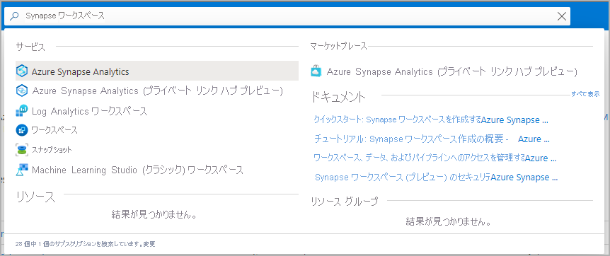
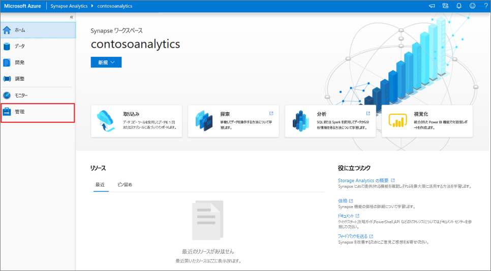
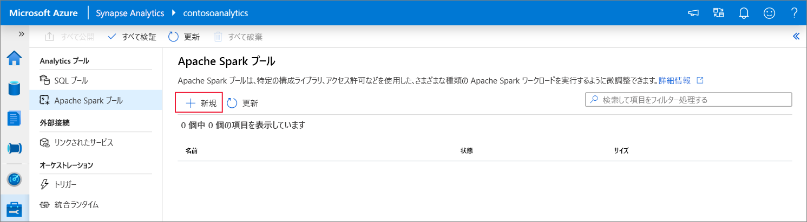
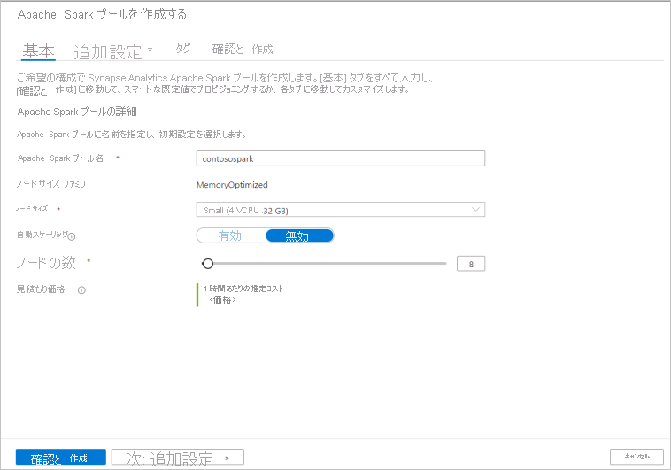
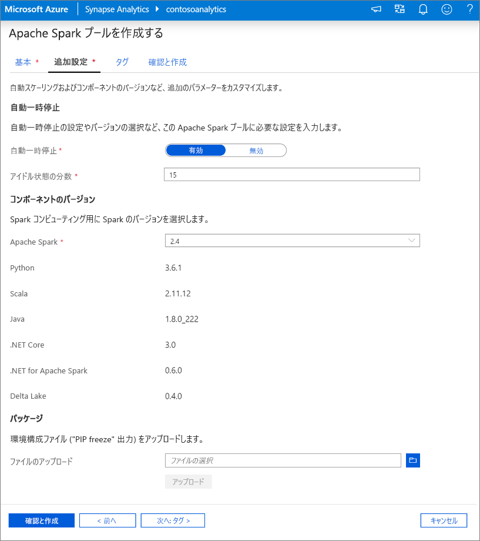
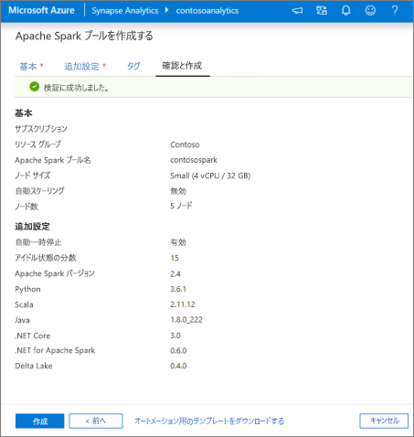
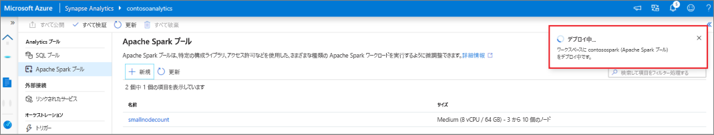
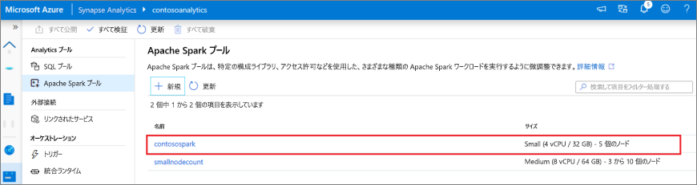
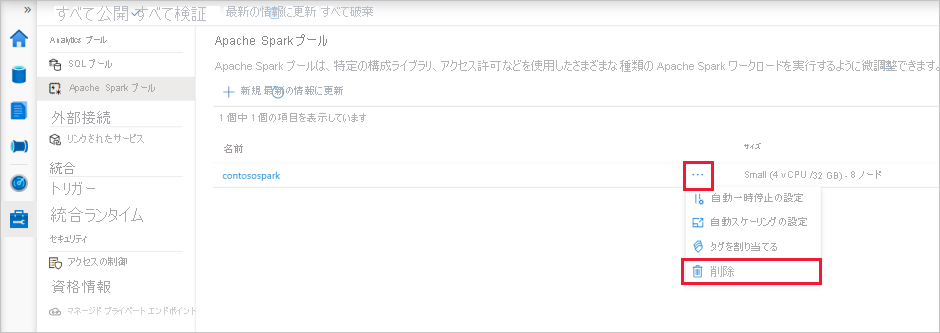
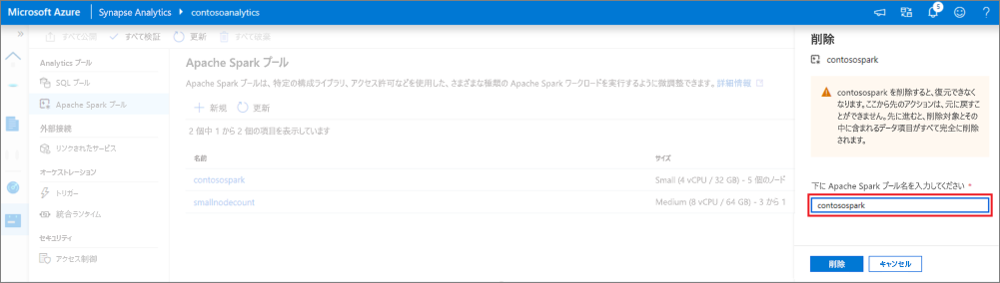

# クイック スタート:Synapse Studio を使用して Apache Spark プール (プレビュー) を作成する

Azure Synapse Analytics には、データの取り込み、変換、モデル化、分析、および提供に役立つさまざまな分析エンジンが用意されています。 Apache Spark プールは、オープンソースのビッグ データ コンピューティング機能を提供します。 お使いの Synapse ワークスペースに Apache Spark プールを作成した後、データを読み込み、モデル化し、処理し、提供して分析情報を得ることができます。  

このクイックスタートでは、Synapse Studio を使用して Synapse ワークスペースで Apache Spark プールを作成する手順を説明します。

> [!IMPORTANT]
> Spark インスタンスの料金は、それを使用しているかどうかに関係なく、分単位で課金されます。 必ず、Spark インスタンスの使用を終了した後にシャットダウンするか、短いタイムアウトを設定してください。 詳しくは、この記事の「**リソースのクリーンアップ**」をご覧ください。

Azure サブスクリプションをお持ちでない場合は、[開始する前に無料アカウントを作成](https://azure.microsoft.com/free/)してください。

## 前提条件

- Azure サブスクリプション - [無料アカウントを作成する](https://azure.microsoft.com/free/)
- [Synapse ワークスペース](./quickstart-create-workspace.md)

## Azure portal にサインインする

[Azure ポータル](https://portal.azure.com/)

## Synapse ワークスペースに移動する

1. Synapse ワークスペースに移動します。ここでは、検索バーにサービス名 (またはリソース名を直接) 入力して、Apache Spark プールを作成します。

1. ワークスペースの一覧で、開くワークスペースの名前 (または名前の一部) を入力します。 この例では、**contosoanalytics** という名前のワークスペースを使用します。

## Synapse Studio を起動する 

1. ワークスペースの概要で **[Synapse Studio の起動]** を選択して、Apache Spark プールを作成する場所を開きます。 検索バーにサービス名を入力するか、またはリソース名を直接入力します。
![[Synapse Studio の起動] が強調表示されている Azure portal の Synapse ワークスペースの概要。](media/quickstart-create-apache-spark-pool/create-spark-pool-studio-20.png)

## Synapse Studio で Apache Spark プールを作成する

1. Synapse Studio のホーム ページで、 **[管理]** アイコンを選択して、左側のナビゲーションの**管理ハブ**に移動します。

1. 管理ハブで、 **[Apache Spark プール]** セクションに移動して、ワークスペースで現在使用可能な Apache Spark プールの一覧を表示します。
![[Apache Spark プール] ナビゲーションが選択されている Synapse Studio の管理ハブ](media/quickstart-create-apache-spark-pool/create-spark-pool-studio-22.png)

1. **[+ 新規]** を選択します。新しい Apache Spark プールの作成ウィザードが表示されます。 

1. **[基本]** タブで、以下の詳細を入力します。

    | 設定 | 推奨値 | 説明 |
    | :------ | :-------------- | :---------- |
    | **[Apache Spark pool name]\(Apache Spark プール名\)** | contosospark | これは、Apache Spark プールの名前です。 |
    | **ノード サイズ** | Small (4 vCPU / 32 GB) (S (4 vCPU/32 GB)) | このクイックスタートのコストを削減するために、最小サイズに設定します |
    | **Autoscale** | 無効 | このクイックスタートでは、自動スケーリングは必要ありません |
    | **[Number of nodes]\(ノードの数\)** | 8 | このクイックスタートでは、コストを制限するために小さいサイズを使用します|
    
    
    > [!IMPORTANT]
    > Apache Spark プールで使用できる名前には、特定の制限があることに注意してください。 名前は、文字または数字のみを含み、15 文字以下である必要があります。さらに、文字で始まり、予約語を含まず、ワークスペース内で一意である必要があります。

1. 次のタブ ([追加設定]) では、すべての既定値をそのままにして、 **[確認と作成]** を押します (タブは追加しません)。
 

1. 現時点では、タグを追加しないため、 **[確認と作成]** を選択します。

1. **[確認と作成]** タブで、以前に入力した内容に基づいて詳細が正しいことを確認し、 **[作成]** をクリックします。 
 

1. Apache Spark プールのプロビジョニング プロセスが開始されます。

1. プロビジョニングが完了すると、新しい Apache Spark プールが一覧に表示されます。

## Synapse Studio を使用して Apache Spark プールのリソースをクリーンアップする

Synapse Studio を使用してワークスペースから Apache Spark プールを削除するには、次の手順に従います。
> [!WARNING]
> Spark プールを削除すると、ワークスペースから分析エンジンが削除されます。 プールに接続することはできなくなります。また、この Spark プールを使用するすべてのクエリ、パイプライン、ノートブックは動作しなくなります。

Apache Spark プールを削除する場合は、次の手順を実行します。

1. Synapse Studio で管理ハブにある Apache Spark プールに移動します。
1. 削除する Apache プールの横にある省略記号 (この場合は、**contosospark**) を選択して、Apache Spark プールのコマンドを表示します。

1. **[削除]** を押します。
1. 削除を確認し、 **[削除]** を押します。
 
1. プロセスが正常に完了すると、Apache Spark プールはワークスペース リソースの一覧に表示されなくなります。 

## 次のステップ

- 「[クイック スタート:Web ツールを使用した Synapse Studio での Apache Spark プールの作成](quickstart-apache-spark-notebook.md)。
- 「[クイック スタート:Azure portal を使用して Apache Spark プールを作成する](quickstart-create-apache-spark-pool-portal.md)。