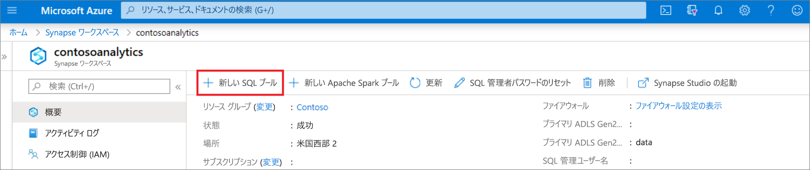
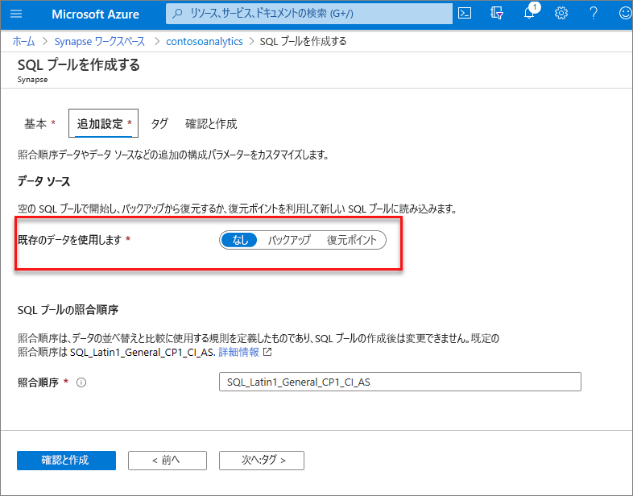
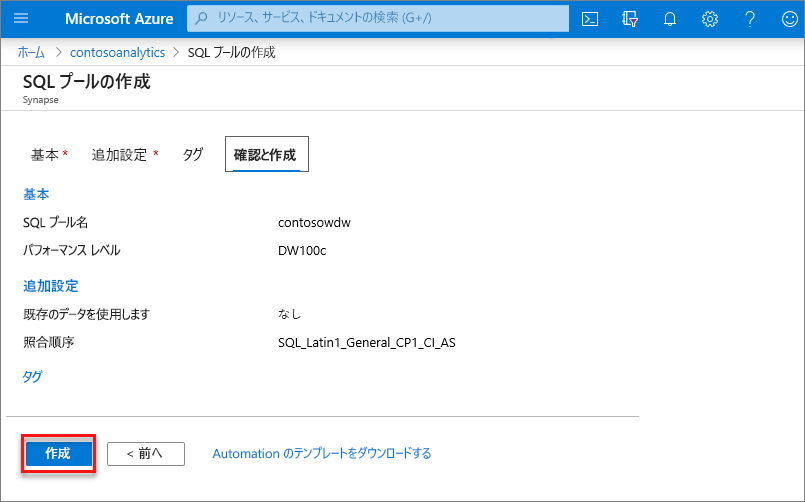
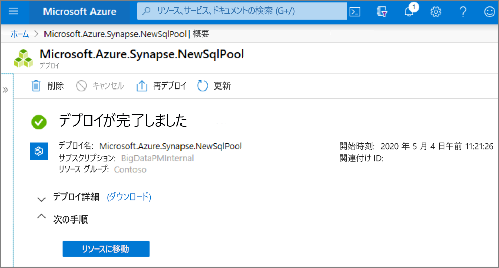
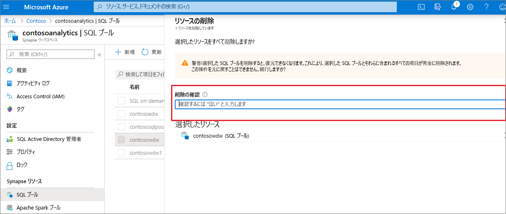

# クイックスタート: Azure portal を使用して専用 SQL プールを作成する

Azure Synapse Analytics には、データの取り込み、変換、モデル化、分析に役立つさまざまな分析エンジンが用意されています。 専用 SQL プールには、T-SQL ベースのコンピューティングとストレージの機能が用意されています。 お使いの Synapse ワークスペースに専用 SQL プールを作成した後、データを読み込み、モデル化し、処理し、提供して、分析情報を迅速に得ることができます。

このクイックスタートでは、Azure portal を使用して Synapse ワークスペースに専用 SQL プールを作成する方法について説明します。

Azure サブスクリプションをお持ちでない場合は、[開始する前に無料アカウントを作成](https://azure.microsoft.com/free/)してください。

## 前提条件

- Azure サブスクリプション - [無料アカウントを作成する](https://azure.microsoft.com/free/)
- [Synapse ワークスペース](./quickstart-create-workspace.md)

## Azure portal にサインインする

[Azure ポータル](https://portal.azure.com/)

## Synapse ワークスペースに移動する

1. Synapse ワークスペースに移動します。ここでは、検索バーにサービス名 (またはリソース名を直接) 入力して、専用 SQL プールを作成します。
 
1. ワークスペースの一覧で、開くワークスペースの名前 (または名前の一部) を入力します。 この例では、**contosoanalytics** という名前のワークスペースを使用します。

## 新しい専用 SQL プールを作成する

1. 専用 SQL プールを作成する Synapse ワークスペースで、上部のバーにある **[New dedicated SQL pool]\(新しい専用 SQL プール\)** コマンドを選択します。

2. **[基本]** タブで、以下の詳細を入力します。

    | 設定 | 推奨値 | 説明 |
    | :------ | :-------------- | :---------- |
    | **専用 SQL プールの名前** | 有効な名前 | 専用 SQL プールの名前。 |
    | **パフォーマンス レベル** | DW100c | このクイックスタートのコストを削減するために、最小サイズに設定します |

  
    ![専用 SQL プールの作成フロー - [基本] タブ。](media/quickstart-create-sql-pool/create-sql-pool-portal-02.png)

    > [!IMPORTANT]
    > 専用 SQL プールで使用できる名前には、特定の制限があることに注意してください。 名前には特殊文字を含めることはできず、15 文字以下である必要があり、予約語は使用できません。また、ワークスペース内で一意である必要があります。

3. **[Next:追加設定]** を選択します。
4. データなしで専用 SQL プールをプロビジョニングするには、 **[None]\(なし\)** を選択します。 既定の照合順序を選択したままにします。

    復元ポイントから専用の SQL プールを復元する場合は、 **[復元ポイント]** を選択します。 復元を実行する方法の詳細については、[既存の専用 SQL プールを復元する方法](backuprestore/restore-sql-pool.md)に関するページをご覧ください

5. **[Review + create]\(レビュー + 作成\)** を選択します。
6. 以前に入力した内容に基づいて詳細が正しいことを確認します。 **［作成］** を選択します

7. この時点で、リソース プロビジョニングのフローが開始されます。
 

8. プロビジョニングが完了した後にワークスペースに戻ると、新しく作成された専用 SQL プールの新しいエントリが表示されます。
 

専用 SQL プールが作成されると、データの読み込み、ストリームの処理、レイクからの読み取りなどのために、ワークスペースで使用できるようになります。

## リソースをクリーンアップする

次の手順に従って、ワークスペースから専用 SQL プールを削除します。
> [!WARNING]
> 専用 SQL プールを削除すると、そのワークスペースから、分析エンジンと、削除された専用 SQL プールのデータベースに格納されているデータの両方が削除されます。 専用 SQL プールに接続することはできなくなります。また、この専用 SQL プールに対して読み取りまたは書き込みを行うすべてのクエリ、パイプライン、ノートブックは動作しなくなります。

専用 SQL プールを削除するには、次の手順を完了します。

1. ワークスペース ブレードの [SQL プール] ブレードに移動します。
1. 削除する専用 SQL プール (この場合は **contosowdw**) を選択します
1. 選択したら、 **[削除]** を押します
1. 削除を確認し、 **[削除]** ボタンを押します
1. プロセスが正常に完了すると、専用 SQL プールはワークスペース リソースの一覧に表示されなくなります。

## 次のステップ

- 「[クイック スタート:Web ツールを使用して Synapse Studio でサーバーレス Apache Spark プールを作成する](quickstart-apache-spark-notebook.md)」を参照してください。
- 「[クイック スタート:Azure portal を使用してサーバーレス Apache Spark プールを作成する](quickstart-create-apache-spark-pool-portal.md)」を参照してください。
