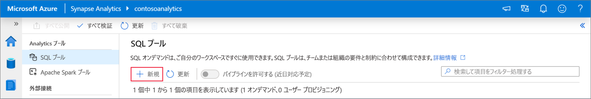
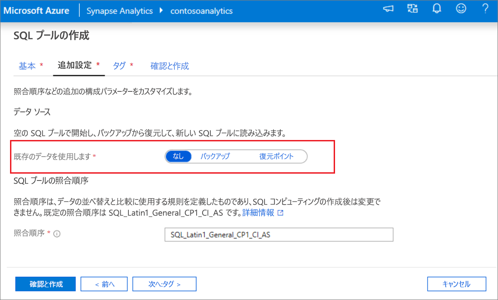
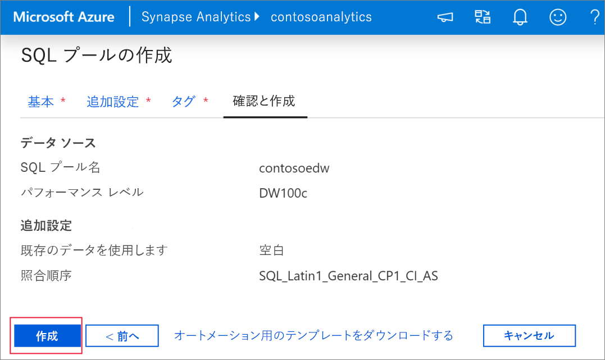
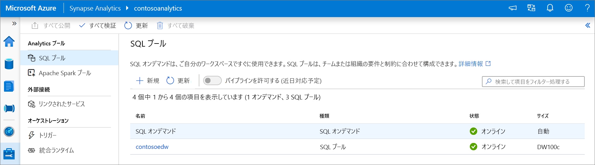
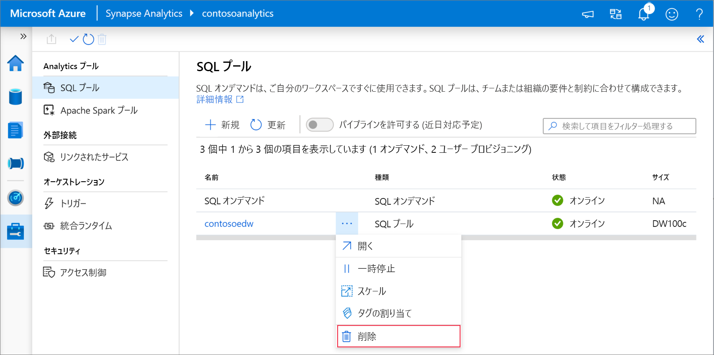
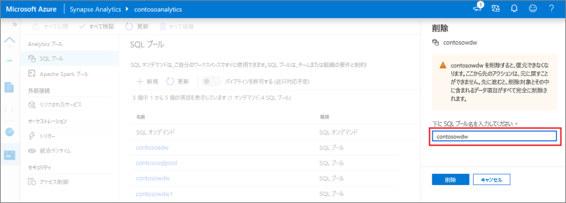

# クイック スタート:Synapse Studio を使用して Synapse SQL プール (プレビュー) を作成する

Azure Synapse Analytics には、データの取り込み、変換、モデル化、分析に役立つさまざまな分析エンジンが用意されています。 SQL プールには、T-SQL ベースのコンピューティングとストレージの機能が用意されています。 お使いの Synapse ワークスペースに SQL プールを作成した後、データを読み込み、モデル化し、処理し、提供して、分析情報を迅速に得ることができます。

このクイックスタートでは、Synapse Studio を使用して Synapse ワークスペースで SQL プールを作成する手順を説明します。

Azure サブスクリプションをお持ちでない場合は、[開始する前に無料アカウントを作成](https://azure.microsoft.com/free/)してください。

## 前提条件

- Azure サブスクリプション - [無料アカウントを作成する](https://azure.microsoft.com/free/)
- [Synapse ワークスペース](quickstart-create-workspace.md)

## Azure portal にサインインする

[Azure ポータル](https://portal.azure.com/)

## Synapse ワークスペースに移動する

1. Synapse ワークスペースに移動します。ここでは、検索バーにサービス名 (またはリソース名を直接) 入力して、SQL プールを作成します。

1. ワークスペースの一覧で、開くワークスペースの名前 (または名前の一部) を入力します。 この例では、**contosoanalytics** という名前のワークスペースを使用します。

## Synapse Studio を起動する

1. ワークスペースの概要で **[Synapse Studio の起動]** を選択して、SQL プールを作成する場所を開きます。 検索バーにサービス名を入力するか、またはリソース名を直接入力します。
![[Synapse Studio の起動] が強調表示されている Azure portal の Synapse ワークスペースの概要。](media/quickstart-create-apache-spark-pool/create-spark-pool-studio-20.png)

## Synapse Studio で SQL プールを作成する

1. Synapse Studio のホーム ページで、 **[管理]** アイコンを選択して、左側のナビゲーションの**管理ハブ**に移動します。

1. 管理ハブで、 **[SQL プール]** セクションに移動して、ワークスペースで現在使用可能な SQL プールの一覧を表示します。
![[SQL プール] ナビゲーションが選択されている Synapse Studio の管理ハブ](media/quickstart-create-sql-pool/create-sql-pool-studio-22.png)

1. **[+ 新規]** コマンドを選択します。新しい SQL プールの作成ウィザードが表示されます。 

1. **[基本]** タブで、以下の詳細を入力します。

    | 設定 | 推奨値 | 説明 |
    | :------ | :-------------- | :---------- |
    | **SQL プール名** | contosoedw | これは、SQL プールの名前です。 |
    | **パフォーマンス レベル** | DW100c | このクイックスタートのコストを削減するために、最小サイズに設定します |

    ![SQL プールの作成フロー - [基本] タブ。](media/quickstart-create-sql-pool/create-sql-pool-studio-24.png)
    > [!IMPORTANT]
    > SQL プールで使用できる名前には、特定の制限があることに注意してください。 名前には特殊文字を含めることはできず、15 文字以下である必要があり、予約語は使用できません。また、ワークスペース内で一意である必要があります。

4. 次の **[追加設定]** タブで、 **[なし]** を選択して、データを含まない SQL プールをプロビジョニングします。 既定の照合順序は、選択されたままにします。

1. 現時点では、タグを追加しないため、 **[次へ: 確認と作成]** をクリックします。

1. **[確認と作成]** タブで、以前に入力した内容に基づいて詳細が正しいことを確認し、 **[作成]** をクリックします。 

1. この時点で、リソース プロビジョニングのフローが開始されます。

1. プロビジョニングが完了した後にワークスペースに戻ると、新しく作成された SQL プールの新しいエントリが表示されます。
 

1. SQL プールが作成されると、ワークスペースでデータの読み込み、ストリームの処理、レイクからの読み取りなどに使用できるようになります。

## Synapse Studio を使用して SQL プールをクリーンアップする    

Synapse Studio を使用してワークスペースから SQL プールを削除するには、次の手順に従います。
> [!WARNING]
> SQL プールを削除すると、ワークスペースから分析エンジンが削除されます。 プールに接続することはできなくなります。また、この SQL プールを使用するすべてのクエリ、パイプライン、ノートブックは動作しなくなります。

SQL プールを削除する場合は、次の手順を行います。

1. Synapse Studio で管理ハブにある SQL プールに移動します。
1. 削除する SQL プールの省略記号 (この場合は、**contosoedw**) を選択して、SQL プールのコマンドを表示します。
1. **[削除]** を押します。
1. 削除を確認し、 **[削除]** を押します。
 
1. プロセスが正常に完了すると、SQL プールはワークスペース リソースの一覧に表示されなくなります。

## 次のステップ 
- 「[クイック スタート:Apache Spark ノートブックの作成](quickstart-apache-spark-notebook.md)に関するページを参照してください。
- 「[クイック スタート:Azure portal を使用した Synapse SQL プールの作成](quickstart-create-sql-pool-portal.md)。