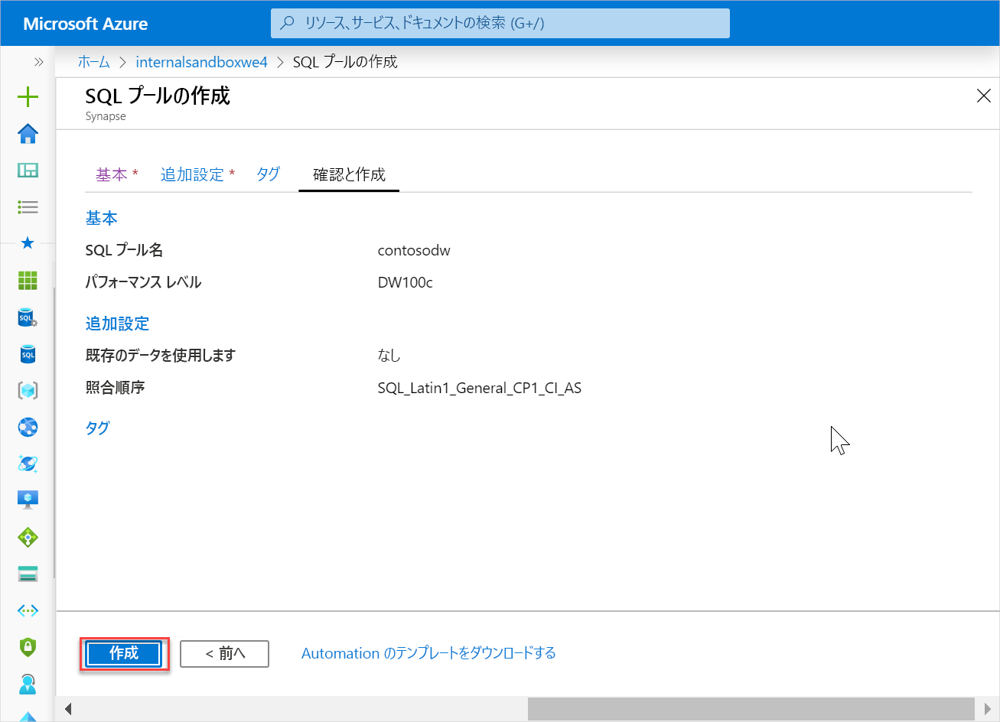
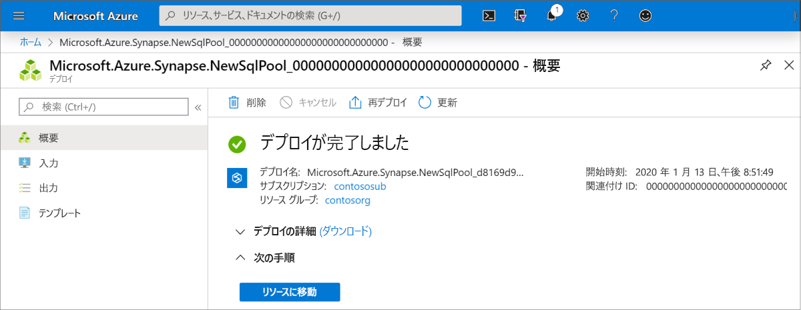
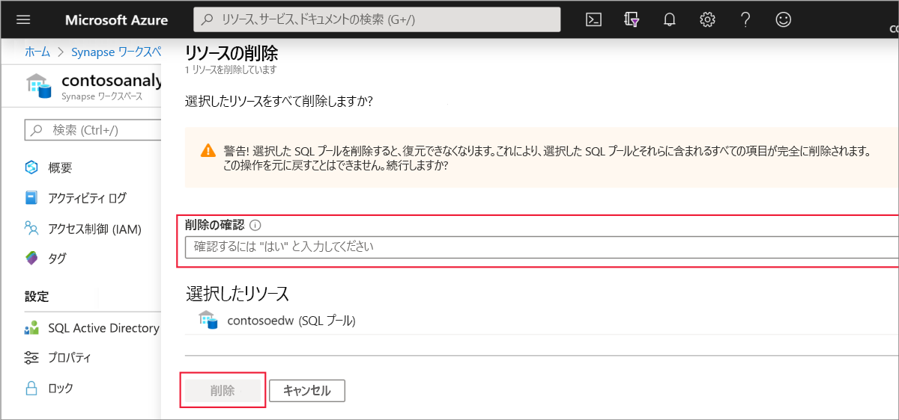

# クイック スタート:Synapse SQL プールを作成する

Azure Synapse Analytics には、データの取り込み、変換、モデル化、分析、および提供に役立つさまざまな分析エンジンが用意されています。 SQL プールには、T-SQL ベースのコンピューティングとストレージの機能が用意されています。 お使いの Synapse ワークスペースに SQL プールを作成した後、データを読み込み、モデル化し、処理し、提供して分析情報を得ることができます。

このクイックスタートでは、Azure portal を使用して Synapse ワークスペースに SQL プールを作成する方法について説明します。

Azure サブスクリプションをお持ちでない場合は、[開始する前に無料アカウントを作成](https://azure.microsoft.com/free/)してください。

## 前提条件

[Synapse ワークスペース](quickstart-create-workspace.md)

## Azure portal にサインインする

[Azure ポータル](https://portal.azure.com/)

## 新しい SQL プールを作成する

1. SQL プールを作成する Synapse ワークスペースで、上部のバーにある **[New SQL pool]\(新しい SQL プール\)** コマンドをクリックします。

2. **[基本]** タブに、以下の詳細を入力します。

    | 設定 | 推奨値 | 説明 |
    | :------ | :-------------- | :---------- |
    | **SQL プール名** | 有効な名前 | SQL プールの名前。 |
    | **パフォーマンス レベル** | DW100c | このクイックスタートのコストを削減するために、最小サイズに設定します |
    ||||
  
    ![SQL プールの作成フロー - [基本] タブ。](media/quickstart-create-sql-pool/quickstart-create-sql-pool-02.png)
    > [!IMPORTANT]
    > SQL プールで使用できる名前には、特定の制限があることに注意してください。 名前には特殊文字を含めることはできず、15 文字以下である必要があり、予約語は使用できません。また、ワークスペース内で一意である必要があります。

3. **[次へ: 追加設定]** を選択します。
4. データなしで SQL プールをプロビジョニングするには、 **[None]\(なし\)** を選択します。 既定の照合順序を選択したままにします。

5. **[Review + create]\(レビュー + 作成\)** をクリックします。
6. 以前に入力した内容に基づいて詳細が正しいことを確認し、 **[作成]** をクリックします。

7. この時点で、リソース プロビジョニングのフローが開始されます。
 

8. プロビジョニングが完了した後にワークスペースに戻ると、新しく作成された SQL プールの新しいエントリが表示されます。
 

## リソースをクリーンアップする

次の手順に従って、ワークスペースから SQL プールを削除します。
> [!WARNING]
> SQL プールを削除すると、そのワークスペースから、分析エンジンと、削除された SQL プールのデータベースに格納されているデータの両方が削除されます。 SQL プールに接続することはできなくなります。また、この SQL プールに対して読み取りまたは書き込みを行うすべてのクエリ、パイプライン、ノートブックは動作しなくなります。

SQL プールを削除するには、次の手順を完了します。

1. ワークスペース ブレードの [SQL プール] ブレードに移動します。
1. 削除する SQL プール (この場合は **contosoedw**) を選択します。
1. それを選択して、 **[削除]** を押します。
1. 削除を確認し、 **[削除]** ボタンを押します。
 
1. プロセスが正常に完了すると、SQL プールはワークスペース リソースの一覧に表示されなくなります。

SQL プールが作成されると、データの読み込み、ストリームの処理、レイクからの読み取りなどのために、ワークスペースで使用できるようになります。

## 次のステップ

- 「[クイック スタート:Web ツールを使用して Synapse Studio で Apache Spark プールを作成する](quickstart-apache-spark-notebook.md)。
- 「[クイック スタート:Azure portal を使用して Apache Spark プールを作成する](quickstart-create-apache-spark-pool.md)。
