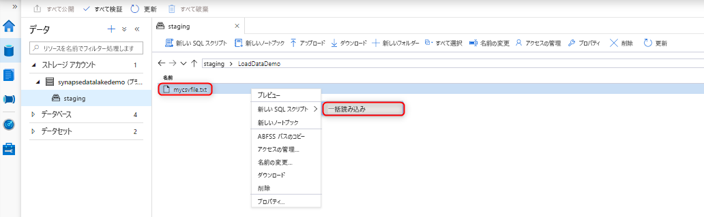
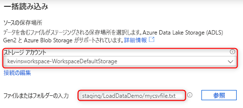
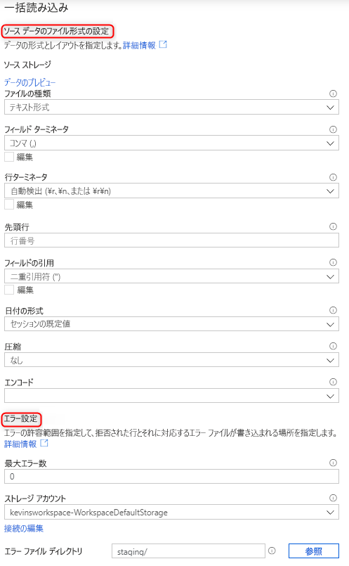
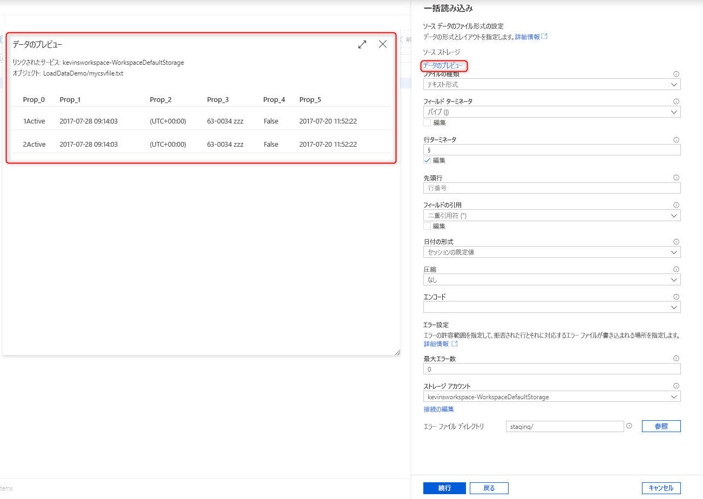
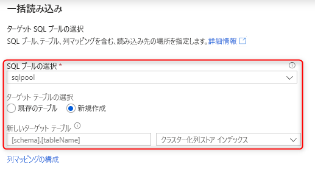
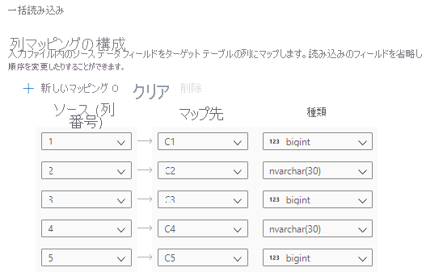
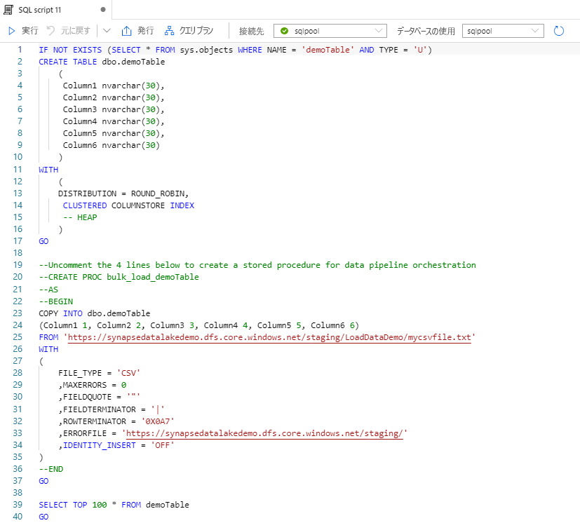

# Synapse SQL を使用したデータの一括読み込み

Synapse Studio の一括読み込みウィザードを使用すると、データの読み込みがかつてないほど簡単になります。 このウィザードの手順に従うと、[COPY ステートメント](https://docs.microsoft.com/sql/t-sql/statements/copy-into-transact-sql?view=azure-sqldw-latest)を使用して、データを一括で読み込むための T-SQL スクリプトを作成できます。 

## 一括読み込みウィザードへのエントリ ポイント

Synapse Studio 内の次の領域を右クリックするだけで、SQL プールを使用してデータの一括読み込みを簡単に実行できます。

- 自分のワークスペースにアタッチされた Azure ストレージ アカウントのファイルまたはフォルダー 

## 前提条件

- 少なくとも ADLS Gen2 アカウントに対するストレージ BLOB データ共同作成者 RBAC ロールがある状態で、ワークスペースにアクセスできる必要があります。

- [COPY ステートメントを使用するために必要なアクセス許可](https://docs.microsoft.com/sql/t-sql/statements/copy-into-transact-sql?view=azure-sqldw-latest#permissions)が必要です。さらに、読み込み先のテーブルを新しく作成する場合は、テーブルの作成アクセス許可が必要です。

- ADLS Gen2 アカウントに関連付けられている、リンクされたサービスには、読み込む**ファイル**/または**フォルダーへのアクセス権**が必要です。 たとえば、リンクされたサービスの認証メカニズムがマネージド ID の場合、ワークスペースのマネージド ID には、ストレージ アカウントに対するストレージ BLOB 閲覧者アクセス許可が少なくとも必要です。

- お使いのワークスペースで VNet が有効になっている場合は、ソース データとエラー ファイルの場所に対して ADLS Gen2 アカウントのリンクされたサービスに関連付けられている統合ランタイムで、インタラクティブな作成が有効になっていることを確認してください。 インタラクティブな作成は、ウィザード内での自動スキーマ検出、ソース ファイルの内容のプレビュー、および ADLS Gen2 ストレージ アカウントの参照に必要です。

### 手順

1. [Source storage location]\(ソース ストレージの場所\) パネルで、ストレージ アカウントと、読み込み元のファイルまたはフォルダーを選択します。

2. 拒否された行 (エラー ファイル) の書き込み先のストレージ アカウントを含め、ファイル形式設定を選択します。 現時点では、CSV ファイルと Parquet ファイルのみがサポートされています。

    

3. [データのプレビュー] をクリックすると、COPY ステートメントによってファイルがどのように解析されるかを確認できるため、ファイル形式設定を構成する際の参考にすることができます。 ファイル形式設定を変更するたびに [データのプレビュー] をクリックして、更新された設定で COPY ステートメントによってファイルがどのように解析されるかを確認します。 

4. 読み込みに使用する SQL プールを選択します (既存のテーブルへの読み込みか、新しいテーブルへの読み込みか)。

5. [Configure column mapping]\(列マッピングの構成\) をクリックして、列マッピングが適切であることを確認します。 新しいテーブルの場合、ターゲット列のデータ型を更新するには、列マッピングを構成することが非常に重要です。

6. [スクリプトを開く] をクリックすると、COPY ステートメントを使用してデータ レイクから読み込むための T-SQL スクリプトが生成されます。

## 次のステップ

- [COPY ステートメント](https://docs.microsoft.com/sql/t-sql/statements/copy-into-transact-sql?view=azure-sqldw-latest#syntax)に関する記事を参照して COPY 機能の詳細を確認する
- [データ読み込みの概要](https://docs.microsoft.com/azure/synapse-analytics/sql-data-warehouse/design-elt-data-loading#what-is-elt)に関する記事を参照する
