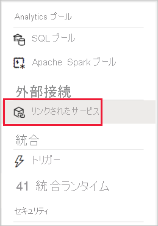
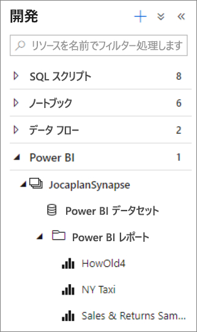
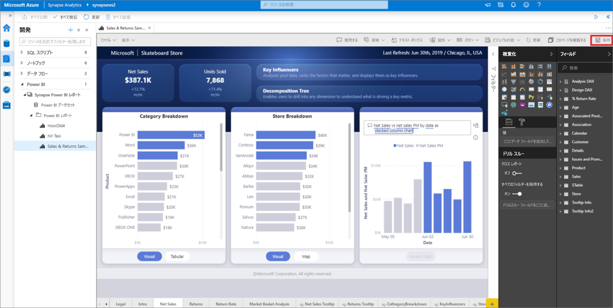

# クイック スタート:Power BI ワークスペースを Synapse Analytics ワークスペースにリンクする (プレビュー)

このクイックスタートでは、Power BI ワークスペースを Synapse Analytics ワークスペースに接続して、Synapse Studio (プレビュー) から新しい Power BI レポートとデータセットを作成する方法について説明します。

Azure サブスクリプションをお持ちでない場合は、[開始する前に無料アカウントを作成](https://azure.microsoft.com/free/)してください。

## 前提条件

- [Azure Synapse ワークスペースと、関連するストレージ アカウントを作成します](quickstart-create-workspace.md)
- [Power BI Professional または Premium ワークスペース](https://docs.microsoft.com/power-bi/service-create-the-new-workspaces)

## Power BI ワークスペースを Synapse ワークスペースにリンクする

1. Synapse Studio から、 **[管理]** をクリックします。

    ![Synapse Studio で [管理] をクリックします。](media/quickstart-link-powerbi/synapse-studio-click-manage.png)

2. **[外部接続]** で、 **[リンクされたサービス]** をクリックします。

    

3. **[+ 新規]** をクリックします。

    ![リンクされたサービスの [+ 新規] が強調表示されています。](media/quickstart-link-powerbi/new-highlighted.png)

4. **[Power BI]** をクリックし、 **[続行]** をクリックします。

    

5. リンクされたサービスの名前を入力し、ドロップダウン リストからワークスペースを選択します。

    

6. **Create** をクリックしてください。

## Synapse Studio で Power BI ワークスペースを表示する

ワークスペースがリンクされると、Synapse Studio から Power BI データセットを参照でき、新しい Power BI レポートを作成して編集することもできます。

1. **[開発]** をクリックします。

    ![Synapse Studio で [開発] をクリックします。](media/quickstart-link-powerbi/synapse-studio-click-develop.png)

2. [Power BI] を展開し、使用するワークスペースを展開します。

    

新しいレポートを作成するには、 **[開発]** タブの上部にある **+** をクリックします。既存のレポートを編集するには、レポート名をクリックします。 保存した変更は、Power BI ワークスペースに書き戻されます。

## 次のステップ

[Azure Storage に格納されているファイルについて Power BI レポートを作成する](sql/tutorial-connect-power-bi-desktop.md)の詳細を確認します。
