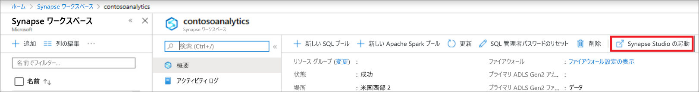
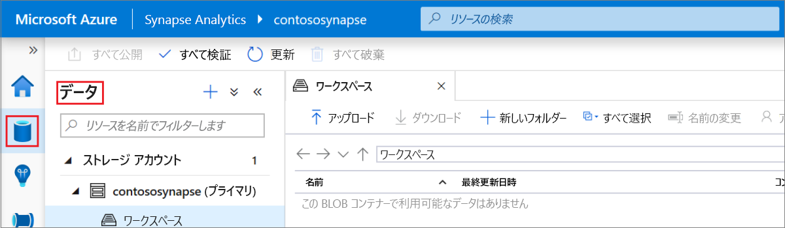
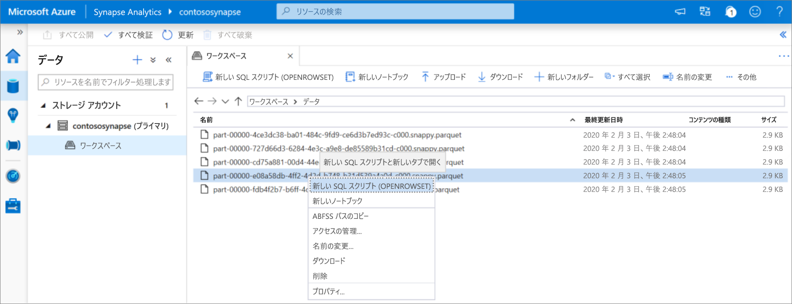
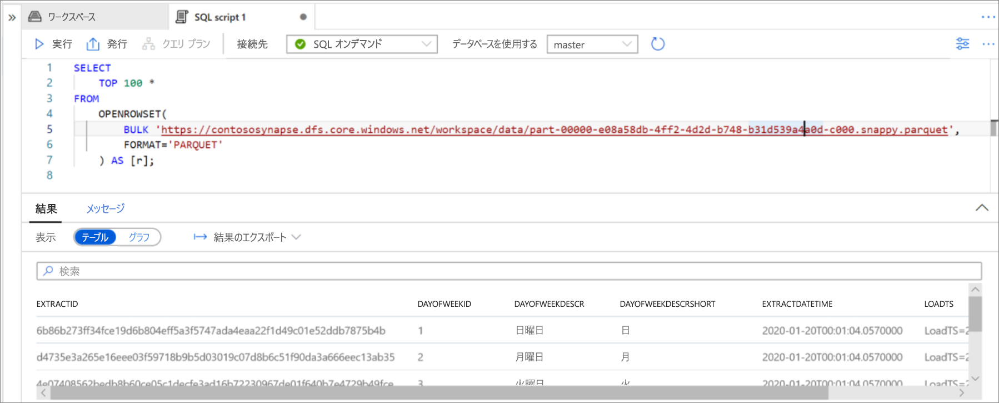

# クイック スタート:Synapse Studio (プレビュー) の使用

このクイックスタートでは、Synapse Studio を使用してファイルに対するクエリを実行する方法について説明します。

Azure サブスクリプションをお持ちでない場合は、開始する前に[無料](https://azure.microsoft.com/free/)アカウントを作成してください。

## Azure portal にサインインする

[Azure portal](https://portal.azure.com/) にサインインします。

## 前提条件

[Azure Synapse ワークスペースと、関連するストレージ アカウントを作成します](quickstart-create-workspace.md)。

## Synapse Studio を起動する

Azure portal の Azure Synapse ワークスペースで、 **[Launch Synapse Studio]\(Synapse Studio の起動\)** をクリックします。

または、[[Azure Synapse Analytics]](https://web.azuresynapse.net) をクリックし、適切なテナント、サブスクリプション、およびワークスペースの値を指定して Synapse Studio を起動することもできます。

## ストレージ アカウントを参照する

Synapse Studio を開いたら、 **[データ]** を参照し、 **[ストレージ アカウント]** を展開して、ワークスペース内のストレージ アカウントを表示します。

新しいフォルダーを作成し、ツールバーのリンクを使用してファイルをアップロードして、ファイルを整理することができます。

## ストレージ アカウントのファイルに対してクエリを実行する

> [!IMPORTANT]
> ファイルに対してクエリを実行できるようにするには、基になるストレージの `Storage Blob Reader` ロールのメンバーである必要があります。 [Azure Storage で**ストレージ BLOB データ閲覧者**または**ストレージ BLOB データ共同作成者**の RBAC アクセス許可を割り当てる](../storage/common/storage-auth-aad-rbac-portal.md?toc=/azure/synapse-analytics/toc.json&bc=/azure/synapse-analytics/breadcrumb/toc.json#assign-a-built-in-rbac-role)方法について確認してください。

1. いくつかの `PARQUET` ファイルをアップロードします。
2. 1 つ以上のファイルを選択し、新しい SQL スクリプトまたは Spark ノートブックを作成して、ファイルの内容を確認します。 ノートブックを作成する場合は、[ワークスペースに Apache Spark プール](quickstart-create-apache-spark-pool.md)を作成する必要があります。

   

3. 生成されたクエリまたはノートブックを実行して、ファイルの内容を確認します。

   

4. クエリを変更して、結果のフィルター処理と並べ替えを行うことができます。 SQL オンデマンドで利用可能な言語機能については、[SQL 機能の概要](sql/overview-features.md)に関する記事を参照してください。

## 次のステップ

- [Azure Storage で**ストレージ BLOB データ閲覧者**または**ストレージ BLOB データ共同作成者**の RBAC アクセス許可](../storage/common/storage-auth-aad-rbac-portal.md?toc=/azure/synapse-analytics/toc.json&bc=/azure/synapse-analytics/breadcrumb/toc.json#assign-a-built-in-rbac-role)を割り当てることにより、Azure AD ユーザーがファイルに対してクエリを実行できるようにする
- [SQL オンデマンドを使用して、Azure Storage 上のファイルに対してクエリを実行する](sql/on-demand-workspace-overview.md)
- [Azure portal を使用して Apache Spark プールを作成する](quickstart-create-apache-spark-pool.md)
- [Azure Storage に格納されているファイルについて Power BI レポートを作成する](sql/tutorial-connect-power-bi-desktop.md)
