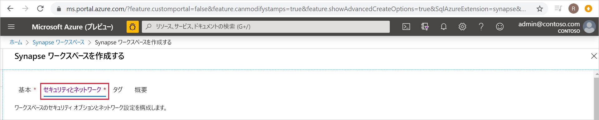
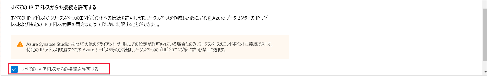

# Azure Synapse Analytics の IP ファイアウォール規則 (プレビュー)

この記事では、IP ファイアウォール規則について説明し、それを Azure Synapse Analytics で構成する方法を示します。

## IP ファイアウォール規則

IP ファイアウォール規則は、各要求の発信元 IP アドレスに基づいて Synapse ワークスペースへのアクセス権を付与または拒否します。 お使いのワークスペースに対して IP ファイアウォール規則を構成できます。 ワークスペース レベルで構成された IP ファイアウォール規則は、ワークスペースのすべてのパブリック エンドポイント (SQL プール、SQL オンデマンド、および開発) に適用されます。

## IP ファイアウォール規則の作成および管理

IP ファイアウォール規則を Synapse ワークスペースに追加するには、2 つの方法があります。 IP ファイアウォールをワークスペースに追加するには、 **[Security + networking]\(セキュリティ + ネットワーク\)** を選択し、ワークスペースの作成時に **[Allow connections from all IP addresses]\(すべての IP アドレスからの接続を許可する\)** をオンにします。

また、ワークスペースの作成後に、Synapse ワークスペースに IP ファイアウォール規則を追加することもできます。 Azure portal の **[セキュリティ]** の下で **[ファイアウォール]** を選択します。 新しい IP ファイアウォール規則を追加するには、それに名前、開始 IP、および終了 IP を指定します。 完了したら、 **[保存]** を選択します。

## 独自のネットワークから Synapse に接続する

Synapse Studio を使用して、Synapse ワークスペースに接続できます。 また、SQL Server Management Studio (SSMS) を使用して、ワークスペース内の SQL リソース (SQL プールと SQL オンデマンド) に接続することもできます。

ネットワークおよびローカル コンピューターのファイアウォールで、Synapse Studio に対して TCP ポート 80、443、および 1443 での送信通信を許可するように設定してください。

また、Synapse Studio に対して UDP ポート 53 での送信通信を許可する必要があります。 SSMS や Power BI などのツールを使用して接続するには、TCP ポート1433での送信通信を許可する必要があります。

既定のリダイレクト接続ポリシー設定を使用している場合は、追加のポートで送信通信を許可することが必要になる場合があります。 接続ポリシーの詳細については、[こちら](https://docs.microsoft.com/azure/sql-database/sql-database-connectivity-architecture#connection-policy)を参照してください。

## 次のステップ

[Azure Synapse ワークスペース](../quickstart-create-workspace.md)を作成する

[マネージド ワークスペース VNet](./synapse-workspace-managed-vnet.md) を使用して Azure Synapse ワークスペースを作成する