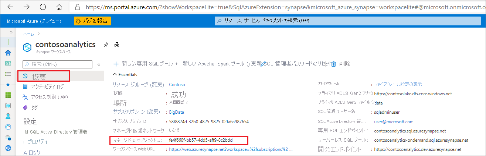
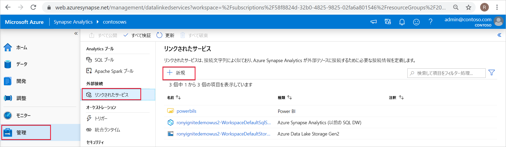
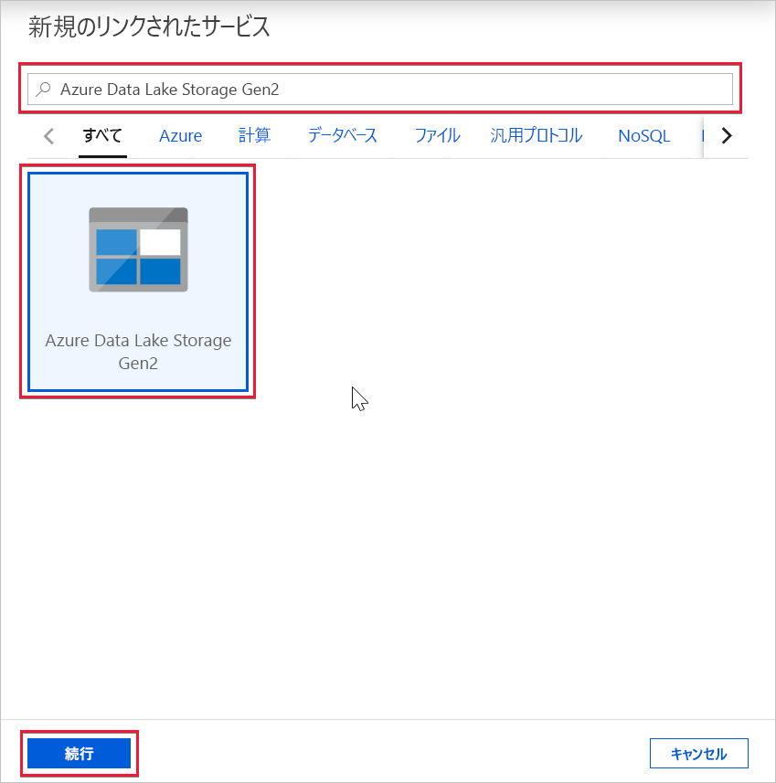
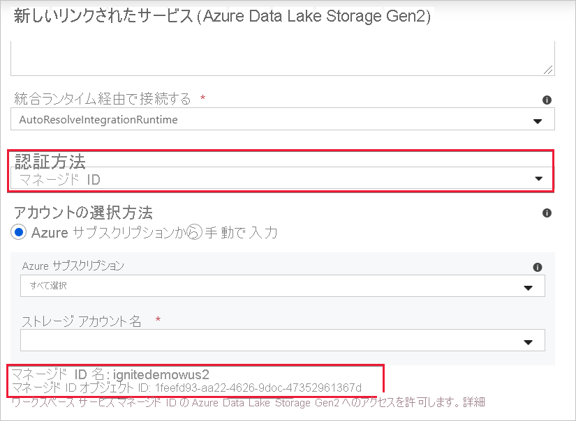

# Azure Synapse ワークスペース マネージド ID (プレビュー)

この記事では、Azure Synapse ワークスペースのマネージド ID について学習します。

## マネージド ID

Azure リソースのマネージド ID は、Azure Active Directory の機能です。 Azure AD で自動的に管理される ID を Azure サービスに提供する機能となります。 マネージド ID 機能を使用して、Azure AD 認証をサポートする任意のサービスを認証できます。

Azure リソースのマネージド ID は、以前のマネージド サービス ID (MSI) の新しい名前です。 詳細については、[マネージド ID](../../active-directory/managed-identities-azure-resources/overview.md?toc=/azure/synapse-analytics/toc.json&bc=/azure/synapse-analytics/breadcrumb/toc.json) に関するページを参照してください。

## Azure Synapse ワークスペース マネージド ID

ワークスペースを作成すると、Azure Synapse ワークスペースに対して、システムによって割り当てられたマネージド ID が作成されます。

>[!NOTE]
>このワークスペース マネージド ID は、このドキュメントの残りの部分ではマネージド ID と呼ばれます。

Azure Synapse では、マネージド ID を使用してパイプラインを調整します。 マネージド ID のライフサイクルは、Azure Synapse ワークスペースに直接関連付けられています。 Azure Synapse ワークスペースを削除すると、マネージド ID もクリーンアップされます。

ワークスペース マネージド ID には、パイプラインで操作を実行するためのアクセス許可が必要です。 アクセス許可を付与するときに、オブジェクト ID または Azure Synapse ワークスペース名を使用してマネージド ID を見つけることができます。

## Azure portal でマネージド ID を取得する

Azure portal でマネージド ID を取得できます。 Azure portal で Azure Synapse ワークスペースを開き、左側のナビゲーションから **[概要]** を選択します。 マネージド ID オブジェクト ID がメイン画面に表示されます。

マネージド ID 情報は、マネージド ID 認証をサポートするリンクされたサービスを Azure Synapse Studio から作成するときにも表示されます。

**Azure Synapse Studio** を起動し、左側のナビゲーションから **[管理]** タブを選択します。 次に、 **[リンクされたサービス]** を選択し、 **[+ 新規]** オプションを選択して、新しいリンクされたサービスを作成します。

**[新しいリンクされたサービス]** ウィンドウで、「*Azure Data Lake Storage Gen2*」と入力します。 リストから **[Azure Data Lake Storage Gen2]** のリソースの種類を選択し、 **[続行]** をクリックします。

次のウィンドウで、 **[認証方法]** として **[マネージド ID]** を選択します。 マネージド ID の**名前**と**オブジェクト ID** が表示されます。

## 次のステップ

[Azure Synapse ワークスペース マネージド ID へのアクセス許可の付与](./how-to-grant-workspace-managed-identity-permissions.md)
