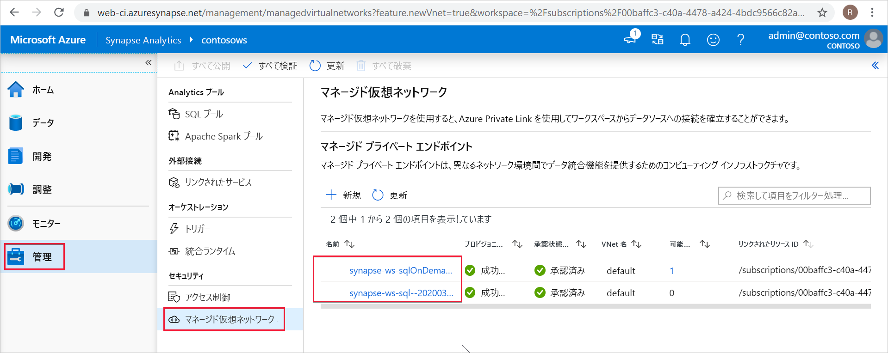

# Synapse マネージド プライベート エンドポイント (プレビュー)

この記事では、Azure Synapse Analytics のマネージド プライベート エンドポイントについて説明します。

## マネージド プライベート エンドポイント

マネージド プライベート エンドポイントは、マネージド ワークスペース VNet に作成されるプライベート エンドポイントです。Azure リソースへのプライベート リンクを確立します。 これらのプライベート エンドポイントは、Azure Synapse によって自動的に管理されます。

Azure Synapse では、プライベート リンクがサポートされます。 プライベート リンクを使用することで、Azure のサービス (Azure Storage、Azure Cosmos DB、Azure SQL Data Warehouse) や Azure でホストされている顧客またはパートナーのサービスに対し、Azure VNet から安全にアクセスすることができます。

プライベート リンクを使用しているときは、VNet とワークスペースとの間のトラフィックが、Microsoft のバックボーン ネットワークのみを使って送信されます。 プライベート リンクによって、データ流出のリスクから身を守ることができます。 リソースへのプライベート リンクは、プライベート エンドポイントを作成することによって確立します。

プライベート エンドポイントでは、自分の VNet からのプライベート IP アドレスを使用して、サービスを実質的に VNet に取り込みます。 プライベート エンドポイントは、サービス全体にではなく Azure 内の特定のリソースにマップされます。 顧客は、その組織で承認されている特定のリソースに接続を制限することができます。 [プライベート リンクとプライベート エンドポイント](https://docs.microsoft.com/azure/private-link/)についての詳しい情報をご覧ください。

>[!IMPORTANT]
>マネージド プライベート エンドポイントは、マネージド ワークスペース VNet を使用した Azure Synapse ワークスペースでのみサポートされます。
>[!NOTE]
>Azure のデータ ソースとの接続にはすべて、マネージド プライベート エンドポイントを作成することをお勧めします。 マネージド ワークスペース VNet からのアウトバウンド トラフィックは将来すべてブロックされます。

Azure Synapse のマネージド プライベート エンドポイントを作成すると、プライベート エンドポイント接続が "保留" 状態で作成されます。 承認ワークフローが開始されます。 接続を承認または拒否する役割は、プライベート リンク リソースの所有者が担います。

所有者が接続を承認した場合、プライベート リンクが確立されます。 それ以外の場合、プライベート リンクは確立されません。 どちらの場合も、マネージド プライベート エンドポイントは接続の状態で更新されます。

承認済み状態のマネージド プライベート エンドポイントのみが、指定されたプライベート リンク リソースにトラフィックを送信できます。

## SQL プールと SQL オンデマンドのマネージド プライベート エンドポイント

SQL プールと SQL オンデマンドは、Azure Synapse ワークスペースにおける分析機能です。 これらの機能では、[マネージド ワークスペース VNet](./synapse-workspace-managed-vnet.md) にはデプロイされていないマルチテナント インフラストラクチャが使用されます。

ワークスペースが作成されると、そのワークスペースに、SQL プールと SQL オンデマンドに対する 2 つのマネージド プライベート エンドポイントが Azure Synapse によって作成されます。 

この 2 つのマネージド プライベート エンドポイントは、Azure Synapse Studio に一覧表示されます。 左側のナビゲーションで **[管理]** を選択し、 **[Managed Virtual Networks]\(マネージド仮想ネットワーク\)** を選択すると、それらが Studio に表示されます。

SQL プールを対象としたマネージド プライベート エンドポイントは *synapse-ws-sql--\<workspacename\>* で、SQL オンデマンドを対象にしたマネージド プライベート エンドポイントは *synapse-ws-sqlOnDemand--\<workspacename\>* です。

Azure Synapse ワークスペースを作成すると、この 2 つのマネージド プライベート エンドポイントが自動的に作成されます。 この 2 つのマネージド プライベート エンドポイントに対して課金されることはありません。

## 次のステップ

[データ ソースへのマネージド プライベート エンドポイントを作成する](./how-to-create-managed-private-endpoints.md)
