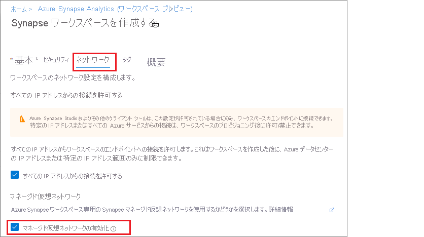

# Azure Synapse Analytics のマネージド仮想ネットワーク (プレビュー)

この記事では、Azure Synapse Analytics のマネージド仮想ネットワークについて説明します。

## マネージド ワークスペース VNet

Azure Synapse ワークスペースを作成するときに、そのワークスペースを VNet に関連付けることを選択できます。 ワークスペースに関連付けられた VNet は、Azure Synapse によって管理されます。 この VNet は、"*マネージド ワークスペース VNet*" と呼ばれます。

マネージド ワークスペース VNet によってもたらされる価値として、次の 4 つの点が挙げられます。

- マネージド ワークスペース VNet を使用すると、VNet の管理負荷を Azure Synapse にオフロードすることができます。
- VNet への Azure Synapse 管理トラフィックを許可するインバウンド NSG ルールを、独自の VNet に対して自分で構成する必要がありません。 そのような NSG ルールの構成ミスは、顧客へのサービス中断を招きます。
- Spark クラスター用のサブネットをピーク負荷に基づいて自分で作成する必要がありません。
- マネージド ワークスペース VNet は、マネージド プライベート エンドポイントと共に、データ流出への保護対策となります。 マネージド プライベート エンドポイントは、マネージド ワークスペース VNet が関連付けられているワークスペースにしか作成できません。

マネージド ワークスペース VNet が関連付けられたワークスペースを作成することによって、そのワークスペースのネットワークは、他のワークスペースから確実に分離されます。 Azure Synapse のワークスペースには、データ統合、Apache Spark、SQL プール、SQL オンデマンドなど、さまざまな分析機能が用意されています。

マネージド ワークスペース VNet が関連付けられているワークスペースには、データ統合および Spark リソースがデプロイされます。 さらに、マネージド ワークスペース VNet では、Spark のアクティビティに関して、ユーザーレベルの分離性が確保されます。それぞれの Spark クラスターが独自のサブネットに配置されるためです。

SQL プールと SQL オンデマンドはマルチテナントの機能であるため、マネージド ワークスペース VNet の外に存在します。 ワークスペース内の SQL プールと SQL オンデマンドへの通信には、Azure Private Link が使用されます。 このプライベート リンクは、マネージド ワークスペース VNet を関連付けたワークスペースを作成すると自動的に作成されます。

>[!IMPORTANT]
>このワークスペースの構成は、ワークスペースの作成後に変更することはできません。 たとえば、マネージド ワークスペース VNet が関連付けられていないワークスペースを再構成して、VNet を関連付けることはできません。 同様に、マネージド ワークスペース VNet が関連付けられているワークスペースを再構成して、VNet の関連付けを解除することもできません。

## マネージド ワークスペース VNet を使用して Azure Synapse ワークスペースを作成する

マネージド ワークスペース VNet が関連付けられた Azure Synapse ワークスペースを作成するには、Azure portal の **[セキュリティとネットワーク]** タブを選択し、 **[マネージド仮想ネットワークの有効化]** チェック ボックスをオンにします。

チェック ボックスをオフのままにした場合、ワークスペースには VNet が関連付けられません。

>[!IMPORTANT]
>プライベート リンクは、マネージド ワークスペース VNet があるワークスペースでしか使用できません。

>[!NOTE]
>マネージド ワークスペース VNet からのアウトバウンド トラフィックは将来すべてブロックされます。 データ ソースへの接続にはすべて、マネージド プライベート エンドポイントの使用をお勧めします。

Azure Synapse ワークスペースがマネージド ワークスペース VNet に関連付けられているかどうかは、Azure portal の **[概要]** を選択して確認できます。

## 次のステップ

[Azure Synapse ワークスペース](../quickstart-create-workspace.md)を作成する

[マネージド プライベート エンドポイント](./synapse-workspace-managed-private-endpoints.md)について理解を深める

[データ ソースへのマネージド プライベート エンドポイントを作成する](./how-to-create-managed-private-endpoints.md)
