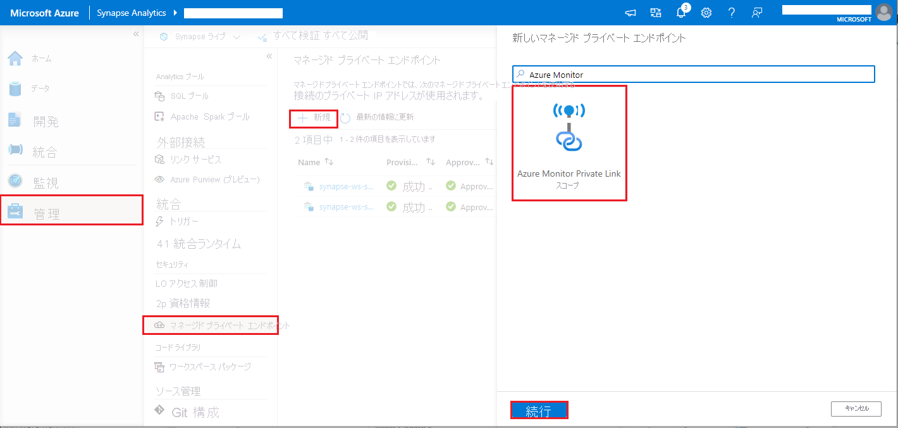

# <a name="monitor-apache-spark-applications-with-azure-log-analytics"></a>Azure Log Analytics を使用して Apache Spark アプリケーションを監視する

このチュートリアルでは、Log Analytics に組み込まれている Synapse Studio コネクタを有効にする方法について説明します。 その後、Apache Spark アプリケーションのメトリックとログを収集し、[Log Analytics ワークスペース](../../azure-monitor/logs/quick-create-workspace.md)に送信できます。 最後に、Azure Monitor ブックを利用してメトリックとログを視覚化できます。

## <a name="configure-workspace-information"></a>ワークスペース情報を構成する

次の手順に従って、Synapse Studio で必要な情報を構成します。

### <a name="step-1-create-a-log-analytics-workspace"></a>手順 1: Log Analytics ワークスペースを作成する

次のいずれかのリソースを参照して、ワークスペースを作成します。
- [Azure portal でワークスペースを作成する](../../azure-monitor/logs/quick-create-workspace.md)
- [Azure CLI を使用してワークスペースを作成する](../../azure-monitor/logs/resource-manager-workspace.md)
- [PowerShell を使用して Azure Monitor でワークスペースを作成して構成する](../../azure-monitor/logs/powershell-workspace-configuration.md)

### <a name="step-2-prepare-an-apache-spark-configuration-file"></a>手順 2: Apache Spark 構成ファイルを準備する

次のいずれかのオプションを使用して、ファイルを準備します。

#### <a name="option-1-configure-with-log-analytics-workspace-id-and-key"></a>オプション 1: Log Analytics ワークスペースの ID とキーを使用して構成する 

次の Apache Spark 構成をコピーして *spark_loganalytics_conf.txt* として保存し、パラメーターを入力します。

   - `<LOG_ANALYTICS_WORKSPACE_ID>`: Log Analytics ワークスペース の ID。
   - `<LOG_ANALYTICS_WORKSPACE_KEY>`: Log Analytics のキー。 これを見つけるには、Azure portal で **[Azure Log Analytics ワークスペース]**  >  **[エージェント管理]**  >  **[プライマリ キー]** に移動します。

```properties
spark.synapse.logAnalytics.enabled true
spark.synapse.logAnalytics.workspaceId <LOG_ANALYTICS_WORKSPACE_ID>
spark.synapse.logAnalytics.secret <LOG_ANALYTICS_WORKSPACE_KEY>
```

#### <a name="option-2-configure-with-azure-key-vault"></a>オプション 2: Azure Key Vault を使用して構成する

> [!NOTE]
> Apache Spark アプリケーションを送信するユーザーにシークレットの読み取りアクセス許可を付与する必要があります。 詳細については、「[Azure のロールベースのアクセス制御を使用して Key Vault のキー、証明書、シークレットへのアクセス権を付与する](../../key-vault/general/rbac-guide.md)」を参照してください。 Synapse パイプラインでこの機能を有効にする場合は、**オプション 3** を使用する必要があります。 これは、ワークスペースのマネージド ID を使用して Azure Key Vault からシークレットを取得するために必要です。

ワークスペース キーを格納するよう Azure Key Vault を構成するには、次の手順に従います。

1. Azure portal でキー コンテナーを作成し、そこに移動します。
2. キー コンテナーの設定ページで、 **[シークレット]** を選択します。
3. **[Generate/Import]\(生成/インポート\)** を選択します。
4. **[シークレットの作成]** 画面で、次の値を選択します。
   - **名前**: シークレットの名前を入力します。 既定値として、「`SparkLogAnalyticsSecret`」と入力します。
   - **値**: シークレットの `<LOG_ANALYTICS_WORKSPACE_KEY>` を入力します。
   - 他の値は既定値のままにしておきます。 **[作成]** を選択します。
5. 次の Apache Spark 構成をコピーして *spark_loganalytics_conf.txt* として保存し、パラメーターを入力します。

   - `<LOG_ANALYTICS_WORKSPACE_ID>`: Log Analytics ワークスペース ID。
   - `<AZURE_KEY_VAULT_NAME>`: 構成したキー コンテナーの名前。
   - `<AZURE_KEY_VAULT_SECRET_KEY_NAME>` (省略可能): ワークスペース キーのキー コンテナー内のシークレット名。 既定値は、`SparkLogAnalyticsSecret` です。

```properties
spark.synapse.logAnalytics.enabled true
spark.synapse.logAnalytics.workspaceId <LOG_ANALYTICS_WORKSPACE_ID>
spark.synapse.logAnalytics.keyVault.name <AZURE_KEY_VAULT_NAME>
spark.synapse.logAnalytics.keyVault.key.secret <AZURE_KEY_VAULT_SECRET_KEY_NAME>
```

> [!NOTE]
> ワークスペース ID を Key Vault に格納することもできます。 上記の手順を参照し、ワークスペース ID をシークレット名 `SparkLogAnalyticsWorkspaceId` を使用して格納してください。 または、構成 `spark.synapse.logAnalytics.keyVault.key.workspaceId` を使用して、Key Vault でワークスペース ID のシークレット名を指定することもできます。

#### <a name="option-3-configure-with-a-linked-service"></a>方法 3. リンク サービスを使用した構成

> [!NOTE]
> このオプションでは、ワークスペースのマネージド ID にシークレットの読み取りアクセス許可を付与する必要があります。 詳細については、「[Azure のロールベースのアクセス制御を使用して Key Vault のキー、証明書、シークレットへのアクセス権を付与する](../../key-vault/general/rbac-guide.md)」を参照してください。

Synapse Studio で Key Vault のリンク サービスを構成してワークスペース キーを格納するには、次の手順に従います。

1. 前のセクション「オプション 2」に記載されているすべての手順を実行します。
2. Synapse Studio で Key Vault のリンク サービスを作成します。

    a. **[Synapse Studio]**  >  **[管理]**  >  **[リンク サービス]** に移動し、 **[新規]** を選択します。

    b. 検索ボックスで **Azure Key Vault** を検索します。

    c. リンク サービスの名前を入力します。

    d. キー コンテナーを選択し、 **[作成]** を選択します。

3. Apache Spark 構成に `spark.synapse.logAnalytics.keyVault.linkedServiceName` 項目を追加します。

```properties
spark.synapse.logAnalytics.enabled true
spark.synapse.logAnalytics.workspaceId <LOG_ANALYTICS_WORKSPACE_ID>
spark.synapse.logAnalytics.keyVault.name <AZURE_KEY_VAULT_NAME>
spark.synapse.logAnalytics.keyVault.key.secret <AZURE_KEY_VAULT_SECRET_KEY_NAME>
spark.synapse.logAnalytics.keyVault.linkedServiceName <LINKED_SERVICE_NAME>
```

#### <a name="available-apache-spark-configuration"></a>使用可能な Apache Spark 構成

| 構成名 | 既定値 | 説明 |
| ------------------ | ------------- | ----------- |
| spark.synapse.logAnalytics.enabled | false | Spark アプリケーションに対して Log Analytics シンクを有効にする場合は true。 それ以外の場合は false。 |
| spark.synapse.logAnalytics.workspaceId | - | 対象の Log Analytics ワークスペース ID。 |
| spark.synapse.logAnalytics.secret | - | 対象の Log Analytics ワークスペース シークレット。 |
| spark.synapse.logAnalytics.keyVault.linkedServiceName   | - | Log Analytics ワークスペースの ID およびキー用の Key Vault リンク サービスの名前。 |
| spark.synapse.logAnalytics.keyVault.name | - | Log Analytics の ID およびキー用の Key Vault 名。 |
| spark.synapse.logAnalytics.keyVault.key.workspaceId | SparkLogAnalyticsWorkspaceId | Log Analytics ワークスペース ID 用の Key Vault シークレット名。 |
| spark.synapse.logAnalytics.keyVault.key.secret | SparkLogAnalyticsSecret | Log Analytics ワークスペース用の Key Vault シークレット名 |
| spark.synapse.logAnalytics.uriSuffix | ods.opinsights.azure.com | 対象の Log Analytics ワークスペースの [URI サフィックス][uri_suffix]。 ご使用のワークスペースが Azure グローバルに存在しない場合は、対象のクラウドに従って URI サフィックスを更新する必要があります。 |
| spark.synapse.logAnalytics.filter.eventName.match | - | 省略可能。 コンマ区切りの Spark イベント名。収集するイベントを指定できます。 例: `SparkListenerJobStart,SparkListenerJobEnd` |
| spark.synapse.logAnalytics.filter.loggerName.match | - | 省略可能。 コンマ区切りの log4j ロガー名。収集するログを指定できます。 例: `org.apache.spark.SparkContext,org.example.Logger` |
| spark.synapse.logAnalytics.filter.metricName.match | - | 省略可能。 コンマ区切りの Spark メトリック名のサフィックス。収集するメトリックを指定できます。 例: `jvm.heap.used`|

> [!NOTE]  
> - Azure China の場合、`spark.synapse.logAnalytics.uriSuffix` パラメーターは `ods.opinsights.azure.cn` にしてください。 
> - Azure Government の場合、`spark.synapse.logAnalytics.uriSuffix` パラメーターは `ods.opinsights.azure.us` にしてください。 

[uri_suffix]: ../../azure-monitor/logs/data-collector-api.md#request-uri


### <a name="step-3-upload-your-apache-spark-configuration-to-an-apache-spark-pool"></a>手順 3: Apache Spark 構成を Apache Spark プールにアップロードする
構成ファイルは、Azure Synapse Analytics Apache Spark プールにアップロードできます。 Synapse Studio で次のようにします。

   1. **[管理]**  >  **[Apache Spark プール]** を選択します
   2. Apache Spark プールの横にある **[...]** ボタンを選択します。
   3. **[Apache Spark 構成]** を選択します。 
   4. **[アップロード]** を選択し、*spark_loganalytics_conf.txt* ファイルを選択します。
   5. **[アップロード]** を選択し、 **[適用]** を選択します。

      > [!div class="mx-imgBorder"]
      > 

> [!NOTE] 
>
> Apache Spark プールに送信されたすべての Apache Spark アプリケーションでは、この構成設定を使用して、指定したワークスペースに Apache Spark アプリケーションのメトリックとログがプッシュされます。

## <a name="submit-an-apache-spark-application-and-view-the-logs-and-metrics"></a>Apache Spark アプリケーションを送信してログとメトリックを表示する

その方法は次のとおりです。

1. 前の手順で構成した Apache Spark プールに Apache Spark アプリケーションを送信します。 次のいずれかの方法を使用して、これを行うことができます。
    - Synapse Studio でノートブックを実行する。 
    - Synapse Studio で、Apache Spark ジョブ定義を使用して Apache Spark バッチ ジョブを送信します。
    - Apache Spark アクティビティを含むパイプラインを実行する。

1. 指定した Log Analytics ワークスペースに移動し、Apache Spark アプリケーションの実行が開始されたときにアプリケーションのメトリックとログを表示します。

## <a name="write-custom-application-logs"></a>カスタム アプリケーション ログを書き込む

Apache Log4j ライブラリを使用して、カスタム ログを書き込むことができます。

Scala の例:

```scala
%%spark
val logger = org.apache.log4j.LogManager.getLogger("com.contoso.LoggerExample")
logger.info("info message")
logger.warn("warn message")
logger.error("error message")
```

PySpark の例:

```python
%%pyspark
logger = sc._jvm.org.apache.log4j.LogManager.getLogger("com.contoso.PythonLoggerExample")
logger.info("info message")
logger.warn("warn message")
logger.error("error message")
```

## <a name="use-the-sample-workbook-to-visualize-the-metrics-and-logs"></a>サンプルのブックを使用してメトリックとログを視覚化する

1. [ブックをダウンロード](https://aka.ms/SynapseSparkLogAnalyticsWorkbook)します。
2. ブック ファイルを開き、内容をコピーします。
3. [Azure portal](https://portal.azure.com/) で、 **[Log Analytics ワークスペース]**  >  **[ブック]** の順に選択します。 
4. **空** のブックを開きます。 **</>** アイコンを選択して **[詳細エディター]** モードを使用します。
5. 存在する JSON コードの上に貼り付けます。
6. **[適用]** を選択し、次に **[編集が完了しました]** を選択します。

    > [!div class="mx-imgBorder"]
    > 

    > [!div class="mx-imgBorder"]
    > 

その後、構成済みの Apache Spark プールに Apache Spark アプリケーションを送信します。 アプリケーションが実行状態になったら、ブックのドロップダウン リストで、実行中のアプリケーションを選択します。

> [!div class="mx-imgBorder"]
> 

ブックはカスタマイズできます。 たとえば、Kusto クエリを使用してアラートを構成できます。

> [!div class="mx-imgBorder"]
> 

## <a name="query-data-with-kusto"></a>Kusto を使用してデータのクエリを実行する

Apache Spark イベントに対するクエリ実行の例を次に示します。

```kusto
SparkListenerEvent_CL
| where workspaceName_s == "{SynapseWorkspace}" and clusterName_s == "{SparkPool}" and livyId_s == "{LivyId}"
| order by TimeGenerated desc
| limit 100 
```

Apache Spark アプリケーションのドライバーと Executor ログに対するクエリの実行例を次に示します。

```kusto
SparkLoggingEvent_CL
| where workspaceName_s == "{SynapseWorkspace}" and clusterName_s == "{SparkPool}" and livyId_s == "{LivyId}"
| order by TimeGenerated desc
| limit 100
```

Apache Spark メトリックに対するクエリ実行例を次に示します。

```kusto
SparkMetrics_CL
| where workspaceName_s == "{SynapseWorkspace}" and clusterName_s == "{SparkPool}" and livyId_s == "{LivyId}"
| where name_s endswith "jvm.total.used"
| summarize max(value_d) by bin(TimeGenerated, 30s), executorId_s
| order by TimeGenerated asc
```


## <a name="create-and-manage-alerts"></a>アラートの作成および管理

ユーザーは、設定された頻度でクエリを実行してメトリックとログを評価し、その結果に基づいてアラートを発行することができます。 詳細については、「[Azure Monitor を使用してログ アラートを作成、表示、管理する](../../azure-monitor/alerts/alerts-log.md)」を参照してください。

## <a name="synapse-workspace-with-data-exfiltration-protection-enabled"></a>データ流出の防止が有効になっている Synapse ワークスペース

[データ流出の防止](../security/workspace-data-exfiltration-protection.md)が有効になっている Synapse ワークスペースが作成された後。

この機能を有効にする場合は、ワークスペースの承認された Azure AD テナント内の [Azure Monitor プライベート リンク スコープ (AMPLS)](../../azure-monitor/logs/private-link-security.md) に対して、マネージド プライベート エンドポイント接続要求を作成する必要があります。

下の手順に従って、Azure Monitor プライベート リンク スコープ (AMPLS) に対するマネージド プライベート エンドポイント接続を作成できます。

1. 既存の AMPLS がない場合は、[Azure Monitor Private Link 接続の設定](../../azure-monitor/logs/private-link-security.md)に関する記事に従って作成します。
2. Azure portal で AMPLS に移動し、 **[Azure Monitor Resources]\(Azure Monitor リソース\)** ページで、 **[追加]** をクリックして Azure Log Analytics ワークスペースに接続を追加します。
3. **[Synapse Studio] > [管理] > [Managed private endpoints]\(マネージド プライベート エンドポイント\)** に移動し、 **[新規]** ボタンをクリックし、 **[Azure Monitor プライベート リンク スコープ]** 、 **[続行]** の順に選択します。
   > [!div class="mx-imgBorder"]
   > 
4. 作成した Azure Monitor プライベート リンク スコープを選択し、 **[作成]** ボタンをクリックします。
   > [!div class="mx-imgBorder"]
   > 
5. プライベート エンドポイントのプロビジョニングが完了するまで数分待ちます。
6. Azure portal で再び AMPLS に移動し、 **[プライベート エンドポイント接続]** ページで、先ほどプロビジョニングした接続と **[承認]** を選択します。

> [!NOTE] 
>  - AMPLS オブジェクトには、Private Link の構成を計画するときに考慮に入れる必要のある制限がいくつかあります。 これらの制限の詳細については、[AMPLS の制限](../../azure-monitor/logs/private-link-security.md)に関する記事を参照してください。 
>  - マネージド プライベート エンドポイントを作成するための[適切なアクセス許可](../security/synapse-workspace-access-control-overview.md)があるか確認します。

## <a name="next-steps"></a>次のステップ

 - [Synapse Studio でサーバーレス Apache Spark プールを使用する](../quickstart-create-apache-spark-pool-studio.md)。
 - [ノートブックで Spark アプリケーションを実行する](./apache-spark-development-using-notebooks.md)。
 - [Azure Studio で Apache Spark ジョブ定義を作成する](./apache-spark-job-definitions.md)。
 - [Azure Storage アカウントを使用して Apache Spark アプリケーションのログとメトリックを収集する](./azure-synapse-diagnostic-emitters-azure-storage.md)。
 - [Azure Event Hubs を使用して Apache Spark アプリケーションのログとメトリックを収集する](./azure-synapse-diagnostic-emitters-azure-eventhub.md)。
