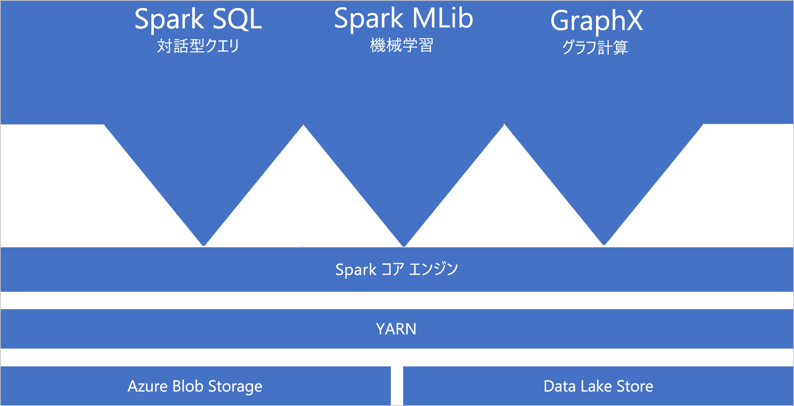
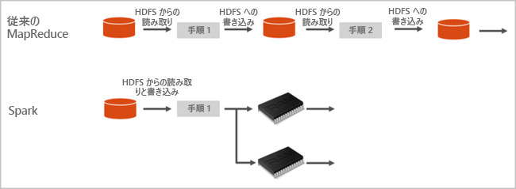

# Azure Synapse Analytics の Apache Spark とは

Apache Spark は、ビッグデータ分析アプリケーションのパフォーマンスを向上させるメモリ内処理をサポートする並列処理フレームワークです。 Azure Synapse Analytics の Apache Spark は、Apache Spark を Microsoft がクラウドに実装したものです。 Azure Synapse では、Spark プール (プレビュー) を Azure に簡単に作成して構成することができます。 Azure Synapse の Spark プールは、Azure Storage および Azure Data Lake Generation 2 ストレージと互換性があります。 そのため、Azure Spark プールを使用して、Azure に格納されているデータを処理することができます。

[!INCLUDE [preview](../includes/note-preview.md)]

## Apache Spark とは

Apache Spark には、クラスターの計算処理をインメモリで行うための基本的な要素が備わっています。 Spark ジョブは、データをメモリに読み込んでキャッシュし、それを繰り返しクエリできます。 メモリ内計算は、ディスクベースのアプリケーションよりもはるかに高速です。 また Spark は、さまざまなプログラミング言語との親和性が高く、分散データ セットをローカル コレクションのように扱うことができます。 計算内容をすべて map 処理と reduce 処理に分ける必要がありません。

Azure Synapse の Spark プールでは、フル マネージドの Spark サービスを利用できます。 以下の一覧は、Synapse Analytics で Spark プールを作成する利点をまとめたものです。

| 機能 | 説明 |
| --- | --- |
| スピードと効率 |Spark インスタンスの起動時間は、60 ノード未満の場合で約 2 分、それより多いの場合には約 5 分となります。 インスタンスの既定のシャットダウン時間は、ノートブック接続によって生存状態になっている場合を除き、最後のジョブが実行されてから 5 分です。 |
| 作成のしやすさ |Azure Synapse には、Azure portal、Azure PowerShell、Synapse Analytics .NET SDK のいずれかを使用して新しい Spark プールを数分で作成できます。 [Synapse Analytics の Spark プールの概要](../quickstart-create-apache-spark-pool.md)に関するページを参照してください。 |
| 使いやすさ |Synapse Analytics には、[Nteract](https://nteract.io/) から派生したカスタム ノートブックが含まれています。 対話型のデータ処理と視覚化にこれらの Notebook を使用できます。|
| REST API |Synapse Analytics の Spark には、ジョブの送信と監視をリモートで実行する REST API ベースの Spark ジョブ サーバーである [Apache Livy](https://github.com/cloudera/hue/tree/master/apps/spark/java#welcome-to-livy-the-rest-spark-server) が含まれています。 |
| Azure Data Lake Storage Generation 2 のサポート| Azure Synapse の Spark プールは、Blob Storage に加え、Azure Data Lake Storage Generation 2 も使用できます。 Data Lake Store の詳細については、「[Azure Data Lake Store の概要](../../data-lake-store/data-lake-store-overview.md)」を参照してください。 |
| サード パーティ製 IDE との統合 | Azure Synapse には、アプリケーションを作成して Spark プールに送信するうえで役立つ [Jetbrains の IntelliJ IDEA](https://www.jetbrains.com/idea/) 用 IDE プラグインが用意されています。 |
| 読み込み済みの Anaconda ライブラリ |Azure Synapse の Spark プールには、プレインストールされた Anaconda ライブラリが付属します。 [Anaconda](https://docs.continuum.io/anaconda/) は、機械学習、データ分析、視覚化などのための 200 個近いライブラリを提供します。 |
| スケーラビリティ | Azure Synapse プールの Apache Spark は自動スケールを有効にすることで、必要に応じてプールをスケールアップしたりスケールダウンしたりすることができます。 また、すべてのデータは Azure Storage または Data Lake Storage に格納されるため、Spark プールはデータの損失なしでシャットダウンできます。 |

Azure Synapse の Spark プールには、そのプールで利用できる次のコンポーネントが既定で含まれています。

- [Spark Core](https://spark.apache.org/docs/latest/)。 Spark Core、Spark SQL、GraphX、MLlib が含まれます。
- [Anaconda](https://docs.continuum.io/anaconda/)
- [Apache Livy](https://github.com/cloudera/hue/tree/master/apps/spark/java#welcome-to-livy-the-rest-spark-server)
- [Nteract ノートブック](https://nteract.io/)

## Spark プールのアーキテクチャ

Synapse Analytics で Spark を実行する方法を理解することで、Spark のコンポーネントを理解しやすくなります。

Spark アプリケーションは、メイン プログラム (ドライバー プログラムと呼ばれる) の SparkContext オブジェクトによって調整された、独立したプロセスのセットとしてプールで実行されます。

SparkContext は、アプリケーション間でリソースを割り当てるクラスター マネージャーに接続できます。 クラスター マネージャーは [Apache Hadoop YARN](https://hadoop.apache.org/docs/current/hadoop-yarn/hadoop-yarn-site/YARN.html) です。 接続されると、Spark はプール内のノードで Executor を取得します。Executor は、アプリケーションの計算を実行し、データを格納するプロセスです。 次に、アプリケーション コード (SparkContext に渡される JAR ファイルまたは Python ファイルで定義された) を Executor に送信します。 最後に、SparkContext はタスクを Executor に送信して実行させます。

SparkContext は、ユーザーの main 関数を実行し、ノードでさまざまな並列処理を実行します。 その後、SparkContext は操作の結果を収集します。 ノードによるデータの読み取りと書き込みは、ファイル システムとの間で行われます。 また、ノードは、変換後のデータを Resilient Distributed Dataset (RDD) としてメモリ内にキャッシュします。

SparkContext は Spark プールに接続し、有向グラフ (DAG) にアプリケーションを変換する処理を担います。 グラフは、ノードの Executor プロセス内で実行される個々のタスクから成ります。 アプリケーションはそれぞれ独自の Executor プロセスを取得し、そのプロセスが、アプリケーション全体が終了するまで稼働し続けながら、複数のスレッドでタスクを実行します。

## Synapse Analytics の Apache Spark のユース ケース

Synapse Analytics の Spark プールでは、以下に挙げる主なシナリオを実現できます。

### Data Engineering とデータ準備

Apache Spark には、大量データの準備と処理をサポートする多くの言語機能が含まれているため、データの価値を高め、それを Synapse Analytics 内の他のサービスから利用することができます。 これは、複数の言語 (C#、Scala、PySpark、Spark SQL) と、処理および接続を目的に提供されているライブラリによって実現されています。

### Machine Learning

Apache Spark には、Spark を基に作成された機械学習ライブラリである [MLlib](https://spark.apache.org/mllib/) が付属し、Synapse Analytics の Spark プールから使用できます。 Synapse Analytics の Spark プールには、Anaconda も含まれています。Anaconda は、機械学習を始めとするデータ サイエンス用のさまざまなパッケージを含む Python ディストリビューションです。 ノートブックの組み込みサポートを併用すれば、機械学習アプリケーションを作成するための環境が得られます。

## どこから始めるか

Synapse Analytics の Apache Spark の詳細については、次の記事を参照してください。

- [クイック スタート: Azure Synapse の Spark プールを作成する](../quickstart-create-apache-spark-pool.md)
- [クイック スタート: Apache Spark ノートブックを作成する](../quickstart-apache-spark-notebook.md)
- [チュートリアル:Apache Spark を使用した機械学習](./apache-spark-machine-learning-mllib-notebook.md)
- [Apache Spark 公式ドキュメント](https://spark.apache.org/docs/latest/)

> [!NOTE]
> 公式の Apache Spark ドキュメントの一部では、Spark コンソールの使用を前提としていますが、このコンソールは Azure Synapse Spark では利用できません。ノートブックまたは IntelliJ のエクスペリエンスをご利用ください。

## 次のステップ

この概要では、Azure Synapse Analytics の Apache Spark の基本について理解します。 次の記事に進んで、Azure Synapse Analytics の Spark プールの作成方法を学習してください。

- [Azure Synapse の Spark プールを作成する](../quickstart-create-apache-spark-pool.md)
