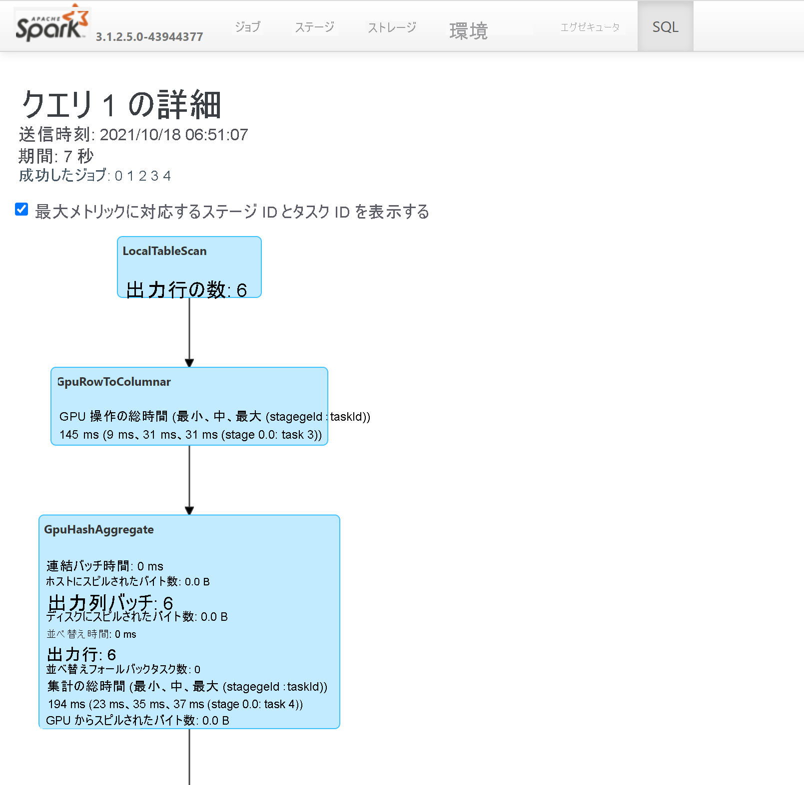

# <a name="apache-spark-gpu-accelerated-pools-in-azure-synapse-analytics"></a>Azure Synapse Analytics の Apache Spark GPU アクセラレータ プール

Apache Spark は、ビッグデータ分析アプリケーションのパフォーマンスを向上させるメモリ内処理をサポートする並列処理フレームワークです。 Azure Synapse Analytics の Apache Spark は、Apache Spark を Microsoft がクラウドに実装したものです。 

Azure Synapse では、GPU の大規模な並列処理能力を使用して処理を高速化する、基になる [RAPIDS ライブラリ](https://nvidia.github.io/spark-rapids/)を使用して Spark ワークロードを実行するための Azure Synapse GPU 対応プールを作成できるようになりました。 Apache Spark 用の RAPIDS アクセラレータを使用すると、GPU 対応プール用に事前構成された構成設定を有効にするだけで、**コードを変更することなく** 既存の Spark アプリケーションを実行できます。
この構成を設定することにより、ワークロード、またはワークロードの一部に対して RAPIDS ベースの GPU アクセラレータをオンまたはオフにできます。

```
spark.conf.set('spark.rapids.sql.enabled','true/false')
```

> [!NOTE]
> Azure Synapse GPU 対応プールは、現在、パブリック プレビュー段階にあります。

## <a name="rapids-accelerator-for-apache-spark"></a>Apache Spark 用の RAPIDS アクセラレータ

Spark RAPIDS アクセラレータは、サポートされている GPU 操作で Spark ジョブの物理プランを上書きし、それらの操作を GPU 上で実行して処理を高速化することによって機能するプラグインです。 このライブラリは現在プレビュー段階であり、すべての Spark 操作がサポートされているわけではありません (現在サポートされている操作の一覧については、[こちら](https://nvidia.github.io/spark-rapids/docs/supported_ops.html)を参照してください。新しいリリースによって段階的にサポートが追加されます)。

## <a name="cluster-configuration-options"></a>クラスター構成オプション

RAPIDS アクセラレータ プラグインでは、GPU と Executor 間の一対一のマッピングのみがサポートされています。 つまり、Spark ジョブでは、(使用可能な GPU と CPU コアの数に応じて) プール リソースで対応できる Executor とドライバー リソースを要求する必要があります。 この条件を満たし、すべてのプール リソースを最適に使用できるようにするためには、GPU 対応プールで実行されている Spark アプリケーションに対して次のようにドライバーと Executor を構成する必要があります。


|プール サイズ | ドライバー サイズのオプション | ドライバー コア | ドライバーのメモリ (GB) | Executor コア | Executor のメモリ (GB) | Executor の数 |
| :------ | :-------------- | :---------- | :------------- | :------------- | :------------------- | :------------------ |
| GPU-Large | Small ドライバー | 4 | 30 | 12 | 60 | プール内のノードの数 |
| GPU-Large | Medium ドライバー | 7 | 30 | 9 | 60 | プール内のノードの数 |
| GPU-XLarge | Medium ドライバー | 8 | 40 | 14 | 80 | 4 * プール内のノードの数 |
| GPU-XLarge | Large ドライバー | 12 | 40 | 13 | 80 | 4 * プール内のノードの数 |


上記の構成のいずれかを満たしていないワークロードは受け入れられません。 これは、プールで使用可能なすべてのリソースを利用し、最も効率的でパフォーマンスの高い構成で Spark ジョブが実行されるようにするために行われます。

ユーザーは、ワークロードを通じて上記の構成を設定できます。 ノートブックの場合、次に示すように、ユーザーは `%%configure` マジック コマンドを使用して上記の構成のいずれかを設定できます。
たとえば、3 つのノードの大規模なプールを使用する場合は、次のようになります。

```
%%configure -f
{
    "driverMemory": "30g",
    "driverCores": 4,
    "executorMemory": "60g",
    "executorCores": 12,
    "numExecutors": 3
}
```

## <a name="run-a-sample-spark-job-through-notebook-on-an-azure-synapse-gpu-accelerated-pool"></a>Azure Synapse GPU アクセラレータ プールでノートブックを介してサンプル Spark ジョブを実行する

このセクションに進む前に、Azure Synapse Analytics での[ノートブックの使用方法の基本的概念](apache-spark-development-using-notebooks.md)を理解しておくことをお勧めします。 GPU アクセラレータを使用して Spark アプリケーションを実行する手順について説明します。 Spark アプリケーションは、Synapse 内でサポートされている 4 つのすべての言語 PySpark (Python)、Spark (Scala)、SparkSQL、.NET for Spark (C#) で作成できます。

1. [こちらのクイックスタート](../quickstart-create-apache-gpu-pool-portal.md)の説明に従って、GPU 対応プールを作成します。

2. ノートブックを作成し、最初の手順で作成した GPU 対応プールに接続します。

3. 前のセクションで説明したように構成を設定します。

4. ノートブックの最初のセルに次のコードをコピーして、サンプル データフレームを作成します。

### <a name="scala"></a>[Scala](#tab/scala)

```scala
import org.apache.spark.sql.types.{IntegerType, StringType, StructField, StructType}
import org.apache.spark.sql.Row
import scala.collection.JavaConversions._

val schema = StructType( Array(
  StructField("emp_id", IntegerType),
  StructField("name", StringType),
  StructField("emp_dept_id", IntegerType),
  StructField("salary", IntegerType)
))

val emp = Seq(Row(1, "Smith", 10, 100000),
    Row(2, "Rose", 20, 97600),
    Row(3, "Williams", 20, 110000),
    Row(4, "Jones", 10, 80000),
    Row(5, "Brown", 40, 60000),
    Row(6, "Brown", 30, 78000)
  )

val empDF = spark.createDataFrame(emp, schema)
```

### <a name="python"></a>[Python](#tab/python)

```python
emp = [(1, "Smith", 10, 100000),
    (2, "Rose", 20, 97600),
    (3, "Williams", 20, 110000),
    (4, "Jones", 10, 80000),
    (5, "Brown", 40, 60000),
    (6, "Brown", 30, 78000)]

empColumns = ["emp_id", "name", "emp_dept_id", "salary"]

empDF = spark.createDataFrame(data=emp, schema=empColumns)
```

### <a name="c"></a>[C#](#tab/csharp)

```csharp
using Microsoft.Spark.Sql.Types;

var emp = new List<GenericRow>
{
    new GenericRow(new object[] { 1, "Smith", 10, 100000 }),
    new GenericRow(new object[] { 2, "Rose", 20, 97600 }),
    new GenericRow(new object[] { 3, "Williams", 20, 110000 }),
    new GenericRow(new object[] { 4, "Jones", 10, 80000 }),
    new GenericRow(new object[] { 5, "Brown", 40, 60000 }),
    new GenericRow(new object[] { 6, "Brown", 30, 78000 })
};

var schema = new StructType(new List<StructField>()
{
    new StructField("emp_id", new IntegerType()),
    new StructField("name", new StringType()),
    new StructField("emp_dept_id", new IntegerType()),
    new StructField("salary", new IntegerType())
});

DataFrame empDF = spark.CreateDataFrame(emp, schema);
```
---

5. 次に、部門 ID ごとの給与の最高額を取得して集計を行い、その結果を表示してみましょう。

### <a name="scala"></a>[Scala](#tab/scala1)

```scala
val resultDF = empDF.groupBy("emp_dept_id").max("salary")
resultDF.show()
```

### <a name="python"></a>[Python](#tab/python1)

```python
resultDF = empDF.groupBy("emp_dept_id").max("salary")
resultDF.show()
```

### <a name="c"></a>[C#](#tab/csharp1)

```csharp
DataFrame resultDF = empDF.GroupBy("emp_dept_id").Max("salary");
resultDF.Show();
```
---

6. GPU 上で実行された、クエリの操作を確認するには、Spark History Server を介して SQL プランを調べます。

## <a name="how-to-tune-your-application-for-gpus"></a>GPU 用にアプリケーションを調整する方法

ほとんどの Spark ジョブでは、構成設定を既定値から調整することでパフォーマンスの向上を確認できます。これは、Apache Spark の RAPIDS アクセラレータ プラグインを利用しているジョブでも同様です。 [こちらのドキュメント](https://nvidia.github.io/spark-rapids/docs/tuning-guide.html)では、RAPIDS プラグインを使用して GPU で実行するように Spark ジョブを調整する方法に関するガイドラインが提供されています。

## <a name="quotas-and-resource-constraints-in-azure-synapse-gpu-enabled-pools"></a>Azure Synapse GPU 対応プールでのクォータとリソース制約

### <a name="workspace-level"></a>ワークスペースレベル

すべての Azure Synapse ワークスペースには、既定のクォータである 50 個の GPU 仮想コアが付属しています。 GPU コアのクォータを増やすには、ワークスペース名、リージョン、およびワークロードに必要な GPU クォータの合計を記載した電子メールを AzureSynapseGPU@microsoft.com まで送信してください。

## <a name="next-steps"></a>次のステップ
- [Azure Synapse Analytics](../overview-what-is.md)
