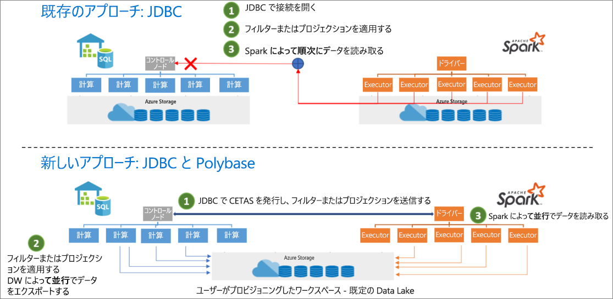

# <a name="introduction"></a>はじめに

Synapse SQL コネクタへの Azure Synapse の Apache Spark は、Azure Synapse の Spark プール (プレビュー) と SQL プールの間でデータを効率的に転送するように設計されています。 Synapse SQL コネクタへの Azure Synapse の Apache Spark は、SQL プールでのみ機能し、SQL オンデマンドでは機能しません。

## <a name="design"></a>デザイン

Spark プールと SQL プールの間でのデータの転送は、JDBC を使用して行うことができます。 ただし、Spark プールや SQL プールといった 2 つの分散システムでは、JDBC はシリアル データ転送のボトルネックになる傾向があります。

Synapse SQL コネクタへの Azure Synapse の Apache Spark プールは、Apache Spark 用のデータ ソースの実装です。 これにより、Azure Data Lake Storage Gen2 と SQL プールの PolyBase が使用され、Spark クラスターと Synapse SQL インスタンスの間でデータが効率的に転送されます。



## <a name="authentication-in-azure-synapse-analytics"></a>Azure Synapse Analytics での認証

システム間の認証は、Azure Synapse Analytics でシームレスに行われます。 Azure Active Directory に接続して、ストレージ アカウントまたはデータ ウェアハウス サーバーにアクセスするときに使用するセキュリティ トークンを取得するトークン サービスがあります。 

このため、ストレージ アカウントとデータ ウェアハウス サーバーで AAD 認証が構成されている限り、資格情報を作成したり、コネクタ API でそれらを指定したりする必要はありません。 そうでない場合は、SQL 認証を指定できます。 詳細については、「[使用法](#usage)」セクションを参照してください。

## <a name="constraints"></a>制約

- このコネクタは Scala でのみ動作します。

## <a name="prerequisites"></a>前提条件

- データの転送先および転送元となるデータベースおよび SQL プールに **db_exporter** ロールがあること。

ユーザーを作成するには、データベースに接続し、次の例に従います。

```sql
CREATE USER Mary FROM LOGIN Mary;
CREATE USER [mike@contoso.com] FROM EXTERNAL PROVIDER;
```

ロールを割り当てるには:

```sql
EXEC sp_addrolemember 'db_exporter', 'Mary';
```

## <a name="usage"></a>使用法

import ステートメントは必要はありません。ノートブック エクスペリエンスのために事前にインポートされています。

### <a name="transferring-data-to-or-from-a-sql-pool-in-the-logical-server-dw-instance-attached-with-the-workspace"></a>ワークスペースに接続されている論理サーバー (DW インスタンス) 内の SQL プールとの間でのデータ転送

> [!NOTE]
> **import はノートブック エクスペリエンスには必要ありません**

```scala
 import com.microsoft.spark.sqlanalytics.utils.Constants
 import org.apache.spark.sql.SqlAnalyticsConnector._
```

#### <a name="read-api"></a>Read API

```scala
val df = spark.read.sqlanalytics("[DBName].[Schema].[TableName]")
```

上記の API は、SQL プールの内部 (マネージド) テーブルと外部テーブルの両方に対して機能します。

#### <a name="write-api"></a>Write API

```scala
df.write.sqlanalytics("[DBName].[Schema].[TableName]", [TableType])
```

ここで、TableType には Constants.INTERNAL または Constants.EXTERNAL を指定できます。

```scala
df.write.sqlanalytics("[DBName].[Schema].[TableName]", Constants.INTERNAL)
df.write.sqlanalytics("[DBName].[Schema].[TableName]", Constants.EXTERNAL)
```

ストレージと SQL Server に対する認証が行われます。

### <a name="if-you-are-transferring-data-to-or-from-a-sql-pool-or-database-in-a-logical-server-outside-the-workspace"></a>ワークスペース外の論理サーバー内の SQL プールまたはデータベースとの間でデータを転送する場合

> [!NOTE]
> import はノートブック エクスペリエンスには必要ありません

```scala
 import com.microsoft.spark.sqlanalytics.utils.Constants
 import org.apache.spark.sql.SqlAnalyticsConnector._
```

#### <a name="read-api"></a>Read API

```scala
val df = spark.read.
option(Constants.SERVER, "samplews.database.windows.net").
sqlanalytics("<DBName>.<Schema>.<TableName>")
```

#### <a name="write-api"></a>Write API

```scala
df.write.
option(Constants.SERVER, "[samplews].[database.windows.net]").
sqlanalytics("[DBName].[Schema].[TableName]", [TableType])
```

### <a name="using-sql-auth-instead-of-aad"></a>AAD ではなく SQL 認証の使用

#### <a name="read-api"></a>Read API

現在、コネクタでは、ワークスペースの外部にある SQL プールに対するトークンベースの認証はサポートされていません。 SQL 認証の使用が必要になります。

```scala
val df = spark.read.
option(Constants.SERVER, "samplews.database.windows.net").
option(Constants.USER, [SQLServer Login UserName]).
option(Constants.PASSWORD, [SQLServer Login Password]).
sqlanalytics("<DBName>.<Schema>.<TableName>")
```

#### <a name="write-api"></a>Write API

```scala
df.write.
option(Constants.SERVER, "[samplews].[database.windows.net]").
option(Constants.USER, [SQLServer Login UserName]).
option(Constants.PASSWORD, [SQLServer Login Password]).
sqlanalytics("[DBName].[Schema].[TableName]", [TableType])
```

### <a name="using-the-pyspark-connector"></a>PySpark コネクタの使用

> [!NOTE]
> この例は、ノートブック エクスペリエンスのみを考慮して提供されています。

DW に書き込むデータフレーム "pyspark_df" があるとします。

PySpark のデータフレームを使用して一時テーブルを作成します。

```py
pyspark_df.createOrReplaceTempView("pysparkdftemptable")
```

マジックを使用して PySpark Notebook で Scala セルを実行します。

```scala
%%spark
val scala_df = spark.sqlContext.sql ("select * from pysparkdftemptable")

pysparkdftemptable.write.sqlanalytics("sqlpool.dbo.PySparkTable", Constants.INTERNAL)
```

同様に、読み取りシナリオでは Scala を使用してデータを読み取り、それを一時テーブルに書き込んでから、PySpark の Spark SQL を使用して一時テーブルをデータフレームに照会します。

## <a name="allowing-other-users-to-use-the-dw-connector-in-your-workspace"></a>他のユーザーが自分のワークスペースで DW コネクタを使用できるようにする

他のユーザーにアクセス許可がないように変更するには、ワークスペースに接続されている ADLS Gen2 ストレージ アカウントのストレージ BLOB データ所有者である必要があります。 そのワークスペースへのアクセス権とノートブックを実行するためのアクセス許可をそのユーザーが持っていることを確認します。

### <a name="option-1"></a>方法 1

- ユーザーをストレージ BLOB データの共同作成者または所有者にする

### <a name="option-2"></a>方法 2

- フォルダー構造に次の ACL を指定する

| Folder | / | synapse | workspaces  | <workspacename> | sparkpools | <sparkpoolname>  | sparkpoolinstances  |
|--|--|--|--|--|--|--|--|
| アクセス許可 | --X | --X | --X | --X | --X | --X | -WX |
| 既定の権限 | ---| ---| ---| ---| ---| ---| ---|

- "synapse" 以下のすべてのフォルダーの ACL を Azure portal から設定できる必要があります。 ルート "/" フォルダーに ACL を設定するには、以下の手順に従ってください。

- AAD を使用して Storage Explorer からワークスペースに接続されているストレージ アカウントに接続します。
- アカウントを選択し、ワークスペースの ADLS Gen2 URL と既定のファイル システムを指定します。
- 一覧表示されたストレージ アカウントが表示されたら、一覧表示されているワークスペースを右クリックし、[アクセスの管理] を選択します。
- "実行" のアクセス許可がある / フォルダーにユーザーを追加します。 [OK] を選択します。

> [!IMPORTANT]
> 意図しない場合は、"既定" を選択しないようにしてください。

## <a name="next-steps"></a>次のステップ

- [Azure portal を使用して SQL プールを作成する](../../synapse-analytics/quickstart-create-apache-spark-pool-portal.md)
- [Azure portal を使用して新しい Apache Spark プールを作成する](../../synapse-analytics/quickstart-create-apache-spark-pool-portal.md) 
