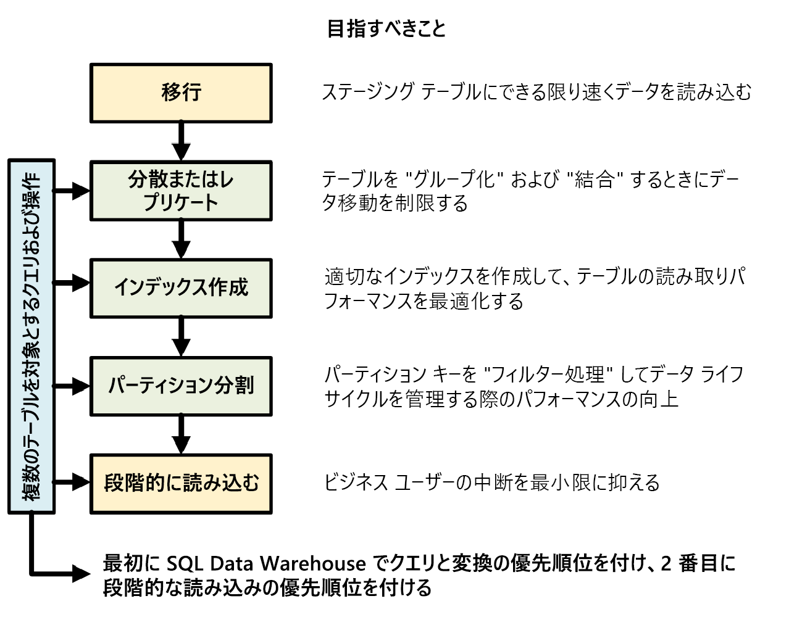

# Azure Synapse Analytics (旧称 SQL DW) のチート シート

このチート シートは、Azure Synapse ソリューションを構築するための役立つヒントとベスト プラクティスを提供します。 

次の図は、データ ウェアハウスを設計するプロセスを示しています。

## 複数のテーブルを対象とするクエリおよび操作

データ ウェアハウスで実行する主要な操作とクエリが事前にわかっている場合は、それらの操作に合わせてデータ ウェアハウス アーキテクチャを優先度付けすることができます。 こうしたクエリや操作には次が含まれる可能性があります。
* 1 つまたは 2 つのファクト テーブルをディメンション テーブルと結合し、結合されたテーブルをフィルター処理して、結果をデータ マートに追加する。
* ファクト テーブルに対して大きな更新または小さな更新を行う。
* テーブルにデータのみを追加する。

事前に操作の種類を知ることは、テーブルの設計を最適化するのに役立ちます。

## データ移行

まず、データを [Azure Data Lake Storage](../../data-factory/connector-azure-data-lake-store.md) または Azure Blob Storage に読み込みます。 次に、PolyBase を使用してデータをステージング テーブルに読み込みます。 次の構成を使用します。

| デザイン | 推奨 |
|:--- |:--- |
| Distribution | ラウンド ロビン |
| インデックス作成 | ヒープ |
| パーティション分割 | なし |
| リソース クラス | largerc または xlargerc |

[データ移行](https://blogs.msdn.microsoft.com/sqlcat/20../../migrating-data-to-azure-sql-data-warehouse-in-practice/)、[データ読み込み](design-elt-data-loading.md)、および[抽出、読み込み、および変換 (ELT) プロセス](design-elt-data-loading.md)の詳細を参照してください。 

## 分散テーブルまたはレプリケート テーブル

テーブルのプロパティに応じて、次の方法を使用します。

| Type | 適しているプロパティ| 条件|
|:--- |:--- |:--- |
| レプリケート | * 圧縮 (最大 5 倍の圧縮) 後のストレージが 2 GB 未満である、スター スキーマの小さいディメンション テーブル |* テーブルに対して多くの書き込みトランザクション (挿入、アップサート、削除、更新など) が行われる  * Data Warehouse ユニット (DWU) のプロビジョニングを頻繁に変更する  * 使うのは 2 - 3 列だけであるがテーブルには多くの列がある  * レプリケート テーブルにインデックスを作成する |
| ラウンド ロビン (既定) | * 一時およびステージング テーブル   * 明白な結合キーまたは適切な候補列がない |* データ移動のためにパフォーマンスが低い |
| ハッシュ インデックス | * ファクト テーブル  * 大きいディメンション テーブル |* ディストリビューション キーを更新できない |

**ヒント:**
* 最初はラウンド ロビンを使いますが、大規模な並列アーキテクチャを活用するにはハッシュ ディストリビューション方法を目指します。
* 共通ハッシュ キーが同じデータ形式であることを確認します。
* 分散には varchar 形式を使わないようにします。
* 頻繁に結合操作が行われるファクト テーブルに対する共通ハッシュ キーを持つディメンション テーブルは、ハッシュが分散される可能性があります。
* データの偏りを分析するには、 *[sys.dm_pdw_nodes_db_partition_stats](/sql/relational-databases/system-dynamic-management-views/sys-dm-db-partition-stats-transact-sql)* を使います。
* クエリの背後で行われているデータ移動を分析し、ブロードキャストおよびシャッフル操作にかかる時間を監視するには、 *[sys.dm_pdw_request_steps](/sql/relational-databases/system-dynamic-management-views/sys-dm-pdw-request-steps-transact-sql)* を使います。 これはディストリビューション方法の検討に役立ちます。

詳しくは、[レプリケート テーブル](design-guidance-for-replicated-tables.md)および[分散テーブル](sql-data-warehouse-tables-distribute.md)に関するページをご覧ください。

## テーブルのインデックス付け

インデックスは、テーブルを迅速に読み取るために役立ちます。 ニーズに応じて、独自のテクノロジのセットを使うことができます。

| Type | 適しているプロパティ | 条件|
|:--- |:--- |:--- |
| ヒープ | * ステージングおよび一時テーブル  * 小さいテーブルと小さい参照 |* すべての参照がテーブル全体をスキャンします |
| クラスター化インデックス | * 最大 1 億行を含むテーブル  * 1 - 2 列のみが頻繁に使われる大規模なテーブル (1 億行以上) |* レプリケート テーブルで使われます  * 複数の結合および Group By 操作を含む複雑なクエリがあります  * インデックス付き列の更新を行います。これはメモリを消費します |
| クラスター化列ストア インデックス (CCI) (既定) | * 大規模なテーブル (1 億行以上) | * レプリケート テーブルで使われます  * 大量のテーブル更新操作を行います  * テーブルを過剰にパーティション分割しています。行グループは異なるディストリビューション ノードおよびパーティションにはまたがりません |

**ヒント:**
* クラスター化インデックスに加えて、フィルターで使用頻度の高い列に非クラスター化インデックスを追加することが必要な場合があります。 
* CCI を含むテーブルでのメモリの管理方法に注意する必要があります。 データを読み込むときに、大きいリソース クラスによってユーザー (またはクエリ) にメリットがあるようにします。 トリミングによって多くの小さい圧縮された行グループが作成されないようにします。
* Gen2 では、パフォーマンスを最大にするため、CCI テーブルはコンピューティング ノードにローカルにキャッシュされます。
* CCI では、行グループの圧縮が不十分であるためにパフォーマンスが低下することがあります。 これが発生した場合は、CCI を再構築または再編成します。 圧縮された行グループあたり 10 万行以上が必要です。 理想は行グループあたり 100 万行です。
* 増分読み込みの頻度とサイズに基づいて、インデックスを再編成または再構築するタイミングを自動化します。 大掃除は常に役に立ちます。
* 行グループをトリミングする場合は、戦略的に行います。 開いている行グループはどのくらいの大きさですか。 今後、どれくらいのデータが読み込まれると予想されますか。

詳しくは、[インデックス](sql-data-warehouse-tables-index.md)に関するページをご覧ください。

## パーティション分割
大きなファクト テーブル (10 億行以上) がある場合、テーブルをパーティション分割することがあります。 ほとんどの場合、パーティション キーは日付に基づく必要があります。 パーティション分割しすぎないように注意してください (特に、クラスター化列ストア インデックスの場合)。

ELT を必要とするステージング テーブルでは、パーティション分割によるメリットがあります。 データのライフサイクル管理が容易になります。
データをパーティション分割しすぎないように注意してください (特に、クラスター化列ストア インデックスの場合)。

詳しくは、[パーティション](sql-data-warehouse-tables-partition.md)に関するページをご覧ください。

## 段階的な読み込み

データを段階的に読み込む場合、まず、データの読み込みに大きいリソース クラスを割り当てていることを確認します。  これは特に、クラスター化列ストア インデックスを使用してテーブルへの読み込みを行う際に重要となります。  詳細については、[リソース クラス](resource-classes-for-workload-management.md)に関するページを参照してください。  

データ ウェアハウスへの ELT パイプラインを自動化するために PolyBase と ADF V2 を使用することをお勧めします。

履歴データ内の大きなバッチを更新する場合、テーブルに保持したいデータは、INSERT、UPDATE、DELETE を使用する代わりに、[CTAS](sql-data-warehouse-develop-ctas.md) を使用して書き込むことを検討してください。

## 統計を管理する
 自動統計が一般公開されるまで、統計の手動のメンテナンスが必要です。 データに*大幅な*変更が発生したときに統計を更新することが重要です。 これにより、クエリ プランを最適化できます。 すべての統計の管理に時間がかかりすぎる場合は、統計を作成する列を限定します。 

更新の頻度を定義することもできます。 たとえば、毎日新しい値が追加される可能性がある日付列を更新する場合があります。 結合に含まれる列、WHERE 句で使われている列、および GROUP BY に含まれている列に関する統計を作成すると、最も大きなメリットが得られます。

詳しくは、[統計](sql-data-warehouse-tables-statistics.md)に関するページをご覧ください。

## リソース クラス
リソース グループは、クエリにメモリを割り当てるための方法として使用されます。 クエリまたは読み込みの速度を向上させるために、より多くのメモリが必要な場合は、さらに高いリソース クラスを割り当てる必要があります。 その一方で、使うリソース クラスを大きくするとコンカレンシーに影響があります。 すべてのユーザーを大きいリソース クラスに移行する前に、そのことを考慮する必要があります。

クエリに時間がかかりすぎる場合は、ユーザーが大きいリソース クラスで実行していないことを確認します。 大きいリソース クラスは、多くのコンカレンシー スロットを消費します。 それにより、他のクエリが待機する可能性があります。

最後に、Gen2 の [SQL プール](sql-data-warehouse-overview-what-is.md#sql-analytics-and-sql-pool-in-azure-synapse)を使用して、各リソース クラスが Gen1 の 2.5 倍のメモリを取得します。

詳しくは、[リソース クラスとコンカレンシー](resource-classes-for-workload-management.md)の操作方法に関するページをご覧ください。

## コストの削減
Azure Synapse の重要な機能は、[コンピューティング リソースを管理する](sql-data-warehouse-manage-compute-overview.md)能力です。 使用していない SQL プールは一時停止できます。それにより、コンピューティング リソースの課金が停止されます。 パフォーマンスのニーズに合わせてリソースを拡大縮小することができます。 一時停止するには、[Azure Portal](../../synapse-analytics/sql-data-warehouse/pause-and-resume-compute-portal.md) または [PowerShell](../../synapse-analytics/sql-data-warehouse/pause-and-resume-compute-powershell.md) を使用します。 拡大縮小するには、[Azure Portal](quickstart-scale-compute-portal.md)、[Powershell](quickstart-scale-compute-powershell.md)、[T-SQL](quickstart-scale-compute-tsql.md)、または [REST API](sql-data-warehouse-manage-compute-rest-api.md#scale-compute) を使用します。

Azure Synapse の重要な機能は、[コンピューティング リソースを管理する](sql-data-warehouse-manage-compute-overview.md)能力です。 使用していない SQL プールは一時停止できます。それにより、コンピューティング リソースの課金が停止されます。 パフォーマンスのニーズに合わせてリソースを拡大縮小することができます。 一時停止するには、[Azure Portal](../../sql-data-warehouse/pause-and-resume-compute-portal.md) または [PowerShell](../../sql-data-warehouse/pause-and-resume-compute-powershell.md) を使用します。 拡大縮小するには、[Azure Portal](quickstart-scale-compute-portal.md)、[Powershell](quickstart-scale-compute-powershell.md)、[T-SQL](quickstart-scale-compute-tsql.md)、または [REST API](sql-data-warehouse-manage-compute-rest-api.md#scale-compute) を使用します。

Azure Functions では自動スケールを利用できます。

## パフォーマンスのためのアーキテクチャの最適化

SQL Database と Azure Analysis Services はハブとスポークのアーキテクチャにすることを検討するようお勧めします。 このソリューションは、異なるユーザー グループ間のワークロードを分離しながら、SQL Database と Azure Analysis Services の高度なセキュリティ機能も使用できます。 また、無制限のコンカレンシーをユーザーに提供することもできます。

詳細については、[Azure Synapse を利用する一般的なアーキテクチャ](https://blogs.msdn.microsoft.com/sqlcat/20../../common-isv-application-patterns-using-azure-sql-data-warehouse/)に関するページを参照してください。

SQL プールから SQL データベースにスポークを 1 回のクリックでデプロイします。

