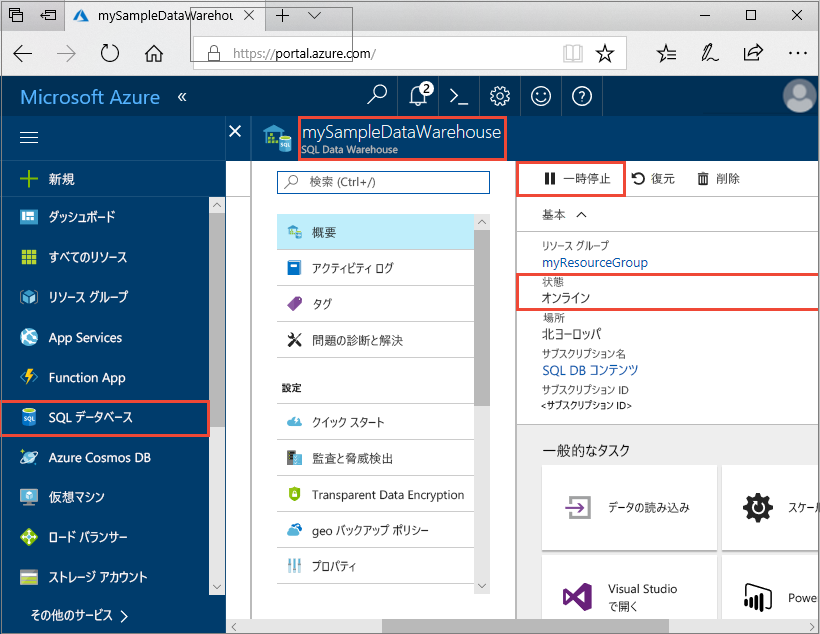
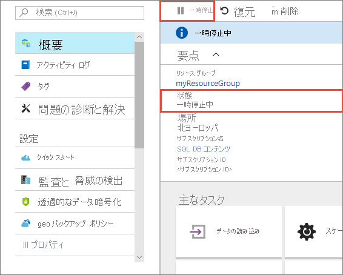
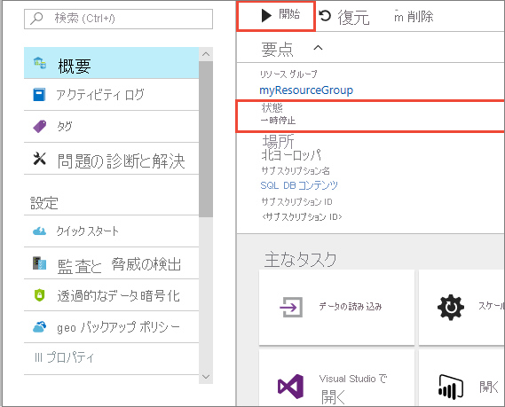
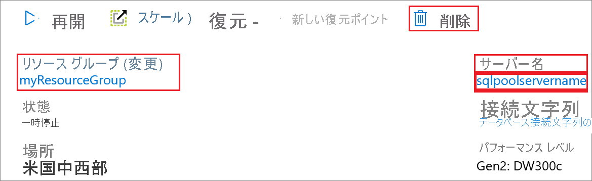

# クイック スタート:Azure portal を使用して Synapse SQL プールのコンピューティングを一時停止、再開する

Azure portal を使用して、Synapse SQL プール (データ ウェアハウス) コンピューティング リソースを一時停止および再開できます。 Azure サブスクリプションをお持ちでない場合は、開始する前に[無料](https://azure.microsoft.com/free/)アカウントを作成してください。

## Azure portal にサインインする

[Azure portal](https://portal.azure.com/) にサインインします。

## 開始する前に

[ポータルでの作成と接続](create-data-warehouse-portal.md)に関する記事に従って、**mySampleDataWarehouse** という名前の SQL プールを作成してください。 

## コンピューティングの一時停止

コストを減らすために、オンデマンドでコンピューティング リソースを一時停止および再開できます。 たとえば、夜間と週末にデータベースを使用しない場合、その期間にデータベースを一時停止して、日中に再開することができます。 
>[!NOTE]
>データベースが一時停止されている間、コンピューティング リソースへの課金は行われません。 ただし、ストレージに対する課金は引き続き行われます。 

SQL プールを一時停止するには、次の手順を実行します。

1. [Azure portal](https://portal.azure.com/) にサインインします。
2. Azure portal の左側のナビゲーション ページで **[Azure Synapse Analytics (以前の SQL DW)]** をクリックします。
2. **[Azure Synapse Analytics (以前の SQL DW)]** ページから **[mySampleDataWarehouse]** を選択して SQL プールを開きます。 
3. **[mySampleDataWarehouse]** ページで **[状態]** が **[オンライン]** になっていることがわかります。

    

4. SQL プールを一時停止するには、 **[一時停止]** ボタンをクリックします。 
5. 続行してよいかどうかを確認するメッセージが表示されます。 **[はい]** をクリックします。
6. 少し待つと、 **[状態]** が **[一時停止中]** になります。

    

7. 一時停止操作が完了すると、状態が **[一時停止]** になり、オプション ボタンが **[再開]** になります。
8. これで SQL プールのコンピューティング リソースがオフラインになりました。 サービスを再開するまで、コンピューティングの料金は発生しません。

    

## コンピューティングの再開

SQL プールを再開するには、次の手順を実行します。

1. Azure portal の左側のページで **[Azure Synapse Analytics (以前の SQL DW)]** をクリックします。
2. **[Azure Synapse Analytics (以前の SQL DW)]** ページから **[mySampleDataWarehouse]** を選択して SQL プール ページを開きます。 
3. **[mySampleDataWarehouse]** ページで **[状態]** が **[一時停止]** になっていることがわかります。

    

4. SQL プールを再開するには、 **[再開]** をクリックします。 
5. 開始してよいかどうかを確認するメッセージが表示されます。 **[はい]** をクリックします。
6. **[状態]** が **[再開中]** になっていることがわかります。

    

7. SQL プールがオンライン状態に戻ると、状態が **[オンライン]** になり、オプション ボタンが **[一時停止]** になります。
8. これで SQL プールのコンピューティング リソースがオンラインになりました。サービスを使用することができます。 コンピューティングの課金が再開されます。

    

## リソースをクリーンアップする

データ ウェアハウス ユニットと SQL プールに格納されているデータに対して課金されます。 これらのコンピューティングとストレージのリソースは別々に請求されます。 

- データをストレージ内に保持する場合は、コンピューティングを一時停止します。
- それ以上課金されないようにする場合は、SQL プールを削除できます。 

必要に応じて、以下の手順でリソースをクリーンアップします。

1. [Azure portal](https://portal.azure.com) にサインインし、SQL プールをクリックします。

    

1. コンピューティング リソースを一時停止するには、 **[一時停止]** ボタンをクリックします。 

2. コンピューティング リソースやストレージに課金されないように SQL プールを削除するには、 **[削除]** をクリックします。

3. 作成した SQL Server を削除するには、**sqlpoolservername.database.windows.net** をクリックした後、 **[削除]** をクリックします。  

   > [!CAUTION]
   > サーバーを削除すると、サーバーに割り当てられているすべてのデータベースが削除されるので、削除には注意してください。

5. リソース グループを削除するには、**myResourceGroup** をクリックして、 **[リソース グループの削除]** をクリックします。

## 次のステップ

SQL プールに対するコンピューティングの一時停止と再開を行いました。 [SQL プールへのデータの読み込み](load-data-from-azure-blob-storage-using-polybase.md)の方法の詳細については、次の記事に進んでください。 コンピューティング機能の管理の詳細については、[コンピューティングの管理の概要](sql-data-warehouse-manage-compute-overview.md)に関する記事を参照してください。 

